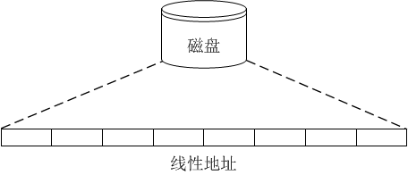
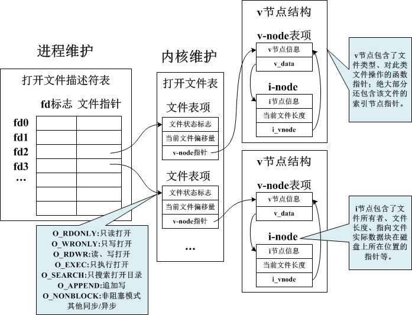

# 文件与 IO

## 基本概念

### 文件种类

### 文件系统

无论各种存储设备的底层是如何设计的，对于操作系统来说，磁盘就是一个线性空间，通过偏移就可以读写数据。



然而，如果缺乏规划，磁盘上的数据将会非常杂乱，大大降低检索效率。因此，文件系统负责对磁盘存储进行统一规划，并且为用户提供统一的操作接口。


## 文件 I/O

文件 IO 通常也被称为**不带缓冲的 IO**，即每个 read 和 write 都调用内核中的一个系统调用。

### 文件描述符

对于内核而言，所有的文件都通过文件描述符引用。文件描述符是一个非负整数，当打开或创建一个新文件时，内核向进程返回一个文件描述符，当对文件进行操作时，文件描述符用来标识该文件。

内核使用三种结构来表示打开文件，分别是：

- 每个进程在进程表中维护的**打开文件描述符表**，每个描述符占据一个表项。
- 内核为所有打开文件维护的一个**打开文件表**。
- 每个打开文件都有一个 **v 节点结构**。

他们之间的关系如下。



### 基本函数

### 文件创建 - open

文件关闭

文件读取

文件写入


### I/O的效率

## 标准 IO

标准 IO 库由 ISO C 标准定义，不仅 Unix 系统，其他操作系统也实现了该库。这意味着，不同于文件 IO 中的函数只能应用于 Unix/Linux 平台，标准 IO 库是天然跨平台可移植的。

### 流和文件指针

标准 IO 和文件 IO 最显著的区别在于两者的使用方式不同，文件 IO 围绕底层文件描述符的概念，而标准 IO 围绕高层数据流概念，两者差异如下：

- 文件 IO 库中，所有的 IO 函数操作围绕文件描述符进行，打开文件便返回一个文件描述符，该文件描述符用于后续对该文件的 IO 操作。
- 标准 IO 库中，所有的 IO 函数操作围绕流进行，打开文件时文件与一个流关联，该流用于后续对该文件的 IO 操作。

根据读写的字符集的不同，流的定向可分为两种：

- 单字节流：用于单字节字符集。
- 多字节流：用于多字节字符集。

当流被创建时并没有定向，可以通过 `fwide` 函数设置未定向流的定向。当打开一个流时，标准 IO 函数 `fopen` 返回一个指向 `FILE` 对象的指针，该对象是一个结构体，包含了该流所需要的所有信息，包括：

- 用于实际 IO 的文件描述符
- 指向该流缓冲区的指针
- 缓冲区长度
- 当前缓存区中的字符数
- 出错标志

`FILE *` 指针称为文件指针，为了引用一个流，需要将该文件指针作为参数传递给标准库函数。

### 标准流

一个进程预定义了 3 个标准流，可以自动使用，分别是：

- 标准输入流：文件指针 `stdin`，对应文件描述符 `STDIN_FILENO`。
- 标准输出流：文件指针 `stdout`，对应文件描述符 `STDOUT_FILENO`。
- 标准错误流：文件指针 `stderr`，对应文件描述符 `STDERR_FILENO`。

### 缓冲

标准 IO 和文件 IO 最核心的区别在于标准 IO 的缓冲区设计：文件 IO 也被称为 unbuffered IO，而标准 IO 正是 buffered IO。

标准 IO 提供缓冲区的目的是尽可能减少 `read` 和 `write` 的调用次数，与此同时也对每个流自动进行缓冲区管理，其提供了如下 3 种不同的缓冲：

- 全缓冲：
- 行缓冲：
- 不带缓冲：

很多系统保持如下的缓冲设置：

- 标准错误是不带缓冲的。
- 若是指向终端设备的流，则是行缓冲的，否则是全缓冲的。

对于任意给定的流，可以通过 `setvbuf` 来改变默认缓冲类型、缓冲区、缓冲区长度。一般而言，应由系统选择缓冲区长度，并自动分配缓冲区，这样关闭该流时，将自动释放缓冲区。

任何时候，可以通过 `int fflush(FILE *stream);` 来强制将 stream 流缓冲区中未写的数据写入内核（该流指向的文件或者标准输出等）。

!> 在标准 IO 库方面，术语冲洗 (flush) 指的是标准 IO 缓冲区的写操作，而不是丢弃数据的意思。

### 流的开/关

下列函数可以打开一个流：

```c
#include <stdio.h>
FILE *fopen(const char *restrict pathname, const char *restrict type);
FILE *freopen(const char *restrict pathname, const char *restrict type, FILE *restrict fp);
FILE *fopen(int fd, const char *type);
```

`type` 参数指定对该 IO 的读写方式。

| type             | 说明 | open 标志 |
| ---------------- | ---- | --------- |
| r 或 rb          |      |           |
| w 或 wb          |      |           |
| a 或 ab          |      |           |
| r+ 或 r+b 或 rb+ |      |           |
| w+ 或 w+b 或 wb+ |      |           |
| a+ 或 a+b 或 ab+ |      |           |

因此，打开一个流的 6 种不同方式为。

|      限制      |  r   |  w   |  a   |  r+  |  w+  |  a+  |
| :------------: | :--: | :--: | :--: | :--: | :--: | :--: |
|  文件必须存在  |  *   |      |      |  *   |      |      |
|    清空文件    |      |  *   |      |      |  *   |      |
|    流可以读    |  *   |      |      |  *   |  *   |  *   |
|    流可以写    |      |  *   |  *   |  *   |  *   |  *   |
| 流只可在尾端写 |      |      |  *   |      |      |  *   |

调用 `fclose` 函数可以关闭一个打开的流：

```c
#include <stdio.h>
FILE *fclose(FILE *fp);
```

在该文件被关闭之前，冲刷缓冲区中的输出数据，输入数据被丢弃，释放自动分配的缓冲区。

### 流的读/写

当流被打开时，可以进行读写操作，根据读写的类型，可以分为

- 非格式化 IO：内容直接进行读写。
- 格式化 IO：内容按一定的格式进行读写。

#### 非格式化 IO

非格式化 IO 包括3 种类型：

- 字符 IO：一次读写一个字符
- 行 IO：一次读写一行
- 二进制 IO：一次读写一个完整结构

TODO

#### 格式化 IO

格式化 IO 包括：

- 格式化输出由 5 个 `printf` 函数来处理。

- 格式化输入由 3  个 `scanf` 函数来处理。

TODO

