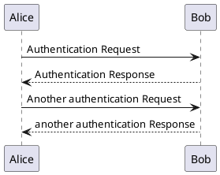
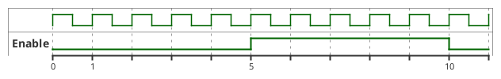

# 示例

```c
#include <stdio.h>
print("abc")
```

```python
import os
print('abc')
```

```cpp
using namespace std;
cout<< "abc" << endl;
```

```java
import org.java
class Main() {
    public static void main() {
        system.out.pr
    }
}
```

$$ d_{node} = d_{proc} + d_{queue} + d_{trans} + d_{prop} $$



!> ad1

?> asdf


