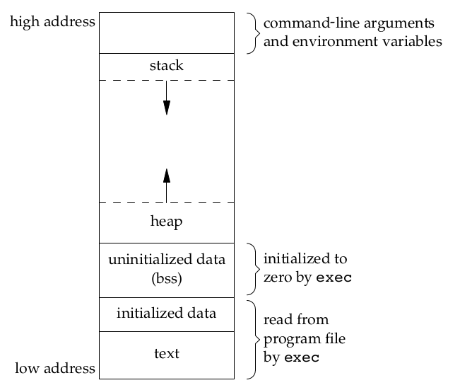
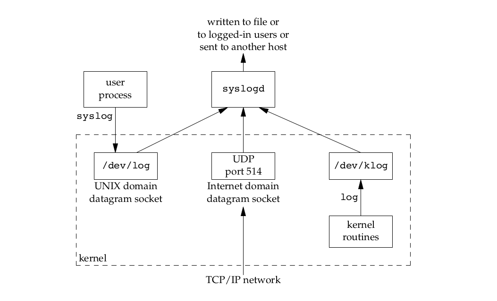

# Unix 系统编程

本文主要内容来自 APUE。

## Unix 基础

### Unix 简介

自 1969 年成立开始，Unix 系统便迅速流行，因为它为各种不同硬件架构的机器**提供了统一的运行环境**。Unix 系统分为两部分，一部分是**程序 (programs) 和服务 (services)** ,它们是供用户使用的，包括 Shell，邮件，文字处理包，源码控制系统等。另一部分是支持这些程序和服务的**操作系统**。

- 1965 年，Bell Telephone Laboratory，通用电气公司以及 MIT 的 MAC计划小组共同开发了 **Multics** 这个新的操作系统。
- Multics 系统的原始版本确实在 GE 645 机器上运行，但因为没有提供预期统一计算服务，再加上发展目标不明确，因此，贝尔实验室结束了对该项目的支持。
- 贝尔实验室的科学家们打算改进它们自己的编程环境，于是，Ken Thompson, Dennis Ritchie 等人起草了一份文件系统 (file system) 设计的白皮书，后来推动了早期 Unix 文件系统的发展。后来再加上进程子系统和一些工具，Unix 就这样诞生了。其名称是相对于 Multics 的复杂而取的，**暗含了 Unix 系统的精简**。
- 第一版使用汇编语言和 B 语言写成。Ritchie 改进了 B 语言，创造了 C 语言，用来生成机器码，声明数据类型，定义数据结构。1973 年，**系统用 C 语言重写**。
- 1974年，汤普逊和里奇合作在 ACM 通信上发表了一篇关于 UNIX 的文章，这是 **UNIX 第一次出现在贝尔实验室以外**。
- 1982年，贝尔实验室综合了 AT&T 开发的中多版本，形成了 **UNIX System Ⅲ**，不久有增加了一些新功能，重新命名为 **UNIX System V**，然而，加州大学伯克利分校开发了 **BSD 4.3**，其作为 UNIX System III 和 V 的替代选择。


### Unix 系统结构

Unix 将系统视为若干层，其中**内核** (operating system, system kernel or just kernel) 直接与硬件交互，为上层程序提供通用服务并将它们与硬件特性隔离开来。


其中，系统从底层至高层分别为：

- 内核：操作系统的灵魂及核心。
- 低层程序（low-level）：通过系统调用 (system call) 与内核交互，这些程序包括 shell `sh` 和 editor `vi`，标准系统配置命令 (commands)，以及 `a.out` 这种由 C 编译器生成的可执行文件。
- 应用程序（high-level）：通过对低层程序调用与组合，为用户提供了更好的界面和操作，同时简化了开发。

所有的操作系统都提供多种服务的入口点，由此程序向内核请求服务。各种版本的 Unix 实现都提供良好定义、数量有限、直接进入内核的入口点，这些入口点被称为**系统调用 (system call)**。不同的系统提供了不同的几十、上百个系统调用，具体数字在不同操作系统版本中会不同，

系统调用接口是用 C 语言定义的，Unix 所使用的技术是为每个系统调用在标准 C 库中设置一个具有同样名字的**包装函数**。用户进程用标准 C 代码来调用这些函数，然后这些函数又用系统所要求的技术调用相应的内核服务。


程序员可以使用的通用库函数在内部实现时可能会调用一个或多个内核的系统调用，但是它们并不是内核的入口点。同时，库函数当然也可以不使用任何内核的系统调用，这样的库函数仅仅是一些标准库为我们准备的用户层面代码而已。因此，系统调用通常提供一种最小接口，而库函数通常提供比较复杂的功能。

实际上，对于用户而言，库函数和系统调用无需区分，都当做底层编程接口即可。例如，进程控制系统调用 (fork, exec 和 wait) 通常由用户应用程序直接调用，然而内存分配系统调用 sbrk 却鲜被直接使用，通常程序员会使用功能更加丰富的 malloc 库函数，而后者的实现中使用了 sbrk 系统调用。但是，我们应当理解库函数可以被替换，系统调用通常是不能被替换的。

### 编程接口

在使用 C 语言编程实现某个功能时候，需要使用操作系统提供的编程接口，Unix 系统提供了如下库供用户使用，包括：

- C 标准库
- 其他库
    - POSIX (Portable Operating System Interface of Unix)
    - Linux Library
    - Windows Library
    - …

编程时首先考虑使用 C 标准库中的接口，这些库保证了最佳的可移植性。C POSIX 库是与标准库同时发展的，它是 POSIX 系统中 C 标准库的规范，作为标准库的超集，其不仅兼容标准库，同时还引入了额外的功能。虽然 POSIX 是为 Unix 标准制定的接口，但对于 Linux、Mac OS X 系统，甚至 Windows 都具有较好的可移植性。

除此之外，最后考虑 Linux 库以及 Windows 库等，除非你确定编写的程序不需要跨平台使用。由于大部分时候我们的代码将会运行在 Linux 内核的机器上，因此有时候想要用到 Linux 内核相关功能，而 POSIX 标准没有涵盖这个接口的话，将不可避免的使用到 Linux 提供的相关库。

- GNU/Linux 是 POSIX 兼容的系统，其使用了 GNU C Library (glibc) 的实现，该实现兼容 C 标准库、POSIX 库等，可以使用 man 手册查阅相关 C 库用法。
- Windows 有自己的头文件，可以在 MSDN 中找到，但也有 POSIX 兼容的版本，例如 Cygwin, MinGW 等。

[List of standard header files in C and C++](https://stackoverflow.com/questions/2027991/list-of-standard-header-files-in-c-and-c) 有一份详细的目录可以帮助你了解这些头文件。

### ISO C - 标准库

**C 标准库也称为 ISO C 库**，主要经历了 C89, C99, C11 三个大版本，目前包括 **31** 个头文件。详细说明可以在 [C Standard Library header files](https://en.cppreference.com/w/c/header) 进行查阅。

|         头文件          |                             说明                             |
| :---------------------: | :----------------------------------------------------------: |
|      `<assert.h>`       | [Conditionally compiled macro that compares its argument to zero](https://en.cppreference.com/w/c/error) |
|   `<complex.h>` (C99)   | [Complex number arithmetic](https://en.cppreference.com/w/c/numeric/complex) |
|       `<ctype.h>`       | [Functions to determine the type contained in character data](https://en.cppreference.com/w/c/string/byte) |
|       `<errno.h>`       | [Macros reporting error conditions](https://en.cppreference.com/w/c/error) |
|    `<fenv.h>` (C99)     | [Floating-point environment](https://en.cppreference.com/w/c/numeric/fenv) |
|       `<float.h>`       | [Limits of floating-point types](https://en.cppreference.com/w/c/types/limits#Limits_of_floating_point_types) |
|  `<inttypes.h>` (C99)   | [Format conversion of integer types](https://en.cppreference.com/w/c/types/integer) |
|   `<iso646.h>` (C95)    | [Alternative operator spellings](https://en.cppreference.com/w/c/language/operator_alternative) |
|      `<limits.h>`       | [Ranges of integer types](https://en.cppreference.com/w/c/types/limits) |
|      `<locale.h>`       | [Localization utilities](https://en.cppreference.com/w/c/locale) |
|       `<math.h>`        | [Common mathematics functions](https://en.cppreference.com/w/c/numeric/math) |
|      `<setjmp.h>`       |  [Nonlocal jumps](https://en.cppreference.com/w/c/program)   |
|      `<signal.h>`       |  [Signal handling](https://en.cppreference.com/w/c/program)  |
|  `<stdalign.h>` (C11)   | [`alignas` and `alignof`](https://en.cppreference.com/w/c/types) convenience macros |
|      `<stdarg.h>`       | [Variable arguments](https://en.cppreference.com/w/c/variadic) |
|  `<stdatomic.h>` (C11)  | [Atomic operations](https://en.cppreference.com/w/c/thread#Atomic_operations) |
|   `<stdbit.h>` (C23)    | Macros to work with the byte and bit representations of types |
|   `<stdbool.h>` (C99)   | [Macros for boolean type](https://en.cppreference.com/w/c/types) |
|  `<stdckdint.h>` (C23)  |       macros for performing checked integer arithmetic       |
|      `<stddef.h>`       | [Common macro definitions](https://en.cppreference.com/w/c/types) |
|   `<stdint.h>` (C99)    | [Fixed-width integer types](https://en.cppreference.com/w/c/types/integer) |
|       `<stdio.h>`       |      [Input/output](https://en.cppreference.com/w/c/io)      |
|      `<stdlib.h>`       | General utilities: [memory management](https://en.cppreference.com/w/c/memory), [program utilities](https://en.cppreference.com/w/c/program), [string conversions](https://en.cppreference.com/w/c/string), [random numbers](https://en.cppreference.com/w/c/numeric/random), [algorithms](https://en.cppreference.com/w/c/algorithm) |
| `<stdnoreturn.h>` (C11) | [`noreturn`](https://en.cppreference.com/w/c/language/_Noreturn) convenience macro |
|      `<string.h>`       | [String handling](https://en.cppreference.com/w/c/string/byte) |
|   `<tgmath.h>` (C99)    | [Type-generic math](https://en.cppreference.com/w/c/numeric/tgmath) (macros wrapping math.h and complex.h) |
|   `<threads.h>` (C11)   |   [Thread library](https://en.cppreference.com/w/c/thread)   |
|       `<time.h>`        | [Time/date utilities](https://en.cppreference.com/w/c/chrono) |
|    `<uchar.h>` (C11)    | [UTF-16 and UTF-32 character utilities](https://en.cppreference.com/w/c/string/multibyte) |
|    `<wchar.h>` (C95)    | [Extended multibyte and wide character utilities](https://en.cppreference.com/w/c/string/wide) |
|   `<wctype.h>` (C95)    | [Functions to determine the type contained in wide character data](https://en.cppreference.com/w/c/string/wide) |

### IEEE POSIX

IEEE POSIX 标准定义了接口的规范，而不同的操作系统根据自身平台的特征实现了这些接口。目前包括 **82** 个头文件（包含所有 C99 头文件），头文件详细说明可以在 [IEEE and The Open Group](http://pubs.opengroup.org/onlinepubs/9699919799/nframe.html) 网站中的 [IEEE Std POSIX.1-2017](http://pubs.opengroup.org/onlinepubs/9699919799/toc.htm) 进行查询。

|      头文件      | 说明 |
| :--------------: | :--: |
|     <aio.h>      |      |
|  <arpa/inet.h>   |      |
|    <assert.h>    |      |
|   <complex.h>    |      |
|     <cpio.h>     |      |
|    <ctype.h>     |      |
|    <dirent.h>    |      |
|    <dlfcn.h>     |      |
|    <errno.h>     |      |
|    <fcntl.h>     |      |
|     <fenv.h>     |      |
|    <float.h>     |      |
|    <fmtmsg.h>    |      |
|   <fnmatch.h>    |      |
|     <ftw.h>      |      |
|     <glob.h>     |      |
|     <grp.h>      |      |
|    <iconv.h>     |      |
|   <inttypes.h>   |      |
|    <iso646.h>    |      |
|   <langinfo.h>   |      |
|    <libgen.h>    |      |
|    <limits.h>    |      |
|    <locale.h>    |      |
|     <math.h>     |      |
|   <monetary.h>   |      |
|    <mqueue.h>    |      |
|     <ndbm.h>     |      |
|    <net/if.h>    |      |
|    <netdb.h>     |      |
|  <netinet/in.h>  |      |
| <netinet/tcp.h>  |      |
|   <nl_types.h>   |      |
|     <poll.h>     |      |
|   <pthread.h>    |      |
|     <pwd.h>      |      |
|    <regex.h>     |      |
|    <sched.h>     |      |
|    <search.h>    |      |
|  <semaphore.h>   |      |
|    <setjmp.h>    |      |
|    <signal.h>    |      |
|    <spawn.h>     |      |
|    <stdarg.h>    |      |
|   <stdbool.h>    |      |
|    <stddef.h>    |      |
|    <stdint.h>    |      |
|    <stdio.h>     |      |
|    <stdlib.h>    |      |
|    <string.h>    |      |
|   <strings.h>    |      |
|   <stropts.h>    |      |
|   <sys/ipc.h>    |      |
|   <sys/mman.h>   |      |
|   <sys/msg.h>    |      |
| <sys/resource.h> |      |
|  <sys/select.h>  |      |
|   <sys/sem.h>    |      |
|   <sys/shm.h>    |      |
|  <sys/socket.h>  |      |
|   <sys/stat.h>   |      |
| <sys/statvfs.h>  |      |
|   <sys/time.h>   |      |
|  <sys/times.h>   |      |
|  <sys/types.h>   |      |
|   <sys/uio.h>    |      |
|    <sys/un.h>    |      |
| <sys/utsname.h>  |      |
|   <sys/wait.h>   |      |
|    <syslog.h>    |      |
|     <tar.h>      |      |
|   <termios.h>    |      |
|    <tgmath.h>    |      |
|     <time.h>     |      |
|    <trace.h>     |      |
|    <ulimit.h>    |      |
|    <unistd.h>    |      |
|    <utime.h>     |      |
|    <utmpx.h>     |      |
|    <wchar.h>     |      |
|    <wctype.h>    |      |
|   <wordexp.h>    |      |


### 系统重要文件

TODO

| 文件 | 说明 |
| ---- | ---- |
|      |      |
|      |      |
|      |      |

### 基本系统数据类型

TODO

| 类型      | 说明 |
| --------- | ---- |
| `clock_t` |      |
|           |      |
|           |      |

## 文件

Unix 中一切皆文件。 这是很有趣的哲学，意味着**文件 (file)**这一模型，提供了对所有 I/O 资源访问的抽象，包括文档、目录、磁盘、CD-ROM、调制解调器、键盘、打印机、显示器和终端等等，甚至也包括了进程、网络之间的通信。所有文件都通过一致的 API 以提供访问，因此只用同一套简单的命令，就可以读写磁盘、键盘、文档以及网络设备。

### 文件描述符

对于 Linux 而言，所有的文件都通过文件描述符引用。文件描述符是一个非负整数，当打开或创建一个文件时，内核向进程返回一个文件描述符。

### 文件类型

Unix 文件大部分是普通文件和目录，但也包括其他类型。

|              文件类型               |                   说明                   |
| :---------------------------------: | :--------------------------------------: |
|        普通文件 regular file        |           主要包括文本和二进制           |
|         目录 directory file         | 包含其他文件的名字以及指向这些文件的指针 |
| 字符特殊文件 character special file |             带缓冲访问的设备             |
|    块特殊文件 block special file    |            不带缓冲访问的设备            |
|          FIFO pipe or FIFO          |              进程间通信文件              |
|       符号链接 symbolic file        |              指向另一个文件              |
|            套接字 socket            |              网络进程间通信              |

TODO 

stat 函数

`stat /etc/passwd /etc /run/systemd/journal/dev-log  /dev/tty /dev/sr0 /dev/cdrom | grep -E 'File|Size'` 可以查看各类文件类型 。

### 文件系统


### 文件存储结构

内核使用三种数据结构来表示打开的文件：

1. Every process has an entry in the **process table**. Associated with each file descriptor are
    - The file descriptor flags
    - A pointer to a **file table entry**
2. The kernel maintains a file table for all open files. Each file table entry contains
    - The file status flags for the file, such as read, write, append, sync, and nonblocking
    - The current file offset
    - A pointer to the **v-node table entry** for the file
3. 

### 文件所属及权限

access

umask

chmod

chown

### 文件时间


### 文件 I/O

| 函数名    | 说明                           | 函数体                                                       | Header     | Return                                              |
| --------- | ------------------------------ | ------------------------------------------------------------ | ---------- | --------------------------------------------------- |
| **open**  | 打开或创建一个文件             | int open(const char *path, int oflag, ... /* mode_t mode */ ); | <fcntl.h>  | fd or -1                                            |
| openat    |                                | int openat(int fd, const char *path, int oflag, ... /* mode_t mode */ ); | <fcntl.h>  | fd or -1                                            |
| creat     | 创建一个文件（不推荐使用）     | int creat(const char* **path, mode_t mode);                  | <fcntl.h>  | fd or -1                                            |
| **close** | 关闭一个打开文件               | int close(int fd);                                           | <unistd.h> | 0 or -1                                             |
| **lseek** | 显式地为一个打开文件设置偏移量 | off_t lseek(int fd, off_t offset, int whence);               | <unistd.h> | offset or -1                                        |
| **read**  | 从打开文件中读数据             | ssize_t read(int fd, void *buf, size_t nbytes);              | <unistd.h> | number of bytes read, 0 if end of file, −1 on error |
| **write** | 向打开文件中写数据             | ssize_t write(int fd, const void *buf, size_t nbytes);       | unistd.h   | number of bytes written if OK, −1 on error          |


| 系统函数  | 描述                                         | 头文件                                                   |
| --------- | -------------------------------------------- | -------------------------------------------------------- |
| dup2      | 复制一个现有的文件描述符                     | <unistd.h>                                               |
| sync      | 保证磁盘上实际文件系统与缓冲区中内容的一致性 | <unistd.h>                                               |
| dup       | 复制一个现有的文件描述符                     | <unistd.h>                                               |
| fsync     | 保证磁盘上实际文件系统与缓冲区中内容的一致性 | <unistd.h>                                               |
| fdatasync | 保证磁盘上实际文件系统与缓冲区中内容的一致性 | <unistd.h>                                               |
| fcntl     | 改变己经打开文件的属性                       | <fcntl.h>                                                |
| ioctl     | I/O操作的杂货箱                              | <unistd.h> in System V <br><sys/ioctl.h> in BSD or Linux |

### 符号链接

### 目录

### 设备特殊文件

## 标准 I/O

TODO

## 进程环境

### 进程开始

C 语言的程序总是从 main 函数开始执行，main 函数的原型如下：
```
int main(int argc, char *argv[]);
```

- argc 是命令行参数数量
- argv 是参数指针数组

当内核执行一个 C 程序时，需要先执行一个启动程序，该启动程序将**命令行参数**和**环境变量表**传递给 main 函数。

命令行参数可以使用如下方式遍历。

```c
for (i = 0; i < argc; i++)
for (i = 0; argv[i] != NULL; i++)
```

第一个命令行参数是程序名本身。

```c
$ ./echoarg arg1 TEST foo
argv[0]: ./echoarg
argv[1]: arg1
argv[2]: TEST
argv[3]: foo
```

除了命令行参数，每个程序都会接收到一个环境表 (environment list)，这是一个字符指针数组，每个指针指向一个以 null 结束的字符串。全局变量 environ 则指向环境表：`extern char **environ;`。


环境变量字符串格式为：`name=value`。尽管我们可以直接得到全局变量 environ 指针，但并不直接通过它访问环境变量，而是通过系列函数对变量进行增删查改。

|   函数   | 声明                                                         |
| :------: | ------------------------------------------------------------ |
|  getenv  | char *getenv(const char *name);                              |
|  putenv  | int putenv(char *str);                                       |
|  setenv  | int setenv(const char *name, const char *value, int rewrite); |
| unsetenv | int unsetenv(const char *name);                              |
| clearenv |                                                              |

### 进程终止

有 8 种方式可以终止一个进程，其中前 5 种为正常终止，后 3 种为非正常终止：

1. 从 main 返回
2. 调用 exit
3. 调用 _exti 或 _Exit
4. 最后一个线程从其 start routine 返回
5. 从最后一个线程调用 pthread_exit
6. 调用 abort
7. 接受到一个信号
8. 最后一个线程对取消请求做出响应

exit, _exit, _Exit 三个函数用于正常终止一个进程，其中 _exit, _Exit 直接返回内核，而 exit 先执行一些清理处理，然后返回内核。由于历史原因，exit 总会执行一个标准 I/O 库的清理关闭操作，这会导致所有打开流调用 fclose 函数，使得所有输出缓存中的所有数据都被 flush (写到文件)。

3 个退出函数都带有一个整型参数，称为终止状态。在大部分 Unix 的 shell 中，可以使用 `echo $?` 查看上一条执行语句的终止状态。

进程可以登记 (register) 函数，登记的函数将会在 exit 调用时自动执行，因此这些函数也称为**终止处理程序 (exit handlers)**。登记由调用 **atexit** 来完成。

```
#include <stdlib.h>
int atexit(void (*func)(void));
```

内核使程序唯一执行的方法是调用 exec 函数，进程自愿终止的唯一方法是显式或隐式地 (通过 exit) 调用 _exit 或 _Exit 函数。进程也可非自愿的由一个信号终止。


### C 程序存储空间布局

TODO



### 共享库

### 存储空间分配

malloc

### 拓展

setjump,longjmp 

setrlimit

## 进程控制

### 进程标识

进程使用一个非负整数作为其 ID，用于唯一标识进程。进程标识 (PID) 是唯一的，但却可以复用。有两个进程 ID 比较特殊：

- ID 为 0 的进程通常是调度进程，也被称为交换进程 (swapper)，该进程是内核的一部分，并不执行任何磁盘上的程序。
- ID 为 1 的通常是 init 进程。它是一个普通进程，但以超级用户特权运行。

除了常用的 PID，每个进程还有一些其他的标识符，可以通过如下函数获取，头文件为 `unistd.h`。

|          函数          |            说明             |
| :--------------------: | :-------------------------: |
| `pid_t getpid(void);`  |    获取调用进程的进程 ID    |
| `pid_t getppid(void);` | 获取调用进程父进程的进程 ID |
| `uid_t getuid(void);`  |    获取调用进程的用户 ID    |
| `uid_t geteuid(void);` |  获取调用进程的有效用户 ID  |
| `gid_t getgid(void);`  |     获取调用进程的组 ID     |
| `gid_t getegid(void);` |   获取调用进程的有效组 ID   |

### fork 函数

由 fork 创建的新进程被称为子进程 (child process)。一个 fork 函数被调用一次，但返回两次。两次返回的区别是：
- 父进程的返回值则是新建子进程的进程 ID，因为一个进程的子进程可以有多个，并且没有一个函数使一个进程可以获得其所有子进程的进程 ID。
- 子进程的返回值是 0，理由是一个进程只会有一个父进程，所以子进程总是可以调用 getppid 以获得其父进程的进程 ID。

子进程和父进程继续执行 fork 调用之后的指令。**子进程是父进程的副本**。例如，子进程获得父进程数据空间、堆和栈的副本。父进程和子进程并**不共享这些存储空间部分**，父进程和子进程**共享正文段**。

由于在 fork 之后经常跟随着 exec, 而后者又会将所有的运行时内存结构替换掉，所以每次 fork 为子进程创建一个副本可能是不划算的。因此现在很多实现并不执行一个父进程数据段、栈和堆的完全副本.作为替代使用了**写时复制 (Copy-On-Write, COW) **技术，意思是父进程或子进程任何一个试图修改的时候才会创建真正的副本，否则内核只是将权限修改为只读，实际上这些区域还是共享的。

### exec 函数

用 fork 函数创建新的子进程后，子进程往往要调用一种 exec 函数以执行另一个程序。当进程调用一种 exec 函数时，**该进程执行的程序完全替换为新程序**，而新程序则从其 main 函数开始执行。因为**调用 exec 并不创建新进程**，所以前后的进程ID并未改变。exec 只是用磁盘上的一个新程序替换了当前进程的正文段、数据段、堆段和栈段。

有 7 种不同的 exec 函数可供使用，被统称为 exec 函数。他们都在头文件 `unistd.h`，成功返回 0，否则返回 -1。

```c
#include <unistd.h>
int execl(const char *pathname, const char *arg0, ... /* (char *)0 */ );
int execv(const char *pathname, char *const argv[]);
int execle(const char *pathname, const char *arg0, ... /* (char *)0, char *const envp[] */ );
int execve(const char *pathname, char *const argv[], char *const envp[]);
int execlp(const char *filename, const char *arg0, ... /* (char *)0 */ );
int execvp(const char *filename, char *const argv[]);
int fexecve(int fd, char *const argv[], char *const envp[]);
```

几种函数的区别在名字里已经有所暗示：

- 待运行程序名
    - 空：表示取路径名作为参数。
    - p：表示取文件名作为参数，且在 PATH 环境变量中指定的各个目录中搜索。
- 待运行程序参数
    - l：表示以参数列表（list）方式提供。
    - v：表示以数组（vector）方式提供。
- 待运行程序环境表：
    - 空：使用调用进程中的 environ 变量为新程序复制现有的环境。
    - e：表示可以传递一个指向环境字符串指针数组的指针。

在很多 Unix 实现中，这 7 个函数中只有 execve 是**内核的系统调用**。另外 6 个只是库函数，关系如下：


### clone 系统调用

`clone()` 系统调用的基本用法如下：

```
/* Prototype for the glibc wrapper function */
#define _GNU_SOURCE
#include <sched.h>

int clone(int (*fn)(void *), void *child_stack,
                int flags, void *arg, ...
                /* pid_t *ptid, void *newtls, pid_t *ctid */ );
```

成功时，调用者的进程中将会返回子进程的 thread ID；失败时返回 -1，子进程将不会被创建，同时将会触发 ERROR。

clone() 创建新进程，其行为类似于 fork()，通常使用 glibc 库中的包装函数 clone()，该函数基于 clone 系统调用。与 fork 不同，clone 允许子进程与父进程共享部分执行上下文的参数，例如虚拟地址空间、文件描述符表、信号处理程序等。

fork 是标准的 Unix 系统调用，用来创建进程，而在 Linux 中 clone 可以根据传递的选项创建不同的执行线程，新的执行线程可以遵循 UNIX 进程、POSIX 线程、介于两者之间或完全不同的事物（例如不同的容器）的语义。`pthread_create()` 和 `fork()` 底层实现都使用了 `clone()`。 

通过 clone() 创建的子进程，从调用指向的函数 fn() 开始执行，而 fork() 创建的子进程将会从 fork 的调用点开始执行。当 fn(arg) 函数返回，子进程结束，函数 fn 的返回值就是子进程的退出状态码，子进程同样可以通过调用 exit() 和收到结束信号而显式结束。

child_stack 参数指定了子进程使用的栈，子进程不可以与父进程共享栈空间，由于绝大部分 Linux 的处理器的栈都是向下生长的，因此该参数需要指向栈顶空间。

flags 的最低字节指定了当子进程结束时需要发送给父进程的结束信号。如果该信号不是 SIGCHLD，则父进程在调用 wait() 等待子进程时必须指定 `__WALL` 或 `__WCLONE` 选项；如果未指定，则子进程退出时父进程将不会收到任何信号。

flags 还可以与零个或多个常量进行按位或运算，以指定在调用进程和子进程之间共享的内容，具体的常量可以查看 man 文档。

### TODO

- exit
- wait/waitpid/wait3/wait4
- 竞争条件
- 更改用户 ID 和组 ID
- system
- 进程调度
- 进程时间

## 进程关系

### 终端登录、网络登陆、伪终端

父子关系：进程pid--〉父进程，ppid

### 进程组

- 一个或多个进程的集合，有pgid

- 一个组有一个组长进程，该进程的PGID为PID。

### 会话

- 一个或多个进程组的集合，有sid。

- 会话ID = 会话首进程的进程ID = 会话首进程的进程组ID
- 一个会话有一个控制终端
- 建立与控制终端连接的会话首进程为控制进程。
- 几个进程组可分为：一个前台进程组和若干后台进程组
- 终端键入：ctrl+c，发送到前台进程组所有进程
- 创建会话：进程调用 setsid
    - 不是进程组长：变成新会话首进程，成为新进程组组长进程，pgid为pid
    - 已经是进程组长：出错。如要创建，可以fork然后关闭父进程。

### 作业控制

fg、bg

### shell执行程序

```shell
@sdnhubvm:~/liyj[18:37]$ ps -o pid,ppid,pgid,sid,comm | cat
  PID  PPID  PGID   SID COMMAND
28247 28242 28247 28247 bash
28813 28247 28813 28247 ps
28814 28247 28813 28247 cat
ubuntu@sdnhubvm:~/liyj[18:37]$ ps -o pid,ppid,pgid,sid,comm | cat &
[1] 28876
ubuntu@sdnhubvm:~/liyj[18:38]$   PID  PPID  PGID   SID COMMAND
28247 28242 28247 28247 bash
28875 28247 28875 28247 ps
28876 28247 28875 28247 cat
```

### 孤儿进程

### BSD实现

### ===

当子进程终止时，父进程得到通知并能取得子进程的退出状态。

终端登录


进程组

每个进程除了有一进程 ID 之外，还属于一个进程组。进程组是一个或多个进程的集合。
同一进程组中的各进程接收来自同一终端的各种信号。
每个进程组有一个唯一的进程组ID

会话

会话 (session) 是一个或多个进程组的集合。
通常是由 shell 的管道将几个进程编成一组的。

```
$ proc1 | proc2 &
$ proc3 | proc4 | proc5
```


1. 该进程变成新会话的会话首进程 (session leader，会话首进程是创建该会话的进程)。此
时，该进程是新会话中的唯一进程。
2. 该进程成为一个新进程组的组长进程。新进程组 ID 是该调用进程的进程 ID。
3. 该进程没有控制终端(下一节讨论控制终端)。如果在调用setsid之前该进程有一个
控制终端，那么这种联系也被切断。


## 信号

### 信号概念

信号是一种软件中断，提供了一种处理异步事件的方法。

每个信号都有一个名字，定义在头文件 `<signal.h>` 中。信号的产生可以由多种方式，例如：

- 某些按键被按下，触发信号。
- 硬件异常（除 0，内存无效等）触发信号。
- 某些条件产生时，触发信号。
- 进程调用函数主动触发信号。

当信号出现时，内核按照以下三种方式之一进行处理。

- 捕捉信号：**通知内核在某种信号发生时，执行用户函数（signal handler）**。
- 执行默认动作：大多数信号的默认动作时终止进程。
- 忽略信号：大多数信号都被忽略了，但 SIGKILL 和 SIGSTOP 不能忽略。

以下是信号的具体解释。

|   信号名   |               英文解释               | 触发条件 |
| :--------: | :----------------------------------: | :------: |
|  SIGABRT   |     abnormal termination (abort)     |          |
|  SIGALRM   |        timer expired (alarm)         |          |
|   SIGBUS   |            hardware fault            |          |
| SIGCANCEL  |     threads library internal use     |          |
|  SIGCHLD   |      change in status of child       |          |
|  SIGCONT   |       continue stopped process       |          |
|   SIGEMT   |            hardware fault            |          |
|   SIGFPE   |         arithmetic exception         |          |
| SIGFREEZE  |          checkpoint freeze           |          |
|   SIGHUP   |                hangup                |          |
|   SIGILL   |         illegal instruction          |          |
|  SIGINFO   |     status request from keyboard     |          |
|   SIGINT   |     terminal interrupt character     |          |
|   SIGIO    |           asynchronous I/O           |          |
|   SIGIOT   |            hardware fault            |          |
|  SIGJVM1   |  Java virtual machine internal use   |          |
|  SIGJVM2   |  Java virtual machine internal use   |          |
|  SIGKILL   |             termination              |          |
|  SIGLOST   |            resource lost             |          |
|   SIGLWP   |     threads library internal use     |          |
|  SIGPIPE   |    write to pipe with no readers     |          |
|  SIGPOLL   |        pollable event (poll)         |          |
|  SIGPROF   |   profiling time alarm (setitimer)   |          |
|   SIGPWR   |          power fail/restart          |          |
|  SIGQUIT   |       terminal quit character        |          |
|  SIGSEGV   |       invalid memory reference       |          |
| SIGSTKFLT  |       coprocessor stack fault        |          |
|  SIGSTOP   |                 stop                 |          |
|   SIGSYS   |         invalid system call          |          |
|  SIGTERM   |             termination              |          |
|  SIGTHAW   |           checkpoint thaw            |          |
|   SIGTHR   |     threads library internal use     |          |
|  SIGTRAP   |            hardware fault            |          |
|  SIGTSTP   |       terminal stop character        |          |
|  SIGTTIN   |   background read from control tty   |          |
|  SIGTTOU   |   background write to control tty    |          |
|   SIGURG   |      urgent condition (sockets)      |          |
|  SIGUSR1   |         user-defined signal          |          |
|  SIGUSR2   |         user-defined signal          |          |
| SIGVTALRM  |    virtual time alarm (setitimer)    |          |
| SIGWAITING |     threads library internal use     |          |
|  SIGWINCH  |     terminal window size change      |          |
|  SIGXCPU   |    CPU limit exceeded (setrlimit)    |          |
|  SIGXFSZ   | file size limit exceeded (setrlimit) |          |
|  SIGXRES   |      resource control exceeded       |          |

### 信号函数

Unix 信号机制最简单的接口是 signal 函数。

```c
#include <signal.h>
void (*signal(int signo, void (*func)(int)))(int);
```

`signal` 函数要求两个参数

- signo 为感兴趣的信号名。
- func 为信号处理程序指针，表示该信号发生时的动作，
    - 常量 SIG_IGN 表示忽略此信号。
    - 常量 SIG_DFL 表示执行默认动作。
    - 函数地址表示在信号发生时调用该函数。

**信号处理函数要求一个整形参数，并且返回值为 void。**当调用 signal 设置信号处理程序时，返回该函数的指针。简化一下 signal 的声明如下：

```
typedef void Sigfunc(int);
Sigfunc *signal(int signo, Sigfunc *func);
```

可靠性

- 机制
- 可重入

### 发送信号

程序可以主动触发信号：

- kill 函数将信号发送给进程或进程组。
- raise 函数将信号发送给自己。

```
#include <signal.h>
int kill(pid_t pid, int signo);
int raise(int signo);
```

kill 函数中，pid 参数有以下几种情况：

- pid > 0：发送给进程 pid。
- pid == 0：发送给同一进程组所有进程。
- pid < 0：发送给进程组 pid 的所有进程（发送进程具有权限向其发送信号的进程）。
- pid == -1：发送给所有进程（发送进程具有权限向其发送信号的进程）。

进程将信号发送给另一进程需要权限。

## 线程基础

### 线程简介

典型的 Unix 进程可以看成只有一个控制线程：一个进程在某一时刻只能做一件事情。有了多个控制线程以后，在程序设计时就可以把进程设计成在某一时刻能够做不止一件事，每个线程处理各自独立的任务。

线程带来了很多好处：

- 通过为每种事件类型分配单独的处理线程，可以简化处理异步事件的代码。**每个线程在进行事件处理时可以采用同步编程模式**，同步编程模式要比异步编程模式简单得多。
- 多个进程必须使用操作系统提供的复杂机制才能实现内存和文件描述符的共享，而多个**线程自动地可以访问相同的存储地址空间和文件描述符**。
- 单控制线程情况下，完成多任务只能串行进行。但有多个控制线程时，**相互独立的任务处理就可以交叉进行**，从而提高整个程序的吞吐量。
- 通过使用多线程将处理用户输入输出的部分与其他部分分开，从而改善程序响应时间。

**多线程**代码与**多处理器**或**多核系统**并不是绑定的，尽管多核处理器能够充分发挥多线程的优势。但即使程序运行在单处理器上，也能得到多线程编程模型的好处。所以不管处理器的个数多少，程序都可以通过使用线程得以简化。而且由于某些线程在阻塞的时候还有另外一些线程可以运行，所以多线程程序在单处理器上运行还是可以改善响应时间和吞吐量。

每个线程都包含有表示执行环境所必需的信息，其中包括：进程中标识线程的线程 ID、一组寄存器值、栈、调度优先级和策略、信号屏蔽字、errno 变量以及线程私有数据。一个进程的所有信息对该进程的所有线程都是共享的，包括可执行程序的代码、程序的全局内存和堆内存、栈以及文件描述符。

这里主要讨论 POSIX 线程，即 pthread 线程，头文件为 `<pthread.h>`。

### 线程标识

就像每个进程有一个进程 ID 一样，每个线程也有一个线程 ID。进程 ID 在整个系统中是唯一的，但线程 ID 只有在它所属的进程上下文中才有意义。

- 进程 ID 使用 pid_t 数据类型来表示
- 线程 ID 使用 pthread_t 数据类型来表示

Linux 上 pthread_t 使用 unsigned long int 实现，有时候打印线程 ID 很有用。而其他 Unix 变种系统却不一定，因此打印 ID 代码移植起来需要特别注意。

| 函数                                               | 解释            |
| -------------------------------------------------- | --------------- |
| pthread_t pthread_self(void);                      | 获得自身线程 ID |
| int pthread_equal(pthread_t tid1, pthread_t tid2); | 线程 ID 比较    |

### 线程创建

在传统 Unix 进程模型中，每个进程只有一个控制线程。程序开始运行时，它也是以单进程中的单个控制线程启动的。在创建多个控制线程以前，程序的行为与传统的进程并没有什么区别。

新增的线程可以通过调用 `pthread_create()` 函数创建，执行成功时返回 0，失败时返回错误码。

```
int pthread_create(pthread_t *thread, 
                const pthread_attr_t *attr, 
                void * (*start_routine)(void *), 
                void *arg);
```

其中参数为：

- 第一个参数为该线程 ID 的指针
- 第二个参数为线程属性
- 第三个参数为该线程执行的任务函数指针
- 第四个参数为任务函数参数指针

以下是一个创建线程代码的简单示例，每个线程简单的打印自身的线程 ID 和 任务 ID 后就退出。

```c
#include <pthread.h>
#include <stdio.h>
#include <stdlib.h>

#define NUM_THREADS 5

void *print_hello(void *taskid) {
    printf("Hello World! It's me, thread (tid:%ld) #%ld!\n", pthread_self(), (long) taskid);
    pthread_exit(NULL);
}

int main(int argc, char *argv[]) {
    pthread_t threads[NUM_THREADS];
    int rc;
    long t;
    for (t = 0; t < NUM_THREADS; t++) {
        printf("In main: creating thread %ld\n", t);
        rc = pthread_create(&threads[t], NULL, print_hello, (void *)t);
        if (rc) {
            printf("ERROR; return code from pthread_create() is %d\n", rc);
            exit(-1);
        }
    }

    /* Last thing that main() should do */
    pthread_exit(NULL);
}
```

上述程序输出结果如下，每次输出的结果并不相同。

```
In main: creating thread 0
In main: creating thread 1
Hello World! It's me, thread (tid:140491234883328) #0!
In main: creating thread 2
Hello World! It's me, thread (tid:140491226490624) #1!
In main: creating thread 3
Hello World! It's me, thread (tid:140491218097920) #2!
In main: creating thread 4
Hello World! It's me, thread (tid:140491131713280) #3!
Hello World! It's me, thread (tid:140491209594624) #4!
```

线程也可以传入参数。

```
#include <pthread.h>
#include <stdio.h>
#include <stdlib.h>

#define NUM_THREADS 3

struct thread_data {
    int task_id;
    char *name;
};

struct thread_data thread_data_array[NUM_THREADS];

void *print_hello(void *threadarg) {
    struct thread_data *my_data;
    long taskid;
    char *name;
    my_data = (struct thread_data *)threadarg;
    taskid = my_data->task_id;
    name = my_data->name;
    printf("Hello World! It's me, thread #%ld, my name is %s!\n", taskid, name);
    pthread_exit(NULL);
}

int main(int argc, char *argv[]) {
    pthread_t threads[NUM_THREADS];
    char *thread_names[NUM_THREADS];
    thread_names[0] = "Alice";
    thread_names[1] = "Bob";
    thread_names[2] = "Tom";

    int rc;
    long t;

    for (t = 0; t < NUM_THREADS; t++) {
        thread_data_array[t].task_id = t;
        thread_data_array[t].name = thread_names[t];
        printf("In main: creating thread #%ld\n", t);
        rc = pthread_create(&threads[t], NULL, print_hello,
                            (void *)&thread_data_array[t]);
        if (rc) {
            printf("ERROR; return code from pthread_create() is %d\n", rc);
            exit(-1);
        }
    }

    /* Last thing that main() should do */
    pthread_exit(NULL);
}
```

上述程序输出结果如下，每次输出的结果并不相同。

```
In main: creating thread #0
In main: creating thread #1
Hello World! It's me, thread #0, my name is Alice!
In main: creating thread #2
Hello World! It's me, thread #1, my name is Bob!
Hello World! It's me, thread #2, my name is Tom!
```

### 线程管理

如果进程中的任意线程调用了exit, Exit 或者 _exit，那么**整个进程就会终止**。单个线程可以通过 3 种方式退出，因此可以在不终止整个进程的情况下，停止它的控制流。

- 线程可以简单地从启动例程中返回，返回值是线程的退出码。
- 线程可以被同一进程中的其他线程取消。
- 线程调用 pthread_exit() 函数。

```
void pthread_exit(void *retval);
```

通过 pthread_exit() 函数终止调用线程，并且如果该线程是 joinable 的话，还可以通过 retval 返回值给同进程的其他线程。注意 retval 指针指向的值不能存在于栈中，因为线程结束后栈会被销毁。

**当进程的所有的线程都终止后，则进程退出**。因此 main 线程最后应该调用 pthread_exit() 明确指出退出主线程，如若不然，main 将会隐式的调用 exit，从而退出整个进程，从而导致其他线程被终止。

```
int pthread_join(pthread_t thread, void **retval);
```

pthread_join() 使得调用线程将一直阻塞，直到指定的线程调用 pthread_exit()、从启动线程中返回或者被取消。

如果对线程的返回值并不感兴趣，那么可以把 retval 指针设置为 NULL。在这种情况下，调用 pthread_join() 函数可以等待指定的线程终止，但并不获取线程的终止状态。


### 线程 API 总结

| 函数                                               | 解释                                     |
| -------------------------------------------------- | ---------------------------------------- |
| pthread_t pthread_self(void);                      | 获得自身线程 ID                          |
| int pthread_equal(pthread_t tid1, pthread_t tid2); | 线程 ID 比较                             |
| void pthread_exit(void *retval);                   | 退出调用线程，并可能传出返回值到其他线程 |

## 线程同步

## 线程控制


## 守护进程（完成）

### 守护进程特征

守护进程（daemon）是一种长期存在的没有控制终端的进程。通常随系统引导时启动，系统关闭时停止。Unix 具有很多守护进程，用来执行日常事务。

使用 `ps -axj` 可以查看系统中各个进程的状态，其中以方括号标识的名字是内核守护进程。守护进程一般以 `d` 字母结尾，例如：

- kthreadd：用来创建其他内核进程。
- kswapd：内存换页守护进程。
- inetd：侦听网络接口，支持各种网络服务请求。
- cron：定时任务。
- ....

### 守护进程规则

首先，创建一个守护进程需要最好遵从**以下基本原则**：

1. 调用 umask
2. 调用 fork，然后使父进程 exit。
3. 调用 setsid 创建一个新会话。
4. 将当前工作目录更改为根目录。
5. 关闭不再需要的文件描述符。
6. 将文件描述符 0，1，2 重写到 `/dev/null`。

其次，守护进程没有控制终端，不能将错误写到标准错误中。每个守护进程将它自己的出错信息写到一个单独的文件中，会导致管理复杂。**因此需要一个集中的守护进程出错记录程序，`syslog` 系统就是一个广泛应用的系统。**



三种产生日志消息的方法：

- 内核例程可以调用 log 函数。任何一个用户进程通过打开（open）然后读（read）`/dev/klog` 设备就可以读取这些消息。
- 大多数用户进程（守护进程）调用 `syslog` 函数以产生日志消息。
- 其他进程通过 TCP/IP 网络可将日志消息发往 UDP 514 端口。

通常， `syslogd` 守护进程读取所有 3 种格式的日志消息。

最后，**守护进程通常要求是单实例的**。如果同一个守护进程同时有多个实例运行，那么造成重复执行操作，可能引发错误。文件记录和锁机制可以保证一个守护进程只有一个副本在运行。

同时，**守护进程应当遵循以下惯例**：

- 若守护进程使用锁文件，则通常为 `/var/run/[name].pid`。
- 若守护进程支持配置文件，则通常为 `/etc/[name].conf`。
- 若守护进程可用命令行启动，则通常由系统初始化脚本完成，且进程终止时，应当自动重启，可以通过 `/etc/inittab` 中添加 `respawn` 记录项。

### 守护进程示例

```c
#include <errno.h>
#include <fcntl.h>
#include <signal.h>
#include <stdio.h>
#include <stdlib.h>
#include <string.h>
#include <sys/resource.h>
#include <sys/stat.h>
#include <sys/types.h>
#include <syslog.h>
#include <unistd.h>

#define LOCKFILE "/var/run/daemon.pid"
#define LOCKMODE (S_IRUSR | S_IWUSR | S_IRGRP | S_IROTH)

int lockfile(int fd) {
    struct flock fl;

    fl.l_type = F_WRLCK;
    fl.l_start = 0;
    fl.l_whence = SEEK_SET;
    fl.l_len = 0;
    return (fcntl(fd, F_SETLK, &fl));
}

int already_running(void) {
    int fd;
    char buf[16];

    fd = open(LOCKFILE, O_RDWR | O_CREAT, LOCKMODE);
    if (fd < 0) {
        syslog(LOG_ERR, "can’t open %s: %s", LOCKFILE, strerror(errno));
        exit(1);
    }
    if (lockfile(fd) < 0) {
        if (errno == EACCES || errno == EAGAIN) {
            close(fd);
            return (1);
        }
        syslog(LOG_ERR, "can’t lock %s: %s", LOCKFILE, strerror(errno));
        exit(1);
    }
    ftruncate(fd, 0);
    sprintf(buf, "%ld", (long)getpid());
    write(fd, buf, strlen(buf) + 1);
    return (0);
}

void daemonize(const char *cmd) {
    int i, fd0, fd1, fd2;
    pid_t pid;
    struct rlimit rl;
    struct sigaction sa;

    /*
     * Clear file creation mask.
     */
    umask(0);

    /*
     * Get maximum number of file descriptors.
     */
    if (getrlimit(RLIMIT_NOFILE, &rl) < 0)
        printf("%s: can't get file limit", cmd);

    /*
     * Become a session leader to lose controlling TTY.
     */
    if ((pid = fork()) < 0)
        printf("%s: can't fork", cmd);
    else if (pid != 0) /* parent */
        exit(0);
    setsid();

    /*
     * Ensure future opens won’t allocate controlling TTYs.
     */
    sa.sa_handler = SIG_IGN;
    sigemptyset(&sa.sa_mask);
    sa.sa_flags = 0;
    if (sigaction(SIGHUP, &sa, NULL) < 0)
        printf("%s: can't ignore SIGHUP", cmd);
    if ((pid = fork()) < 0)
        printf("%s: can't fork", cmd);
    else if (pid != 0) /* parent */
        exit(0);

    /*
     * Change the current working directory to the root so
     * we won’t prevent file systems from being unmounted.
     */
    if (chdir("/") < 0)
        printf("%s: can't change directory to /", cmd);

    /*
     * Close all open file descriptors.
     */
    if (rl.rlim_max == RLIM_INFINITY)
        rl.rlim_max = 1024;
    for (i = 0; i < rl.rlim_max; i++)
        close(i);

    /*
     * Attach file descriptors 0, 1, and 2 to /dev/null.
     */
    fd0 = open("/dev/null", O_RDWR);
    fd1 = dup(0);
    fd2 = dup(0);

    /*
     * Initialize the log file.
     */
    openlog(cmd, LOG_CONS, LOG_DAEMON);
    if (fd0 != 0 || fd1 != 1 || fd2 != 2) {
        syslog(LOG_ERR, "unexpected file descriptors %d %d %d",
               fd0, fd1, fd2);
        exit(1);
    }
}

void reread(void) {
    /* ... */
}

void sigterm(int signo) {
    syslog(LOG_INFO, "got SIGTERM; exiting");
    exit(0);
}

void sighup(int signo) {
    syslog(LOG_INFO, "Re-reading configuration file");
    reread();
}

int main(int argc, char *argv[]) {
    char *cmd;
    struct sigaction sa;

    if ((cmd = strrchr(argv[0], '/')) == NULL)
        cmd = argv[0];
    else
        cmd++;

    /*
     * Become a daemon.
     */
    daemonize(cmd);

    /*
     * Make sure only one copy of the daemon is running.
     */
    if (already_running()) {
        syslog(LOG_ERR, "daemon already running");
        exit(1);
    }

    /*
     * Handle signals of interest.
     */
    sa.sa_handler = sigterm;
    sigemptyset(&sa.sa_mask);
    sigaddset(&sa.sa_mask, SIGHUP);
    sa.sa_flags = 0;
    if (sigaction(SIGTERM, &sa, NULL) < 0) {
        syslog(LOG_ERR, "can't catch SIGTERM: %s", strerror(errno));
        exit(1);
    }
    sa.sa_handler = sighup;
    sigemptyset(&sa.sa_mask);
    sigaddset(&sa.sa_mask, SIGTERM);
    sa.sa_flags = 0;
    if (sigaction(SIGHUP, &sa, NULL) < 0) {
        syslog(LOG_ERR, "can't catch SIGHUP: %s", strerror(errno));
        exit(1);
    }

    /*
     * Proceed with the rest of the daemon.
     */
    /* ... */
    while (1) {
        sleep(10);
    }

    exit(0);
}
```

编译并多次运行上述程序。

```
# gcc daemon.c -o daemon
# ./daemon
# ./daemon
# ./daemon
```

此时 `ps -axj` 查看发现只有一个守护进程被执行了。通常情况下 PPID 为 1，但许多 Linux 发行版中 systemd 会接管 init。

```
PPID     PID    PGID     SID TTY        TPGID STAT   UID   TIME COMMAND
   1    1050    1050    1050 ?             -1 Ss    1000   0:01 /lib/systemd/systemd --user
1050   85898   85897   85897 ?             -1 S        0   0:00 ./daemon
```

最后我们杀死这个进程，并 `cat /var/log/syslog | grep daemon` 查看日志。

```
Nov 19 02:37:38 msi-ryzen3600 daemon: daemon already running
Nov 19 02:38:29 msi-ryzen3600 daemon: message repeated 2 times: [ daemon already running]
Nov 19 02:45:19 msi-ryzen3600 daemon: got SIGTERM; exiting
```

## 终端/伪终端

## 数据库

TODO

