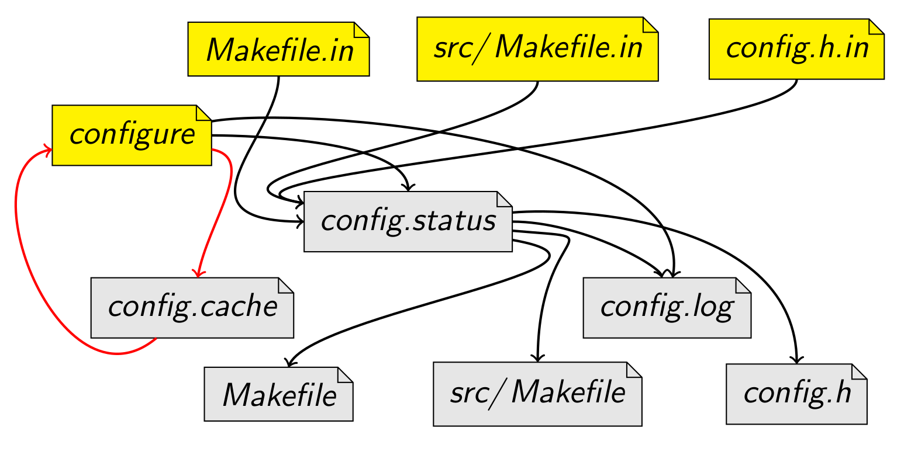
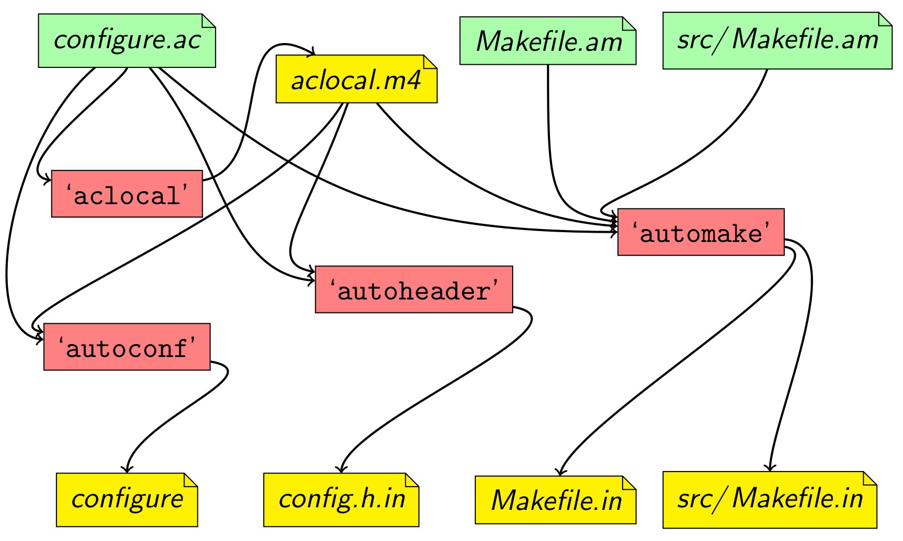
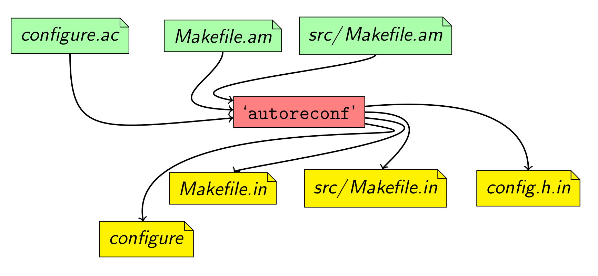

# 构建系统

代码变成可执行文件的过程可以笼统的称为编译链接，编译链接的安排叫做构建 (build)。对于大型项目而言，手动编译链接文件效率低下，通过构建系统就可以快速的完成程序的编译链接。其中 Make 是最常用的构建工具，主要用于 C 语言的项目。但是实际上，任何只要某个文件有变化就要重新构建的项目，都可以用 Make 构建。

## Make 的概念

`make` 命令直接用了 Make 这个词制作的含义，制作出某个文件包括三个部分：产品（目标）、原料（前置条件）和构造步骤（命令）。比如，制作产品 a.txt，需要获取 b.txt 和 c.txt ，构造步骤是将两个文件连接（cat 命令）而成，那么使用 make 命令就写为如下格式：

```makefile
a.txt: b.txt c.txt
    cat b.txt c.txt > a.txt
```

`make a.txt` 这条命令的背后，实际上分成两步：

1. 确认 b.txt 和 c.txt 必须已经存在;
2. 使用 cat 命令 将这个两个文件合并，输出为新文件。

像这样的规则，都写在一个叫做 Makefile 的文件中，Make 命令依赖这个文件进行构建。Makefile 文件也可以用命令行参数 `make --file=rules.txt` 指定依据 rules.txt 文件中的规则进行构建。

总之，make 只是一个根据指定的 Shell 命令进行构建的工具。

## Makefile 文件格式

Makefile 文件由一系列规则（rules）构成。每条规则的形式如下。

```makefile
<target> : <prerequisites> 
[tab]  <commands>
```

“目标”是必需的，不可省略；**“前置条件”和“命令”都是可选的，但是两者之中必须至少存在一个**。

每条规则就明确两件事：**构建目标的前置条件是什么，以及如何构建**。

### 目标 (target)

一个目标（target）就构成一条规则。**目标通常是文件名**，指明 Make 命令所要构建的对象，比如 a.txt 。目标可以是一个文件名，也可以是多个文件名，之间用空格分隔。

除了文件名，**目标还可以是某个操作的名字**，这称为"伪目标"（phony target）。

```makefile
clean:
    rm *.o
```

上面代码的目标是 clean，它不是文件名，而是一个操作的名字，属于伪目标，作用是删除对象文件。但是，如果当前目录中，正好有一个文件叫做 clean，那么这个命令不会执行。为了避免这种情况，可以明确声明 clean 是伪目标，写法如下。

```makefile
.PHONY: clean
clean:
    rm *.o temp
```

如果 Make 命令运行时没有指定目标，**默认会执行 Makefile 文件的第一个目标**。

### 前置条件 (prerequisites)

前置条件通常是一组文件名，之间用空格分隔。指定了“目标”是否重新构建的判断标准：只要有一个前置文件不存在，或者有过更新（前置文件的 last-modification 时间戳比目标的时间戳新），"目标"就需要重新构建。

```makefile
result.txt: source.txt
    cp source.txt result.txt

source.txt:
    echo "hello makefile" > source.txt
```

上面代码中，构建 result.txt 的前置条件是 source.txt 。如果当前目录中 source.txt 已经存在，那么 `make result.txt` 可以正常运行，否则必须再写一条规则，来生成 source.txt 。

第二条规则中，构建 source.txt 没有前置条件，就意味着它跟其他文件都无关，只要这个文件还不存在，每次调用 `make source.txt`，它都会生成。

如果连续两次次执行 `make result.txt`，第一次执行会先新建 source.txt，然后再新建 result.txt。第二次执行，Make 发现 source.txt 没有变动（时间戳晚于 result.txt），就不会执行任何操作，result.txt 也不会重新生成。

```makefile
$ make result.txt
echo "hello makefile" > source.txt
cp source.txt result.txt
$ make result.txt
make: 'result.txt' is up to date.
```

如果生成多个文件，可以不指定命令。source 是一个伪目标，只有三个前置文件，没有任何对应的命令。执行 `make source` 命令后，就会一次性生成 file1，file2，file3 三个文件。

```makefile
source: file1 file2

file1:
    touch file1
file2:
    touch file2
file3:
    touch file3
```

### 命令 (commands)

命令（commands）表示如何更新目标文件，由一行或多行的 Shell 命令组成。它是构建"目标"的具体指令，它的运行结果通常就是生成目标文件。

**每行命令之前必须有一个 Tab 键作为分隔符**。如果想用其他键，可以用内置变量 `.RECIPEPREFIX = >` 声明使用 `>` 作为分隔符。

> 许多编辑器会“智能”的将 Tab 替换为 4/8 个空格，请确保在写 Makefile 文件时关闭这项功能，当然真正智能的编辑器会自动在 Makefile 文件中关闭这项功能。如果是复制的别人的 Makefile 代码，很有可能复制出空格，从而导致 `*** missing separator.` 的报错出现。

**每行命令在一个单独的 shell 中执行，这些 Shell 之间没有继承关系**。因为不同行命令在两个不同的进程执行，解决办法是：

- 将两行命令写在一行，中间用分号分隔。
- 在换行符前加反斜杠转义。
- 在目标前加上 `.ONESHELL:` 命令。

## Makefile 文件语法

### 基本语法

井号（#）在 Makefile 中表示注释。

正常情况下，make 会打印每条命令（包括命令中的注释），然后再执行，这就叫做回声（echoing）。在命令的前面加上@，就可以关闭回声。

### 通配符 

通配符（wildcard）用来指定一组符合条件的文件名。Makefile 的通配符与 Bash 一致，主要有星号（*）、问号（？）和 [...] 。比如， `*.o` 表示所有后缀名为o的文件。

PHONY 目标并非实际的文件名：只是在显式请求时执行命令的名字。有两种理由需要使用 PHONY 目标：避免和同名文件冲突，改善性能。

### 模式匹配

Make 命令允许对文件名，进行类似正则运算的匹配，主要用到的匹配符是 `%` 。比如，假定当前目录下有 f1.c 和 f2.c 两个源码文件，需要将它们编译为对应的对象文件。

```makefile
%.o: %.c: # 等同于以下规则

f1.o: f1.c
f2.o: f2.c
```

**使用匹配符 %，可以将大量同类型的文件，只用一条规则就完成构建**。

### 变量

Makefile 允许使用等号自定义变量。调用时，变量需要放在 `$( )` 之中。

```makefile
src = main.c
main: src
    gcc -c $(src) -o main
```

调用 Shell 变量，需要在美元符号前，再加一个美元符号，这是因为 Make 命令会对美元符号转义。

Make命令提供一系列内置变量，比如，`$(CC)` 指向当前使用的 C 编译器，`$(MAKE)` 指向当前使用的 Make 工具。这主要是为了跨平台的兼容性，详细的内置变量清单见手册。

| 标准配置变量 |           解释           |
| :----------: | :----------------------: |
|    **CC**    |    C compiler command    |
|   **CXX**    |   C++ compiler command   |
| **CPPFLAGS** | C/C++ preprocessor flags |
|  **CFLAGS**  |     C compiler flags     |
| **CXXFLAGS** |    C++ compiler flags    |
| **LDFLAGS**  |       linker flags       |

Make 命令还提供一些自动变量，它们的值与当前规则有关。主要有以下几个。

`$@` 表示目标文件
`$^` 表示所有的依赖文件
`$<` 表示第一个依赖文件
`$?` 表示比目标还要新的依赖文件列表
`$*` 指代匹配符 % 匹配的部分

### 赋值运算符

Makefile 一共提供了四个赋值运算符，详细区别见 [StackOverlow](https://stackoverflow.com/questions/448910/what-is-the-difference-between-the-gnu-makefile-variable-assignments-a)。

| 符号 | 含义         | 说明                                                         |
| ---- | ------------ | ------------------------------------------------------------ |
| `=`  | 惰性赋值     | 如果变量已经有值，那么新值将覆盖原有值，但变量将会在其使用时展开。 |
| `:=` | 立即赋值     | 如果变量已经有值，那么新值将覆盖原有值，但变量在其赋值时立即展开。 |
| `?=` | 惰性初始赋值 | 类似 `=`，但仅在变量没有赋值过时生效。                       |
| `+=` | 惰性追加赋值 | 类似 `=`，但新值将追加到原有值后面，两者使用空格分开。       |

### 控制流

```makefile
ifeq ($(CC),gcc)
  libs=$(libs_for_gcc)
else
  libs=$(normal_libs)
endif
```

```makefile
all:
    for i in one two three; do \
        echo $i; \
    done

LIST = one two three    # 同上
all:
    for i in $(LIST); do echo $i; done
```


### 函数

Makefile 还可以使用函数，格式如下。

```makefile
$(function arguments)
${function arguments}   # 另一种写法
```

Makefile 提供了许多内置函数，可供调用。下面是几个常用的内置函数。

- shell 函数用来执行 shell 命令
- wildcard 函数用来在 Makefile 中，替换 Bash 的通配符。
- subst 函数用来文本替换。
- patsubst 函数用于模式匹配的替换

## 隐式规则 (Implicit Rules)

在使用 Makefile 时，有一些使用频率非常高的东西，例如编译 C/C++ 的源程序为中间目标文件（Unix下是 .o 文件，Windows下是 .obj 文件）。“隐含规则”就是一种惯例，make 会按照这种“惯例”心照不喧地来运行，即使 Makefile 中没有显式的指明。

### 编译 C 程序

`n.o` 从 `n.c` 自动推导得出 ，其生成命令是 `$(CC) –c $(CPPFLAGS) $(CFLAGS)`

### 编译 C++ 程序

`n.o` 从 `n.cc`, `n.cpp`, `n.C` 自动推导得出，其生成命令是 `$(CXX) $(CPPFLAGS) $(CXXFLAGS) -c`

### 汇编和汇编预处理

TODO

### 链接 Object 文件

TODO

## Makefile 实例

### 简单项目

对于一个简单项目，假设源文件均直接在项目目录下，并且将所有目标文件都输出到当前目录中，则可以使用以下 makefile 文件构建。

```makefile
TARGET_EXEC = a.out

SRCS := $(wildcard *.c)
OBJS := $(SRCS:%.c=%.o)

CFLAGS = -g -W -Wall -I.
LDFLAGS = -lpthread

.PHONY: clean

%.o: %.c
	$(CC) ${CFLAGS} -c $< -o $@
$(TARGET_EXEC): $(OBJS)
	$(CC) $(OBJS) -o $@ $(LDFLAGS)

clean:
	rm -f ${TARGET_EXEC} $(OBJS)
```

### 中小型项目

对于一个中型的C/C+工程，假设其目录结构如下：

```
├── build
│   ├── a.out
│   └── src
│       ├── main.c.d
│       └── main.c.o
├── include
│   └── log.h
├── lib
│   └── liblog.a
├── log
│   └── log.txt
├── Makefile
├── README.md
├── src
│   └── main.c
├── test
```

则可以直接使用以下 makefile 文件构建项目。

```makefile
TARGET_EXEC ?= a.out

SRC_DIRS ?= ./src
INC_DIRS ?= ./include
INC_DIRS += $(shell find $(SRC_DIRS) -type d)
BUILD_DIR ?= ./build
LIB_DIRS ?= ./lib
TEST_DIRS ?= ./test

SRCS := $(shell find $(SRC_DIRS) -name *.cpp -or -name *.c -or -name *.s)
OBJS := $(SRCS:%=$(BUILD_DIR)/%.o)
DEPS := $(OBJS:.o=.d)
LIBS := $(shell basename $(LIB_DIRS)/*.a)

INC_FLAGS := $(addprefix -I,$(INC_DIRS))
CPPFLAGS := $(INC_FLAGS) -g -W -Wall -MMD -MP
LDFLAGS := -L$(LIB_DIRS) -llog

$(BUILD_DIR)/$(TARGET_EXEC): $(OBJS)
	$(CC) $(OBJS) -o $@ $(LDFLAGS)

# assembly
$(BUILD_DIR)/%.s.o: %.s
	$(MKDIR_P) $(dir $@)
	$(AS) $(ASFLAGS) -c $< -o $@

# c source
$(BUILD_DIR)/%.c.o: %.c
	$(MKDIR_P) $(dir $@)
	$(CC) $(CPPFLAGS) $(CFLAGS) -c $< -o $@

# c++ source
$(BUILD_DIR)/%.cpp.o: %.cpp
	$(MKDIR_P) $(dir $@)
	$(CXX) $(CPPFLAGS) $(CXXFLAGS) -c $< -o $@

.PHONY: clean

clean:
	$(RM) -r $(BUILD_DIR)

-include $(DEPS)

MKDIR_P ?= mkdir -p
```

### 批量编译

当前目录下有多个 C 文件，每个 C 文件有一个 main() 函数，把这些 C 文件分别编译成对应名字的可执行文件。

```makefile
CFLAGS = -g -W -Wall
LDFLAGS = -lpthread

SRCS = $(wildcard *.c)
TARGET = $(patsubst %.c, %, ${SRCS})

.PHONY: all clean

%.o: %.c
	$(CC) ${CFLAGS} -c -o $@
%: %.o
	$(CC) ${LDFLAGS} -o $@

all: ${TARGET}

clean:
	rm -f ${TARGET}
```

在 Makefile 规则中，通配符会被自动展开。但在变量的定义和函数引用时，通配符将失效。这种情况下如果需要通配符有效，就需要使用函数 wildcard，它的用法是：`$(wildcard PATTERN...)`。首先使用 wildcard 函数获取工作目录下的 `.c` 文件列表；在Makefile中，它被展开为已经存在的、使用空格分开的、匹配此模式的所有文件列表。如果不存在任何符合此模式的文件，函数会忽略模式字符并返回空。

可以使用 `$(patsubst %.c,%.o,$(wildcard *.c))`，之后将列表中所有文件名的后缀 `.c` 替换为 `.o`。这样我们就可以得到在当前目录可生成的 `.o` 文件列表。

### 中大型项目

```makefile
# C Makefile using gcc, gdb and valgrind. 
# Modified version of Makefile using g++ & gdb by Roberto Nicolas Savinelli <rsavinelli@est.frba.utn.edu.ar>
# Tomas Agustin Sanchez <tosanchez@est.frba.utn.edu.ar>

# Includes the project configurations
include project.conf

# Validating project variables defined in project.conf
ifndef PROJECT_NAME
$(error Missing PROJECT_NAME. Put variables at project.conf file)
endif
ifndef BINARY
$(error Missing BINARY. Put variables at project.conf file)
endif
ifndef PROJECT_PATH
$(error Missing PROJECT_PATH. Put variables at project.conf file)
endif

# C Compiler
CC = gcc
# Compiler Flags
CFLAGS = -Wall -Wextra -g3
# Test Compiler flags
TCFLAGS = -Wall -Wextra -Wshadow -Wno-unused-variable -Wno-unused-function -Wno-unused-result -Wno-unused-variable -Wno-pragmas -O3 -g3
# Used libraries
LIBS = -lm
# Test libraries
TEST_LIBS = -l cmocka -L /usr/lib
# Include directory
INCLUDE_DIRECTORY=./include/
# Source directory
SOURCE_DIRECTORY=./src
# Test Directory
TEST_DIRECTORY=./test
# The main file path
MAIN_FILE= ./src/app/main.c
# Inlcude folder
INCLUDES = $(foreach dir, $(shell find $(INCLUDE_DIRECTORY) -type d -print), $(addprefix -I , $(dir)))
# Source files
SOURCES = $(filter-out $(MAIN_FILE), $(shell find $(SOURCE_DIRECTORY) -name '*.c'))
# Test cases files
TESTS = $(shell find $(TEST_DIRECTORY) -name '*.c')
# Application name
APPNAME = route
# Output file name
OUTPUT = build/$(APPNAME).out
# Test Output file
TEST_OUTPUT = build/$(APPNAME)_test.out
# Leaks log file
LEAKS = log/leaks.log
# Thread chek log file
HELGRIND = log/threads.log

all : compile run

.PHONY: all

start:
	@echo "Creating project: $(PROJECT_NAME)"
	@mkdir -pv $(PROJECT_PATH)
	@echo "Copying files from template to new directory:"
	@cp -rvf ./* $(PROJECT_PATH)/
	@echo
	@echo "Go to $(PROJECT_PATH) and compile your project: make"
	@echo "Then execute it: build/$(BINARY) --help"
	@echo "Happy hacking :-P"

install:
	@echo Installing dependencies...
# Install required libraries here.
	@echo Installed

dirs: 
	@echo $(DIRS)

compile:
	@mkdir -p build
	@echo Building...
	$(CC) $(CFLAGS) $(MAIN_FILE) $(SOURCES) $(INCLUDES) $(LIBS) -o $(OUTPUT)
	@echo Build completed.

run: compile
	@echo 
	./$(OUTPUT)

test-build:
	@mkdir -p build
	@echo Preparing tests...
	$(CC) $(TCFLAGS) $(TESTS) $(SOURCES) $(INCLUDES) $(LIBS) $(TEST_LIBS) -o $(TEST_OUTPUT)

test: test-build
	./$(TEST_OUTPUT)
	@echo Tests completed.
	
leaks: compile
	@mkdir -p log
	valgrind --leak-check=yes --log-file="$(LEAKS)" --track-origins=yes ./$(OUTPUT)

threads: compile
	@mkdir -p log
	valgrind --tool=helgrind --log-file="$(HELGRIND)" ./$(OUTPUT)

clean:
	$(RM) ./$(OUTPUT)

cleanLogs:
	$(RM) -r log || true

remove: clean cleanLogs
```

## 自动化工具

在项目规模较小、场景简单的情况下，编写 Makefile 不是一件难事，然而随着场景复杂，编写能够适配多种平台的 Makefile 是十分复杂的。Autotools 工具包可以根据目标机器环境，生成对应的 Makefile，使程序员将主要精力集中在代码的编写上。

在 Windows 平台下软件安装一般提供**一键式安装**程序，而 Linux 平台的软件一般有二进制分发和源码分发两种。由于 Linux 平台版本较多，因此通过源码安装的方式更为普适且对软件具有一定的定制化，但由此带来的缺点是略显复杂。

### 基本流程

用户在安装前一般需要进行以下准备：

- 获取软件源代码压缩包。
- 准备开发工具，包括  `gcc` 编译器套件、`make` 构建工具等。
- 阅读说明文档（如果开发者已提供）。

开发者决定将软件进行源码发布之后，通常倾向于让用户以尽量简洁的方式来安装。在 GNU 风格中，开发者将倾向于让用户可以直接执行以下三部分操作来完成安装。

```shell
$ ./configure			# 配置脚本
$ make					# 构建命令
$ [sudo] make install	# 安装命令
```

其中每一行命令完成一件事：

1. 配置：`configure` 脚本将会检查目标系统的配置和当前可用的特性，保证软件可以在当前平台上正确构建，最终生成 `Makefile` 脚本供以下步骤使用。
2. 构建：当 `configure` 配置完毕后，可以使用 `make` 命令执行构建。这个过程会执行在 `Makefile` 文件中定义的一系列任务将软件源代码编译成可执行文件等。
3. 安装：命令将生成的可执行文件、库等文件复制到系统标准目录中。通常，可执行文件被复制到某个 `PATH` 包含的路径，程序的调用文档被复制到某个 `MANPATH` 包含的路径，还有程序依赖的文件也会被存放在合适的路径。

### Autotools 工具包

以上三个步骤依赖 `configure` 和 `Makefile` 两个脚本文件。 [Autotools Tutorial](https://www.lrde.epita.fr/~adl/autotools.html) 是一个优秀的教程！

首先，`configure` 脚本会结合一些**模板文件**（通常是 `.in` 后缀）生成 `config.h` 和 `Makefile` 文件，如下图所示。



其中黄色部分即是开发者需要提供给用户的文件，那么这些模板脚本如何生成呢？幸运的是，开发者无需手动编写它们，而是通过 `Autotools` 软件包来自动生成，该软件包的众多命令协作生成模板和脚本文件。



红色部分是众多参与生成模板文件的命令，而绿色部分是**开发配置文件**。如果你执意弄清楚各个过程可以手动使用命令逐步生成模板文件。**然而，`autoreconf` 命令可以按照规则自动调用上述命令，从而大大减少开发者学习成本。**



因此，开发者的任务便简化为：

- 编写 `Makefile.am` 文件：其中 `.am` 表示 **a**uto**m**ake。`automake` 命令通过该文件生成 `Makefile.in`。
- 编写 `configure.ac` 文件：其 `.ac` 后缀代表 **a**uto**c**onf。`autoconf` 命令通过该文件生成 `configure` 文件，`autoheader` 命令通过该文件生成 `config.h.in` 文件，`automake` 命令生成 `Makefile.in` 时也需要该文件。
- 使用 `autoreconf` 命令生成用户需要的 `configure` 脚本和 `.in` 后缀的模板文件。

### configure.ac 配置

```
AC_INIT([amhello], [1.0], [bug-automake@gnu.org])
AM_INIT_AUTOMAKE([-Wall -Werror foreign])
AC_PROG_CC
AC_CONFIG_HEADERS([config.h])
AC_CONFIG_FILES([
 Makefile
 src/Makefile
])
AC_OUTPUT
```

更多参考 [configure.ac Setup Explained](https://www.gnu.org/software/automake/manual/html_node/amhello_0027s-configure_002eac-Setup-Explained.html)

### Makefile.am 配置

项目根目录下的 `Makefile.am` 应当保持简洁。

```
SUBDIRS = src
dist_doc_DATA = README
```

`SUBDIRS` 是一个特殊变量，列出了在处理当前目录之前应该递归处理的所有目录。

在子目录的 `src/Makefile.am` 中列出了所有 `automake` 的构建指令。

```
bin_PROGRAMS = hello
hello_SOURCES = main.c
```

`bin_PROGRAMS` 表明最终需要在 `Makefile` 中构建 `hello` 程序，并且安装到 `bindir` 目录中。

对于每一个在 `_PROGRAMS` 变量中定义的 `prog` 程序，将会寻找一个 `prog_SOURCES` 变量中定义的源文件，这些文件将会编译、链接到一起。 

