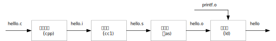

# 编译系统

## 程序组织结构

`hello.h` 头文件定义了程序接口，其内容如下。

```c
#ifndef HELLO_H
#define HELLO_H

void hello();

#endif
```

`hello.c` 文件定义了程序实现，其内容如下：

```c
#include <stdio.h>
#include "hello.h"

void hello() {
    printf("Hello world!\n");
}
```

`main.c` 文件定义了主程序，其内容如下：

```c
#include "hello.h"

int main(){
    hello();   
}
```

然后我们运行这个程序。

```
$ gcc hello.c main.c -o hello
$ ./hello
Hello world!
```

## 编译器驱动程序

将 C 程序从**源文件**转化为**可执行目标文件**，是由**编译器驱动程序 (compiler driver)** 来完成的，这个翻译过程可以分为 4 个阶段，每个阶段由一个程序负责，分别是：

1. 预处理器 (preprocessor)：将 `hello.c` 处理为 `hello.i`
2. 编译器 (compiler)：将 `hello.i` 编译为汇编文件 `hello.s`
3. 汇编器 (assembler)：将 `hello.s` 汇编为目标文件 `hello.o`
4. 链接器 (linking driver) ：将 `hello.o` 与其他目标文件链接为可执行文件`hello`

上述四个程序一同构成了**编译系统 (compilation system)** 。例如 Unix 系统中常用的 **GCC** (the GNU  Compiler Collection) 驱动程序就是编译系统的一种实现。

这个过程可以用下图表示。



通常情况下，我们重点需要了解以下三种文件：
- 源文件 (source file) `hello.c` 
- 可重定位目标文件 (Relocatable object file) `hello.o`
- 可执行目标文件 (Executable object file) `hello`

### 预处理 (Preprocessing)

### 编译 (Compiling)

### 汇编 (Assembling)

### 链接 (Linking)

链接 (linking) 是将各种代码和数据片段收集并组合称为一个单一可执行文件的过程，这个文件可以被**加载（复制）**到内存中并执行。链接可以执行于**编译时 (compile time)** ，也就是在**源代码被翻译成机器代码时**；也可以执行于**加载时 (load time)** ，也就是在**程序被加载器 (loader) 加载到内存并执行时**；也可以执行于**运行时 (run time)** ，也就是**应用程序执行时**。

在早期，链接是手动完成的，在现代系统中，链接是由**链接器 (linker)** 自动执行的。

为什么要有链接器呢？链接器使得**分离编译 (separate compile)** 成为可能。

根据链接发生的时间段，可以分为：

- 编译时链接：正常链接，静态链接库
- 加载时链接：动态链接库
- 运行时链接：动态链接库

按照技术可以分为：

- 静态链接
- 动态链接

https://stackoverflow.com/questions/2055840/difference-between-load-time-dynamic-linking-and-run-time-dynamic-linking

### 总结

gcc 是 Linux 上常用的编译套件，常用选项如下。

|     参数     |             解释             |
| :----------: | :--------------------------: |
|     `-c`     |   编译生成可重定位目标文件   |
|   `-Idir`    |   `dir` 是头文件所在的目录   |
|   `-Ldir`    |   `dir` 是库文件所在的目录   |
| `-o outfile` | `outfile` 是输出文件的文件名 |
|     `-w`     |         隐藏所有警告         |
|     `-W`     |  显示编译器认为有错误的警告  |
|   `-Wall`    |        显示大多数警告        |
|    `-O2`     |         编译优化选项         |
|     `-g`     |         产生调试信息         |

## 可重定位目标文件

### 文件结构

### 符号和符号表

## 可执行目标文件

### 文件结构

### 内存加载

## 静态链接

### 符号解析

### 重定位

### 静态链接库

首先，我们需要将库的源代码编译为目标文件。

```
$ gcc -c hello.c
```

接着，制作静态链接库文件。这里只有一个目标文件，但是可以将多个目标文件打包到一起。

```
ar rc libhello.a hello.o
```

最后，链接静态链接库至主程序中。

```
$ gcc -o main main.c -lhello
/usr/bin/ld: 找不到 -lhello
collect2: error: ld returned 1 exit status
```

然而链接器 `ld` 无法找到 `libhello.a` 文件，GCC 有一个默认的搜索目录列表，GCC 首先搜索这些目录，然后按顺序搜索 `-L` 参数指定的目录。很明显，我们项目的当前目录并没有在其中。所以，我们直接通过 `-L` 参数将当前目录（`./`）加入搜索路径中。

```
$ gcc -o main main.c -lhello -L.
```

>  事实上，链接器的搜索路径很多，可以通过以下命令查看全部搜索路径。
>
>  ```
>  $ ld --verbose | grep SEARCH_DIR | tr -s ' ;' \\012
>  SEARCH_DIR("=/usr/local/lib/x86_64-linux-gnu")
>  SEARCH_DIR("=/lib/x86_64-linux-gnu")
>  SEARCH_DIR("=/usr/lib/x86_64-linux-gnu")
>  SEARCH_DIR("=/usr/lib/x86_64-linux-gnu64")
>  SEARCH_DIR("=/usr/local/lib64")
>  SEARCH_DIR("=/lib64")
>  SEARCH_DIR("=/usr/lib64")
>  SEARCH_DIR("=/usr/local/lib")
>  SEARCH_DIR("=/lib")
>  SEARCH_DIR("=/usr/lib")
>  SEARCH_DIR("=/usr/x86_64-linux-gnu/lib64")
>  SEARCH_DIR("=/usr/x86_64-linux-gnu/lib")
>  ```

很好，现在没有任何链接错误了，运行程序得到正确输出。

```
$ ./main
Hello world!
```

> 另一种方式是直接使用 `gcc -static -o main main.c libhello.a` 来生成静态可执行文件。

## 动态链接

### 链接过程

### 动态链接库

首先，我们需要将库的源代码编译为位置无关代码（position-independent code, PIC）的目标文件。

```
$ gcc -c -fpic hello.c
```

接着，根据目标文件生成动态链接库。

```
$ gcc -shared -o libhello.so hello.o
```

最后，链接动态链接库至主程序中。

```
$ gcc -o main main.c -lhello -L.
```

由于我们有静态链接的经验，加入了 `-L` 参数，因此没有任何链接错误，运行程序试试。

```
$ ./main
./main: error while loading shared libraries: libhello.so: cannot open shared object file: No such file or directory
```

错误再一次发生，原来这次是加载器找不到 `libhello.so` 库了，在 `main` 加载时，加载器会借助 `ld.so` 进行动态链接库的运行时加载（有时候也直接将 `ld.so` 称为加载器），问题就发生在这里。同样，我们查看一下 `ld.so` 的搜索路径。

```
$ ldconfig -v 2>/dev/null | grep -v ^$'\t'
/usr/lib/x86_64-linux-gnu/libfakeroot:
/lib/i386-linux-gnu:
/usr/local/lib:
/lib/x86_64-linux-gnu:
/lib:
```

意料之中的，这个结果同样不包括我们项目的当前目录。我们有以下几种解决办法。

1. 加载器搜索上述**标准目录**，直接将动态链接库复制过去。
2. 加载器会搜索可执行文件的 `rpath` 目录，将当前目录加入其中。
3. 加载器会搜索 `LD_LIBRARY_PATH`  环境变量中定义的目录，将当前目录加入其中。

首先，我们尝试直接将可执行文件复制到标准目录中，这里我们选择 `/usr/local/lib` 目录。

```
$ sudo cp libhello.so /usr/local/lib
$ ./main
Hello world!
```

我们终于看到了久违的输出！这种方式比较适用有管理员权限的场景，这样所有该机器上用户都可以使用该动态链接库。

如果没有管理员权限，那么可以使用第二种方式，直接在链接期将当前路径写入到可执行文件本身的 `rpath` (run path) 中。

```
$ rm main	# delete old executable file
$ gcc -o main main.c -lhello -L. -Wl,-rpath=.	# make new file
$ ./main
Hello world!
```

但这种方式也有缺陷，首先是该路径写入到可执行文件本身，并且运行该文件的用户必须拥有该路径的权限，使用方式不灵活。其次，如果该路径是网络路径，那么程序启动时将会产生延迟。

最后，我们尝试使用配置环境变量的方式。

```
$ gcc -o main main.c -lhello -L.
$ echo $LD_LIBRARY_PATH
$ export LD_LIBRARY_PATH=`pwd`:$LD_LIBRARY_PATH
$ ./main
Hello world!
```

不出意外的，我们再一次看到了成功的输出。


参考：
- [Shared libraries with GCC on Linux](https://www.cprogramming.com/tutorial/shared-libraries-linux-gcc.html#fn:loadorder)
- [How to print the ld(linker) search path](https://stackoverflow.com/questions/9922949/how-to-print-the-ldlinker-search-path)
- [Where do executables look for shared objects at runtime?](https://unix.stackexchange.com/questions/22926/where-do-executables-look-for-shared-objects-at-runtime)

### 运行时加载链接

### 位置无关代码

## 目标文件处理工具

| 工具命令  |                 解释                 |
| :-------: | :----------------------------------: |
|   `ar`    |            创建静态链接库            |
| `objdump` |      可以显示目标文件的所有信息      |
|   `nm`    |                                      |
|  `size`   |                                      |
| `readelf` |                                      |
| `strings` |                                      |
|  `strip`  |                                      |
|   `ldd`   | 列出可执行文件运行时需要的动态链接库 |


## gcc

-I 不会递归搜索目录!!!!!!

## ld
