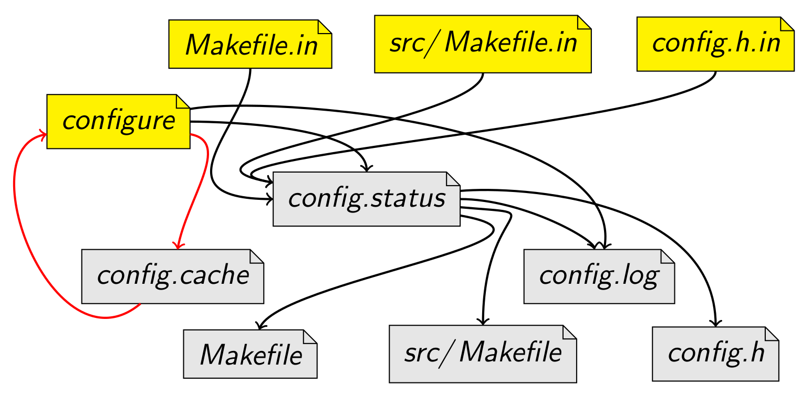
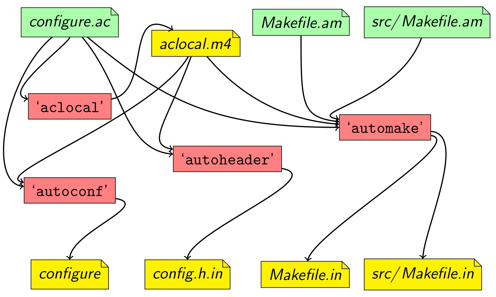
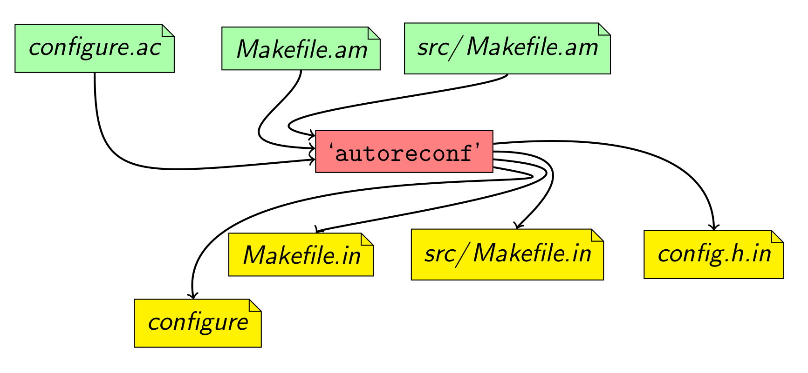

# 软件发布

软件编写完成之后，需要进行软件发布才可以让别人使用。如果可能的话，直接给用户提供可执行文件是最佳选择，这样用户无需进行安装即可开箱即用。然而如果软件复杂，则必须在目标机器上**进行安装**才能使用。在 Windows 平台下软件发布一般提供**一键式安装**程序，而 Linux 平台的软件通过源码安装的方式**略显复杂**，但由此带来的好处是**对软件具有一定的定制化，掌控化**。

## 基本流程

用户在安装前一般需要进行以下准备：

- 获取软件源代码压缩包。
- 准备开发工具，包括  `gcc` 编译器套件、`make` 构建工具等。
- 阅读说明文档（如果开发者已提供）。

开发者决定将软件进行源码发布之后，通常倾向于让用户以尽量简洁的方式来安装。在 GNU 风格中，开发者将倾向于让用户可以直接执行以下三部分操作来完成安装。

```shell
$ ./configure			# 配置脚本
$ make					# 构建命令
$ [sudo] make install	# 安装命令
```

其中每一行命令完成一件事：

1. 配置：`configure` 脚本将会检查目标系统的配置和当前可用的特性，保证软件可以在当前平台上正确构建，最终生成 `Makefile` 脚本供以下步骤使用。
2. 构建：当 `configure` 配置完毕后，可以使用 `make` 命令执行构建。这个过程会执行在 `Makefile` 文件中定义的一系列任务将软件源代码编译成可执行文件等。
3. 安装：命令将生成的可执行文件、库等文件复制到系统标准目录中。通常，可执行文件被复制到某个 `PATH` 包含的路径，程序的调用文档被复制到某个 `MANPATH` 包含的路径，还有程序依赖的文件也会被存放在合适的路径。

## Autotools 工具包

以上三个步骤依赖 `configure` 和 `Makefile` 两个脚本文件。 [Autotools Tutorial](https://www.lrde.epita.fr/~adl/autotools.html) 是一个优秀的教程！

首先，`configure` 脚本会结合一些**模板文件**（通常是 `.in` 后缀）生成 `config.h` 和 `Makefile` 文件，如下图所示。



其中黄色部分即是开发者需要提供给用户的文件，那么这些模板脚本如何生成呢？幸运的是，开发者无需手动编写它们，而是通过 `Autotools` 软件包来自动生成，该软件包的众多命令协作生成模板和脚本文件。



红色部分是众多参与生成模板文件的命令，而绿色部分是**开发配置文件**。如果你执意弄清楚各个过程可以手动使用命令逐步生成模板文件。**然而，`autoreconf` 命令可以按照规则自动调用上述命令，从而大大减少开发者学习成本。**



因此，开发者的任务便简化为：

- 编写 `Makefile.am` 文件：其中 `.am` 表示 **a**uto**m**ake。`automake` 命令通过该文件生成 `Makefile.in`。
- 编写 `configure.ac` 文件：其 `.ac` 后缀代表 **a**uto**c**onf。`autoconf` 命令通过该文件生成 `configure` 文件，`autoheader` 命令通过该文件生成 `config.h.in` 文件，`automake` 命令生成 `Makefile.in` 时也需要该文件。
- 使用 `autoreconf` 命令生成用户需要的 `configure` 脚本和 `.in` 后缀的模板文件。

## configure.ac 配置

```
AC_INIT([amhello], [1.0], [bug-automake@gnu.org])
AM_INIT_AUTOMAKE([-Wall -Werror foreign])
AC_PROG_CC
AC_CONFIG_HEADERS([config.h])
AC_CONFIG_FILES([
 Makefile
 src/Makefile
])
AC_OUTPUT
```

更多参考 [configure.ac Setup Explained](https://www.gnu.org/software/automake/manual/html_node/amhello_0027s-configure_002eac-Setup-Explained.html)

## Makefile.am 配置

项目根目录下的 `Makefile.am` 应当保持简洁。

```
SUBDIRS = src
dist_doc_DATA = README
```

`SUBDIRS` 是一个特殊变量，列出了在处理当前目录之前应该递归处理的所有目录。

在子目录的 `src/Makefile.am` 中列出了所有 `automake` 的构建指令。

```
bin_PROGRAMS = hello
hello_SOURCES = main.c
```

`bin_PROGRAMS` 表明最终需要在 `Makefile` 中构建 `hello` 程序，并且安装到 `bindir` 目录中。

对于每一个在 `_PROGRAMS` 变量中定义的 `prog` 程序，将会寻找一个 `prog_SOURCES` 变量中定义的源文件，这些文件将会编译、链接到一起。 

更多参考 [Makefile.am Setup Explained](