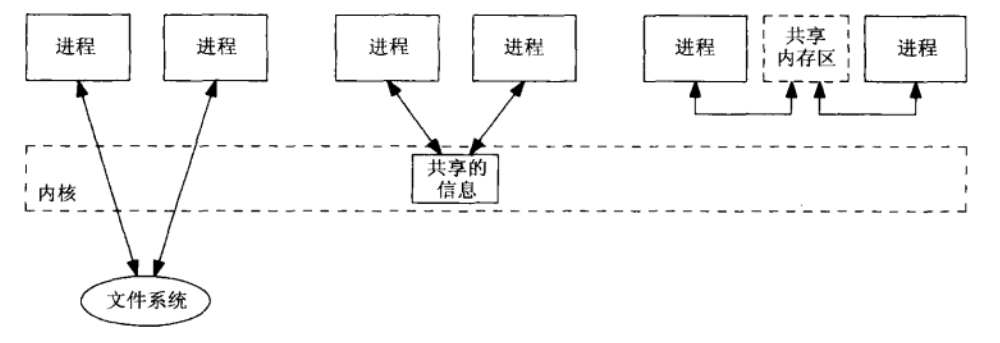

# 进程间通信

## IPC 简介

### Unix 共享信息模型

进程间通信（Inter Process communication, IPC）即进程间交互信息。狭义上来讲，IPC 广义上来讲，IPC 不仅包括进程间通信，还包括线程间通信。

在 Unix 中，每个进程都有各自的地址空间，进程间信息共享的方式有以下三种：

1. **共享文件系统文件中信息**：要访问此数据，每个进程都**必须经过内核**（读、写等），在更新文件时，**需要某种形式的同步**，防止读写串扰。
2. **共享驻留在内核中的信息**：访问共享信息的每个操作都**涉及对内核的系统调用**。例如管道、消息队列、信号量。
3. **共享内存区域**：进程通过设置共享内存即可共享信息，**完全不需要内核**，共享内存的进程**需要某种形式的同步**。
    以上所有的 IPC 技术都不止局限于两个进程。

在具有线程模型的 Unix 中，线程是最小执行单元。根据线程的所属，分为两种情况：

1. 不同进程的线程间通信：可视为上述进程间通信。
2. 同一进程的线程间通信：由于同一进程中的所有线程共享相同的全局变量，因此这种通信方式与进程间共享内存区域概念类似。

综上所述，我们可以得到

对于线程而言，同一进程中的所有线程共享相同的全局变量，因此共享内存的概念是线程模型的固有属性。多个线程访问这些全局变量必须使用同步手段，同步虽然不是明确的 IPC 形式，但与许多形式的 IPC 一起使用来控制对某些共享数据的访问。

### 

### 概述

进程间通信（Inter Process communication, IPC）具有两种基本方式：

- **消息传递（Message Passing）**：不同进程之间通过传递消息来获取信息。
    - 匿名管道 (Anonymous pipe)
    - 命名管道 (Named pipe)
    - 信号 (Signal)
    - 消息队列 (Message queue)
        - POISX
        - System V
    - 网络套接字 (Socket)  
    - Unix 域套接字 (Unix domain socket)、
    - 远程过程调用 (Remote Process Calls, RPCs)
- **同步（Synchronization）**：不同进程之间通过共享对象来获取信息。
    - 共享内存 (Shared memory)
    - 内存映射文件 (Memory-mapped file)

Synchronization

- System V semaphore
- Posix semaphore
- Mutexes and Conditional variable
- Read-write locks

IPC 分为四种主要的方式:

1. message passing (pipes, FIFOs, message queues),
2. synchronization(mutexes, condition variables, read-write locks, semaphores),
3. shared memory (anonymous, named)
4. procedure calls (Solaris doors, Sun RPC)

| 方法                                                     | 简述                                                         | 特点                                                         | 适用场景 |
| -------------------------------------------------------- | ------------------------------------------------------------ | ------------------------------------------------------------ | -------- |
| 文件 (File)                                              | 存储在磁盘或文件服务器上的记录，可以由多个进程访问。         |                                                              |          |
| 匿名管道 (Anonymous pipe)                                | 使用标准输入和输出构建的单向数据通道，写入管道的写入端的数据由操作系统缓冲在内存，直到从管道的读取端读取数据为止。通过使用相反“方向”上的两个管道可以实现过程之间的双向通信。 | 只能用于父子进程或者兄弟进程之间。                           |          |
| 命名管道 (Named pipe)                                    | 与匿名管道使用标准输入输出进行读写不同，命名管道的读写就像常规文件。 |                                                              |          |
| 信号 (Signal) 异步系统陷入 (Asynchronous System Trap) | 从一个进程发送到另一个进程的系统消息，通常不用于传输数据，而是用于远程命令伙伴进程。 | 信号是软件层次上对中断机制的一种模拟，是一种异步通信方式，   |          |
| 消息队列 (Message queue)                                 |                                                              |                                                              |          |
| 套接字 (Socket)                                          |                                                              |                                                              |          |
| Unix 域套接字 (Unix domain socket)                       |                                                              |                                                              |          |
| 共享内存 (Shared memory)                                 | 多个进程被授予对同一块内存的访问权限，该内存块创建了一个共享缓冲区，以使进程之间可以相互通信。 | 由于多个进程共享一段内存，因此需要依靠某种同步机制（如信号量）来达到进程间的同步及互斥。 |          |
| 消息传递 (Message passing)                               |                                                              |                                                              |          |
| 内存映射文件 (Memory-mapped file)                        | 映射到 RAM 的文件，可以通过直接更改内存地址而不是输出到流来修改。这具有与标准文件相同的好处。 |                                                              |          |

### IPC 对象的持久化

IPC 对象有三种类型的持续性：

- 随进程持续：直到打开 IPC 对象的最后一个进程关闭该对象
- 随内核持续：内核重启或 IPC 对象被显式删除
- 随文件系统持续：  直到 IPC 对象被显式删除

没有任何一种 IPC 是使用文件系统持久化的，但确实是有一些 IPC 依赖于文件系统的实现。文件提供了文件系统的持久化属性，但 IPC 通常不使用这种方式，大多数 IPC 对象在内核重启之后就会消失，这是因为进程在重启之后也会消失，进程都消失了，IPC 也失去了意义。同时，使用文件系统持久化可能会降低 IPC 的性能，然而 IPC 的设计目标就是高性能，否则为何不直接使用文件进行信息传递呢？

### IPC 名字和标识

IPC 对象具有名字和标识符，这样一个进程创建 IPC 对象，另一个进程可以指定同一个对象。某种类型的 IPC 所有可能的名字集合称为它的命名空间。

| IPC 类型             | 名字空间       | 标识符                  |
| -------------------- | -------------- | ----------------------- |
| 管道                 | 没有名字       | 文件描述符              |
| FIFO                 | 路径名         | 文件描述符              |
| POSIX 互斥锁         | 没有名字       | `pthread_mutex_t` 指针  |
| POSIX 条件变量       | 没有名字       | `pthread_cond_t` 指针   |
| POSIX 读写锁         | 没有名字       | `pthread_rwlock_t` 指针 |
| `fcntl` 记录上锁     | 路径名         | 文件描述符              |
| POSIX 消息队列       | POSIX IPC 名字 | `mqd_t` 值              |
| POSIX 有名信号量     | POSIX IPC 名字 | `sem_t` 指针            |
| POSIX 基于内存信号量 | 没有名字       | `sem_t` 指针            |
| POSIX 共享内存区     | POSIX IPC 名字 | 文件描述符              |
| 网络套接字           | IP 地址和端口  | 文件描述符              |
| Unix 域套接字        | 路径名         | 文件描述符              |

### IPC 与进程关系

| IPC 类型             | fork | exec | _exit |
| -------------------- | ---- | ---- | ----- |
| 管道                 |      |      |       |
| FIFO                 |      |      |       |
| POSIX 互斥锁         |      |      |       |
| POSIX 条件变量       |      |      |       |
| POSIX 读写锁         |      |      |       |
| `fcntl` 记录上锁     |      |      |       |
| POSIX 消息队列       |      |      |       |
| POSIX 有名信号量     |      |      |       |
| POSIX 基于内存信号量 |      |      |       |
| POSIX 共享内存区     |      |      |       |
| 网络套接字           |      |      |       |
| Unix 域套接字        |      |      |       |

## POSIX IPC

## 消息传递

### 管道

### FIFO

### 消息队列

**消息队列 (Message Queue)是存储在内核中并由消息队列标识符标识的消息的链接表**。以下消息队列简称队列，消息队列标识符简称队列 ID。

msgget()|创建一个新队列
ftok()|用于产生一个唯一的键
msgget()|创建一个新队列或打开一个现有队列，返回其队列 ID。
msgsnd()|将新消息添加到队列尾端。
msgrcv()|从队列中取出消息，不一定以 FIFO 的方式取消息，也可以按消息队类型字段取消息。
msgctl()|对队列执行多种操作，主要用于销毁队列。

## 同步

### 信号量

信号量是一种编程思想

## 共享内存区

### 概述

首先架构模型是什么？和其他 IPc 的优势在哪？（内核复制）

如何同步保护这块地方？

如何创建对象？

如何映射到自身进程地址空间？

Posix 提供了两种进程间共享内存的方法：

- 内存映射文件
- 匿名对象
- 共享内存对象

## 远程进程调用 (RPC)

rpcgen

## 参考

- UNIX Network Programming - volume 2 IPC, by Richard Stevens
- [IPC using Message Queues](https://www.geeksforgeeks.org/ipc-using-message-queues/)
- [How do I read a string entered by the user in C?](https://stackoverflow.com/questions/4023895/how-do-i-read-a-string-entered-by-the-user-in-c)
- 