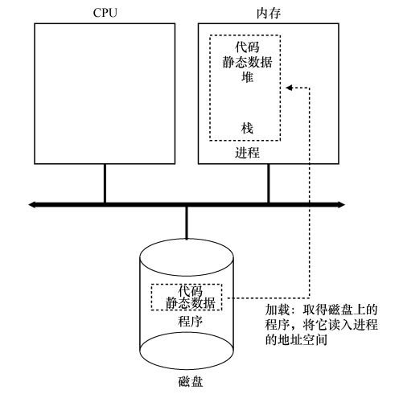
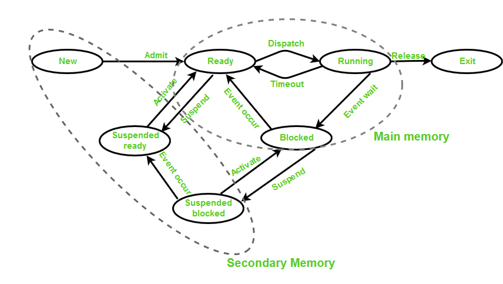

# Linux 内核

## 操作系统介绍

计算机是如何运行程序的？简而言之：执行指令。

- 首先处理器从内存中获取 (fetch) 一条指令；
- 然后对其进行解码 (decode)，弄清楚这是什么指令；
- 接着执行 (execute) 它，具体可以做什么和处理器的指令集有关；
- 完成这条指令后，跳转到下一条指令，直到最后完成程序的执行。

这就是冯·诺依曼计算模型的基础，它的实质就是如此的简单。然而实际上编写这样的代码无异于异常困难，你需要对这个系统中方方面面都了解才能写出一个简单的程序。而**操作系统负责让程序运行变得容易**，允许程序与设备交互，甚至允许你同时运行多个程序！

为了实现上述目的，操作系统利用**虚拟化**技术将物理资源 (如 CPU、内存、硬盘) 转换为更加通用、强大且易于使用的虚拟形式，因此操作系统是一个资源管理器。

为了让你知道你能通过操作系统做些什么，操作系统还提供了一些接口供你调用，实际上典型的操作系统会提供几百个**系统调用 (system call)** 供程序使用。因此操作系统为应用程序提供了一个标准库。Unix 系统结构中，最底层是硬件，然后是内核 (操作系统) ，上层是利用各种系统调用而构建的库或工具，再上层便是应用程序。

### 虚拟化 CPU
以下是一个简单的程序，该程序的作用是：每隔一秒打印一个字符串。
```c
int main(int argc, char* argv[]) {
    if (argc != 2) {
        fprintf(stderr, "usage: cpu <string>\n");
        exit(1);
    }
    char* str = argv[1];
    while(1) {
        sleep(1);
        printf("%s\n", str); 
    }
    return 0;
}
```

我们可以直接运行一个程序，然后使用 `Control + C` 来强制终止他。但假如同时运行四个程序，我们会观察到四个程序仿佛在同时运行，程序交替输出 A B C D，但顺序是不能保证的。
```sh
liyj@ubuntu:~$ gcc -o cpu cpu.c 
liyj@ubuntu:~$ ./cpu "A"
A
A
A
^C
liyj@ubuntu:~$ ./cpu "A" & ./cpu "B" & ./cpu "C" & ./cpu "D" &
... # 4 个程序的 PID
... # 交替输出的 ABCD
```

虽然我们只有一个 CPU (忽略多核超线程) ，但我们好似拥有无限的 CPU，从而让许多程序看似同时运行，这就是**虚拟化 CPU**。

### 虚拟化内存
现代机器提供的物理内存模型非常简单：**内存就是一个字节数组**。程序运行需要访问内存，因为我们的代码和数据都存储在内存之上。

```c
int main(int argc, char* argv[]) {
    int *p = malloc(sizeof(int));
    assert(p != NULL);
    printf("(%d) memory address of p: %p\n", getpid(), p);
    *p = 0;
    while(1) {
        sleep(1);
        *p = *p + 1;
        printf("(%d) p: %d\n", getpid(), *p);
    }
    return 0;
}
```

```
liyj@ubuntu:~$ ./mem & ./mem &
... # 2 个进程的 PID 
(9170) memory address of p: 0x555555559260
(9171) memory address of p: 0x555555559260
... # 交替输出 p 值
```

可以发现，两个进程中的 p 的地址竟然是完全一样的！这正是操作系统虚拟化内存的作用，每个进程都拥有自己的**虚拟地址空间**，而虚拟地址以某种方式映射到了物理地址上，从而不会影响其他进程。注意：要想看到上述效果，必须保证禁用了**地址空间随机化**，随机化可以带来更好的安全性。

### 并发
**并发 (Concurrency)** 指的是可以**同时具有多个活动的任务**。并发的反义词是顺序 (Sequential)，顺序执行的意思是各个任务必须依次执行，而不是并发的交替执行。与并发经常对比的另一个术语是**并行 (parallelism)**，并行强调**同时执行**。

操作系统为我们提供了多种形式的并发手段：基于进程、基于线程、基于事件驱动。当我们需要并发的时候，我们需要同时执行多个任务，那么任务之间的关系就有两种可能性：
1. 分工：多个任务之间不需要交流，每个任务只需专注自己的任务。
2. 合作：多个任务之间需要传递信息。

对于分工式的并发，情况要好处理的多。然而对于合作式的并发，**多个任务同时正确的操作共享 (shared) 可变的 (mutable) 资源可能很有难度**。

- 通过 CPU 虚拟化和内存虚拟化我们已经知道了进程这个概念，**基于进程的并发(process-based concurrency)** 是操作系统固有的并发手段，进程具有“单独的虚拟地址空间”，每个进程都是由内核调度和维护的。
- 随着线程的出现，并发可以更小的粒度来实现，线程是在单个进程的中运行并由内核调度的逻辑流。**基于线程的并发 (thread-based concurrency)** 似乎是目前最常用的手段。
- 还有一类比较高级的并发基于 IO 多路复用实现，这种方式称为**基于事件的并发 (event-based concurrency)** 。与前两种并发手段不同的是，基于事件的并发不再依赖操作系统进行任务调度，所有的任务的逻辑流都是由程序员来完成的。基于事件的并发常用于一些 GUI 程序或网络服务器中。
- 另一种新兴的并发手段是**协程 (coroutine)** ，这种并发手段专注于协作式任务，通常由高级编程语言所支持，与基于事件的并发相同，这种并发手段也是由程序员来完成的。

> 早期的单核处理器系统 (Uniprocessor System) 中，因为仅仅只有一个 CPU 可以执行程序，因此并发执行仅是通过使一台计算机在其执行任务之间快速切换来模拟的。然而，在现代多处理器系统 (Multiprocessor System) 已经司空见惯，多处理器系统具有多个 CPU (通常称为核心 core) 集成到单个 IC 芯片中，同时，超线程技术 (Hyperthreading) 使得单个 CPU 核心可以执行多个控制流，看起来我们拥有了更多的 CPU 硬件。假设你的 PC 使用了一颗 Intel Core i7 8 核 16 线程的芯片，那么可以认为你的 PC 拥有 16 个 CPU 可以用来执行代码。正是由于现代多处理器系统的出现，并发的底层实际上不一定需要频繁的切换任务来模拟，它可能是真正并行执行的。然而作为用户我们无需深究这个过程，因为并发是逻辑上的概念，而并行是一种用来优化的底层技术。

### 持久性
内存的特性是掉电丢失，因此，操作系统需要**硬件和软件**来持久地（persistently）存储数据。
- 硬件以某种输入/输出设备的形式出现。在现代系统中可能是磁盘驱动器（Hard Disk Driver）或者固态硬盘（SSD）。
- 操作系统中管理磁盘的软件通常称为**文件系统（file system）**，它负责以可靠和高效的方式，将用户创建的任何文件（file）存储在系统的磁盘上。

不像操作系统为 CPU 和内存提供的抽象，操作系统不会为每个应用程序创建专用的虚拟磁盘。相反，它假设用户经常需要**共享文件**中的信息。

### 特性与实现
操作系统会将某项功能抽象为具体的形式，例如：
- 将虚拟化 CPU 抽象为进程
- 将虚拟化内存抽象为进程的地址空间
- 将并发功能抽象为线程
- 将持久化功能抽象为文件系统

为了实现这些抽象，操作系统就需要一些低级机制以及一些高级智能。我们将低级机制称为**机制 (mechanism)**。机制是一些低级方法或协议，实现了所需的功能。例如，进程切换是一种虚拟化 CPU 的机制。

在这些机制之上，操作系统中有一些智能以**策略 (policy)** 的形式存在，策略是在操作系统内做出某种决定的算法。操作系统在不同的情况下可以使用不同的策略，从而获得更高效的性能。这是一种模块化的思想，即操作系统可以在底层机制不变的情况下，通过更改策略来更好的实现功能。例如，当需要进程切换时，需要切换到哪一个进程就是进程调度策略。

## 进程

操作系统为正在运行的程序提供的抽象，就是所谓的进程。为了理解构成进程的是什么，我们必须理解它的机器状态 (machine state)：程序在运行时可以读取或更新的内容。具体而言，**一个进程的机器状态涉及到内存、CPU 和外设**。
1. 指令存在内存中，正在运行的程序读取和写入的数据也在内存中。因此进程可以访问的内存（称为**地址空间**，address space）是该进程的一部分。
2. 进程的机器状态的另一部分是**寄存器**。许多指令明确地读取或更新寄存器，因此它们对于执行该进程很重要。例如，程序计数器 (Program Counter，PC) 告诉我们程序当前正在执行哪个指令。
3. 程序也经常访问**持久存储设备**。因此进程需要包含此类 I/O 信息，例如当前打开的文件列表。

### 程序 vs 进程
程序如何转化为进程？具体来说，操作系统如何启动并运行一个程序？

操作系统运行程序必须做的第一件事是将代码和所有静态数据（例如初始化变量）加载 (load) 到内存中，加载到进程的地址空中。程序最初以某种可执行格式驻留在磁盘（或固态硬盘 SSD）上。因此，将程序和静态数据加载到内存中的过程，需要操作系统从磁盘读取这些字节，并将它们放在内存中的某处。



在早期的（或简单的）操作系统中，加载过程在运行程序之前会全部完成，而现代操作系统使用惰性加载机制，即程序执行期间需要加载的代码或数据片段才会加载，要真正理解代码和数据的惰性加载是如何工作的，必须更多地了解分页和交换的机制，这是我们将来讨论**内存虚拟化**时要涉及的主题。

将代码和静态数据加载到内存后，操作系统在运行此进程之前还需要执行其他一些操作。必须为程序的**运行时栈** (run-time stack) 分配一些内存。C 程序使用**栈存放局部变量、函数参数和返回地址**。操作系统也可能为程序的**堆** (heap) 分配一些内存。在 C 程序中，**堆用于显式请求的动态分配数据**。程序通过调用 malloc()来请求这样的空间，并通过调用 free()来明确地释放它。数据结构（如链表、散列表、树和其他有趣的数据结构）需要堆。起初堆会很小。随着程序运行，通过 malloc()库 API 请求更多内存，操作系统可能会参与分配更多内存给进程，以满足这些调用。

操作系统还将执行一些其他初始化任务，特别是与**输入/输出** (I/O) 相关的任务。例如，在 UNIX 系统中，默认情况下每个进程都有 3 个打开的文件描述符 (file descriptor)，用于标准输入、输出和错误，这些描述符让程序轻松读取来自终端的输入以及打印输出到屏幕。

通过将代码和静态数据加载到内存中，通过创建和初始化栈以及执行与 I/O 设置相关的其他工作，OS 现在终于为程序执行搭好了舞台。然后它有最后一项任务：启动程序，在入口处运行，即 main()。通过跳转到 main() 例程，OS 将 CPU 的控制权转移到新创建的进程中，从而程序开始执行。


### 进程状态
既然已经了解了进程是什么，以及它大致是如何创建的，让我们来谈谈进程在给定时间可能处于的不同状态 (state)。简而言之，进程的五个基本状态为：
- 新建 (New/Create) ：创建进程。
- **就绪 (Ready)** ：在创建过程之后，该过程进入就绪状态，即该过程被加载到主存储器中。此处的进程已准备就绪，可以运行，并且正在等待获取 CPU 时间以执行该进程，就绪进程将维护在一个队列中。
- **运行 (Running)** ：进程获得 CPU 时间片，真正开始运行。
- **阻塞 (Blocked)** ：一个进程正在等待某一事件 (例如请求 I/O 或等待 I/O 完成等) 而暂时停止运行，这时即使把处理机分配给进程也无法运行，故称该进程处于阻塞状态。
- **终止 (Terminated)** ：进程结束/终止/退出。

支持**虚拟内存**的系统中的进程可以使用两个其他状态，在这两种状态下，进程都存储在辅助存储器（通常是硬盘） 上。
- 挂起就绪 (Suspended Ready)
- 挂起阻塞 (Suspended Blocked)

简单的理解，当进程就绪或阻塞时，将会加入到一个队列，如果这个队列实际存在物理内存中，则是正常的状态；如果这个队列实际存在于硬盘上，则会附加一个**挂起**的标志，表示当前进程已经不在内存中。



### 数据结构
操作系统是一个程序，和其他程序一样，它有一些关键的数据结构来跟踪各种相关的信息。例如，
- 记录某个进程信息的数据结构
- 为所有就绪的进程保留某种进程列表
- 以某种方式跟踪被阻塞的进程

以下展示了 xv6 内核中每个进程的信息类型

```c
// the registers xv6 will save and restore to stop and subsequently restart a process 
struct context {
 int eip;
 int esp;
 int ebx;
 int ecx;
 int edx;
 int esi;
 int edi;
 int ebp;
};

// the different states a process can be in
enum proc_state { UNUSED, EMBRYO, SLEEPING,
                RUNNABLE, RUNNING, ZOMBIE };

// the information xv6 tracks about each process
// including its register context and state
struct proc {
    char *mem; // Start of process memory
    uint sz; // Size of process memory
    char *kstack; // Bottom of kernel stack
    // for this process
    enum proc_state state; // Process state
    int pid; // Process ID
    struct proc *parent; // Parent process
    void *chan; // If non-zero, sleeping on chan
    int killed; // If non-zero, have been killed
    struct file *ofile[NOFILE]; // Open files
    struct inode *cwd; // Current directory
    struct context context; // Switch here to run process
    struct trapframe *tf; // Trap frame for the
    // current interrupt
}; 
```

除了一些常规进程信息，寄存器上下文 (context) 需要额外注意一下：对于不运行的进程，context 将保存其寄存器的内容。当一个进程停止时，它的寄存器将被保存到这个内存位置，通过恢复这些寄存器（将它们的值放回实际的物理寄存器中），操作系统可以恢复运行该进程，这称为上下文切换。

“真正的”操作系统中存在类似的进程结构，如 Linux、macOS X 或 Windows。通常称之为**进程控制块 (Process Control Block, PCB)**，PCB 是计算机操作系统用来存储有关进程的所有信息的数据结构，每个进程都有一个 PCB 结构。
- 创建 (初始化或安装) 进程后，操作系统将为其创建一个相应的进程控制块。
- 在进程状态转换期间，将更新 PCB 中的信息（寄存器上下文）。
- 当进程终止时，其 PCB 返回到从中提取新 PCB 的池中。

PCB 的作用是使一个在多道程序环境下不能独立运行的程序(含数据)，成为一个能独立运行的基本单位，一个能与其它进程并发执行的进程。PCB 必须保存在受到保护的内存区域中，在某些操作系统中，PCB 放置在进程内核栈的开头。在 Linux 中，PCB 结构为 `task_struct` 结构体。

## 进程机制：受限直接执行
为了虚拟化 CPU，操作系统需要用某种方式让多任务共享物理 CPU，让他们看起来像是同时运行。基本思想很简单：运行一个进程一段时间，然后切换其他进程运行一段时间，如此轮换。通过以这种方式**时分共享 CPU**实现了虚拟化。

首先我们看看程序是如何在 CPU 上**直接执行**的，大致流程如下：
1. 在进程列表中为其创建一个进程条目；
2. 为其分配一些内存；
3. 将程序代码 (可执行文件) 加载到内存中；
4. 执行一些初始化任务 (如根据 argc/argv 设置程序栈) 
5. 找到入口点 (main() 函数) 并跳转到那里进行执行。
6. **(程序代码) 执行 main() 代码，并通过 return 返回**。
7. 释放进程内存，并从进程列表中清除该进程条目。

上述的过程很简单，除了加粗的过程是我们的程序可以决定的，其余过程均是操作系统完成的。在这个过程中，很明显有两个问题需要考虑：
1. **操作系统如何确保程序不做我们不想让它做的事情**。如果没有安全限制，一个恶意程序很快就可以破坏整个系统。
2. **操作系统如何主动切换不同的进程**。如果不能主动切换，程序代码永远不返回岂不是操作系统再也拿不回硬件的控制权。

由于有上述两个问题需要处理，因此操作系统虚拟化 CPU 的底层机制称为**受限直接执行 (limited direct access)**。

### 处理器模式
为了解决第一个问题，**硬件提供了不同的执行模式来协助操作系统**：
- 用户模式 (User mode) ：应用程序不能完全访问硬件资源。
- 内核模式 (Kernel mode) ：应用程序可以做任何事情，操作系统就运行在这种模式下。

如果用户需要执行某种特权操作 (磁盘读写、创建进程、分配更多内存、进程间通信) 怎么办？这依靠操作系统提供的**系统调用 (System Call)**。

要执行系统调用，程序必须执行一个特定的 `trap` 指令。这个指令会跳转到内核程序并且将特权级改为 Kernel mode，这样就可以执行任何指令了。执行完毕后，OS 会调用一个特定的 `return-from-trap` 指令，这个指令会将程序返回到用户程序并且将特权级改为 User mode。

操作系统在启动时会初始化一个 trap 指令表，用来记住每个系统调用的处理代码地址。当系统调用执行时，就会转到这个地址运行系统调用对应的程序。

### 进程间切换
如果一个进程在 CPU 上运行，这就意味着操作系统没有运行。如果操作系统没有运行，它便什么也不能做。像一个哲学问题，操作系统如何重新获得 CPU 的控制权 (regain control) ，以便它可以在进程之间切换？答案很简单：**时钟中断 (timer interrupt)**。时钟设备可以编程为每隔几毫秒产生一次中断。产生中断时，当前正在运行的进程停止，操作系统中预先配置的中断处理程序 (interrupt handler) 会运行。此时，操作系统重新获得 CPU 的控制权，因此可以做它想做的事：停止当前进程，并启动另一个进程。

当操作系统获得控制权之后，切换到哪个进程是由调度程序 (scheduler) 决定的，但如果决定进行切换，OS 就会执行一些底层代码，即所谓的**上下文切换 (context switch)** 。操作系统要做的就是为当前正在执行的进程保存一些寄存器的值 (到它的内核栈) ，并为即将执行的进程恢复一些寄存器的值 (从它的内核栈)。

通过切换栈，内核在进入切换代码调用时，是一个进程 (被中断的进程) 的上下文，在返回时，是另一进程 (即将执行的进程) 的上下文。当操作系统最终执行 `return-from-trap` 时，即将执行的进程变成了当前运行的进程。至此上下文切换完成。

## 进程策略：进程调度

现在已经有了运行进程的底层机制——上下文切换，那么还需要一些上层策略来决定当发生切换时应该选择哪个进程进行切换，这称之为**进程调度/CPU 调度 (CPU Scheduling)**。

### 基本调度思想

| 方法                    | 是否抢占                                                     | 是否抢占 |
| ----------------------- | ------------------------------------------------------------ | -------- |
| 先来先服务 (FCFS)       | 先到先服务 (First Come First Service, FCFS) 是最基本的算法，也称为先进先出 (FIFO) 。 | 非抢占   |
| 最短任务优先 (SJF)      | 最短任务优先 (Shortest Job First, SJF) 的策略是：先运行最短的任务，然后是次短的任务，如此下去。 | 非抢占   |
| 最短完成时间优先 (STCF) | 最短完成时间优先 (Shortest Time-to-Completion First, STCF) 或抢占式最短作业优先 (Preemptive Shortest Job irst, PSJF) 的策略是向 SJF 添加抢占，每当新工作进入系统时，确定剩余工作和新工作中谁的剩余时间更少，然后调度该工作。 | 抢占     |
| 轮转 (RR)               | 轮转调度 (Round Robin, RR) 的基本思想很简单：RR 在一个时间片 (time slice，有时称为调度量子，scheduling quantum) 内运行一个工作，然后切换到运行队列中的下一个任务，而不是运行一个任务直到结束。它反复执行，直到所有任务完成。因此，RR 有时被称为时间切片 (time-slicing) 。时间片长度必须是时钟中断周期的倍数。因此，如果时钟中断是每 10ms 中断一次，则时间片可以是 10ms、20ms 或 10ms 的任何其他倍数。 | 抢占     |

### 实用调度方法

#### 多级反馈队列 (MLFQ)

多级反馈队列 (Multi-level Feedback Queue, MLFQ)
MLFQ 的两条基本规则。

- 规则 1：如果 A 的优先级 > B 的优先级，运行 A (不运行 B) 。
- 规则 2：如果 A 的优先级 = B 的优先级，轮转运行 A 和 B。
- 规则 3：工作进入系统时，放在最高优先级 (最上层队列) 。
- 规则 4a：工作用完整个时间片后，降低其优先级 (移入下一个队列) 。
- 规则 4b：如果工作在其时间片以内主动释放 CPU，则优先级不变。
- 规则 5：经过一段时间 S，就将系统中所有工作重新加入最高优先级队列。
- 规则 4：一旦工作用完了其在某一层中的时间配额 (无论中间主动放弃了多少次 CPU) ，就降低其优先级 (移入低一级队列) 。

MLFQ 有趣的原因是：它不需要对工作的运行方式有先验知识，而是通过观察工作的运行来给出对应的优先级。通过这种方式，MLFQ 可以同时满足各种工作的需求：
- 对于短时间运行的交互型工作，获得类似于 SJF/STCF 的很好的全局性能，
- 同时对长时间运行的 CPU 密集型负载也可以公平地、不断地稳步向前。

因此，许多系统使用某种类型的 MLFQ 作为自己的基础调度程序，包括类 BSD UNIX 系统、Solaris 以及 Windows NT 和其后的 Window 系列操作系统。

#### 比例份额调度
比例份额 (proportional-share) 调度程序，有时也称为公平份额 (fair-share) 调度程序。比例份额算法基于一个简单的想法：**调度程序的最终目标，是确保每个工作获得一定比例的 CPU 时间，而不是优化周转时间和响应时间。**

彩票调度背后是一个非常基本的概念：彩票数 (ticket) 代表了进程 (或用户或其他) 占有某个资源的份额。一个进程拥有的彩票数占总彩票数的百分比，就是它占有资源的份额。

### Linux 多处理器调度
有趣的是，在构建多处理器调度程序方面，Linux 社区一直没有达成共识。一直以来，存在 3 种不同的调度程序：
- O(1) 调度程序：采用多队列，基于优先级（类似 MLFQ），随时间推移改变进程的优先级，然后调度最高优先级进程，来实现各种调度目标。
- 完全公平调度程序 (CFS)：采用多队列，CFS 是确定的比例调度方法（类似彩票调度）
- BF 调度程序 (BFS)：采用单队列，基于比例调度，但采用了其他方法。

目前 CFS 是 Linux 内核的默认调度程序。更多可以参考 [Linux内核-CFS进程调度器](https://wongxingjun.github.io/2015/09/09/Linux%E5%86%85%E6%A0%B8-CFS%E8%BF%9B%E7%A8%8B%E8%B0%83%E5%BA%A6%E5%99%A8/)。


## 线程概念

### 线程的创建
糟糕点：
- 执行顺序不确定
- 共享数据

核心问题：不可控的调度，通过分析汇编码得出结论

### 原子性的愿望
- 超级指令完成 3 条指令的效果
- 提供同步机制，自定义构建超级指令

关键术语|解释
临界区 (critical Section)|访问共享资源的一段代码
竞态条件 (race condition)|竞态条件出现在多个线程大致同时进入临界区时，都试图更新共享资源从而导致了不期望的结果
不确定性 (indeterminate)|由于一个或多个竞态条件组成，导致执行结果不确定
互斥 (mutual exclusion)|

为了避免这些问题，线程应该使用某种**互斥原语**，保证只有一个线程进入**临界区**，从而避免出现**竞态**，并产生**确定**的程序输出。

### 另一个问题：等待另一个线程

### 原子性的愿望

- 超级指令完成 3 条指令的效果
- 提供同步机制，自定义构建超级指令

关键术语|解释
临界区 (critical Section)|访问共享资源的一段代码
竞态条件 (race condition)|竞态条件出现在多个线程大致同时进入临界区时，都试图更新共享资源从而导致了不期望的结果
不确定性 (indeterminate)|由于一个或多个竞态条件组成，导致执行结果不确定
互斥 (mutual exclusion)|

为了避免这些问题，线程应该使用某种**互斥原语**，保证只有一个线程进入**临界区**，从而避免出现**竞态**，并产生**确定**的程序输出。

### 同步概念

并发编程的一个基本问题：我们总是希望原子式 (atomic) 的执行一系列指令。但由于处理器的中断，我们总是做不到。能够直接解决这个问题的一个办法就是使用锁。程序员在源代码中加锁，放在需要保护的关键区 (critical sections) 周围，保证这些关键部分代码能够像单条原子指令一样执行。

对于 `balance = balance + 1;` 这行代码来讲，尽管看起来只有一行，但编译后却产生多条指令，这是一个读-改-写模式，

**更新共享变量**是一种典型的关键代码段。尽管在源代码层次看起来只有一行，但编译后却产生多条指令，这是一个读-改-写模式，在其中任意一步发生线程调度，都可能造成错误的结果。

```
balance = balance + 1;
```

其他的关键区还可能是：为共享的链表增加一个元素，或对共享结构的复杂更新操作。

锁的解决思路如下：

lock_t mutex; // some globally-allocated lock ’mutex’
...
lock(&mutex);
balance = balance + 1;
unlock(&mutex);


锁就是一个变量，这个变量主要保存了锁在某一时刻的状态，它

- 要么是**可用的**，表示没有线程持有锁，
- 要么是**被占用的**，表示有一个线程持有锁，并且正处于关键区。

lock 和 unlock 的语义十分简单：

- lock() 尝试获取锁，如果没有其他线程持有该锁，则该线程获取锁，并进入关键区。
- unlock() 由持有锁的线程调用，一旦被释放，锁就变为可用状态。

锁为程序员提供了最小的调度控制，使得程序员可以获得一些控制权，通过给关键区加锁，**保证关键区内代码只有一个线程活跃**，因此将原本由操作系统调度的混乱状态变得可控。

# Pthread 锁互斥锁

POSIX 库将锁称之为互斥量 (mutual exclusion, mutex)，有时也叫 Pthread 锁，被用来提供线程之间的互斥。

使用起来也十分简单，大致代码如下：

pthread_mutex_t lock = PTHREAD_MUTEX_INITIALIZER; 

pthread_mutex_lock(&lock);
balance = balance + 1;
pthread_mutex_unlock(&lock); 


# 锁的实现和性能

我们已经从程序员的角度，对锁如何工作有了一定的理解。那如何实现一个锁呢？我们需要什么**硬件**支持？需要什么**操作系统**的支持？

在实现锁之前，我们应该首先明确目标，为了评价锁是否能工作（并工作得好），我们应该先设立一些标准。

- 第一是锁的基本任务，即提供**互斥 (mutual exclusion)**。锁是否能够有效阻止多个线程进入关键区？
- 第二是**公平性 (fairness)**。当锁可用时，是否每一个竞争线程有公平的机会抢到锁？从线程角度看就是，是否有竞争锁的线程由于一直无法竞争到锁而饿死。
- 最后是**性能 (performance)**。使用锁之后增加的时间开销有多少，不同的场景有何区别？

# 基于硬件的锁

在本节中，我们仅用硬件支持，看看能实现到什么程度？

## 控制中断

最早提供的互斥解决方案之一，就是在关键区关闭中断，这个解决方案是为单处理器系统开发的。


void lock() {
    DisableInterrupts();
}
void unlock() {
    EnableInterrupts();
}


既然由于是中断导致线程的切换，那我们就解决掉中断。很好，既然解决不了问题，就解决提出问题的人。

假设我们运行在这样一个单处理器系统上。通过在进入临界区之前关闭中断（使用特殊的硬件指令），可以保证临界区的代码不会被中断，从而原子地执行。结束之后，我们重新打开中断（同样通过硬件指令），程序正常运行。

这种方法简单，但却存在许多问题，主要包括：

1. 要求我们允许所有调用线程执行特权操作（打开关闭中断），并信任这种机制不会被滥用。无条件的信任一个用户程序是一个糟糕的选择。
2. 这种方案不支持多处理器。
3. 关闭中断导致中断丢失，可能会导致严重的系统问题。例如磁盘或者网络刚好来了数据，请求中断怎么办？

## 自旋锁 - 一次失败的尝试

首先我们实现一个锁，**用一个变量标记锁是否被持有**。


typedef struct lock_t { int flag; } lock_t;

void init(lock_t *mutex) {
    // 0 -> lock is available, 1 -> held
    mutex->flag = 0;
}

void lock(lock_t *mutex) {
while (mutex->flag == 1) // TEST the flag
    ; // spin-wait (do nothing)
    mutex->flag = 1; // now SET it!
}

void unlock(lock_t *mutex) {
    mutex->flag = 0;
}


首先看互斥性，很明显可以分析出，该方法不满足互斥性。如果 Thread 1 在进入 lock 之后，设置 flag 为 1 之前被中断调度，那么由于此时 flag 仍然为 0，则其他线程同样可以进入 lock。

## 基于 Test-And-Set 的自旋锁

造成上述结果的原因是 test-and-set 这个过程不是原子的！基于这种概念，一些系统提供了一种最简单的硬件支持是测试并设置指令 (test-and-set instruction)，也叫作原子交换 (atomic exchange)。在 x86 上是 xchg 原子交换指令。我们用如下的 C 代码片段来定义 test-and-set 指令做了什么。


int TestAndSet(int *old_ptr, int new) {
    int old = *old_ptr; // fetch old value at old_ptr
    *old_ptr = new; // store 'new' into old_ptr
    return old; // return the old value
} 


test-and-set 指令做了下述事情。它返回 old_ptr 指向的旧值，同时更新为 new 的新值。当然，关键是这些代码原子地执行。因此我们之前的锁可以变为以下内容，其实只有 lock() 部分做了一点修改：


typedef struct lock_t { int flag; } lock_t;

void init(lock_t *mutex) {
    // 0 -> lock is available, 1 -> held
    mutex->flag = 0;
}

void lock(lock_t *mutex) {
while (TestAndSet(&lock->flag, 1) == 1)
    ; // spin-wait (do nothing)
}

void unlock(lock_t *mutex) {
    mutex->flag = 0;
}


通过 test-and-set 指令，我们已经实现了一把最简单的**自旋锁 (spin lock)**。竞争锁的线程在 CPU 周期内一直自旋，直到锁可用。

**自旋锁在单 CPU 的情况下需要抢占式的调度器**，即不断通过时钟中断一个线程，运行其他线程。否则，自旋锁在单 CPU 上无法使用，因为一个自旋的线程永远不会放弃 CPU。

我们来分析一下这个锁：

首先是互斥性，由于 test-and-set 指令，不难分析，在 lock 的过程要么线程进入关键区并设置 flag 为 1，要么一直等待自旋，直到 flag 为 0。

下一个标准是公平性，自旋锁对于等待线程的公平性如何呢？能够保证一个等待线程会进入临界区吗？答案是**自旋锁不提供任何公平性保证**。实际上，自旋的线程在竞争条件下可能会永远自旋。

最后是性能，性能可以分为两方面考虑：

- 在单 CPU 的情况下，性能开销相当大。假设 N 个线程有一个进入关键区，则竞争锁的 N-1 个线程都会在放弃 CPU 之前自旋一个时间片。
- 在多 CPU 上，自旋锁性能不错。假设线程 A 在 CPU 1，线程 B 在 CPU 2 竞争同一个锁。线程 A（CPU 1）占有锁时，线程 B 竞争锁就会自旋（在 CPU 2 上）。然而，临界区一般都很短，因此很快锁就可用，然后线程 B 获得锁。自旋等待其他处理器上的锁，并没有浪费很多 CPU 周期，因此效果不错。

## 基于 Compare-And-Swap 的自旋锁

某些系统提供了另一个硬件原语，名为 CAS。以下是这条指令的 C 语言伪代码。


int CompareAndSwap(int *ptr, int expected, int new) {
    int actual = *ptr;
    if (actual == expected)
        *ptr = new;
    return actual;
} 


有了 CAS 指令，就可以实现一个锁，类似于用 TAS 那样。例如，我们只要用下面的代码替换 lock() 函数即可实现一个自旋锁，其余代码不变。


void lock(lock_t *lock) {
    while (CompareAndSwap(&lock->flag, 0, 1) == 1)
    ; // spin
} 



CAS 比 TAS 更强大，但就实现一个简单的自旋锁方面，两者是等价的。


## 基于 LL-SC 的自旋锁

一些平台提供了实现临界区的一对指令。例如 MIPS 架构中，链接加载（load-linked）和条件式存储（store-conditional）可以用来配合使用，实现其他并发结构。


int LoadLinked(int *ptr) {
    return *ptr;
}
int StoreConditional(int *ptr, int value) {
    if (no one has updated *ptr since the LoadLinked to this address) {
        *ptr = value;
        return 1; // success!
    } else {
        return 0; // failed to update
    }
} 


Load-Linked 指令和典型加载指令类似，关键区别来自 Store-Conditional 指令，只有上一次加载的地址在期间都没有更新时，才会成功，（同时更新刚才 Load-Linked 的地址的值）。成功时，Store-Conditional 返回 1，并将 ptr 指向的值更新为 value。失败时，返回 0，并且不会更新值。

我们可以用链接加载和条件存储指令改写我们的 lock() 函数。


void lock(lock_t *lock) {
    while (1) {
        while (LoadLinked(&lock->flag) == 1)
        ; // spin until it's zero
        if (StoreConditional(&lock->flag, 1) == 1)
        return; // if set-it-to-1 was a success: all done
                // otherwise: try it all over again
    }
}
void unlock(lock_t *lock) {
    lock->flag = 0;
}


一个线程调用 lock()，执行了链接的加载指令，返回 0。在执行条件式存储之前，中断产生了，另一个线程进入 lock 的代码，也执行链接式加载指令，同样返回 0。现在，两个线程都执行了链接式加载指令，将要执行条件存储。重点是只有一个线程能够成功更新标志为 1，从而获得锁；第二个执行条件存储的线程会失败（因为另一个线程已经成功执行了条件更新），必须重新尝试获取锁。

## 基于 Fetch-And-Add 的自旋锁

最后一个硬件原语是获取并增加（fetch-and-add）指令，它能原子地返回特定地址的旧值，并且让该值自增一。获取并增加的 C 语言伪代码如下：

我们使用 fetch-and-add 指令可以实现一个 ticket 锁。


int FetchAndAdd(int *ptr) {
    int old = *ptr;
    *ptr = old + 1;
    return old;
}

typedef struct lock_t {
    int ticket;
    int turn;
} lock_t;

void lock_init(lock_t *lock) {
    lock->ticket = 0;
    lock->turn = 0;
}

void lock(lock_t *lock) {
    int myturn = FetchAndAdd(&lock->ticket);
    while (lock->turn != myturn)
    ; // spin
}

void unlock(lock_t *lock) {
    FetchAndAdd(&lock->turn);
} 


不是用一个值，这个解决方案使用了 ticket 和 turn 变量来构建锁。基本操作也很简单：如果线程希望获取锁，首先对一个 ticket 值执行一个原子的获取并相加指令。这个值作为该线程的“turn”（顺位，即 myturn）。根据全局共享的 lock->turn 变量，当某一个线程的（myturn== turn）时，则轮到这个线程进入临界区。unlock 则是增加 turn，从而下一个等待线程可以进入临界区。

ticket 锁的过程类似于**排队**，每个竞争的线程 lock() 相当于入队，而 unlock() 相当于出队。不同于之前的方法：本方法能够**保证所有线程都能抢到锁**。只要一个线程获得了 ticket 值，最终一定会被调度。


## 总结：自旋过多

基于硬件的锁简单（只有几行代码）而且有效，这也是任何好的系统或者代码的特点。但是某些场景下，这些解决方案会效率低下。

如何让锁不会不必要地自旋，浪费 CPU 时间？只有硬件支持是不够的。我们还需要操作系统支持！

# 基于硬件和 OS 的锁

通过基于硬件的锁，有没有发现，每一个线程无论处于获取锁或是竞争锁的状态，都在不停的运行。

通过操作系统的支持，我们可以给线程定义状态：

- 运行 (Running)：线程可以执行并正在执行，该线程此时获得 CPU 时间片。
- 就绪 (Ready)：线程可以执行，但由于线程调度机制，此时并没有获取 CPU 时间片。
- 阻塞 (Blocked)：线程不可以执行，因此也不参与线程调度，需要被唤醒后才能重新参与线程调度。

## yield 系统调用：让出替代自旋

硬件支持让我们有了很大的进展：我们已经实现了有效、公平（通过 ticket 锁）的锁。但是，问题仍然存在：如果临界区的线程发生上下文切换，其他线程只能一直自旋，等待被中断的（持有锁的）进程重新运行。有什么好办法？

第一种简单友好的方法就是，**在要自旋的时候放弃 CPU 时间片**。在这种方法中，我们假定操作系统提供原语 yield()，线程可以调用它主动放弃 CPU，从而让其他线程运行。


void lock() {
    while (TestAndSet(&flag, 1) == 1)
        yield(); // give up the CPU
}


线程可以处于 3 种状态之一（运行、就绪和阻塞）。yield() 系统调用能够让运行 (running) 态变为就绪 (ready) 态，从而允许其他线程运行。因此，线程让出本质上是线程**取消调度 (deschedules)** 了它自己。

考虑在单 CPU 上运行两个线程。在这个例子中，基于 yield 的方法十分有效。如果许多线程（例如 100 个）反复竞争一把锁，则竞争线程将会一直处于 run-and-yield 模式，虽然比自旋好多了，但也浪费了不少时间在上下文切换的场景上。

更糟的是，我们还没有考虑饿死的问题。一个线程可能一直处于让出的循环，而其他线程反复进出临界区。

## 使用队列：睡眠替代自旋

前面一些方法的真正问题是存在太多的偶然性。调度程序决定如何调度。如果调度不合理，线程或者一直自旋（第一种方法），或者立刻让出 CPU（第二种方法）。无论哪种方法，都可能造成浪费或饿死。

因此，我们必须显式地施加某种控制，决定锁释放时谁能抢到锁。为了做到这一点，我们需要操作系统的更多支持，并需要一个**队列**来保存等待锁的线程。

简单起见，我们利用 Solaris 提供的支持，它提供了两个调用

- park() 能够让调用线程睡眠
- unpark(threadID) 则会唤醒 threadID 标识的线程

可以用这两个调用来实现锁，**让调用者在获取不到锁时睡眠，在锁可用时被唤醒**。


typedef struct lock_t {
    int flag;
    int guard;
    queue_t *q;
} lock_t;

void lock_init(lock_t *m) {
    m->flag = 0;
    m->guard = 0;
    queue_init(m->q);
}

void lock(lock_t *m) {
    while (TestAndSet(&m->guard, 1) == 1)
        ;  // acquire guard lock by spinning
    if (m->flag == 0) {
        m->flag = 1;  // lock is acquired
        m->guard = 0;
    } else {
        queue_add(m->q, gettid());
        m->guard = 0;
        park();
    }
}

void unlock(lock_t *m) {
    while (TestAndSet(&m->guard, 1) == 1)
        ;  // acquire guard lock by spinning
    if (queue_empty(m->q))
        m->flag = 0;  // let go of lock; no one wants it
    else
        unpark(queue_remove(m->q));  // hold lock (for next thread!)
    m->guard = 0;
}


这种解决方案中存在一个问题，假如在 park() 调用之前，刚好遇到该线程 park()，这时切换到另一个线程（比如持有锁的线程），如果该线程随后释放了锁。那当第一个线程重新获得时间片后，接下来又会执行一个 park()，因此可能会永远睡下去。这种问题有时称为**唤醒/等待竞争 (wakeup/waiting race)**。为了避免这种情况，我们需要额外的工作。

## Linux 系统实现 - 两段锁

例如，Linux 提供了 futex，它类似于 Solaris 的接口，但提供了更多内核功能。具体来说，每个 futex 都关联一个特定的物理内存位置，也有一个事先建好的内核队列。调用者通过 futex 调用（见下面的描述）来睡眠或者唤醒。

具体来说有两个调用：

- 调用 futex_wait(address, expected) 时，如果 address 处的值等于 expected，就会让调线程睡眠。否则，调用立刻返回。
- 调用 futex_wake(address) 唤醒等待队列中的一个线程。


void mutex_lock(int *mutex) {
    int v;
    /* Bit 31 was clear, we got the mutex (this is the fastpath) */
    if (atomic_bit_test_set(mutex, 31) == 0) return;
    atomic_increment(mutex);
    while (1) {
        if (atomic_bit_test_set(mutex, 31) == 0) {
            atomic_decrement(mutex);
            return;
        }
        /* We have to wait now. First make sure the futex value
        we are monitoring is truly negative (i.e. locked). */
        v = *mutex;
        if (v >= 0) continue;
        futex_wait(mutex, v);
    }
}
void mutex_unlock(int *mutex) {
    /* Adding 0x80000000 to the counter results in 0 if and only if
    there are not other interested threads */
    if (atomic_add_zero(mutex, 0x80000000)) return;
    /* There are other threads waiting for this mutex,
    wake one of them up. */
    futex_wake(mutex);
}

这段代码利用一个整数，同时记录锁**是否被持有**（整数的最高位），以及**等待者的个数**（整数的其余所有位）。因此，如果锁是负的，它就被持有（因为最高位被设置，该位决定了整数的符号）。这段代码的有趣之处还在于，它展示了如何优化常见的情况，即没有竞争时：只有一个线程获取和释放锁，所做的工作很少（获取锁时测试和设置的原子位运算，释放锁时原子的加法）。

Linux 采用的这种古老的锁方案多年来不断被采用，现在也称为**两段锁 (two-phase lock)**。两阶段锁意识到自旋可能很有用，尤其是在很快就要释放锁的场景。因此，两阶段锁的第一阶段会先自旋一段时间，希望它可以获取锁。但是，如果第一个自旋阶段没有获得锁，第二阶段调用者会睡眠，直到锁可用。上文的 Linux 锁就是这种锁，不过只自旋一次；更常见的方式是在循环中自旋固定的次数，然后使用 futex 睡眠。

# 线程锁总结

通过锁的方式可以实现关键区的原子性，评价一个锁的指标至少包括互斥性和公平性。

仅通过**硬件原子原语**的支持，我们可以实现简单的**自旋锁**，自旋锁在多 CPU 的情况下性能不错，但过多的自旋总是浪费宝贵的 CPU 时间片。

通过借助**操作系统系统调用**的支持，我们可以实现更有效率的锁，其中：

- 通过 **yield 系统调用**可以显式让竞争线程在自旋时切换，节省 CPU 时间，但会导致频繁切换线程上下文的问题，或者线程反复让出 CPU 时间片而最终饿死自己。这种方式本质上是让线程在 running 和 ready 之间反复切换。
- 通过借助 **wait/wake 函数和队列**，可以让竞争线程在自旋时睡眠，并加入一个睡眠队列，通过逐个唤醒竞争线程来让竞争线程获得 CPU 时间片。这种方式本质上是让线程在 running 和 ready 状态之外还可以处于 block 状态，由于 block 线程不参与线程调度，因此节省了时间片。

