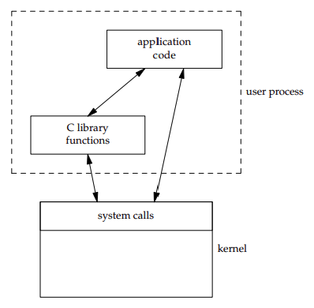

# 语言特性

## 编程接口

在使用 C 语言编程实现某个功能时候，应当明确可以使用哪些基础库，包括：

- C 标准库
- 其他库
  - POSIX (Portable Operating System Interface of Unix)
  - Linux Library
  - Windows Library
  - …

**C 标准库也称为 ISO C 库**，主要经历了 C89, C99, C11 三个大版本，目前包括 **31** 个头文件。编程时首先考虑使用 C 标准库中的接口，这些库保证了最佳的可移植性。详细说明可以在 [C Standard Library header files](https://en.cppreference.com/w/c/header) 进行查阅。

|         头文件          |                             说明                             |
| :---------------------: | :----------------------------------------------------------: |
|      `<assert.h>`       | [Conditionally compiled macro that compares its argument to zero](https://en.cppreference.com/w/c/error) |
|   `<complex.h>` (C99)   | [Complex number arithmetic](https://en.cppreference.com/w/c/numeric/complex) |
|       `<ctype.h>`       | [Functions to determine the type contained in character data](https://en.cppreference.com/w/c/string/byte) |
|       `<errno.h>`       | [Macros reporting error conditions](https://en.cppreference.com/w/c/error) |
|    `<fenv.h>` (C99)     | [Floating-point environment](https://en.cppreference.com/w/c/numeric/fenv) |
|       `<float.h>`       | [Limits of floating-point types](https://en.cppreference.com/w/c/types/limits#Limits_of_floating_point_types) |
|  `<inttypes.h>` (C99)   | [Format conversion of integer types](https://en.cppreference.com/w/c/types/integer) |
|   `<iso646.h>` (C95)    | [Alternative operator spellings](https://en.cppreference.com/w/c/language/operator_alternative) |
|      `<limits.h>`       | [Ranges of integer types](https://en.cppreference.com/w/c/types/limits) |
|      `<locale.h>`       | [Localization utilities](https://en.cppreference.com/w/c/locale) |
|       `<math.h>`        | [Common mathematics functions](https://en.cppreference.com/w/c/numeric/math) |
|      `<setjmp.h>`       |  [Nonlocal jumps](https://en.cppreference.com/w/c/program)   |
|      `<signal.h>`       |  [Signal handling](https://en.cppreference.com/w/c/program)  |
|  `<stdalign.h>` (C11)   | [`alignas` and `alignof`](https://en.cppreference.com/w/c/types) convenience macros |
|      `<stdarg.h>`       | [Variable arguments](https://en.cppreference.com/w/c/variadic) |
|  `<stdatomic.h>` (C11)  | [Atomic operations](https://en.cppreference.com/w/c/thread#Atomic_operations) |
|   `<stdbit.h>` (C23)    | Macros to work with the byte and bit representations of types |
|   `<stdbool.h>` (C99)   | [Macros for boolean type](https://en.cppreference.com/w/c/types) |
|  `<stdckdint.h>` (C23)  |       macros for performing checked integer arithmetic       |
|      `<stddef.h>`       | [Common macro definitions](https://en.cppreference.com/w/c/types) |
|   `<stdint.h>` (C99)    | [Fixed-width integer types](https://en.cppreference.com/w/c/types/integer) |
|       `<stdio.h>`       |      [Input/output](https://en.cppreference.com/w/c/io)      |
|      `<stdlib.h>`       | General utilities: [memory management](https://en.cppreference.com/w/c/memory), [program utilities](https://en.cppreference.com/w/c/program), [string conversions](https://en.cppreference.com/w/c/string), [random numbers](https://en.cppreference.com/w/c/numeric/random), [algorithms](https://en.cppreference.com/w/c/algorithm) |
| `<stdnoreturn.h>` (C11) | [`noreturn`](https://en.cppreference.com/w/c/language/_Noreturn) convenience macro |
|      `<string.h>`       | [String handling](https://en.cppreference.com/w/c/string/byte) |
|   `<tgmath.h>` (C99)    | [Type-generic math](https://en.cppreference.com/w/c/numeric/tgmath) (macros wrapping math.h and complex.h) |
|   `<threads.h>` (C11)   |   [Thread library](https://en.cppreference.com/w/c/thread)   |
|       `<time.h>`        | [Time/date utilities](https://en.cppreference.com/w/c/chrono) |
|    `<uchar.h>` (C11)    | [UTF-16 and UTF-32 character utilities](https://en.cppreference.com/w/c/string/multibyte) |
|    `<wchar.h>` (C95)    | [Extended multibyte and wide character utilities](https://en.cppreference.com/w/c/string/wide) |
|   `<wctype.h>` (C95)    | [Functions to determine the type contained in wide character data](https://en.cppreference.com/w/c/string/wide) |

C POSIX 库是与标准库同时发展的，它是 POSIX 系统中 C 标准库的规范，作为标准库的超集，其不仅兼容标准库，同时还引入了额外的功能。目前包括 **82** 个头文件（包含所有 C99 头文件）。虽然 POSIX 是为 Unix 标准制定的接口，但对于 Linux、Mac OS X 系统，甚至 Windows 都具有较好的可移植性。

标准定义了接口的规范，而不同的操作系统根据自身平台的特征实现了这些接口。头文件详细说明可以在 [IEEE and The Open Group](http://pubs.opengroup.org/onlinepubs/9699919799/nframe.html) 网站中的 [IEEE Std POSIX.1-2017](http://pubs.opengroup.org/onlinepubs/9699919799/toc.htm) 进行查询。

|      头文件      | 说明 |
| :--------------: | :--: |
|     <aio.h>      |      |
|  <arpa/inet.h>   |      |
|    <assert.h>    |      |
|   <complex.h>    |      |
|     <cpio.h>     |      |
|    <ctype.h>     |      |
|    <dirent.h>    |      |
|    <dlfcn.h>     |      |
|    <errno.h>     |      |
|    <fcntl.h>     |      |
|     <fenv.h>     |      |
|    <float.h>     |      |
|    <fmtmsg.h>    |      |
|   <fnmatch.h>    |      |
|     <ftw.h>      |      |
|     <glob.h>     |      |
|     <grp.h>      |      |
|    <iconv.h>     |      |
|   <inttypes.h>   |      |
|    <iso646.h>    |      |
|   <langinfo.h>   |      |
|    <libgen.h>    |      |
|    <limits.h>    |      |
|    <locale.h>    |      |
|     <math.h>     |      |
|   <monetary.h>   |      |
|    <mqueue.h>    |      |
|     <ndbm.h>     |      |
|    <net/if.h>    |      |
|    <netdb.h>     |      |
|  <netinet/in.h>  |      |
| <netinet/tcp.h>  |      |
|   <nl_types.h>   |      |
|     <poll.h>     |      |
|   <pthread.h>    |      |
|     <pwd.h>      |      |
|    <regex.h>     |      |
|    <sched.h>     |      |
|    <search.h>    |      |
|  <semaphore.h>   |      |
|    <setjmp.h>    |      |
|    <signal.h>    |      |
|    <spawn.h>     |      |
|    <stdarg.h>    |      |
|   <stdbool.h>    |      |
|    <stddef.h>    |      |
|    <stdint.h>    |      |
|    <stdio.h>     |      |
|    <stdlib.h>    |      |
|    <string.h>    |      |
|   <strings.h>    |      |
|   <stropts.h>    |      |
|   <sys/ipc.h>    |      |
|   <sys/mman.h>   |      |
|   <sys/msg.h>    |      |
| <sys/resource.h> |      |
|  <sys/select.h>  |      |
|   <sys/sem.h>    |      |
|   <sys/shm.h>    |      |
|  <sys/socket.h>  |      |
|   <sys/stat.h>   |      |
| <sys/statvfs.h>  |      |
|   <sys/time.h>   |      |
|  <sys/times.h>   |      |
|  <sys/types.h>   |      |
|   <sys/uio.h>    |      |
|    <sys/un.h>    |      |
| <sys/utsname.h>  |      |
|   <sys/wait.h>   |      |
|    <syslog.h>    |      |
|     <tar.h>      |      |
|   <termios.h>    |      |
|    <tgmath.h>    |      |
|     <time.h>     |      |
|    <trace.h>     |      |
|    <ulimit.h>    |      |
|    <unistd.h>    |      |
|    <utime.h>     |      |
|    <utmpx.h>     |      |
|    <wchar.h>     |      |
|    <wctype.h>    |      |
|   <wordexp.h>    |      |

除此之外，最后考虑 Linux 库以及 Windows 库等，除非你确定编写的程序不需要跨平台使用。由于大部分时候我们的代码将会运行在 Linux 内核的机器上，因此有时候想要用到 Linux 内核相关功能，而 POSIX 标准没有涵盖这个接口的话，将不可避免的使用到 Linux 提供的相关库。

- GNU/Linux 是 POSIX 兼容的系统，其使用了 GNU C Library (glibc) 的实现，该实现兼容 C 标准库、POSIX 库等，可以使用 man 手册查阅相关 C 库用法。
- Windows 有自己的头文件，可以在 MSDN 中找到，但也有 POSIX 兼容的版本，例如 Cygwin, MinGW 等。

[List of standard header files in C and C++](https://stackoverflow.com/questions/2027991/list-of-standard-header-files-in-c-and-c) 有一份详细的目录可以帮助你了解这些头文件。

## 系统调用和库函数

所有的操作系统都提供多种服务的入口点，由此程序向内核请求服务。各种版本的 Unix 实现都提供良好定义、数量有限、直接进入内核的入口点，这些入口点被称为**系统调用 (system call)**。不同的系统提供了不同的几十、上百个系统调用，具体数字在不同操作系统版本中会不同，

系统调用接口是用 C 语言定义的，Unix 所使用的技术是为每个系统调用在标准 C 库中设置一个具有同样名字的**包装函数**。用户进程用标准 C 代码来调用这些函数，然后这些函数又用系统所要求的技术调用相应的内核服务。

程序员可以使用的通用库函数在内部实现时可能会调用一个或多个内核的系统调用，但是它们并不是内核的入口点。同时，库函数当然也可以不使用任何内核的系统调用，这样的库函数仅仅是一些标准库为我们准备的用户层面代码而已。

从实现者的角度来看，系统调用和库函数之间有根本的区别，但从用户角度来看，其区别并不重要。特别是包装函数的存在，使得系统调用和库函数都以 C 函数的形式出现，两者都为应用程序提供服务。但是，我们应当理解库函数可以被替换，系统调用通常是不能被替换的。

应用程序既可以调用系统调用也可以调用库函数，而很多库函数则会调用系统调用。



## 程序结构

C 是一种面向过程的结构化编程语言，Pascal 之父说程序=算法+数据结构，在 C 语言中，程序可以看成由一系列的外部对象构成，外部对象包括：

- 外部变量：在函数外面定义的变量，可以被多个函数使用。
- 函数：由于 C 语言不允许在函数中定义函数，因此函数本身就是外部的。

默认情况下，外部变量和函数拥有如下性质：通过同一个名字对外部变量的所有引用，实际上都是引用同一个对象。也称为外部链接性质。

### 作用域规则

名字的作用域是指：程序中可以使用该名字的区域。

外部变量和函数的作用域为：

- 从声明处开始
- 到其所在的待编译文件末尾结束。

函数内部的变量是该函数的私有变量，或者称之为局部变量，其作用域为该函数。

### 外部变量

外部变量可以在全局范围内访问，因此外部变量可以作为函数之间交互的桥梁，可以简化函数参数表设计。但需要注意这种方式不能被滥用，因为这导致各个函数具有太多数据关联。

外部变量的声明与定义是完全不同的：

- 变量声明用于说明变量的属性（主要是类型）
- 变量定义除此之外将会引起存储器的内存分配。

外部变量定义如下，这两条语句将会引起存储分配，并且可作为该源文件中其余部分的声明。 

```c
int sp;
double val[MAXVAL];
```

外部变量声明如下，如果要在外部变量定义前就使用该文件，或者变量的使用和定义不在同一个源文件中，则必须使用 `extern` 关键字。 

```c
extern int sp;
extern double val[];
```

在一个源程序的所有文件中，**外部变量只能在某个文件中被定义一次**，而其他文件通过 `extern` 声明来访问它（定义该变量的文件也可以包含该变量的 `extern` 声明）。

外部变量的初始化只能出现在定义中，未初始化的外部变量默认值为 0。

### 局部变量

与外部变量相对的，局部变量是在函数内定义的变量，包括两种变量：

- 自动变量：仅在函数调用时存在，函数执行完毕退出时消失。大多数局部变量，通常都是自动变量。
- 静态局部变量：通过 `static` 关键字限制的局部变量，不随函数调用而存亡，而是一直存在。

### 静态变量

静态对象是指通过 `static` 限制的外部对象，包括静态变量和静态函数，其**作用域被限制在被编译源文件中**。通过 `static` 限制对象可以达到隐藏外部对象的目的。

静态变量/静态函数与外部变量/函数类似，但名字仅能在当前源文件访问，不会污染全局命名空间，通过静态变量或静态函数，将调用者不关心的外部对象隐藏到文件内部，可以达到模块化编程的效果。

局部变量也可以用 `static` 关键字修饰，其效果是：该变量只能在某个特定函数中使用，但却一直占据存储空间，不随函数的调用退出而产生消失。 

### 变量类型总结

各种类型的变量对比如下。

|     变量类型      | 定义位置 | 声明修饰符 | 初始值 |   作用域   |     生存期     |
| :---------------: | :------: | :--------: | :----: | :--------: | :------------: |
| 外部变量/全局变量 | 函数外部 |  `extern`  |   0    |    全局    |    一直存在    |
|     静态变量      | 函数外部 |  `static`  |   0    | 所在源文件 |    一直存在    |
|     自动变量      | 函数内部 |     无     |  随机  |  所在函数  | 随函数调用存亡 |
|   静态局部变量    | 函数内部 |  `static`  |   0    |  所在函数  |    一直存在    |

### 头文件组织

对于许多高级程序语言来说，整个程序范围太大，而函数范围太小，因此使用模块或包的概念表示一类变量和函数的集合，从而便于组织程序架构。例如 Java 中的类和包，Python 中的模块和包等概念。 

然而，C 语言并没有这些概念，并且由于 C 支持分离编译，程序员可以将一个程序的各个部分分散到不同的源文件中编译，然后链接到一起。这使得编写大型程序更加难以控制，借助于 `static` 静态对象机制，可以实现基于文件的模块化编程，但是当某个源文件内容过多时，又会使得开发不便。

因此，C 语言并没有一种万能的模块化编程范式，程序架构的依赖于开发者控制，需要开发者精心的组织头文件。一般而言，可以按照如下方式组织头文件：

- 对于中等规模的程序：最好只用一个头文件存放程序中各部分共享的对象。
- 较大规模的程序：每个 `.c` 文件对应一个 `.h` 文件，每一对作为一个逻辑上的模块对内对外提供接口。

## 基本数据类型

C 语言标准层面没有明确定义基本数据类型的大小，只能确定 `sizeof(char) <= sizeof(short) <= sizeof(int) <= sizeof(long) <= sizeof(long long)`。具体某种类型的大小与编译器和系统有关，具体来说和实现采用的**数据模型**有关，


对于目前 64 位操作系统而言，以下两种模型使用广泛：
- **LLP64**: Microsoft Windows (x86-64 and IA-64) using Visual C++; and MinGW
- **LP64**: Most Unix and Unix-like systems, e.g., Solaris, Linux, BSD, macOS. Windows when using Cygwin; z/OS

使用代码测试一下，本机为 Linux：

```
#include <stdio.h>

int main()
{
    printf("char: %ld, short: %ld, int: %ld, long: %ld, long long: %ld, void *: %ld\n",
        sizeof(char), sizeof(short), sizeof(int), sizeof(long), sizeof(long long), sizeof(void *));
    return 0;
}
// output:
// char: 1, short: 2, int: 4, long: 8, long long: 8, void *: 8
```

>  当数据类型的位数重要时,请使用 `stdint.h` 中定义的固定长度类型 (fixed-size types)，例如 `int8_t`、`uint32_t` 等，或使用 `sizeof()` 计算位数。

## 函数

函数封装了程序的实现细节，通过函数调用，代码更加易用清晰。

C 语言中所有函数参数都是通过**值传递**的。传递给被调用函数的参数值存放在临时变量中，而不是存放于原来的变量。

需要注意，值传递与能否改变原始参数的值是无关的，因此，在 C 语言中：

- 一般变量参数：不能修改原始参数值，只能修改该变量临时创建的私有副本的值。

- 指针变量参数：通过变量的地址，间接修改原始参数值。指针本身仍然会复制。

- 数组参数：数组名作参数，实际传递的是数组起始元素地址，效果等同指针变量，数组本身不会被复制。

## C 预处理器

文件包含

```c
#include <filename>
#include "filename"
```

宏定义

```c
#define IDENTIFIER TEXT
#define IDENTIFIER(OPT) TEXT
#undef IDENTIFIER
```

条件编译

TODO

OS 特定编译功能

TODO

## 数组

### 数组初始化
1. **局部**数组未初始化时，其值为随机值。
2. **全局**或**静态**数组未初始化时，其值为 `NUL` 或 0。

应当养成每次都初始化数组的好习惯。当**数组初始化之后，会将未初始化的位置设置为 `NUL` 或 0**，利用这个规则，我们可以通过初始化数组第一个元素从而快速将数组初始化为 0 或 `NUL`。

通过代码，验证上述结论。

```c
#include <stdio.h>
#include <string.h>

void dump_int(int* str);
void dump_char(char* str);

int arr_g[5];

int main()
{
    static int arr_s[5];
    int arr1[5];
    int arr2[5] = { 0 };
    char arr3[5];
    char arr4[5] = "abc";

    dump_int(arr_g); //(int) 0 0 0 0 0
    dump_int(arr_s); //(int) 0 0 0 0 0
    dump_int(arr1); // (int)  0 0 1346658496 21995 407207840
    dump_int(arr2); // (int)  0 0 0 0 0
    dump_char(arr3); // (char)  NUL NUL -32 -124 t
    dump_char(arr4); // (char) a b c NUL NUL
    
    return 0;
}

void dump_int(int* str)
{
    printf("(int) ");
    for (int n = 0; n < 5; ++n) {
        printf("%d ", *(str + n));
    }
    printf("\n");
}

void dump_char(char* str)
{
    printf("(char) ");
    for (int n = 0; n < 5; ++n) {
        if (str[n] < 0 || str[n] > 127) {
            printf("%d ", str[n]);
        } else if (str[n] == 0) {
            printf("NUL ");
        } else {
            printf("%c ", str[n]);
        }
    }
    printf("\n");
}
```

### 多维数组

TODO

## 指针

### 指针与地址

我们知道，数据（例如数字 47）是存储在内存中的某个位置的，这个位置在内存中有一个地址（例如 `0x7fff0bfb602c`），然而这个名称对人类是不友好的，因此程序员使用变量（例如 `i`）来表示数据。也就是说，变量名和这个内存地址实际上是一回事，变量名通过**取址运算符 `＆` **便可以得到该内存地址。

```
int i = 47
&i == 0x7fff0bfb602c
```

指针是一种保存变量地址的变量。也就是说，指针变量的值（简称为指针）就是另一个变量的内存地址。指针的定义如下：

```c
int i = 47;
int *p = &i;
```

这并没有什么稀奇的，真正赋予 C 语言指针威力的是**解引用符 (dereference) `*`**，在该符号的帮助下，我们可以通过指针（内存地址）来取得那一小块内存的读写权限！，这是一项非常强大，同时也非常底层、非常容易导致混乱的功能。

```c
int i = 47;
int *p = &i;
printf("%d", *p);	// read
*p = 32;	// write
```

指针声明写为 `int* p` 、`int *p` 以及 `int * p`  都可以。但指针必须指向某种类型的数据，甚至 `void` 也是允许的，表示可以存放任意数据类型的指针，通常可以作为接口使用。但这种指针不能通过解引用获取变量值，必须先进行类型转换之后才可以解引用。

```c
void *p = &i;
printf("%d\n", *p);	// compile error
printf("%d\n", *(int *)p);	// ok, but need type conversion
```

需要注意，指针变量存储的地址通常由取址运算符得到，因为内存地址是一个非常“底层”的参数，与用户代码无关。但是将任意值赋值给指针变量是允许的（会发生类型转换），在这种情况下，通过解引用符号获取该内存地址的数据可能会得到“垃圾数据”，甚至几乎一定会由于地址不合法而引发段错误。其中原因涉及虚拟内存，不再详细说明。

指针可以进行加减运算（`++`、`--`、`+`、`-`），其加减的**单位为指向数据类型的大小**。取址运算符和解引用运算符优先级高于算术运算符，但从右向左结合。例如 `*p += 1` == `++*p` == `(*p)++` != `*p++`，如果不清楚优先级，加括号是最好的方式！

```c
int i = 47;
int* p = &i;
printf("%p\n", p);      // 0x7ffd5f7e8c2c
printf("%p\n", ++p);    // 0x7ffd5f7e8c30 
```

由于指针也是变量，因此可以赋值为另一个指针变量，此时两个指针变量的值相同，指向同一个变量。

因此，关于指针：

- **总是将指针初始化为 NULL 是一个好习惯**！
- 指针可以进行加减运算（`++`、`--`、`+`、`-`），其加减的**单位为指向数据类型的大小**。
- 指针与普通类型一样也可以存储在数组中，成为指针数组。
- 指针与普通类型一样也可以被另一个指针指向，构成**多级指针**。

### 指针与函数

指针可以作为函数的参数或者返回值。

- 指针可以作为参数传给函数，可以在调用函数时改变该实参的值。
- 指针可以作为函数返回值，**一般用于动态内存分配**时返回该堆指针，需要注意若该指针指向局部变量，则在函数退出时，该变量也不复存在，因此 `*p` 会得到“垃圾数据”。

### 指针与数组

```c
int arr[3] = { 0 };
int* pa = arr;
printf("%p\n", arr);    // 0x7fffd8f6e6d0
printf("%p\n", &arr);   // 0x7fffd8f6e6d0
printf("%p\n", pa);     // 0x7fffd8f6e6d0
printf("%p\n", &pa);    // 0x7fffd8f6e6c8
```


## 字符串

### 存储方式
C 语言使用**字符数组**来表示字符串，字符数组和字符串之间的区别在于**字符串以特殊字符 `\0 (NUL)` 结尾**。
```c
char array[5] = {'h', 'e', 'l', 'l', 'o'};
char str[6] = "hello";
char str1[6] = {'h', 'e', 'l', 'l', 'o', '\0'}; // equivalent to str
```

**字符指针**在某种程度上也可以表示字符串，这并不惊讶，因为字符数组名本身就是一个常指针。

`char* str1` 和 `char str2[]` 都可以表示字符串，然而两者具有很大区别：

- `str1` 是一个指向 char 变量的指针变量，指向一个字符串常量（其位于常量区），指针变量的值可以改变，而字符串常量的值不能改变。
- `str2` 是一个指针常量，指向一个字符数组，指针常量值不可改变，但数组内容可以改变。

```c
int main()
{
    char* str1 = "hello";
    char str2[10] = "world";
    printf("str1: %s\n", str1); // hello
    printf("str2: %s\n", str2); // world

    //str1[0] = 'W'; // Segment Fault
    str2[0] = 'W'; // OK
    printf("str2: %s\n", str2); // World

    str1 = "hello c language"; // OK
    printf("str1: %s\n", str1); // hello c language
    str1 = str2; // OK
    printf("str1: %s\n", str1); // World
    //str2 = "hello"; // Error，expression must be a modifiable lvalue

    return 0;
}
```

同样，`str1` 和 `str2` 位于不同的内存区。显然，`str2` 位于栈，而 `str1` 同全局变量、堆内存一样位于堆中。 
```c
char str[10] = "C"; // address: 0x55a607eb1010
int main()
{
    char* str1 = "hello";   // address: 0x55a607eaf004
    char str2[10] = "world";  // address: 0x7ffc2940e042
    char* str3 = (char*) malloc(10); // address: 0x55a609b752a0
}
```

### string.h 头文件
通常字符串函数都位于 `string.h` 头文件中。该头文件引入了以下内容：
- 一个变量：`size_t` 表示无符号整数
- 一个宏：`NULL` 表示空字符串常量
- 若干函数：主要可以分为两类：
    1. 以 `mem` 开头的操作内存字节的函数
    2. 以 `str` 开头的操作字符的函数

| 函数名                 | 作用                                                         |
| ---------------------- | ------------------------------------------------------------ |
| `strlen(str)`          | 计算 str 长度，不包括 NUL 字符。                             |
| `strcat(dst, src)`     | 将 src 加到 dst 后面。                                       |
| `strcmp(fir, sec)`     | 相同为 0，否则返回第一个不匹配字符的 ASCII 值的差，即 fir - sec。 |
| `strcpy(dst, src)`     | 将 src 拷贝到 dst，遇到 NUL 字符停止。                       |
| `strncpy(dst, src, n)` | 将 src 的 n 字节拷贝到 dst。<br>如果 src 的前 n 字节不包括 NUL 字符，则 dst 将不会有 NUL 结束符！<br>如果 src 不足 n 字节，则剩余空间使用 NUL 字符补齐。 |
| `memcpy(dst, src, n)`  | 将 src 的 n 字节拷贝到 dst。                                 |
| `memset(s, c, n)`      | 将 s 的 n 字节设为 c。                                       |

具有相同后缀的两种函数功能相似，但稍有不同。其中 `mem` 系列函数将字符序列视为字节操作，而 `str` 系列函数将字符序列视为字符串操作。逻辑上而言 `mem` 系列表达的语义更加底层。

### 字符串拷贝
以 `memcpy` vs `strcpy` 作为例子。

```c
#include <stdio.h>
#include <string.h>

void dump(char* str);

int main()
{
    char s[5] = { 's', 'a', '\0', 'c', 'h' };

    char membuff[5] = { 0 };
    char strbuff[5] = { 0 };

    strcpy(strbuff, s);
    memcpy(membuff, s, 5);

    dump(membuff); // 73 61 00 63 68  sa ch
    dump(strbuff); // 73 61 00 00 00  sa

    return 0;
}

void dump(char* str)
{
    char* p = str;
    for (int n = 0; n < 5; ++n) {
        printf("%2.2x ", *p);
        ++p;
    }
    printf("\t");
    p = str;
    for (int n = 0; n < 5; ++n) {
        printf("%c", *p ? *p : ' ');
        ++p;
    }
    printf("\n");
}
```

在网络编程时，应当使用 `memcpy` 拷贝数据。

### 字符串格式化
除了 `memcpy` 和 `strcpy` 以及其系列函数外，`sprintf` 函数也常用于字符串拷贝，但该函数操作的源对象不限于字符串，源对象可以是字符串、也可以是任意基本类型的数据。因此 `sprintf` 主要是实现将其他数据类型转换为字符串功能。同时，由于该函数属于 `printf` 家族函数，因此也可以完成字符串拼接效果。

```c
char path[100];
sprintf(path, "/proc/%d/uid_map", pid);
```

## 结构体

### 内存布局与字节对齐
结构体字节对齐的细节和具体的编译器实现相关，但一般来说遵循 3 个准则：
- 结构体变量的首地址能够被其最宽基本类型成员的大小(sizeof)所整除。
- 结构体每个成员相对结构体首地址的偏移量 offset 都是成员大小的整数倍，如有需要编译器会在成员之间加上填充字节。
- 结构体的总大小 sizeof 为结构体最宽基本成员大小的整数倍，如有需要编译器会在最末一个成员之后加上填充字节。

直接使用 `pragma pack` 预处理宏可以改变结构体的字节对齐方式：
- `#pragma pack(n)`：结构体将按照 n 个字节对齐，其取值为 1、2、4、8、16，默认是 8。
- `#pragma pack(1)`：结构体没有填充字节，实现空间“无缝存储”，这对跨平台传输数据来说是友好和兼容的。

如果只想改变个别结构体的字节对齐方式，可以使用 GCC 编译器指定结构体**类型属性 (Type Attribute)** 为 packed，即： `__attribute__((__packed__))`。

```c
struct padding {
    char c; //1
    short s; //2
    int i; //4
    double d; //8
};
// sizeof() is 16

struct nopadding {
    char c; //1
    short s; //2
    int i; //4
    double d; //8
} __attribute__((__packed__));
// sizeof() is 15
```

`__attribute__` 必须紧挨着 struct 关键字或者结构体 `}` 之后，否则将会报错或不起作用。 

## I/O 处理

### 输入函数

C 语言的输入函数家族主要包括三个函数，其区别在于**输入源**不同，分别是

- `scanf`：从标准输入流 `stdin` 读入。
- `fscanf`：从文件流指针 `steam` 读入。
- `sscanf`：从字符串指针 `str` 读入。 

```c
#include <stdio.h>
int scanf(const char *format, ...);
int fscanf(FILE *stream, const char *format, ...);
int sscanf(const char *str, const char *format, ...);
```

输入函数主要构成参数为**格式化字符串**以及**可变参数列表**。其中，格式化字符串包括一系列指令，输入函数将会按照指令的规则来解析输入，并将结果按照顺序存入到指针参数指向的变量中。

实际上，输入函数简单易用。然而，格式化字符串的内容才是其精髓，通过精妙的组合可以实现许多效果。

**格式化字符串**包括一系列**指令**，它们有：
- 一串空白字符：包括空格、换行、制表符等，它们可以匹配输入源中任意数量的空白字符。
- **转换格式符**：由 `%` 开头的字符，将会按照格式匹配输入源，并将结果存储到对应的变量中。
- 常规字符： 除了以上两种字符以外常规的字符，必须精确匹配输入中对应的字符。

因此，输入函数族的处理过程大致如下：
1. 从输入源的第一个位置，尝试匹配第一个指令，如果匹配成功，则进行下一个指令匹配，如果匹配失败，则函数返回。
2. 由于前一个指令已经“消耗了”一定的输入，因此下一个指令将继续匹配剩余输入源。
3. 如果输入不够或者错误，则引发 `input failure` 退出；如果匹配错误，则引发 `match failure` 退出；如果匹配完毕，则函数返回成功匹配的个数。

> 实际上，输入输出真正复杂多变的地方在于转换格式符的规则，详细内容请查阅 man 手册，此文不再一一列出。

**转换说明符**是 `%` 后面的字符，以下是两个不常用但十分有用的说明符号。常用的说明符在示例程序中有展示，不再赘述。
- `%n`：返回到目前为止，匹配消耗的输入字符数，并存储到下一个变量中，该变量类型必须为 int。
- `%[`：匹配一系列非空字符，且字符必须属于方括号集合，如果第一个字符为 `^` 则表示除此之外任何字符。对于如果字符间有 `-` 则表示两字符间所有字符，如果要匹配字符 `]` 或 `-` 本身，则字符 `]` 必须位于 `[` 或 `^`之后，`-`必须位于最后一个，`%[^]0-9-]` 表示匹配除了 `[`、数字 `0` - `9` 以及 `-` 之外所有字符。

以下是标准输入读取示例：

`%[]`：匹配一系列非空字符，且字符必须属于方括号集合，如果第一个字符为 `^` 则表示除此之外任何字符。对于如果字符间有 `-` 则表示两字符间所有字符，如果要匹配字符 `]` 或 `-` 本身，则字符 `]` 必须位于 `[` 或 `^`之后，`-`必须位于最后一个，`%[^]0-9-]` 表示匹配除了 `[`、数字 `0` - `9` 以及 `-` 之外所有字符。

```c
char* p;
int n;
n = scanf("%m[^]0-9-]", &p);
if (n == 1) {
    printf("read: %s\n", p);
    free(p);
} else {
    fprintf(stderr, "No matching characters\n");
}
```

以下是文件读取读取示例：

```c
#include <stdio.h>

int main()
{
    int i;
    unsigned int u;
    unsigned int x;
    float f;
    double lf;
    char s[10] = { '\0' };
    char str[128] = { '\0' };

    FILE* fp = fopen("value.txt", "r");
    int len = fscanf(fp, "%i %u %x %f %s %lf %[^\n]", &i, &u, &x, &f, s, &lf, str);
    printf("len: %d\n", len);
    printf("data: %i %u %x %f %s %lf %s\n", i, u, x, f, s, lf, str);
}
```

以下是字符串读取示例：

`%n`：返回到目前为止，匹配消耗的输入字符数，并存储到下一个变量中，该变量类型必须为 int。

以下代码将文本文件中 x 行 y 列的浮点数读取到二维数组中。

```c
#include <stdio.h>

int main()
{
    int row = 3;
    int column = 4;
    double data[row][column];

    FILE* f = fopen("data.txt", "r");
    if (f == NULL) {
        printf("File can not be read!");
        return 1;
    }

    char line_buffer[1024] = { '\0' };
    int r = 0;
    while (fgets(line_buffer, 1024, f)) {
        int c = 0, offset = 0, len;
        double tmp;
        while (sscanf(line_buffer + offset, "%lf%n", &tmp, &len) != EOF) {
            data[r][c++] = tmp;
            offset += len;
        }
        r++;
    }

    for (int i = 0; i < row; i++) {
        for (int j = 0; j < column; j++) {
            printf("%lf ", data[i][j]);
        }
        printf("\n");
    }

    pclose(f); // 关闭文件
    return 0;
}
```

### 输出函数

C 语言的输入函数家族主要包括五个函数，其区别在于**输出源**不同，分别是
- `printf`：输出至标准输入流 `stdin` 。
- `fprintf`：输出至文件流指针 `steam` 。
- `dprintf`：输出至文件描述符 `fd` 。 
- `sprintf`：输出至字符串指针 `str` 。 
- `snprintf`：输出至字符串指针 `str` 。 

```c
#include <stdio.h>

int printf(const char *format, ...);
int fprintf(FILE *stream, const char *format, ...);
int dprintf(int fd, const char *format, ...);
int sprintf(char *str, const char *format, ...);
int snprintf(char *str, size_t size, const char *format, ...);
```

输出函数主要构成参数为**格式化字符串**以及**可变参数列表**，其中，格式化字符串包括一系列指令，输出函数将会按照指令的规则依次将参数的值格式化输出。

输出函数格式化字符串包括一系列**指令**，它们有：
- 常规字符： 直接输出，不做任何改变。
- **转换格式符** (conversion specifications)：由 `%` 开头的字符，将会按照格式格式化变量，并将结果输出。

**转换格式符**中的**转换说明符** (conversion specifier) 同输入函数一样，但转换格式符提供了一些额外的选项，格式如下：

```
%[flags][field width][precision][length modifier]conversion specifier
```

**标志符号 (flags)** 有四个比较常用：
- `#` ：标准形式，例如十六进制数字会以 `0x` 开头等。
- `0` ：空位补零，默认是空格填充。
- `-` ：左对齐，默认是右对齐。
- `+` ：正数符号显示，默认正数不显示符号。

**宽度 (field width)** 字段使用**非负数字**描述了这个变量占用的**最小宽度**，如果变量的输出结果宽度小于该值，则进行填充。

**精度 (precision)** 使用 `.dig` 表示，dig 为非负数字。精度和宽度有一定冲突。
- 对于整数，指示显示的位数。
- 对于浮点书，指示小数点后位数。
- 对于字符串指示最大显示个数。

**转换说明符**是格式符中最重要的部分，主要包括：
- `d, i` : int 输出为 signed decimal 格式。
- `o, u, x, X` : unsigned int 输出为 unsigned octal/decimal/hex 格式。
- `f` ：double 输出为小数形式，精度表示小数点位数，默认后 6 位。
- `e, E`:  double 输出为科学计数格式。
- `g, G`: double 输出为去除多余 0 格式，精度表示有效数字位数。
- `c`: int 输出为 unsigned char。
- `s`: char * 输出为字符串。
- `p`:  void * 指针输出为十六进制地址。

以下是一个输出示例代码。

```c
#include <stdio.h>

int main() {
    int i = 47;
    double f = 314.1592653;
    char str[] = "hello world";
    printf("i:\tdec: %d, oct: %o, HEX: %#X, hex: %04x\n", i, i, i, i);
    printf("f:\tbasic: %f, e: %.2e, E: %.10E, g: %.8g\n", f, f, f, f);
    printf("c:\t%c\n", i);
    printf("s:\t%s\n", str);
    printf("p:\t%p\n", str);
    return 0;
}
// output:
// i:      dec: 47, oct: 57, HEX: 0X2F, hex: 002f
// f:      basic: 314.159265, e: 3.14e+02, E: 3.1415926530E+02, g: 314.15927
// c:      /
// s:      hello world
// p:      0x7ffc9df49a5c
```


## 可变参数

`<stdarg.h>`

## 错误处理

`<error.h>`

## 动态内存分配

|                             函数                             |                             解释                             |
| :----------------------------------------------------------: | :----------------------------------------------------------: |
|   [malloc](https://en.cppreference.com/w/c/memory/malloc)    |                     分配内存 (function)                      |
|   [calloc](https://en.cppreference.com/w/c/memory/calloc)    |               分配内存并初始化为 0 (function)                |
|  [realloc](https://en.cppreference.com/w/c/memory/realloc)   | 扩展分配的内存块，如果制定的字节数小于原来的字节则保持不变；如果大于原来的字节树则新内容为定义。 |
|     [free](https://en.cppreference.com/w/c/memory/free)      |                释放先前分配的内容 (function)                 |
| [aligned_alloc](https://en.cppreference.com/w/c/memory/aligned_alloc)(C11) |                  分配对齐的内存 (function)                   |

简而言之， `malloc` 和 `calloc` 函数的主要区别有两点：

1. `malloc` 函数分配**给定字节数**的未初始化数组。
2. `calloc` 函数接收两个参数，分别为**数组个数**和**类型字节数**，并且将内存初始化为零。

在 [Difference between malloc and calloc?](https://stackoverflow.com/questions/1538420/difference-between-malloc-and-calloc) 中提到的 [Why does calloc exist?](https://vorpus.org/blog/why-does-calloc-exist/) 这篇博客详细解释了 `malloc` 和 `calloc` 函数的真正的不同点。简而言之，推荐使用 `calloc` 函数。

因此标准写法如下：

```c
int* ptr;	// declare ptr, int* for example
ptr = calloc(MAXELEMS, sizeof(*ptr));

// almost equivalent to the calloc() call above
ptr = malloc(MAXELEMS * sizeof(*ptr));
memset(ptr, 0, MAXELEMS * sizeof(*ptr));
```

## 日期和时间工具

`<time.h>`

## 地理位置支持

`<locale.h>`

## 其他

### const 关键字

指定变量不可被当前线程/进程改变（但有可能被系统或其他线程/进程改变）。

### volatile 关键字

指定变量的值有可能会被系统或其他进程/线程改变，强制编译器每次从内存中取得该变量的值。

## 参考

- https://en.cppreference.com/w/c

- [Is an array name a pointer?](https://stackoverflow.com/questions/1641957/is-an-array-name-a-pointer)
- [How do I understand complicated function declarations?](https://stackoverflow.com/questions/1448849/how-do-i-understand-complicated-function-declarations)