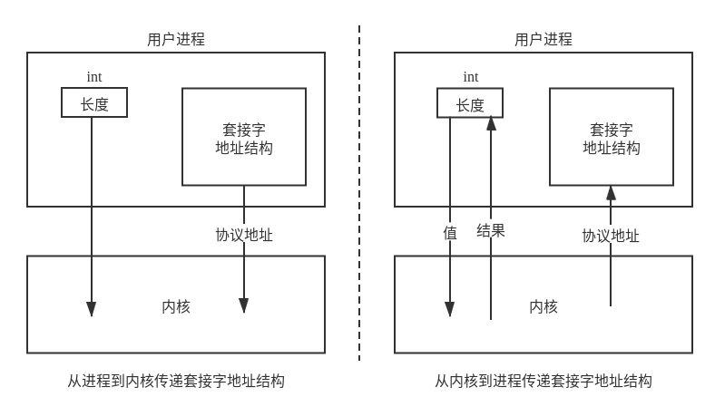
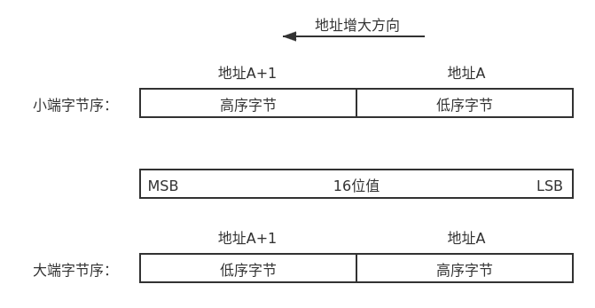
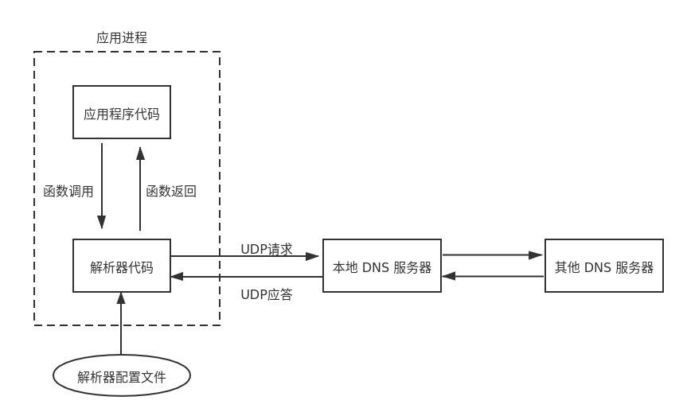
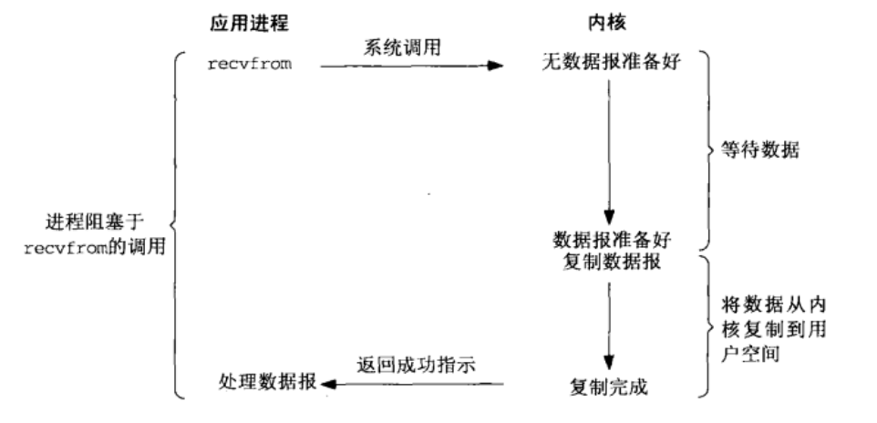
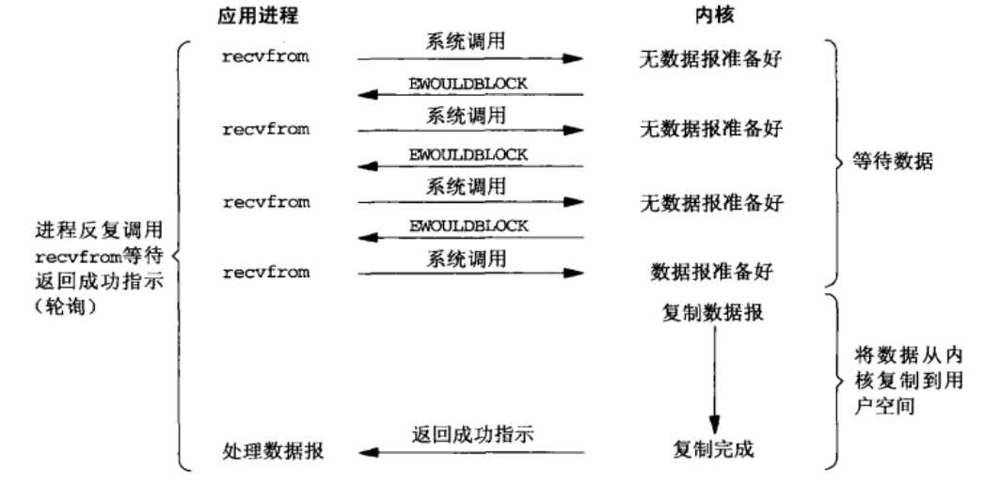
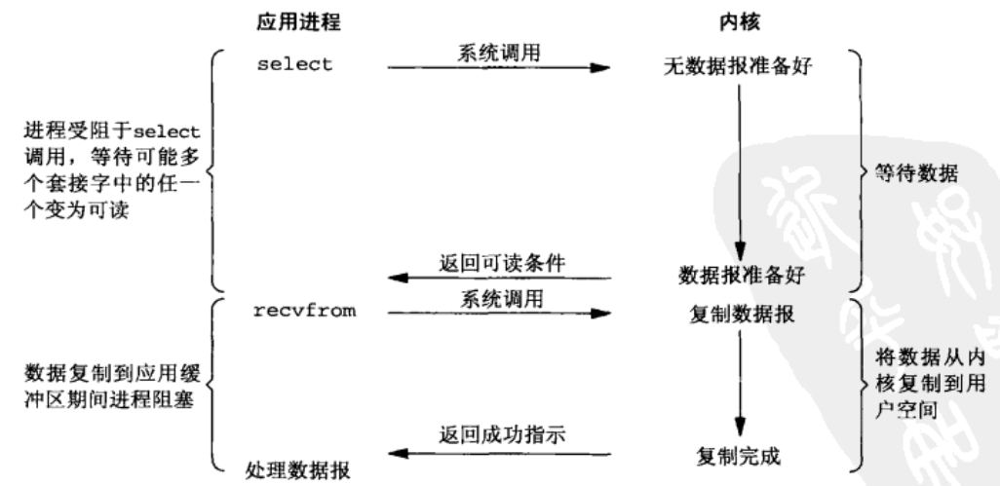
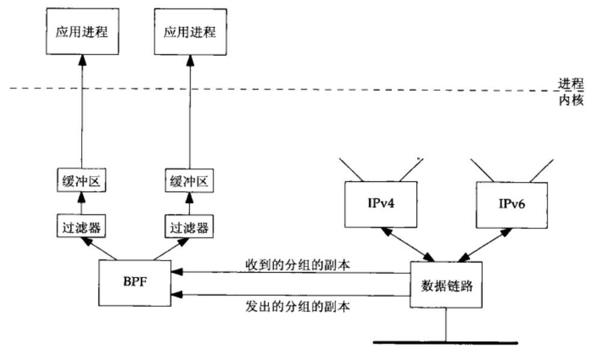

# Unix 网络编程

## 网络编程概述

### 网络通信模型

### 套接字编程接口

tcp

udp

raw

....

### 网络编程头文件

| 头文件         | 标准  | 简介                    | 主要内容                                                     | 应用场景                     |
| -------------- | ----- | ----------------------- | ------------------------------------------------------------ | ---------------------------- |
| `sys/socket.h` | POSIX | 主要套接字库            | 主要套接字的结构体、函数定义。                               | 常规引入                     |
| `sys/un.h`     | POSIX | Unix 域（本地）套接字库 | Unix 域套接字的结构体、函数定义。                            | 需要 Unix 域套接字时引入     |
| `netinet/in.h` | POSIX | 套接字地址结构定义      | 各种套接字地址结构、字节序转换函数等定义。                   | 常规引入                     |
| `netinet/*.h`  | POSIX | Internet 协议族包结构   | 包括主要协议（Ethernet、IP、ARP、IGMP、ICMP、TCP、UDP 等）的包结构以及相关变量函数的定义。 | 需要操作协议头时需要引入     |
| `arpa/inet.h`  | POSIX | Internet 协议族地址转换 | 各种 IP 地址的格式转换函数。                                 | 常规引入                     |
| `strings.h`    | ISO C | 字符串、内存操作        | 各种内存操作，例如内存清零、拷贝等。                         | 常规引入                     |
| `unistd.h`     | ISO C | unix 系统调用接口       | read，write, close，fork，exec 等                            | 常规引入                     |
| `signal.h`     | ISO C | 信号函数                | POSIX 信号相关函数                                           | 需要软件中断时引入           |
| `sys/select.h` | POSIX | IO 复用                 | selec 相关函数                                               | 需要 IO 复用时引入           |
| `poll.h`       | POSIX | IO 复用                 | poll 相关函数                                                | 需要 IO 复用时引入           |
| `fcntl.h`      | POSIX | file control 文件控制   | 各种描述符控制操作                                           | 需要设置描述符控制属性时引入 |
| `netdb.h`      | POSIX | 域名相关                | 与域名和 IP 地址转换相关的函数                               | 需要域名解析时引入           |
|                |       |                         |                                                              |                              |


## 套接字地址结构

大多数套接字函数都需要一个**指向套接字地址结构的指针作为参数**，每个协议族都定义了自己的套接字地址结构，这些结构名均以 `sockaddr_` 开头。

| 结构体名称         | 功能              | 头文件           |
| ------------------ | ----------------- | ---------------- |
| `sockaddr`         | 通用套接字地址    | `<sys/socket.h>` |
| `sockaddr_storage` | 新通用套接字地址  | `<sys/socket.h>` |
| `sockaddr_in`      | IPv4 套接字地址   | `<netinet/in.h>` |
| `sockaddr_in6`     | IPv6 套接字地址   | `<netinet/in.h>` |
| `sockaddr_un`      | Unix 域套接字地址 | `<sys/un.h>`     |

> 结构体中的 IP 地址和端口结构均是网络序。

### 地址传递与值-结果参数

当往一个套接字函数传递套接字地址时，传递的是指向该结构的一个指针。

```c
struct sockaddr_in serv;
// filling in serv{}
connect(sockfd, (struct sockaddr *)&serv, sizeof(serv));
```

同时，该结构的长度通常也作为一个参数来传递，但其传递方式取决于传递的方向是从内核到进程还是从进程到内核。

- 从进程到内核传递套接字，其参数是结构体的整数大小。内核通过指针和内容大小，便知道从进程复制多少数据。
- 从内核到进程传递套接字，其参数是指向表示该结构大小的整数变量的指针。当函数被调用时，它告诉内核该结构的大小，这样内核写该结构时不会越界；当函数返回时，结构大小又是一个结果，它告诉进程内核在该结构中存储了多少信息。这种类型的参数称为值-结果参数。



当使用值-结果参数时，如果地址结构时固定长度的，那么内核返回值总是固定的，例如 IPv4 是 16 字节，IPv6 是 28 字节。如果是可变套接字结构，那么返回值很可能小于该结构的最大长度。

### 通用套接字地址结构

套接字函数以引用（指针）形式来传递套接字地址参数，需要通用类型指针来支持任何协议族的套接字地址，由于历史因素，当时并没有 `void *` 这种通用类型指针，因此定义了一个通用的套接字地址结构。

```c
struct sockaddr {
    uint8_t sa_len;
    sa_family_t sa_family;  /* address family: AF_XXX value */
    char sa_data[14];       /* protocol specific address */
}
```

**其中，sa_len 结构体长度字段并不是所有的实现都支持，这是 BSD 添加的，用于简化套接字地址结构的处理，但 POSIX 规范并不要求有这个成员。**因此，在 Linux 中定义如下，共计 16 字节。

```c
struct sockaddr
{
    __SOCKADDR_COMMON (sa_);	/* Common data: address family and length.  */
    char sa_data[14];		/* Address data.  */
};
```

其中 `__SOCKADDR_COMMON (sa_)` 是一个宏定义，其定义为 `#define __SOCKADDR_COMMON(sa_prefix) sa_family_t sa_prefix##family`，其中使用了 `##` 连接符，将 `sa_prefix` 和 `family` 进行连接。例如，`__SOCKADDR_COMMON (sa_)` 将会被简单的替换为 ` sa_family_t sa_family`。

### IPv4 地址结构

IPv4 套接字地址结构以 `sockaddr_in` 命名，协议族前缀为 `sin_`，**包含三个主要的结构：协议族 `sin_family`、端口 `sin_port` 以及网络地址 `sin_addr`**，最后的 `sin_zero` 是用来补齐与通用套接字地址结构相比不足的位。

```c
/* Internet address.  */
typedef uint32_t in_addr_t;
struct in_addr {
    in_addr_t s_addr;
};

/* Structure describing an Internet socket address.  */
struct sockaddr_in {
    __SOCKADDR_COMMON (sin_);									// 2 字节
    in_port_t sin_port;            /* Port number.  */			// 2 字节
    struct in_addr sin_addr;        /* Internet address.  */	// 4 字节

    /* Pad to size of `struct sockaddr'.  */					// 8 字节
    unsigned char sin_zero[sizeof(struct sockaddr) -
                           __SOCKADDR_COMMON_SIZE -
                           sizeof(in_port_t) -
                           sizeof(struct in_addr)];
};
```

> 或许你会发现，`in_addr` 中 仅仅定义了一个 `in_addr_t` 类型的变量，这就造成了 IPv4 地址存在两种不同的访问方法，例如，定义了套接字地址结构为 serv，那么 `serv.sin_addr` 将按照 `in_addr` 结构体来引用 32 位地址，而 `serv.sin_addr.s_addr` 将按照 `in_addr_t` (通常是一个 32 位整数) 来引用同一个地址，因此，我们必须正确的处理参数。这是具有历史原因的，一开始 `sin_addr` 是一个结构，定义为多种结构的 union，允许访问其中的部分字节，用于早期 IP 地址划分为 A，B，C 的时期，随着子网划分技术和无类地址编排的发展，其它结构被废除，仅仅剩下了一个字段的结构。

### IPv6 地址结构

IPv4 套接字地址结构以 `sockaddr_in`6 命名，协议族前缀为 `sin6_`。

```c
/* IPv6 address */
struct in6_addr {
    union {
        uint8_t __u6_addr8[16];
        uint16_t __u6_addr16[8];
        uint32_t __u6_addr32[4];
    } __in6_u;
#define s6_addr            __in6_u.__u6_addr8
#ifdef __USE_MISC
# define s6_addr16        __in6_u.__u6_addr16
# define s6_addr32        __in6_u.__u6_addr32
#endif
};

/* Structure describing an IPv6 socket address.  */
struct sockaddr_in6 {
    __SOCKADDR_COMMON (sin6_);								// 2 字节
    in_port_t sin6_port;    /* Transport layer port # */	// 2 字节
    uint32_t sin6_flowinfo;    /* IPv6 flow information */	// 4 字节
    struct in6_addr sin6_addr;    /* IPv6 address */		// 16 字节
    uint32_t sin6_scope_id;    /* IPv6 scope-id */			// 4 字节
};
```

## 基本套接字编程

### 字节操作函数

`string.h` 头文件定义了以 `mem` 开头的操作内存字节的函数，在网络编程时，经常使用该系列函数对内存字节进行操作。

| 函数名                | 作用                       |
| --------------------- | -------------------------- |
| `memcpy(dst, src, n)` | 将 src 的 n 字节拷贝到 dst |
| `memset(s, c, n)`     | 将 s 的 n 字节设为 c       |
| `memcmp(s1, s2, n)`   | 比较 s1 和 s2 的 n 字节    |


### 字节序函数

内存存储 16 位整数有两种形式：

- 小端字节序：低序字节存储在起始地址。
- 大端字节序：高序字节存储在起始地址。



这两种字节序没有标准可寻，都在系统中使用着。某个系统所使用的字节序称为**主机字节序**（host byte order），网络协议使用的字节序称为**网络字节序**（network byte order）。通常情况下，Linux 系统使用小端字节序，网络协议使用大端字节序，我们只需要在合适的情况下调用字节序转换函数即可。

以下函数包含在头文件  `#include<arpa/inet.h>` 中，其中 `s` 表示 `unsigned short int ` ，`l` 表示  `unsigned long int `。

| 函数名  |           主要功能           |
| :-----: | :--------------------------: |
| `htons` | 16位短整形数据主机序转网络序 |
| `htonl` | 32位长整形数据主机序转网络序 |
| `ntohs` | 16位短整形数据主机序转网络序 |
| `ntohl` | 32位长整形数据主机序转网络序 |

### 地址转换函数

以下函数包含在头文件  `#include<arpa/inet.h>` 中。

|   函数名    |                           主要功能                           |
| :---------: | :----------------------------------------------------------: |
| `inet_aton` | 点分十进制数字符串转换为 32 位网络字节序二进制值 (`struct in_addr`) |
| `inet_ntoa` | 32 位网络字节序二进制值 (`struct in_addr`) 转换为点分十进制数字符串 |
| `inet_pton` |      表达式格式 (presentation) 转换为数值格式 (numeric)      |
| `inet_ntop` |      数值格式 (numeric) 转换为表达式格式 (presentation)      |

### 数据读写函数

## TCP 套接字编程

### 基本函数

|   函数名   |             主要功能              |
| :--------: | :-------------------------------: |
|  `socket`  |            创建套接字             |
|   `bind`   |         为套接字绑定地址          |
| `connect`  |         主动发起 TCP 连接         |
|  `listen`  |      标记该 TCP 套接字为被动      |
|  `accept`  | 从 TCP 连接队列取出一个已完成连接 |
|  `close`   |           关闭 TCP 连接           |
|   `read`   |            TCP 读字节             |
|  `write`   |            TCP 写字节             |
| `recvfrom` |           UDP 接收数据            |
|  `sendto`  |           UDP 发送数据            |

### socket 函数

socket 创建一个通信实体，并返回一个指向该实体的文件描述符 (file descriptor)，该文件描述符也称为套接字。三个参数逐步缩小 socket 类型的范围。

```
/* Create a new socket of type TYPE in domain DOMAIN, using
   protocol PROTOCOL.  If PROTOCOL is zero, one is chosen automatically.
   Returns a file descriptor for the new socket, or -1 for errors.  */
int socket(int domain, int type, int protocol);
```

`domain` 指定了通信域，决定了通信时使用的协议族。常用的有：

- AF_UNIX, AF_LOCAL
- AF_INET
- AF_INET6
- AF_NETLINK
- AF_PACKET

协议族中的 AF_* 前缀意为 Address Family，4.x BSD 使用 PF_* 前缀，意为 Protocol Family，两者是完全相同的。

`type` 指定了通信的类型，从而决定了通信的语义，如可靠性，序列性，等。常用的类型有：

- SOCK_STREAM 流式套接字
- SOCK_DGRAM 数据报套接字
- SOCK_RAW 原始套接字
- SOCK_PACKET 废弃，不应该在新软件中使用

`protocol` 指定了通信时使用的具体协议，通常对于给定的协议族和类型，只会有一种协议与之对应，这种情况下 protocol 值设为 0 即可，然而当该类型有多种协议可选时，必须指定协议。

创建一个合适的 socket 是第一步，因此要明确自己的需求。
- 如果需要捕获一个帧 (2 层) 的全部信息，应当使用底层的接口 AF_PACKE
    - 如果你需要自己处理帧头，指明类型为 SOCK_RAW
    - 如果帧头交由系统自动处理指明类型为 SOCK_DGRAM
    - 如果你明确需要只接收某种二层以上协议的帧，指明第三个协议参数，例如 ETH_P_IP 或者 ETH_P_ARP 表示只接收 IP 帧或者 ARP 帧，否则可以使用 ETH_P_ALL 来表示收发所有协议的帧。
- 如果你需要处理 IP 层信息，可以使用较高的接口 AF_INET，进行 IP 包收发。
    - 如果你需要自己处理 IP 头，则指明类型为 SOCK_RAW 
    - 如果你只关心应用层信息，并且想使用 TCP，则指明类型为 SOCK_STREAM，协议默认为 0 即可。
    - 如果你只关心应用层信息，并且想使用 UDP，则指明类型为 SOCK_DGRAM，协议默认为 0 即可。

```c
// Full frame including the link-level header (L2 header + L2 payload)
int sock_raw_all = socket(AF_PACKET, SOCK_RAW, htons(ETH_P_ALL));   // All Kinds of Frame
int sock_raw_ip = socket(AF_PACKET, SOCK_RAW, htons(ETH_P_IP));     // Only IP Frame
int sock_raw_arp = socket(AF_PACKET, SOCK_RAW, htons(ETH_P_ARP));   // Only ARP Frame

// Cooked packets with the link-level header removed.
int sock_dgram_ip = socket(AF_PACKET, SOCK_DGRAM, htons(ETH_P_IP));     // Only IP Packet
int sock_dgram_arp = socket(AF_PACKET, SOCK_DGRAM, htons(ETH_ARP_IP));     // Only ARP Packet

// IP packet (IP header + IP payload)
int sock_ip = socket(AF_INET, SOCK_RAW, 0);         // same with sock_dgram_ip
int sock_ip_tcp = socket(AF_INET, SOCK_RAW, IPPROTO_TCP);
int sock_ip_udp = socket(AF_INET, SOCK_RAW, IPPROTO_UDP);
int sock_ip_icmp = socket(AF_INET, SOCK_RAW, IPPROTO_ICMP);

// L4 packet or flow
int sock_udp = socket(AF_INET, SOCK_DGRAM, IPPROTO_UDP);     // (UDP header + UDP payload)
int sock_tcp = socket(AF_INET, SOCK_STREAM, IPPROTO_TCP);     // (TCP header + TCP payload)
```

### bind 函数
```c
/* Give the socket FD the local address ADDR (which is LEN bytes long).  */
int bind(int sockfd, const struct sockaddr *addr, socklen_t addrlen);
```

bind 操作将给 sockfd 分配一个长度为 addrlen 的 addr 地址。第二个参数 sockaddr 是一个通用 socket 地址，然而任何具体的 bind 调用必须要将指向特定协议的套接字地址结构的指针进行强制类型转换，变成指向某个通用套接字地址结构的指针。以下是三种常用结构体。
- struct sockaddr     - 通用 socket 地址
- struct sockaddr_in  - Internet socket 地址 (IPv4)
- struct sockaddr_in6 - Internet socket 地址 (IPv6)

因此，强制类型转换的代码需要写成以下形式，即：将 address 的地址强行按照 sockaddr 结构体的方式读取。避免了编译器报不兼容指针类型的错误。
```c
struct sockaddr_in address;     /* IPv4 socket address structure */
bind(sockfd, (structure sockaddr *) &address, sizeof(address))
```

### listen 函数
```c
/* Prepare to accept connections on socket FD.
   N connection requests will be queued before further requests are refused.
   Returns 0 on success, -1 for errors.  */
int listen(int sockfd, int backlog);
```

listen() 将 sockfd 指向的套接字标记为一个**被动套接字 (passive socket)**，即该套接字不能主动发起连接，内核应当接收指向该套接字的连接请求，该套接字使用 accept() 来接收请求。

一旦应用程序调用了 listen，TCP 协议栈将为所有传入连接执行**三次握手**，这些连接在内核中排队，然后 accept 从队列中检索下一个连接并返回它。backlog 定义为**由未处理连接构成的队列可能增长到的最大长度**。当队列已满时，客户端可能会收到一个 ECONNREFUSED 错误。

> 虽然 listen 表面上作为监听之意，但 listen 并不是一个阻塞的调用，它将会立即返回调用程序。

### accept 函数
```c
int accept(int sockfd, struct sockaddr *addr, socklen_t *addrlen);
```

sockfd 是一个通过 socket 创建的套接字，该套接字已经 bind 到一个本地地址，并且经过 listen 设置为等待连接的状态。

addr 是一个 指向 sockaddr 类型的指针，该结构需要使用 addrlen 指针指明长度。当连接建立时，该地址结构将会**填充对端的信息**。

addrlen 必须正确的初始化为对端 socket 地址结构的字节数，如果你看到对端地址都是 0.0.0.0 之类的信息，请立即检查初始化是否正确。

```c
socklen_t = clientlen;
// ...
clientlen = sizeof(struct sockaddr_in);
connfd = accept(listenfd, (struct sockaddr *)&clientaddr, &clientlen);
```

> 执行完三次握手的连接将会在内核中排队，然而如果内核队列中没有连接时，则应用程序会阻塞在 accept 这里，等待一个连接的到来。

### connect 函数
```c
int connect(int sockfd, const struct sockaddr *addr, socklen_t addrlen);
```

如果说一个被动套接字通过 listen 和 accept 过程才能完成一个连接的话，那么这个连接是对端通过 connect 主动发起的。通常 TCP 服务器端有一个监听套接字，而客户端使用 connect 发起连接。

connect 函数将使用 sockfd 套接字发起连接，其对端的地址为 addr 指针指向的结构，该地址大小为 addrlen。与 accept 不同，connect 函数的地址大小参数不是一个指针。

```c
struct sockaddr_in serveraddr;
// ... initialize serveraddr
connect(sockfd, (struct sockaddr *)&serveraddr, sizeof(serveraddr);
```

connect 意为连接之意，我们知道 UDP 并没有连接的概念，只有类似 TCP 的流协议才有连接的语义，然而这并不意味着 UDP 套接字 (SOCK_DGRAM) 类型不可以使用 connect，虽然这确实是较少使用的场景，但仍然是可能的，我们将在后续文章再讨论这种特殊情况。

### close 函数

```c
#include <unistd.h>
int close(int fd);
```

close 函数用来关闭套接字，并终止 TCP 连接。

close 并非立即终止 TCP 连接，其默认行为是把该套接字标记成已关闭，然后立即返回到调用进程，此时该套接字描述符不能再由调用进程使用（不能再进行读写），然后 TCP 将继续尝试发送已排队等待发送到对端的数据，数据发送完毕后发送正常的 TCP 连接终止序列。

父进程关闭己连接套接字只是导致相应描述符的引用数值减 1 ，如果引用计数值仍大于 0，则这个 close 调用并不引发 TCP 的终止序列。如果我们确实想在某个 TCP 连接发送一个 FIN 终止序列，那么可以改用 shutdown 函数。

### read & write 函数
```c
#include <unistd.h>
ssize_t read(int fd, void *buf, size_t count);
```

read 函数尝试从文件描述符 fd 读取最多 count 字节的数据到 buf 中。
- 成功：返回读取字节数
- 失败：返回 -1
- 到达文件末尾：返回 0

```c
#include <unistd.h>
ssize_t write(int fd, const void *buf, size_t count);
```

write 函数尝试从 buf 缓冲区提取最多 count 字节的数据写入到文件描述符 fd 中。
- 成功：返回写入字节数
- 失败：返回 -1

> read/write 的返回值和 count 不相等并不是一个错误，这个现象的原因在于内核中用于套接宇的缓冲区可能已达到极限，这时候需要多次调用 read/wirte 函数才能读写剩余的字节。

### readn & writen 函数
为了解决 read 和 write 的潜在问题，可以通过自己定义的函数来确保每次都读取 n 个字节数据。

```c
ssize_t readn(int fd, void *vptr, size_t n) {
    size_t nleft;
    ssize_t nread;
    char *ptr;

    ptr = vptr;
    nleft = n;
    while (nleft > 0) {
        if ((nread = read(fd, ptr, nleft)) < 0) {
            if (errno == EINTR)
                nread = 0; /* and call read() again */
            else
                return (-1);
        } else if (nread == 0)
            break; /* EOF */
    
        nleft -= nread;
        ptr += nread;
    }
    return (n - nleft); /* return >= 0 */
}
```

```c
ssize_t writen(int fd, const void *vptr, size_t n) {
    size_t nleft;
    ssize_t nwritten;
    const char *ptr;

    ptr = vptr;
    nleft = n;
    while (nleft > 0) {
        if ((nwritten = write(fd, ptr, nleft)) <= 0) {
            if (nwritten < 0 && errno == EINTR)
                nwritten = 0; /* and call write() again */
            else
                return (-1); /* error */
        }
    
        nleft -= nwritten;
        ptr += nwritten;
    }
    return (n);
}

```

## UDP 套接字编程

## Unix 域套接字编程

### CS示例

服务端部分如下：

```c
int sockfd;
char* path = "/tmp/parent";
struct sockaddr_un remoteaddr, localaddr;

sockfd = socket(AF_LOCAL, SOCK_DGRAM, 0);
unlink(path);
bzero(&remoteaddr, sizeof(remoteaddr));
bzero(&localaddr, sizeof(localaddr));

localaddr.sun_family = AF_LOCAL;
strcpy(localaddr.sun_path,path);

bind(sockfd, (struct sockaddr *)&localaddr, sizeof(localaddr));
printf("[main] bind success\n");

int n;
socklen_t len;
char mesg[MAXLINE];

for ( ; ; ) {
    len = sizeof(remoteaddr);
    n = recvfrom(sockfd, mesg, MAXLINE, 0, &remoteaddr, &len);
    printf("[main] recieve %s from server %s\n", (char *)mesg, remoteaddr.sun_path);
    sendto(sockfd, mesg, n, 0, &remoteaddr, len);
    printf("[main] send %s to server %s\n", (char *)mesg, remoteaddr.sun_path);
}
```

客户端部分如下：

```c
int sockfd;
char* server_path = "/tmp/parent";
char* path = "/tmp/child";
struct sockaddr_un remoteaddr, localaddr;

sockfd = socket(AF_LOCAL, SOCK_DGRAM, 0);
printf("[child] %d\n",sockfd);
unlink(path);
bzero(&remoteaddr, sizeof(remoteaddr));
bzero(&localaddr, sizeof(localaddr));

localaddr.sun_family = AF_LOCAL;
strcpy(localaddr.sun_path,path);

bind(sockfd, (struct sockaddr *)&localaddr, sizeof(localaddr));
printf("[child] bind to %s success\n", path);

remoteaddr.sun_family = AF_LOCAL;
strcpy(remoteaddr.sun_path, server_path);

int n;
socklen_t len = sizeof(remoteaddr);
char sendbuf[MAXLINE] = {'f', 'u', 'c', 'k', '\0'};
char recvbuf[MAXLINE];

sendto(sockfd, sendbuf, strlen(sendbuf), 0, &remoteaddr, len);
printf("[child] send %s to server %s\n", (char *)sendbuf, remoteaddr.sun_path);

n = recvfrom(sockfd, recvbuf, MAXLINE, 0, &remoteaddr, &len);

printf("[child] recieve %s from server %s\n",(char *) recvbuf, remoteaddr.sun_path);

return 0; 
```


## 套接字选项

|    函数名     |        主要功能        |
| :-----------: | :--------------------: |
| `getsockname` | 获取套接字本地协议地址 |
| `getpeername` | 获取套接字对端协议地址 |
| `getsockopt`  |     获取套接字选项     |
| `setsockopt`  |     设置套接字选项     |

## 名字与地址转换

### 域名系统

通常情况下，我们会使用数值地址（32 位 IP 地址）来表示主机，例如 `206.6.22.3`，用数值端口号（16 位数）来表示服务器，例如 80 号端口通常表示主机上的一个 Web 服务器。然而，许多情况下我们应该使用域名来代替地址，因为域名容易记忆又输入方便。因此网络编程需要在地址和域名之间进行转换的函数。

我们知道，域名和 IP 地址转换由 DNS 协议来完成，实际中转换由 DNS 服务器来完成，那么我们编写的代码如何与 DNS 服务器打交道呢？答案是通过解析器（resolver）来完成，解析器代码通常位于系统库函数中，构造应用程序时被 link-editing 到应用程序中。



### netdb

### IPv4 转换函数

### 通用转换函数

以下函数包含在头文件  `#include<netdb.h>` 中。

|     函数名      |                  主要功能                  |
| :-------------: | :----------------------------------------: |
| `gethostbyname` |           根据域名查找 IPv4 地址           |
| `gethostbyaddr` |           根据 IPv4 地址查找域名           |
| `getservbyname` |             根据服务名查找端口             |
| `getservbyport` |             根据端口查找服务名             |
|  `getaddrinfo`  | 根据域名查找 IP 地址<br>根据服务名查找端口 |
|  `getnameinfo`  | 根据 IP 地址查找域名<br>根据端口查找服务名 |

### `gethostbyname` 函数

```c
#include <arpa/inet.h>
#include <netdb.h>
#include <stdio.h>
#include <stdlib.h>

int main(int argc, char** argv)
{
    char* hostname = NULL;
    struct hostent* hptr = NULL;
    char ip[16] = { '\0' };

    while (--argc > 0) {
        hostname = *++argv;
        if ((hptr = gethostbyname(hostname)) == NULL) {
            printf("Error for host %s: %s\n", hostname, hstrerror(h_errno));
            exit(1);
        }

        printf("Official hostname: %s\n", hptr->h_name);
        for (char** palias = hptr->h_aliases; *palias != NULL; palias++) {
            printf("\tAlias name: %s\n", *palias);
        }
        if (hptr->h_addrtype == AF_INET) {
            for (char** paddr = hptr->h_addr_list; *paddr != NULL; paddr++) {
                printf("\tIPv4 address: %s\n", inet_ntop(hptr->h_addrtype, *paddr, ip, sizeof(ip)));
            }
        } else {
            printf("Unknow address type\n");
        }
    }

    return 0;
}
```

测试：

```
$ ./test_gethostbyname dns.google
Official hostname: dns.google
        IPv4 address: 8.8.8.8
        IPv4 address: 8.8.4.4
```


### `gethostbyaddr` 函数

```c
#include <arpa/inet.h>
#include <netdb.h>
#include <stdio.h>
#include <stdlib.h>

int main(int argc, char** argv)
{
    char* ipv4 = NULL; // input
    struct hostent* hptr = NULL;
    struct in_addr sa = { 0 };

    while (--argc > 0) {
        ipv4 = *++argv;

        if (inet_pton(AF_INET, ipv4, &sa) <= 0) {
            printf("input error\n");
            exit(1);
        }

        if ((hptr = gethostbyaddr(&sa, 4, AF_INET)) == NULL) {
            printf("Error for ip %s: %s\n", ipv4, hstrerror(h_errno));
            exit(1);
        }
        printf("IPv4 addr: %s\n", ipv4);
        printf("Official hostname: %s\n", hptr->h_name);
    }

    return 0;
}
```

测试

```
$ ./test_gethostbyaddr 8.8.8.8
IPv4 addr: 8.8.8.8
Official hostname: dns.google
```

### `getservbyname` 函数

TODO

### `getservbyport` 函数

TODO

### `getaddrinfo` 函数

名字到地址，以及服务到端口

```c
#include <arpa/inet.h>
#include <netdb.h>
#include <stdio.h>
#include <stdlib.h>

int main(int argc, char** argv)
{
    struct addrinfo* result = NULL;
    struct addrinfo* ptr = NULL;
    struct addrinfo hints = { 0 };
    hints.ai_family = PF_UNSPEC;
    hints.ai_socktype = SOCK_STREAM;
    hints.ai_flags |= AI_CANONNAME;

    char* host = NULL;

    while (--argc > 0) {
        host = *++argv;

        int n;
        if ((n = getaddrinfo(host, NULL, &hints, &result)) != 0) {
            perror("getaddrinfo");
            printf("getaddrinfo: %s\n", gai_strerror(n));
            exit(1);
        }
        printf("Host: %s\n", host);

        for (ptr = result; ptr != NULL; ptr = ptr->ai_next) {
            char addrstr[INET6_ADDRSTRLEN];
            void* p = NULL;
            inet_ntop(ptr->ai_family, ptr->ai_addr->sa_data, addrstr, sizeof(addrstr));

            switch (ptr->ai_family) {
            case AF_INET:
                p = &((struct sockaddr_in*)ptr->ai_addr)->sin_addr;
                break;
            case AF_INET6:
                p = &((struct sockaddr_in6*)ptr->ai_addr)->sin6_addr;
                break;
            }

            inet_ntop(ptr->ai_family, p, addrstr, sizeof(addrstr));
            printf("IPv%d address: %s (%s)\n", ptr->ai_family == AF_INET6 ? 6 : 4,
                addrstr, ptr->ai_canonname);

            printf("flag: %d\n", ptr->ai_flags);
            printf("protocol: %d\n", ptr->ai_protocol);
            printf("socket type: %d\n", ptr->ai_socktype);
            printf("addr len: %d\n", ptr->ai_addrlen);
        }

        freeaddrinfo(result);
    }
}
```

### `getnameinfo` 函数

TODO

### 打包我们自己的函数


## Unix I/O 模型

对于一次 I/O 访问 (以 read 举例) ，数据会先被拷贝到操作系统内核的缓冲区中，然后才会从操作系统内核的缓冲区拷贝到应用程序的地址空间。所以说，当一个 read 操作发生时，它会经历两个阶段：
1. 等待数据准备完毕 (Waiting for the data to be ready)
2. 将数据从内核拷贝到进程中 (Copying the data from the kernel to the process)

Unix 下有五种基本的 I/O 模型：
- **阻塞 I/O (blocking I/O)** 
- **非阻塞 I/O (nonblocking I/O)** 
- **I/O 多路复用 (IO multiplexing/Event-driven I/O)** 
- 信号驱动 I/O (signal driven I/O) 
- 异步 I/O (asynchronous I/O) 

信号驱动 I/O 思路是为套接字设置信号处理函数，当 I/O 就绪时内核触发信号通知进程可以启动一个 I/O 操作，例如 recvfrom 读取数据。异步 I/O 类似于信号驱动，但是由内核通知进程 IO 操作何时完成。由于两者适用场景较少，本文不做过多介绍。

### 阻塞式 I/O

**默认情况下，I/O 模型是阻塞式的**。



由于 IO 通常是阻塞的，当我们等待一个 IO 的时候无法接收到其他 IO 的请求，简单的解决方案是通过多进程（线程）的方式为每一个 IO 客户端分配独立的进程（线程），该进程（线程）阻塞在某点保持阻塞状态，直到该客户端发来一个请求，才读取并回复它。这对于少量 IO 客户端来说是可以的，但是如果我们想将其扩展到数百个客户端，为每个客户端创建一个进程（线程）可不是一个好主意。

### 非阻塞式 I/O

当进程把套接字设为非阻塞时，当请求的 I/O 操作需要把进程设为睡眠时，不进入睡眠而是立即返回一个错误。



非阻塞 IO 需要**轮询**返回的结果，往往耗费大量 CPU 时间。

### I/O 复用

I/O 复用是指所有 I/O 事件复用一个等待时机，系统不阻塞在真正的系统调用上，而是阻塞在 select 或 poll 上。




## I/O 复用

I/O 多路复用（I/O Multiplexing）是一种内核提供的对文件描述符进行轮询的机制，这是一种基于事件并发的思想。当内核一旦发现进程指定的一个或多个 IO 条件就绪（输入已经准备好读取，或者描述符已经能够承接更多输出），就通知进程。I/O 多路复用技术通过以下三组系统调用支持：

- **select(2)**
- **poll(2)**
- **epoll**

I/O 复用在以下典型的网络应用场合都发挥了巨大的作用：

- 客户处理多个描述符，通常是交互式输入和网络套接字。
- 一个 TCP 服务器既要处理监听套接字，又要处理已连接套接字。
- 一个服务器既要处理 TCP，又要处理 UDP。
- 一个服务器要处理多个服务或多个协议。

Linux (Unix) 有一条规则就是一切资源都可视为文件，每个进程都有一个文件描述符表，文件描述符可能指向文件、套接字、设备或其他对象。通常情况下系统需要处理众多 I/O 资源，因此会进行一个初始化阶段，然后进入一个等待模式，等待 IO 客户端的请求然后响应它。

由于 IO 通常是阻塞的，当我们等待一个 IO 的时候无法接收到其他 IO 的请求，简单的解决方案是通过多进程（线程）的方式为每一个 IO 客户端分配独立的进程（线程），该进程（线程）阻塞在某点保持阻塞状态，直到该客户端发来一个请求，才读取并回复它。这对于少量 IO 客户端来说是可以的，但是如果我们想将其扩展到数百个客户端，为每个客户端创建一个进程（线程）可不是一个好主意。

基于事件的并发针对两方面问题：

1. 多线程应用中，正确处理并发很有难度，忘记加锁、死锁和其他烦人的问题会发生。
2. 开发者无法控制多线程在某一时刻的调度。程序员只是创建了线程，然后就依赖操作系统能够合理的调度，在某些时候操作系统的调度不是最优的。

### 验证模型

我们通过一个 TCP 并发的 Echo Server 来验证 I/O 复用的功能和性能，其中：

- 客户端负责发送报文
- 服务端接收报文并原封不动的将报文返回给客户端

因此，需要一个程序来模拟多个客户端发送报文，这里采用多线程技术实现。一个线程模拟一个客户端，每个客户端向服务端发送若干次消息，在所有客户端都收到回复消息后，记录消耗的时间。

```c
#include <arpa/inet.h>
#include <errno.h>
#include <netinet/in.h>
#include <netinet/tcp.h>
#include <pthread.h>
#include <signal.h>
#include <stdio.h>
#include <stdlib.h>
#include <string.h>
#include <sys/select.h>
#include <sys/socket.h>
#include <sys/time.h>
#include <unistd.h>

#define MAXBUF 256
#define SERV_PORT 9877
#define NUM_THREADS 50
#define NUM_MSGS 10

void error(char *msg) {
    perror(msg);
    exit(0);
}

// A normal C function that is executed as a thread
// when its name is specified in pthread_create()
void *thr_func(void *vargp) {
    char msg[MAXBUF];
    struct sockaddr_in addr = {0};
    int sockfd;
    int n;

    /* Create socket and connect to server */
    sockfd = socket(AF_INET, SOCK_STREAM, 0);
    addr.sin_family = AF_INET;
    addr.sin_port = htons(SERV_PORT);
    addr.sin_addr.s_addr = inet_addr("127.0.0.1");

    connect(sockfd, (struct sockaddr *)&addr, sizeof(addr));
    sprintf(msg, "Message from client %ld", (long)vargp);
    for (int i = 0; i < NUM_MSGS; i++) {
        /* write: send the message line to the server */
        n = write(sockfd, msg, strlen(msg));
        if (n < 0)
            error("ERROR writing to socket");

        /* read: print the server's reply */
        bzero(msg, MAXBUF);
        n = read(sockfd, msg, MAXBUF);
        if (n < 0)
            error("ERROR reading from socket");
        // printf("Echo from server: %s\n", msg);
    }
    close(sockfd);
    pthread_exit(NULL);
}

int main(int argc, char *argv[]) {
    pthread_t threads[NUM_THREADS];

    int rc;
    long t;
    struct timeval start, end;
    long secs_used, micros_used;

    gettimeofday(&start, NULL);
    for (t = 0; t < NUM_THREADS; t++) {
        // printf("In main: creating thread #%ld\n", t);
        rc = pthread_create(&threads[t], NULL, thr_func, (void *)t);
        if (rc) {
            printf("ERROR; return code from pthread_create() is %d\n", rc);
            exit(-1);
        }
    }

    /* Last thing that main() should do */
    for (t = 0; t < NUM_THREADS; t++) {
        pthread_join(threads[t], NULL);
    }
    gettimeofday(&end, NULL);
    secs_used =
        (end.tv_sec - start.tv_sec);  // avoid overflow by subtracting first
    micros_used = ((secs_used * 1000000) + end.tv_usec) - (start.tv_usec);

    printf("%d client send %d*%d messages: %ld micros used\n", NUM_THREADS,
           NUM_THREADS, NUM_MSGS, micros_used);
    pthread_exit(NULL);
}
```

通过如下方式编译并使用。其中相关打印已经注释掉，避免影响计时。

```
$ gcc tcpcli.c -o cli -lpthread
$ ./cli
```

### select

`select` 函数允许进程指示内核等待多个事件中的任何一个发生，并只在有一个或多个事件发生或经过一段指定的时间后才唤醒它。

也就是一说，我们调用 select 告知内核对哪些描述符 (可读、可写或异常) 感兴趣以及超时等待多长时间。其中感兴趣的描述符不局限于套接字，任何描述符都可以使用 select 来测试。

```c
#include <sys/select.h>
#include <sys/time.h>
int select(int nfds, fd_set *readfds, fd_set *writefds, fd_set *exceptfds,
            struct timeval *timeout);
```
最后一个参数 timeout 指针用来设置**超时时间**，这可能有以下三种情况：

- NULL：永远等待，直到有一个描述符准备好后而返回。
- 设置一个结构体，其中包含一段时间：最多等待一段固定时间后返回，如果期间有描述符准备好则立即返回。
- 设置一个结构体，其中设置为 0：不等待。

中间的三个参数用来让我们指定**内核测试的条件**，异常条件使用不多，主要是读写条件。

其中 fd_set 是一个文件描述符集，通常是一个整数数组，其中每个整数中的每一位对应一个描述符。形象的说，可以将 fd_set 看作是一个比特流，其中每一个比特位对应一个文件描述符：

- 如果该比特位为 1，则表示将该位对应的文件描述符加入到这个描述符集。
- 如果该比特位为 0，则表示将该位对应的文件描述符移出这个描述符集。

以下用到四个宏来实现对 fd_set 的操作：
```c
void FD_ZERO(fd_set *fdset);            /* clear all bits in fdset */
void FD_SET(int fd, fd_set *fdset);     /* turn on the bit for fd in fdset */
void FD_CLR(int fd, fd_set *fdset);     /* turn off the bit for fd in fdset */
int  FD_ISSET(int fd, fd_set *fdset);   /* is the bit for fd on in fdset? */
```

nfds 参数指定**待测试的描述符个数**，通常设置为 `maxfd+1`，这是因为 select 要对 fd_set 的每一位进行检查，假设 fd_set 有 1024 位，但其实我们只有两个 fd，分别为 3 和 4，那么 select 不需要检测 1024 位，只需要检测 0-4 位即可，所以共 5 个。假设这两个 fd 分别为 100，200，那么很不幸，尽管我们只用到了两个 fd，但 0-200 描述符都需要被测试一遍！这是一个 `O(n)` 的算法。

调用 select 函数时，我们指定所关心的描述符在该函数返回时，结果将指示哪些描述符就绪，并且任何未就绪的描述符位都清成 0，因此该函数返回后，我们使用FD_ISSET 测试 fd_set 数据类的描述符，同时得再次把所有描述符集内所关心的位均置为 1。

该函数的返回值表示**跨所有描述符集的已就绪的总位数**。

以下是 select 服务端的示例：

```c
#include <arpa/inet.h>
#include <errno.h>
#include <netinet/in.h>
#include <signal.h>
#include <stdio.h>
#include <stdlib.h>
#include <string.h>
#include <sys/select.h>
#include <sys/socket.h>
#include <sys/time.h>
#include <sys/types.h>
#include <unistd.h>
#include <wait.h>

#define MAXBUF 1500
#define SERV_PORT 9877

int main() {
    char buffer[MAXBUF];
    int nready, client[FD_SETSIZE];
    int i, maxi, maxfd, listenfd, connfd, sockfd;
    ssize_t n;
    fd_set rset, allset;
    socklen_t addrlen, peerlen;
    struct sockaddr_in servaddr, cliaddr, peeraddr;

    listenfd = socket(AF_INET, SOCK_STREAM, 0);

    memset(&servaddr, 0, sizeof(servaddr));
    servaddr.sin_family = AF_INET;
    servaddr.sin_addr.s_addr = INADDR_ANY;
    servaddr.sin_port = htons(SERV_PORT);

    bind(listenfd, (struct sockaddr *)&servaddr, sizeof(servaddr));

    listen(listenfd, 5);

    maxfd = listenfd;
    maxi = -1;
    for (i = 0; i < FD_SETSIZE; i++) {
        client[i] = -1;
    }
    FD_ZERO(&allset);
    FD_SET(listenfd, &allset);

    for (;;) {
        rset = allset;
        nready = select(maxfd + 1, &rset, NULL, NULL, NULL);

        if (FD_ISSET(listenfd, &rset)) {
            addrlen = sizeof(cliaddr);
            connfd = accept(listenfd, (struct sockaddr *)&cliaddr, &addrlen);
            printf("client [%s:%d] connected\n", inet_ntoa(cliaddr.sin_addr),
                   ntohs(((struct sockaddr_in *)&cliaddr)->sin_port));
            for (i = 0; i < FD_SETSIZE; i++) {  // save descriptor
                if (client[i] < 0) {
                    client[i] = connfd;
                    break;
                }
            }

            if (i == FD_SETSIZE) {
                perror("too many clients.");
                exit(1);
            }

            FD_SET(connfd, &allset);  // add new descriptor to set
            if (connfd > maxfd) {
                maxfd = connfd;  // for select
            }
            if (i > maxi) {
                maxi = i;  // max index in client[] array
            }

            if (--nready <= 0) {  // no more readable descriptors
                continue;
            }
        }

        for (i = 0; i <= maxi; i++) {  // check all clients for data
            if ((sockfd = client[i]) < 0) {
                continue;
            }
            if (FD_ISSET(sockfd, &rset)) {
                peerlen = sizeof(struct sockaddr_in);
                getpeername(sockfd, (struct sockaddr *)&peeraddr, &peerlen);
                if ((n = read(sockfd, buffer, MAXBUF)) == 0) {
                    // connection closed by client
                    printf("client [%s:%d] closed\n",
                           inet_ntoa(peeraddr.sin_addr),
                           ntohs(((struct sockaddr_in *)&peeraddr)->sin_port));

                    close(sockfd);
                    FD_CLR(sockfd, &allset);
                    client[i] = -1;
                } else {
                    printf("client [%s:%d] send %ld bytes -> %s\n",
                           inet_ntoa(peeraddr.sin_addr),
                           ntohs(((struct sockaddr_in *)&peeraddr)->sin_port),
                           n, buffer);
                    write(sockfd, buffer, n);
                }
            }
            if (--nready <= 0) {
                break;
            }
        }
    }
    return 0;
}
```

### poll

```c
#include <poll.h>
int poll(struct pollfd *fds, nfds_t nfds, int timeout);
```

第一个参数是**指向一个结构数组第一个元素的指针**。每个数组元素都是一个 pollfd 结构，用于测试每个描述符 fd 的条件。

```c
struct pollfd {
    int fd;            /* File descriptor to poll.  */
    short int events;  /* Types of events poller cares about.  */
    short int revents; /* Types of events that actually occurred.  */
};
```

要测试的条件由 events 成员指定，函数在相应的 revents 成员中返回该描述符的状态。

| 常值       | 可用于 events 设置 | 可用于 events 结果 | 解释                     |
| ---------- | :----------------: | :----------------: | ------------------------ |
| POLLIN     |         √          |         √          | 普通或优先级带数据可读   |
| POLLRDNORM |         √          |         √          | 普通数据可读             |
| POLLRDBAND |         √          |         √          | 优先级带数据可读         |
| POLLPRI    |         √          |         √          | 高优先级带数据可读       |
| POLLOUT    |         √          |         √          | 普通数据可写             |
| POLLRDNORM |         √          |         √          | 普通数据可写             |
| POLLRDBAND |         √          |         √          | 优先级带数据可写         |
| POLLERR    |                    |         √          | 发生错误                 |
| POLLHUP    |                    |         √          | 发生挂起                 |
| POLLNVAL   |                    |         √          | 描述符不是一个打开的文件 |

结构数组中元素的个数由 nfds 参数指定。

以下是 poll 服务端的示例：

```c
#include <arpa/inet.h>
#include <errno.h>
#include <poll.h>
#include <stdio.h>
#include <stdlib.h>
#include <string.h>
#include <sys/socket.h>
#include <unistd.h>

#define MAXBUF 1500
#define SERV_PORT 9877
#define OPEN_MAX 256

void error(char *msg) {
    perror(msg);
    exit(1);
}

int main(int argc, char **argv) {
    int i, maxi, listenfd, connfd, sockfd;
    int nready;
    ssize_t n;
    char buf[MAXBUF];
    socklen_t clilen;
    struct pollfd client[OPEN_MAX];
    struct sockaddr_in cliaddr, servaddr;

    listenfd = socket(AF_INET, SOCK_STREAM, 0);

    bzero(&servaddr, sizeof(servaddr));
    servaddr.sin_family = AF_INET;
    servaddr.sin_addr.s_addr = htonl(INADDR_ANY);
    servaddr.sin_port = htons(SERV_PORT);

    bind(listenfd, (struct sockaddr *)&servaddr, sizeof(servaddr));
    listen(listenfd, 5);

    client[0].fd = listenfd;
    client[0].events = POLLRDNORM;
    for (i = 1; i < OPEN_MAX; i++) {
        client[i].fd = -1; /* -1 indicates available entry */
    }
    maxi = 0; /* max index into client[] array */

    for (;;) {
        nready = poll(client, maxi + 1, -1);

        if (client[0].revents & POLLRDNORM) { /* new client connection */
            clilen = sizeof(cliaddr);
            connfd = accept(listenfd, (struct sockaddr *)&cliaddr, &clilen);
            printf("client [%s:%d] connected\n", inet_ntoa(cliaddr.sin_addr),
                   ntohs(((struct sockaddr_in *)&cliaddr)->sin_port));

            for (i = 1; i < OPEN_MAX; i++)
                if (client[i].fd < 0) {
                    client[i].fd = connfd; /* save descriptor */
                    break;
                }
            if (i == OPEN_MAX) error("too many clients");

            client[i].events = POLLRDNORM;
            if (i > maxi) maxi = i; /* max index in client[] array */

            if (--nready <= 0) continue; /* no more readable descriptors */
        }

        for (i = 1; i <= maxi; i++) { /* check all clients for data */
            if ((sockfd = client[i].fd) < 0) continue;
            if (client[i].revents & (POLLRDNORM | POLLERR)) {
                if ((n = read(sockfd, buf, MAXBUF)) < 0) {
                    if (errno == ECONNRESET) { /*4connection reset by client */
                        printf("client[%d] aborted connection\n", i);
                        close(sockfd);
                        client[i].fd = -1;
                    } else {
                        error("read error");
                    }

                } else if (n == 0) { /*4connection closed by client */
                    printf("client[%d] closed connection\n", i);
                    close(sockfd);
                    client[i].fd = -1;
                } else {
                    write(sockfd, buf, n);
                }
                if (--nready <= 0) break; /* no more readable descriptors */
            }
        }
    }
}

```

### epoll (TODO)

```c
#include <sys/epoll.h>
int epoll_create(int size); // Since Linux 2.6.8, the size argument is ignored
int epoll_ctl(int epfd, int op, int fd, struct epoll_event *event);
int epoll_wait(int epfd, struct epoll_event *events, int maxevents, int timeout);
```

- 调用 `epoll_create` 在内核中建立一个 epoll 对象（在 epoll 文件系统中为这个句柄对象分配资源）。
- 调用 `epoll_ctl` 向 epoll 对象中注册套接字，并设置监听的类型。
- 调用 `epoll_wait` 收集发生的事件的连接。

### 总结

功能总结

| 复用方式 | 用户态将文件描述符传入内核的方式                             |
| -------- | ------------------------------------------------------------ |
| select   | 创建 3 个文件描述符集并拷贝到内核中，分别监听读、写、异常动作。 |
| poll     | 将传入的 struct pollfd 结构体数组拷贝到内核中进行监听。      |
| epoll    | 执行 epoll_create 会在内核的高速 cache 区中建立一颗红黑树以及就绪链表 (该链表存储已经就绪的文件描述符)。接着用户执行的 epoll_ctl 函数添加文件描述符会在红黑树上增加相应的结点。 |

| 复用方式 | 内核态检测文件描述符是否就绪                                 |
| -------- | ------------------------------------------------------------ |
| select   | 采用轮询方式。遍历所有 fd 并返回一个描述符读写操作是否就绪的 mask 掩码，根据这个掩码给 fd_set 赋值。 |
| poll     | 采用轮询方式。查询每个 fd 的状态，如果就绪则在等待队列中加入一项并继续遍历。 |
| epoll    | 采用回调机制。在执行 epoll_ctl 的 add 操作时，不仅将文件描述符放到红黑树上，而且也注册了回调函数，内核在检测到某文件描述符可读/可写时会调用回调函数，该回调函数将文件描述符放在就绪链表中。 |

| 复用方式 | 用户态如何获取就绪的文件描述符                               |
| -------- | ------------------------------------------------------------ |
| select   | 将之前传入的 fd_set 拷贝传出到用户态并返回就绪的文件描述符总数。用户态并不知道是哪些文件描述符处于就绪态，需要遍历来判断。 |
| poll     | 将之前传入的 fd 数组拷贝传出用户态并返回就绪的文件描述符总数。用户态并不知道是哪些文件描述符处于就绪态，需要遍历来判断。 |
| epoll    | epoll_wait 只用观察就绪链表中有无数据即可，最后将链表的数据返回给数组并返回就绪的数量。内核将就绪的文件描述符放在传入的数组中，所以只用遍历依次处理即可。这里返回的文件描述符是通过 mmap 让内核和用户空间共享同一块内存实现传递的，减少了不必要的拷贝。 |

| 复用方式 | 继续监听的需要的动作                                         |
| -------- | ------------------------------------------------------------ |
| select   | 将新的监听文件描述符集合拷贝传入内核中，继续以上步骤。       |
| poll     | 将新的 struct pollfd 结构体数组拷贝传入内核中，继续以上步骤。 |
| epoll    | 无需重新构建红黑树，直接沿用已存在的即可。                   |

经过功能总结的话，其实 select 和 poll 的方式是类似的，两者的区别在于：

- select 使用 3 个 fd_set 来指示描述符事件，并且 select 函数每次都会清空 fd_set 的值，而 poll 对于某个文件描述符有一个关联的结构，不需要每次都清空。
- poll 没有文件描述符的数量限制。

epoll 和 select/poll 主要区别在于：

- epoll 减少了用户态和内核态之间的文件描述符拷贝。
- epoll 减少了对就绪文件描述符的遍历，若 n 为 文件描述符总量，则 epoll 的该过程复杂度为 `O(1)`，而 select/poll 复杂度为 `O(n)`。


### 用户空间与内核的接口

内核通过各种不同的接口把内部信急输出到用户空hl

- 系统调用
- procfs 这是个虚拟文件系统，通常是挂载到 /proc:，允许内核以文件的形式向用户空间输出内部信息，这些文件并没有实际存在于磁盘中，但是可以通过 cat 以及 > shell 重定向运算符写入。
- sysctl /proc/sys 此接口允许用户空间读取或修改内核变量的值。

ioctl 系统调用

- Netlink 套接字 这是网络应用程序与内核通信时最新的首选机制，IPROUTE2 包中大多数命令都使用此接口。对 Linux 而言，Netlink 代表的就是 BSD 世界中的路由套接字 (routing socket)。


## 用户空间与内核接口

网络编程时需要经常获取一些内核的信息，例如接口信息、是否支持广播、是否支持组播、路由表、ARP 缓存表等。操作系统的大部分内部信息都存储在内核中，而我们的程序大部分是作为用户空间进程。系统调用是最常用的和内核通信的方式，库函数通过提供与系统调用的同名包装函数，使我们可以完成大部分功能。除此之外，Unix 提供了多种用户空间和内核通信的接口，我们可以利用这些方式来获取网络相关信息。

|         方式          |                             描述                             |            关注的网络功能            |
| :-------------------: | :----------------------------------------------------------: | :----------------------------------: |
| `procfs` 虚拟文件系统 | 内核以文件的形式向用户空间输出内部信息，这些文件并没有实际存在于磁盘中，但是可以通过 `cat` 以及 `>` shell 重定向运算符写入。 | `/proc/net` 中记录了和网络相关的内容 |
|     `ioctl` 函数      | 这是一个各种 IO 操作的杂货箱，各种不适宜归类的 IO 操作都被放到了这里。 |  获取接口信息、访问路由表、ARP 缓存  |
|     `sysctl` 函数     |  获取内核信息的函数，包括文件系统、虚拟内存、网络、硬件等。  |  获取接口信息、访问路由表、ARP 缓存  |
|   `netlink` 套接字    | 网络应用程序与内核通信时最新的首选机制，IPROUTE2 包中大多数命令都使用此接口。 |         能够获取许多网络信息         |

Linux 提供的 PF_NETLINK 套接字是 BSD 中路由套接字（AF_ROUTE）的超集。

```
#define PF_ROUTE	PF_NETLINK /* Alias to emulate 4.4BSD.  */
```

### procfs

https://www.kernel.org/doc/html/latest/filesystems/proc.html

### ioctl - 设备控制

`ioctl` 是 IO Control 的缩写，而 IO 可以理解为广义上的输入输出设备，因此该函数提供了多种对于设备的控制功能。`ioctl` 基本语法如下：

```c
#include <sys/ioctl.h>
int ioctl(int fd, unsigned long request, ...);
```

其中：

- 第一个参数 fd 表示设备。
- 第二个参数 request 是一个与设备无关的请求码，请求码以宏的形式定义。
- 第三个参数通常是一个“内存变量”，装载着从内核中获取的信息（get 操作），或者要向内核发送的信息（set 操作）。

`ioctl` 中与网络相关的请求可以划分为 6 类：

- 套接字操作
- 文件操作
- **接口操作**
- **ARP 高速缓存操作**
- **路由表操作**
- 流系统操作

其中，最为常用的是接口操作，其请求码格式为 `SIOCGIFxxx` 和 `SIOCSIFxxx`，分别表示对于接口的 Get 操作和 Set 操作。

### sysctl - 内核信息

使用 sysctl 获取：

- 路由表
- 接口表
- ARP 缓存

注：Linux 很多没有

## Netlink 套接字

Netlink 是一种在内核与用户应用间进行**双向数据传输**的方式。

### Netlink 创建

用户态应用使用标准的 socket API 就可以使用 netlink 提供的强大功能。

```c
#include <asm/types.h>
#include <sys/socket.h>
#include <linux/netlink.h>

netlink_socket = socket(AF_NETLINK, SOCK_RAW, netlink_family);
```

其中 `netlink_family` 表示了 Netlink 通信使用的协议。在 Linux 中已经预先定义了许多协议供用户使用。

```c
#define NETLINK_ROUTE		0	/* Routing/device hook				*/
#define NETLINK_UNUSED		1	/* Unused number				*/
#define NETLINK_USERSOCK	2	/* Reserved for user mode socket protocols 	*/
#define NETLINK_FIREWALL	3	/* Unused number, formerly ip_queue		*/
#define NETLINK_SOCK_DIAG	4	/* socket monitoring				*/
#define NETLINK_NFLOG		5	/* netfilter/iptables ULOG */
#define NETLINK_XFRM		6	/* ipsec */
#define NETLINK_SELINUX		7	/* SELinux event notifications */
#define NETLINK_ISCSI		8	/* Open-iSCSI */
#define NETLINK_AUDIT		9	/* auditing */
#define NETLINK_FIB_LOOKUP	10	
#define NETLINK_CONNECTOR	11
#define NETLINK_NETFILTER	12	/* netfilter subsystem */
#define NETLINK_IP6_FW		13
#define NETLINK_DNRTMSG		14	/* DECnet routing messages */
#define NETLINK_KOBJECT_UEVENT	15	/* Kernel messages to userspace */
#define NETLINK_GENERIC		16
/* leave room for NETLINK_DM (DM Events) */
#define NETLINK_SCSITRANSPORT	18	/* SCSI Transports */
#define NETLINK_ECRYPTFS	19
#define NETLINK_RDMA		20
#define NETLINK_CRYPTO		21	/* Crypto layer */
#define NETLINK_SMC		22	/* SMC monitoring */
```

内核态需要使用专门的内核 API 来使用 netlink。

```c
struct sock *netlink_kernel_create(struct net *net, int unit, struct netlink_kernel_cfg *cfg)
```

其中第二个参数 unit 含义和用户态 netlink_family 参数相同。


相对于其他用户和内核通信方式，Netlink 具有以下优点：

- netlink是一种异步通信机制，并且是双向通信的。
- 使用 netlink 的内核部分可以采用模块的方式实现。

### Netlink 地址

netlink 使用 `sockaddr_nl` 结构体来表示地址。

```
struct sockaddr_nl {
    sa_family_t     nl_family;  /* AF_NETLINK */
    unsigned short  nl_pad;     /* Zero */
    pid_t           nl_pid;     /* Port ID */
    __u32           nl_groups;  /* Multicast groups mask */
};
```

`nl_pid` 为单播通信端口号，用于唯一标识一个单播通信实体。如果 bind 之前为


内核为 0，用户空间程序一般为其进程 ID。


|        |      |      |
| ------ | ---- | ---- |
| 用户为 |      |      |
|        |      |      |
|        |      |      |


`nl_groups` 为组播通信组掩码。表示 netlink 组，

用户代码

```
#include <linux/netlink.h>
#include <stdio.h>
#include <stdlib.h>
#include <string.h>
#include <sys/socket.h>
#include <unistd.h>

#define NETLINK_USER 31

#define MAX_PAYLOAD 1024 /* maximum payload size*/
struct sockaddr_nl src_addr, dest_addr;
struct nlmsghdr *nlh = NULL;
struct iovec iov;
int sock_fd;
struct msghdr msg;

int main()
{
    sock_fd = socket(PF_NETLINK, SOCK_RAW, NETLINK_USER);
    if (sock_fd < 0)
        return -1;

    memset(&src_addr, 0, sizeof(src_addr));
    src_addr.nl_family = AF_NETLINK;
    src_addr.nl_pid = getpid(); /* self pid */

    bind(sock_fd, (struct sockaddr *)&src_addr, sizeof(src_addr));

    memset(&dest_addr, 0, sizeof(dest_addr));
    dest_addr.nl_family = AF_NETLINK;
    dest_addr.nl_pid = 0; /* For Linux Kernel */
    dest_addr.nl_groups = 0; /* unicast */

    nlh = (struct nlmsghdr *)malloc(NLMSG_SPACE(MAX_PAYLOAD));
    memset(nlh, 0, NLMSG_SPACE(MAX_PAYLOAD));
    nlh->nlmsg_len = NLMSG_SPACE(MAX_PAYLOAD);
    nlh->nlmsg_pid = getpid();
    nlh->nlmsg_flags = 0;

    strcpy(NLMSG_DATA(nlh), "Hello");

    iov.iov_base = (void *)nlh;
    iov.iov_len = nlh->nlmsg_len;
    msg.msg_name = (void *)&dest_addr;
    msg.msg_namelen = sizeof(dest_addr);
    msg.msg_iov = &iov;
    msg.msg_iovlen = 1;

    printf("Sending message to kernel\n");
    sendmsg(sock_fd, &msg, 0);
    printf("Waiting for message from kernel\n");

    /* Read message from kernel */
    recvmsg(sock_fd, &msg, 0);
    printf("Received message payload: %s\n", NLMSG_DATA(nlh));
    close(sock_fd);
}
```

 内核代码

```
#include <linux/module.h>
#include <net/sock.h> 
#include <linux/netlink.h>
#include <linux/skbuff.h> 
#define NETLINK_USER 31

struct sock *nl_sk = NULL;

static void hello_nl_recv_msg(struct sk_buff *skb)
{

    struct nlmsghdr *nlh;
    int pid;
    struct sk_buff *skb_out;
    int msg_size;
    char *msg = "Hello from kernel";
    int res;

    printk(KERN_INFO "Entering: %s\n", __FUNCTION__);

    msg_size = strlen(msg);

    nlh = (struct nlmsghdr *)skb->data;
    printk(KERN_INFO "Netlink received msg payload:%s\n", (char *)nlmsg_data(nlh));
    pid = nlh->nlmsg_pid; /*pid of sending process */

    skb_out = nlmsg_new(msg_size, 0);
    if (!skb_out) {
        printk(KERN_ERR "Failed to allocate new skb\n");
        return;
    }

    nlh = nlmsg_put(skb_out, 0, 0, NLMSG_DONE, msg_size, 0);
    NETLINK_CB(skb_out).dst_group = 0; /* not in mcast group */
    strncpy(nlmsg_data(nlh), msg, msg_size);

    res = nlmsg_unicast(nl_sk, skb_out, pid);
    if (res < 0)
        printk(KERN_INFO "Error while sending bak to user\n");
}

static int __init hello_init(void)
{

    printk("Entering: %s\n", __FUNCTION__);
    //nl_sk = netlink_kernel_create(&init_net, NETLINK_USER, 0, hello_nl_recv_msg, NULL, THIS_MODULE);
    struct netlink_kernel_cfg cfg = {
        .input = hello_nl_recv_msg,
    };

    nl_sk = netlink_kernel_create(&init_net, NETLINK_USER, &cfg);
    if (!nl_sk) {
        printk(KERN_ALERT "Error creating socket.\n");
        return -10;
    }

    return 0;
}

static void __exit hello_exit(void)
{

    printk(KERN_INFO "exiting hello module\n");
    netlink_kernel_release(nl_sk);
}

module_init(hello_init); module_exit(hello_exit);

MODULE_LICENSE("GPL");
```


参考

- [How to use netlink socket to communicate with a kernel module?](https://stackoverflow.com/questions/3299386/how-to-use-netlink-socket-to-communicate-with-a-kernel-module) 

## 接口操作

### 数据结构

使用 ioctl 获取接口信息需要 `SIOCGIFCONF` 请求完成，需要用到 `ifconf` 结构，该结构又包括 `ifreq` 结构。

```c
/*
 * Structure used in SIOCGIFCONF request.
 * Used to retrieve interface configuration
 * for machine (useful for programs which
 * must know all networks accessible).
 */
struct ifconf {
    int ifc_len; /* size of buffer	*/
    union {
        char __user *ifcu_buf;
        struct ifreq __user *ifcu_req;
    } ifc_ifcu;
};
#define ifc_buf ifc_ifcu.ifcu_buf /* buffer address	*/
#define ifc_req ifc_ifcu.ifcu_req /* array of structures */
```

 `ifreq` 结构如下

```c
/*
 * Interface request structure used for socket
 * ioctl's.  All interface ioctl's must have parameter
 * definitions which begin with ifr_name.  The
 * remainder may be interface specific.
 */
struct ifreq {
#define IFHWADDRLEN 6
    union {
        char ifrn_name[IFNAMSIZ]; /* if name, e.g. "en0" */
    } ifr_ifrn;

    union {
        struct sockaddr ifru_addr;
        struct sockaddr ifru_dstaddr;
        struct sockaddr ifru_broadaddr;
        struct sockaddr ifru_netmask;
        struct sockaddr ifru_hwaddr;
        short ifru_flags;
        int ifru_ivalue;
        int ifru_mtu;
        struct ifmap ifru_map;
        char ifru_slave[IFNAMSIZ]; /* Just fits the size */
        char ifru_newname[IFNAMSIZ];
        void __user *ifru_data;
        struct if_settings ifru_settings;
    } ifr_ifru;
};
#define ifr_name ifr_ifrn.ifrn_name           /* interface name 	*/
#define ifr_hwaddr ifr_ifru.ifru_hwaddr       /* MAC address 		*/
#define ifr_addr ifr_ifru.ifru_addr           /* address		*/
#define ifr_dstaddr ifr_ifru.ifru_dstaddr     /* other end of p-p lnk	*/
#define ifr_broadaddr ifr_ifru.ifru_broadaddr /* broadcast address	*/
#define ifr_netmask ifr_ifru.ifru_netmask     /* interface net mask	*/
#define ifr_flags ifr_ifru.ifru_flags         /* flags		*/
#define ifr_metric ifr_ifru.ifru_ivalue       /* metric		*/
#define ifr_mtu ifr_ifru.ifru_mtu             /* mtu			*/
#define ifr_map ifr_ifru.ifru_map             /* device map		*/
#define ifr_slave ifr_ifru.ifru_slave         /* slave device		*/
#define ifr_data ifr_ifru.ifru_data           /* for use by interface	*/
#define ifr_ifindex ifr_ifru.ifru_ivalue      /* interface index	*/
#define ifr_bandwidth ifr_ifru.ifru_ivalue    /* link bandwidth	*/
#define ifr_qlen ifr_ifru.ifru_ivalue         /* Queue length 	*/
#define ifr_newname ifr_ifru.ifru_newname     /* New name		*/
#define ifr_settings ifr_ifru.ifru_settings   /* Device/proto settings*/
```

### 接口名字和索引函数

- if_nametoindex()
- if_indextoname()
- if_nameindex()
- if_freenameindex()

```c
#include <net/if.h>
#include <stdio.h>
#include <stdlib.h>
#include <unistd.h>

int
main(int argc, char *argv[])
{
    struct if_nameindex *if_ni, *i;

    if_ni = if_nameindex();
    if (if_ni == NULL) {
        perror("if_nameindex");
        exit(EXIT_FAILURE);
    }

    for (i = if_ni; ! (i->if_index == 0 && i->if_name == NULL); i++)
		printf("%u: %s\n", i->if_index, i->if_name);

    if_freenameindex(if_ni);

    exit(EXIT_SUCCESS);
}
```

## ARP 缓存操作

### ARP 缓存

### iproute2 命令

通过 `ip neigh show` 获取。

### ioctl 实现

TODO

### sysctl 实现

TODO

## 路由表操作

创建一个路由套接字后，进程可以通过写该套接字，向内核发送命令，通过读自该套接字，从内核接收信息。

### Netlink 套接字

### sysctl 实现

### ioctl 实现

TODO

## 路由表内部实现

### 最长掩码匹配实现

路由三要素：

- 目的网段
- 掩码
- 下一跳

注意，没有输出端口

路由通过两种方式进入内核：

- 主机自动发现
- 静态配置
- 路由协议进程

实现算法：

- 哈希表
- trie树
- PC-trie树
- LC-trie树
- 256-way-mtrie树
- LPM

## 广播

TCP/IP 协议栈中的寻址类型包括：

|      类型      | IPv4 | IPv6 | TCP  | UDP  | 标识接口数 |  递送接口数  |
| :------------: | :--: | :--: | :--: | :--: | :--------: | :----------: |
|  单播 unicast  |  √   |  √   |  √   |  √   |    一个    |     一个     |
|  任播 anycast  |  √   |  √   |      |  √   |    一组    | 一组中的一个 |
| 多播 multicast | 可选 |  √   |      |  √   |    一组    | 一组中的全体 |
| 广播 broadcast |  √   |      |      |  √   |    全体    |     全体     |

其中：

- 多播支持在 IPv4 中是可选的，而在 IPv6 中则是必需的。
- IPv6 不支持广播
- TCP 只支持单播

广播地址分为两种：

- 子网定向广播地址：形如 `192.168.42.255/24`， 表示指定子网上所有接口的地址。
- 受限广播地址：形如 `255.255.255.255/32`，用于不知道对方子网的情况下。

这两种广播地址路由器均不转发。

通过设置套接字属性，允许程序发送广播数据。

```c
const int on = 1;
if (setsockopt(fd, SOL_SOCKET, SO_BROADCAST, &on, sizeof(on)) < 0) {
	// process error
}
```

## 组播

TODO

## 原始套接字

原始套接字提供了普通 TCP/UDP 套接字不具备的功能：

- 读写原始 IP 数据包首部中的内容。例如处理 OSPF、PIM 等路由包。
- 自定义 IP 包首部。

### 原始套接字创建

原始套接字创建方法如下：

```c
fd = socket(AF_INET, SOCK_RAW, IPPROTO_RAW);
```

如果需要发送时自定义 IP 首部，需要通过以下设置。否则由内核自动组成 IP 首部。

```c
const int on = 1;
if (setsockopt(daemon_socket, IPPROTO_IP, IP_HDRINCL, &on, sizeof(on)) < 0) {
	log_warn("setsockopt error");
}
```

另外，还可以进行 connect，可以使用 send 函数。

```c
struct sockaddr_in addr;
bzero(&addr, sizeof(addr));
addr.sin_family = AF_INET;
addr.sin_addr.s_addr = inet_addr("127.0.0.1");

if (connect(fd, (struct sockaddr *)&addr, sizeof(addr)) < 0) {
	log_error("daemon connect error (%s)", strerror(errno));
}
```

### 原始套接字输出

原始套接字输出遵循以下规则：

- 普通输出通过 sendto 或 sendmsg 并指定 IP 地址完成。
- 如果套接字已连接，还可以使用 send 或 write。
- 如果开启了 `IP_HDRINCL` 选项，则由用户组成首部，否则由内核负责。
- 内核会对超出 MTU 的数据包进行分片。

### 原始套接字输入

内核把数据传送给原始套接字遵循以下规则：

- UDP 分组和 TCP 分组**不会**被内核传送给原始套接字，想要获取带 IP 头的 UDP/TCP 数据，只能使用链路层套接字。
- **大部分 ICMP 分组**会被内核处理完后传递给原始套接字。
- **所有 IGMP 分组**会被内核处理完后传递给原始套接字。
- 所有**内核不认识的协议**会被直接传递给原始套接字。
- **分片分组在重组完成之后**被传递给原始套接字。

当需要将一个数据包传送给原始套接字时，内核为所有进程的原始套接字都传递该 IP 数据的一个副本。当如下条件均满足时，则原始套接字收到该数据包。

- 如果创建时指定了协议字段，则只递送该协议数据包。
- 如果创建时已经通过 bind 绑定了某个本地 IP 地址，则只递送**目的地址为该地址**的数据包。
- 如果创建时已经通过 connect 绑定了某个外地 IP 地址，则只递送**源地址为该地址**的数据包。

### PING 程序

TODO

### TRACEROUTE 程序

TODO

### ICMP 守护进程

TODO

## 数据链路套接字

Unix 为应用程序提供了访问数据链路层的强大功能。Linux 上访问数据链路层的 2 个常用方法为：

- BSD 分组过滤器（BPF）
- Linux 链路套接字 （PF_PACKET）

除此之外，另有两个常用的库可以实现该功能。库使用了上述底层技术，但却为用户屏蔽了实现细节。

- libpcap：分组捕获函数库
- libnet：分组构造函数库

### BPF

BPF 架构如下图所示。



除了**捕获**功能，BPF 另一个强大的功能在于提供了**内核过滤方式**，避免了用户在应用层面进行数据过滤，这样大大减少了数据从内核空间到用户空间的复制开销。

### Linux 链路套接字

Linux 链路套接字创建方式如下：

```c
fd = socket(PF_PACKET, SOCK_RAW, htons(ETH_P_ALL));
```

其中：

- 第二个参数表示抓包获取的帧格式：
    - `SOCK_RAW` 表示整个链路层帧
    - `SOCK_DGRAM` 表示去除了首部的分组
- 第三个参数表示抓包感兴趣的协议类型

Linux 链路套接字提供了内核过滤方式，代码片如下：

```c
// tcpdump -i eth1 ip or ether proto 0x0886 or 0x0806 -dd
struct sock_filter filter[] = {{0x28, 0, 0, 0x0000000c}, {0x15, 2, 0, 0x00000800}, {0x15, 1, 0, 0x00000886},
                               {0x15, 0, 1, 0x00000806}, {0x6, 0, 0, 0x00040000},  {0x6, 0, 0, 0x00000000}};
struct sock_fprog prog = {
	.len = sizeof(filter) / sizeof(filter[0]),
	.filter = filter,
};
setsockopt(fd, SOL_SOCKET, SO_ATTACH_FILTER, &prog, sizeof(prog))
```

### libpcap

TODO

### libnet

TODO

## C/S 架构程序设计范式

### 线程池

### IO 复用

## 网络编程技巧

- 给结构体分配内存：使用 char * buf 初始化一块空间，然后使用 calloc（1，size）将其清空，size为结构体长度，然后使用结构体强制转换进行 buf 赋值操作。结构体指针+1跳过1个结构体的长度。

```c
char *buf;
struct rt_msghdr *rtm;
buf = calloc(1, sizeof(struct rt_msghdr));
rtm = (struct rt_msghdr *)buf;
rtm->xxx = xxx;
```

- TODO

## 参考

- [The Linux Kernel](https://www.kernel.org/doc/html/latest/)
- [LINUX – IO MULTIPLEXING – SELECT VS POLL VS EPOLL](https://devarea.com/linux-io-multiplexing-select-vs-poll-vs-epoll)
- [epoll 比 select 和 poll 高效的原因](https://blog.csdn.net/Move_now/article/details/71773965)
