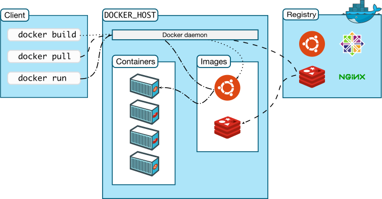

# Docker 容器

## 容器简介

如今 Docker 在云计算、微服务架构、集成测试部署等领域被广泛使用，得益于**容器** (Container) 这一虚拟化技术的日渐成熟，虽然 Docker 没有带来多少革命性技术，但 Docker 却几乎成为容器一词的事实标准。如果你想了解容器虚拟化技术，或许 Docker 是一个不错的选择。即使是对虚拟化技术不关心的 IT 从业者，相信 Docker 也能为他们在许多工作场景中带来便利。

早期，硬件抽象层基于 hypervisor 的虚拟化方式可以最大程度上提供虚拟化管理的灵活性。各种不同操作系统的虚拟机都能通过 hypervisor（KVM、XEN 等）来衍生、运行、销毁。然而，Linux Container (LXC) 容器技术的诞生解决了 IT 世界里“集装箱运输”的问题，LXC 是一种**内核轻量级的操作系统层虚拟化技术**，LXC 也是 Docker 的基石。

容器具有以下特点：

1. 极其轻量：只打包了必要的Bin/Lib；
2. 秒级部署：根据镜像的不同，容器的部署大概在毫秒与秒之间（比虚拟机强很多）；
3. 易于移植：一次构建，随处部署；
4. 弹性伸缩：Kubernetes、Swam、Mesos 这类开源、方便、好使的容器管理平台有着非常强大的弹性管理能力。

容器和虚拟机两者位于不同的虚拟化层次，并没有谁更好一说，只有谁更合适。但不可否认的是，容器为我们带来了许多新的使用场景。


## Docker 简介

Docker 是目前最流行的容器实现，目前包括两种产品：

- 包含了社区版引擎 (Docker Engine - Community) 的 Docker 社区版 (Docker Community Edition, Docker CE)：适用于初步体验 Docker 个人开发者和小型团队。
- 包含了企业版引擎 (Docker Engine - Enterprise) 以及其他专用于企业管理工具的 Docker 企业版 (Docker Enterprise Edition, Docker EE)：专为企业开发和 IT 团队而设计，提供了安全等保障，支持在大规模生产中构建、交付和运行业务关键型应用程序。

推荐使用 Linux 学习，相关安装见官网。

### Docker 引擎

无论是哪个版本的 Docker，引擎都是核心，Docker 引擎是一个 CS 架构的应用，包含三个主要组件：

- **服务端**：是一个长时间运行的守护进程 (Daemon)，通过 `dockerd` 命令进行设置。
- **REST API 中间层**：是一个程序与守护进程通信的桥梁。
- **客户端命令行接口**：负责接受、解析、响应客户端发送的 `docker` 命令。


### Docker 架构

整个 Docker 平台可以分成三个**逻辑分离**的部分，它们可以分布在不同的物理机器上面，也可能集中于一台物理机器上面。如果是一般学习的情况，那么客户端和服务端都在宿主机上面，而 registry 是 Docker Hub。




### Docker 镜像站

**镜像站/注册服务器** (Registries) 用于存储 Docker 镜像，类似于 Github。Docker Hub 是官方维护的注册服务器，除此之外 Docker registry 可以是部署在第三方平台上的一个公有或私有的服务器，例如 Google Container Registry、AWS Container Registry 等，甚至用户可以方便的建立自己的个人服务器。

推荐国内用户使用国内的镜像站，可以大大加速 Docker 镜像的传输。在 `/etc/docker/daemon.json` 文件（如果没有就创建一个）加入如下配置。

```
$ vim /etc/docker/daemon.json
...
{
  "registry-mirrors": [
    "https://hub-mirror.c.163.com",
    "https://ustc-edu-cn.mirror.aliyuncs.com",
    "https://ghcr.io",
    "https://mirror.baidubce.com"
  ]
}
```

> Docker 注册服务器包含许多 Docker 仓库，在许多不严谨的场合，注册服务器经常被称为仓库，实际上注册服务器是仓库的仓库。

### Docker 服务端

**服务端**主要包括 Docker 引擎，其中的守护进程 (`dockerd`) 运行于宿主机上，其负责监听客户端的 API 请求，并且管理 Docker 对象。大多数 Linux 发行版，docker 守护进程由 systemd 通过 `docker.service` 管理，因此守护进程的启动和退出一般通过 `systemctl` 命令完成。

|       动作       |           systemd 命令           |
| :--------------: | :------------------------------: |
|     启动服务     |  systemctl start docker.service  |
|  开机自启动服务  | systemctl enable docker.service  |
|     停止服务     |  systemctl stop docker.service   |
|     重启服务     | systemctl restart docker.service |
| 重新加载守护进程 |     systemctl daemon-reload      |

### Docker 客户端

**客户端**是用户接触 Docker 最主要的方式，用户主要通过 `docker` 命令与 Docker 交互。当用户执行 Docker 命令的时候，客户端便将该命令发送给服务端的 `dockerd` 守护进程。客户端和服务端可以位于不同的物理机器，通过网络进行通信。

```
Usage:  docker [OPTIONS] COMMAND

A self-sufficient runtime for containers

Management Commands:
  app*        Docker App (Docker Inc., v0.9.1-beta3)
  builder     Manage builds
  buildx*     Docker Buildx (Docker Inc., v0.8.2-docker)
  config      Manage Docker configs
  container   Manage containers
  context     Manage contexts
  image       Manage images
  manifest    Manage Docker image manifests and manifest lists
  network     Manage networks
  node        Manage Swarm nodes
  plugin      Manage plugins
  scan*       Docker Scan (Docker Inc., v0.17.0)
  secret      Manage Docker secrets
  service     Manage services
  stack       Manage Docker stacks
  swarm       Manage Swarm
  system      Manage Docker
  trust       Manage trust on Docker images
  volume      Manage volumes

Commands:
  attach      Attach local standard input, output, and error streams to a running container
  build       Build an image from a Dockerfile
  commit      Create a new image from a container's changes
  cp          Copy files/folders between a container and the local filesystem
  create      Create a new container
  diff        Inspect changes to files or directories on a container's filesystem
  events      Get real time events from the server
  exec        Run a command in a running container
  export      Export a container's filesystem as a tar archive
  history     Show the history of an image
  images      List images
  import      Import the contents from a tarball to create a filesystem image
  info        Display system-wide information
  inspect     Return low-level information on Docker objects
  kill        Kill one or more running containers
  load        Load an image from a tar archive or STDIN
  login       Log in to a Docker registry
  logout      Log out from a Docker registry
  logs        Fetch the logs of a container
  pause       Pause all processes within one or more containers
  port        List port mappings or a specific mapping for the container
  ps          List containers
  pull        Pull an image or a repository from a registry
  push        Push an image or a repository to a registry
  rename      Rename a container
  restart     Restart one or more containers
  rm          Remove one or more containers
  rmi         Remove one or more images
  run         Run a command in a new container
  save        Save one or more images to a tar archive (streamed to STDOUT by default)
  search      Search the Docker Hub for images
  start       Start one or more stopped containers
  stats       Display a live stream of container(s) resource usage statistics
  stop        Stop one or more running containers
  tag         Create a tag TARGET_IMAGE that refers to SOURCE_IMAGE
  top         Display the running processes of a container
  unpause     Unpause all processes within one or more containers
  update      Update configuration of one or more containers
  version     Show the Docker version information
  wait        Block until one or more containers stop, then print their exit codes
```

### Docker 对象

Docker 对象包括：容器 (container)、镜像 (image)、网络 (network)、数据卷 (volumes)等。其中，镜像和容器是 Docker 的核心对象。

| 类比领域 |     镜像     |    容器    |
| :------: | :----------: | :--------: |
|  虚拟机  | ISO 安装文件 | 虚拟机实例 |
| 编程语言 |      类      |    实例    |

## 镜像 (image)

### 常用命令

|      功能      |                            命令                             |                             备注                             |
| :------------: | :---------------------------------------------------------: | :----------------------------------------------------------: |
|  列出所有镜像  |            `docker images`<br>`docker image ls`             |                                                              |
|    获取镜像    |                 `docker pull IMG_NAME:TAG`                  |                     默认使用 latest 标签                     |
|    删除镜像    |                  `docker rmi IMG_NAME:TAG`                  |                                                              |
| 从容器更新镜像 | `docker commit -m "DESC" -a "AUTHOR" CONTAINER_ID IMG_NAME` | `docker commit -m "change libc version" -a "liyanjiu" 60118fc51c7c alpine:glibc` |
|    构建镜像    |                `docker build -t IMG_NAME .`                 |                  当前目录下需有 Dockerfile                   |
|  设置镜像标签  |              `docker tag IMG_ID IMG_NAME:TAG`               |                                                              |

### Dockerfile

## 容器 (container)

### 常用命令

|             功能             |                           命令                           |                 备注                 |
| :--------------------------: | :------------------------------------------------------: | :----------------------------------: |
|           启动容器           |                 `docker run -it alpine`                  |      详细参数见 docker run 章节      |
| 容器文件拷贝（容器到宿主机） |    `docker cp [OPTIONS] CONTAINER:SRC_PATH DEST_PATH`    |                                      |
| 容器文件拷贝（宿主机到容器） |   `docker cp [OPTIONS] SRC_PATH|- CONTAINER:DEST_PATH`   |                                      |
|          重命名容器          |            `docker container rename OLD NEW`             |        container 关键字可省略        |
|     查看容器所有底层信息     |       `docker inspect CONTAINER [-f GO_TEMP_STR]`        | 详细格式字符串见 docker inspect 章节 |
|      删除一个或多个容器      | `docker container rm [OPTIONS] CONTAINER [CONTAINER...]` |     其中 container 关键字可省略      |
|       删除所有停止容器       |                 `docker container prune`                 |                                      |

### docker run/exec/attach

docker run -it alpine

- i：交互式操作
- t：终端

docker attach 是将标准输入输出连接到容器。

### docker inspect

| 功能           | 命令                                                     |
| -------------- | -------------------------------------------------------- |
| 查看 IP 地址   | `docker inspect mc -f '{{.NetworkSettings.IPAddress}}'`  |
| 查看 MAC 地址  | `docker inspect mc -f '{{.NetworkSettings.MacAddress}}'` |
| 查看容器进程号 | `docker inspect mc -f '{{.State.Pid}}'`                  |

可以考虑将常用功能抽离为 shell 函数，例如：

```bash
# dip CONTAINER 获取容器 PIM
function dip {
	docker inspect -f '{{.State.Pid}}' $1
}
```


### Q&A

Q：如何查看容器和宿主机的 veth 对应关系？

A：分别在容器和宿主机中使用 `ip link` 查看接口名称和接口序号，其中接口名称格式为 `本地接口名@对端接口序号`。由于 veth 对都是成对创建的，所以每次需要占用 2 个接口序号，因此宿主机中的接口序号和 docker 中的接口序号应当相邻。如果需要确认接口序号，可以使用 `ip -d link show` 查看接口信息，其格式为 `接口序号: 接口名@对端接口序号`。


Q：为何 `ip netns list` 看不到容器对应的 netns？

A：该命令只能查看 `/var/run/netns` 下面的数据，而 docker 把 netns 创建到了其他地方。


Q：如何查看容器对应的 netns ？

A：使用 `ln -s /proc/$PID/ns/net /var/run/netns/CONTAINER` 建立 ip netns 可见的软连接，其中 PID 为容器的 PID，CONTAINER 为容器名或容器 ID。


Q：如何为容器添加新网卡？

A：首先创建网桥，其次使用 `docker network connect BR_NAME CONTAINER` 将容器连接到网桥即可。

## 网络 (network)

Docker 的网络子系统底层使用了多种驱动程序来提供核心联网功能：

|     网络     |  驱动   |                             场景                             |
| :----------: | :-----: | :----------------------------------------------------------: |
|   网桥网络   | bridge  | 默认的网络驱动，用于独立容器内运行的应用需要通信的场景，容器网络和宿主机网络隔离，容器有自己的 IP 地址，并通过网桥与宿主机连接。 |
|   主机网络   |  host   | 用于独立容器内运行的应用需要通信的场景，容器没有 IP 地址，与主机共享网络协议栈。 |
|   重叠网络   | overlay |          用于跨主机的容器进行通信，常用于容器集群。          |
| macvlan 网络 | macvlan |                                                              |

### 常用命令

| 功能           | 命令                                       | 备注                                               |
| -------------- | ------------------------------------------ | -------------------------------------------------- |
| 列出所有网桥   | `docker network ls`                        |                                                    |
| 创建网桥       | `docker network create NET type TYPE`      |                                                    |
| 容器连接到网桥 | `docker network connect BR_NAME CONTAINER` | `docker network connect br-lan agitated_lederberg` |


## 问题

Q: alpine 不能执行可执行文件
A: 这是由于 alpine 采用的是 musl.libc 而不是 gcc.libc，但二者是兼容的。
mkdir /lib64 && ln -s /lib/libc.musl-x86_64.so.1 /lib64/ld-linux-x86-64.so.2

## 参考

- [A Beginner-Friendly Introduction to Containers, VMs and Docker](https://www.freecodecamp.org/news/a-beginner-friendly-introduction-to-containers-vms-and-docker-79a9e3e119b/)
- [什么是容器技术](https://cloud.tencent.com/developer/article/1116709?fromSource=waitui)
- [Reference documentation](https://docs.docker.com/reference/)
- [Docker Internals](http://docker-saigon.github.io/post/Docker-Internals/)
- [why-you-dont-need-to-run-sshd-in-docker](https://www.oschina.net/translate/why-you-dont-need-to-run-sshd-in-docker?cmp)
- [Kubernetes vs Docker – What Is the Difference?](https://www.nakivo.com/blog/docker-vs-kubernetes/)
- [](https://cloud.tencent.com/developer/article/1116709?fromSource=waitui)
- [How to Start Docker Containers Automatically After a Reboot?](https://www.digitalocean.com/community/questions/how-to-start-docker-containers-automatically-after-a-reboot)

- [FOUR WAYS TO CONNECT A DOCKER CONTAINER TO A LOCAL NETWORK](https://blog.oddbit.com/post/2014-08-11-four-ways-to-connect-a-docker/)
- [Docker自定义网络——MacVLAN](http://hustcat.github.io/docker-macvlan/)
