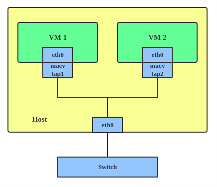

# 网络 - iproute2

## 命令基本格式

常用的选项如下：

|     选项      |                解释                |
| :-----------: | :--------------------------------: |
| -n[etns] name | 在命名空间 name 中执行后续 ip 命令 |
|               |                                    |
|               |                                    |

常用的子命令如下：

|   子命令   | 解释 |
| :--------: | :--: |
|  ip link   |      |
| ip address |      |
|  ip netns  |      |
|            |      |

### ip link 子命令

ip link 命令用来配置网络设备，常用命令基本格式如下：

```
ip link add ...
ip link delete ...
ip link set ...
ip link show ...
ip link help ...
```

## 网桥 - bridge

bridge 设备即网桥（交换机），是 Linux 内核使用纯软件实现的虚拟交换机，有着和物理交换机相同的功能，例如二层交换，MAC 地址学习等。因此，bridge 更确切的叫法应该是 Linux 内核虚拟交换机。需要注意的是，Linux 平台上还有其他用户层虚拟交换机软件，例如 Open vSwitch 等，以下使用网桥指代 bridge 设备。

使用 `ip` 命令即可操作网桥，另一种方式是通过 `brctl` 命令，但需要额外安装 `bridge-utils` ，本文使用 `ip` 命令完成对网桥的所有操作。

首先创建一个网桥 br0。

```
ip link add br0 type bridge
```

然后创建两个命名空间，并创建两个 veth 设备。

```
# create network namespace
ip netns add ns1
ip netns add ns2

# create two veth pairs and move interfaces to network namespace
ip link add veth-ns1-br type veth peer name veth-ns1
ip link add veth-ns2-br type veth peer name veth-ns2
ip link set veth-ns1 netns ns1
ip link set veth-ns2 netns ns2

# set all interfaces up 
ip link set veth-ns1-br up
ip link set veth-ns2-br up
ip -n ns1 link set veth-ns1 up
ip -n ns2 link set veth-ns2 up

# assign IP to interfaces
ip -n ns1 address add 10.0.0.1/24 dev veth-ns1
ip -n ns2 address add 10.0.0.2/24 dev veth-ns2
```

将接口添加到网桥之前，必须保证其状态为 up，通过设置接口的 master 属性即可将其添加到网桥。

```
ip link set veth-ns1-br master br0
ip link set veth-ns2-br master br0
```

因此，通过网桥两个容器可以互相通信。

```
+------------------+     +------------------+
|       ns1        |     |       ns2        |
|                  |     |                  |
|    10.0.0.1/24   |     |    10.0.0.2/24   |
+---+(veth-ns1)+---+     +---+(veth-ns2)+---+
         +                          +        
         |                          |        
         +                          +        
+-+(veth-ns1-br)+-----------+(veth-ns2-br)+-+
|               Linux bridge                |
+-------------------------------------------+            
```

通过设置 nomaster 将接口从网桥移除。

```
ip link set veth-ns1-br nomaster
ip link set veth-ns2-br nomaster
```

删除网桥 br0 命令为。

```
ip link delete br0 type bridge
```

需要注意的是，在网桥创建成功后，Linux 会自动在默认命名空间创建一个与网桥同名的接口，通过 `ip link` 命令即可查看到。这也是令初学者迷惑的一点，实际上，这仅仅是创建的同名接口，而不是网桥本身。

```
5: br0: <BROADCAST,MULTICAST> mtu 1500 qdisc noop state DOWN group default qlen 1000
    link/ether 1a:9c:fb:2d:be:21 brd ff:ff:ff:ff:ff:ff
```

网桥作为一个二层设备不需要配置 IP，但是网桥通过默认命名空间的同名接口，自动将本机协议栈挂在网桥上。这样网桥上挂载的命名空间（容器）就可以同主机进行通信，进而通过内核路由访问到外部网络。

```
route: default gw 10.0.0.3/24
+------------------+     +------------------+
|       ns1        |     |       ns2        |
|                  |     |                  |
|    10.0.0.1/24   |     |    10.0.0.2/24   |
+---+(veth-ns1)+---+     +---+(veth-ns2)+---+
         +                          +        
         |                          |        
         +                          +        
+-+(veth-ns1-br)+-----------+(veth-ns2-br)+-+
|               Linux bridge                |
+-----------------(br0)---------------------+
                    |                        
+-----------------(br0)---------------------+
|              10.0.0.3/24                  |
|        default network namespace          |
|       (Linux Kernel IP Forwarding)        |
|              10.0.1.1/24                  |
+---------------(enp0s3)--------------------+
```

!> 对于本机来说，数据从 br0 出意味着从协议栈进入网桥，从 br0 口入意味着从网桥进入本机协议栈。这有助于梳理一些数据包的过滤条件的处理方向问题。

## 绑定接口 - bonded interface

Linux 可以将几个物理接口绑定到一起成为一个绑定的逻辑接口，即 bonded 接口，使用绑定接口的目的在于提高速率或者提高可靠性。因此，绑定接口支持两种模式：

- 热备份：hot stanby
- 负载均衡：load balancing


```
ip link add bond1 type bond miimon 100 mode active-backup
ip link set eth0 master bond1
ip link set eth1 master bond1
```

这创建了一个热备份的 bonded 接口，其他使用方式请参考[内核文档](https://www.kernel.org/doc/Documentation/networking/bonding.txt)。

## team device

The main thing to realize is that a team device is not trying to replicate or mimic a bonded interface. What it does is to solve the same problem using a different approach, using, for example, a lockless (RCU) TX/RX path and modular design.

But there are also some functional differences between a bonded interface and a team. For example, a team supports LACP load-balancing, NS/NA (IPV6) link monitoring, D-Bus interface, etc., which are absent in bonding. For further details about the differences between bonding and team, see Bonding vs. Team features.

Use a team when you want to use some features that bonding doesn't provide.

```
# teamd -o -n -U -d -t team0 -c '{"runner": {"name": "activebackup"},"link_watch": {"name": "ethtool"}}'
# ip link set eth0 down
# ip link set eth1 down
# teamdctl team0 port add eth0
# teamdctl team0 port add eth1
```

[Bonding vs. Team features](https://github.com/jpirko/libteam/wiki/Bonding-vs.-Team-features)

## 虚拟局域网 - VLAN

VLAN 可以将 LAN 划分出独立的广播域，通过加入 VLAN 头来进行数据包区分。


通过 VLAN 接口，可以划分子网。VLAN 接口是逻辑接口，需要依附一个物理端口用于数据包的收发，但和物理接口的设置是相互独立的。因此，VLAN 接口上可以设置 IP 地址。


Linux 系统数据包从协议栈经过 eth0.100 发出时，将会给数据包打上 100 标签，然后再调用物理接口的发送函数从 eth0 发出。

当数据包从 eth0 接收时，如果数据包不含 VLAN 标签，则直接送入协议栈正常处理。若含有 VLAN 标签，则会根据 VLAN 标签送往 VLAN 接口，在 VLAN 接口上 VLAN 头被去除，然后进入 eth0.100 接口到达协议栈处理。

使用 ip 命令创建、查看、设置 IP 地址、开启、关闭、删除接口操作如下：

```
# ip link add link eth0 name eth0.100 type vlan id 100
# ip -d addr show
# ip addr add 192.168.100.1/24 brd 192.168.100.255 dev eth0.100
# ip link set dev eth0.100 up
# ip link set dev eth0.100 down
# ip link delete eth0.100
```

!> 当配置了 VLAN 时，需要确保对端连接的交换机或设备接口可以处理 VLAN 标签，例如将交换机端口设置为 Trunk。

## MACVLAN

通过 VLAN 可以在一个物理接口上创建多个逻辑接口，并且通过 VLAN 标签进行数据分流，各个 VLAN 接口和其依附的物理接口的二层地址是相同的。然而，通过 MACVLAN 可以一个物理接口上创建多个逻辑接口，每个逻辑接口都拥有独立的二层地址。

不使用 MACVLAN 时，若要将两个命名空间或虚拟机连接到物理网络，需要通过 bridge 设备。


通过 MACVLAN 可以将物理接口直接绑定到命名空间，不再需要桥接。


MACVLAN 是 Linux 的网卡虚拟化技术，关于容器和虚拟机是否可以使用，需要看对应的容器或虚拟机是否支持 MACVLAN 驱动。

MACVLAN 操作命令如下：

```
# ip link add macvlan1 link eth0 type macvlan mode bridge
# ip link add macvlan2 link eth0 type macvlan mode bridge
# ip netns add net1
# ip netns add net2
# ip link set macvlan1 netns net1
# ip link set macvlan2 netns net2
```

MACVLAN 具有 5 种类型，可以根据需求自由选择，其中常用的为桥模式。

### 私有模式（Private）

不允许 MACVLAN 接口之间互相通信，即使外部交换机开启了发卡模式。


!> hairpin 中文翻译为发卡。bridge 不允许包从收到包的端口发出，比如 bridge 从一个端口收到一个广播报文后，会将其广播到所有其他端口。bridge 的某个端口打开 hairpin mode 后允许从这个端口收到的包仍然从这个端口发出。这个特性用于 NAT 场景下，比如 docker 的 nat 网络，一个容器访问其自身映射到主机的端口时，包到达 bridge 设备后走到 ip 协议栈，经过 iptables 规则的 dnat 转换后发现又需要从 bridge 的收包端口发出，需要开启端口的 hairpin mode。

### VEPA 模式

允许 MACVLAN 接口之间穿过物理接口，通过外部交换机互相通信，外部交换机需要开启发卡模式。


### 桥模式（Bridge）

允许 MACVLAN 接口之间互相通信，此时物理接口类似于桥转发数据。


### 穿越模式（Passthru）

允许一个 MACVLAN 接口越过物理接口，直接和外部接口相连。


### 源模式（Source）

这个模式通过允许通过的源 MAC 地址列表，可以实现 MAC-based VLAN。

## IPVLAN

IPVLAN 同 MACVLAN 极其相似，不过其接口实例拥有相同的 MAC 地址。


IPVLAN 支持两种模式：

L2 模式类似于 MACVLAN 的桥模式，父接口类似于交换机。


L3 模式中父接口类似于交路由器。


对比 MACVLAN，IPVLAN 功能相似，那么如何选择呢？内核中推荐如果使用场景满足以下条件之一，那么需要使用 IPVLAN。

- 物理父接口连接的对端设备配置了规则，一个端口仅允许一个 MAC 地址。
- 主接口创建的虚拟接口不会达到 MAC 容量上限，且网卡设置混杂模式可能会降低性能。
- 子接口位于的网络，其接口 MAC 地址可能会被误改变。

```
# ip netns add ns0
# ip link add name ipvl0 link eth0 type ipvlan mode l2
# ip link set dev ipvl0 netns ns0
```

## MACVTAP/IPVTAP

MACVTAP/IPVTAP 驱动用于简化桥接的虚拟网络。当在某物理接口上创建 MACVTAP/IPVTAP 实例时，内核将会创建一个字符设备 `/dev/tapX` 作为 TUN/TAP 设备，该设备直接被 KVN/QEMU 使用。



### TUN/TAP

什么是 TUN/TAP 设备呢？通常情况下，物理网卡工作如下：


TUN 设备是三层设备，可以被用户通过 `/dev/tunX` 字符设备直接读写，而不需要经过协议栈，通常可以用于实现 VPN。


TAP 设备类似 TUN 设备，区别如下：

- `/dev/tunX` 工作在三层网络层 (ip_forward)
- `/dev/tapX` 工作在二层链路层 (bridge, MAC broadcast)

### MACVLAN vs MACVTEP

MACVTEP 看起来使用方式同 MACVLAN 很类似，二者有何区别呢？

MACVLAN 工作流程如下：


单独使用 MACVLAN 在同一接口上提供了不同的 IP 和 MAC 地址之外并无大用。如果与 namespace 相结合则发挥了威力。


通过使用 MACVLAN，宿主机和命名空间都好像挂载在交换机上一样。

而使用 MACVTEP 则如下图所示。


可见两者最大的区别在于是否使用标准协议栈，而字符设备提供了更多的可能性。两者都具有不同的类型，在 MACVLAN 章节已经说明了各类型区别，不再赘述。另外，IPVALN 和 IPVTEP 的区别也类似。

### 使用

通过以下命令可以创建一个桥模式的 MACVTEP。

```
ip link add link eth0 name macvtap0 address 52:54:00:b8:9c:58 type macvtap mode bridge
ip link set macvtap0 up
ip link show macvtap0
```

创建完毕后，例如 QEMU 要使用该接口创建网卡，可以进行如下设置。

```
qemu -net nic,model=virtio,addr=1a:46:0b:ca:bc:7b -net tap,fd=3 3<>/dev/tap11
```

其中 `tap11` 中的 `11` 是创建 `macvtap0` 时自动生成的索引号。

## 虚拟以太网对 - veth pair

veth 设备总是成对出现的，两个设备一端连接内核协议栈，另一端两个设备彼此相连。一个设备收到协议栈的数据发送请求后，会将数据发送到另一个设备上去。

```
+----------------------------------------------------------------+
|                                                                |
|       +------------------------------------------------+       |
|       |             Newwork Protocol Stack             |       |
|       +------------------------------------------------+       |
|              ↑               ↑               ↑                 |
|..............|...............|...............|.................|
|              ↓               ↓               ↓                 |
|        +----------+    +-----------+   +-----------+           |
|        |   eth0   |    |   veth0   |   |   veth1   |           |
|        +----------+    +-----------+   +-----------+           |
|192.168.1.11  ↑               ↑               ↑                 |
|              |               +---------------+                 |
|              |         192.168.2.11     192.168.2.1            |
+--------------|-------------------------------------------------+
               ↓
         Physical Network
```

veth 设备单独使用并没有任何用处，因为两个设备挂在同一个协议栈上。

veth 设备常用的功能是用来连接两个网络命名空间，这样两个设备挂在两个协议栈之下，使得两个网络命名空间中的设备可以互相通信。其流程为：

1. 创建 veth 设备对。
2. 将其中一个设备移动到另一个网络命名空间内。
3. 在网络命名空间中启动设备。

```
ip link add <p1-name> type veth peer name <p2-name>
ip link set <p2-name> netns <p2-namespace>
ip link set <p1-name> up
ip -n[etns] <p2-namespace> link set <p2-name> up
```

这样内核协议栈便可以和网络命名空间（容器）内协议栈连接，后续可以根据需求配置 IP 地址进行通信。

以上只能连接两个网络命名空间，如果需要多个网络命名空间相连，可以通过 veth 设备将各个命名空间与网桥相连，使得多个网络命名空间（容器）可以进行通信。

```
ip link add <p1-name> type veth peer name <p2-name>
...
```

## VXLAN

## VRF

虚拟路由转发（Virtual Routing Forwarding, VRF）是一种三层虚拟化技术，简单而言就是把一台路由器当作多台虚拟路由器使用。虚拟路由器之间从物理网卡设备到三层路由之间全是隔离的。另外，VRF 可以嵌套在 net 命名空间中使用。

### 实现原理

Linux 中通过虚拟网卡技术实现 VRF，每个 VRF 域表现为一个虚拟网卡，通过将物理网卡“绑到”虚拟网卡上，从而实现将该物理网卡划分到不同 VRF 域中隔离。

VRF 的实现经历了两个阶段：

1. 内核 v4.3 - v4.8：基础阶段，需要结合外部策略路由规则才能使用。
2. 内核 v4.8 之后：完善阶段，通过引入 l3mdev 提供完整的设施支持。

在第一阶段中，VRF 的实现简单粗暴，通过配置**策略路由**，将流量导入不同的路由表中匹配，从而实现隔离。


用户需要使用命令配置策略路由，示例如下：

```
ip rule add oif vrf-blue table 10
ip rule add iif vrf-blue table 10
```

当数据包被物理网卡 eth1 接收后，在 netif_receive_skb 中，会有 rx_handler 回调函数截获数据包，将 skb 中的 dev 字段修改为 VRF 虚拟网卡对象，这个处理是和 Bridge 一样的。

由于数据包中 dev 已经是 VRF 设备，表明数据是通过 VRF 设备来接受的，自然进入策略路由匹配流程，由此实现了 VRF 隔离逻辑。

通过原理可知，此时的隔离仅仅是路由表的隔离，其二三层的邻居表都是共享的。

在 Linux 4.8 之后，内核提供了一种更加优雅的实现方式。即引入了 l3mdev (Layer 3 master device) 机制，通过 l3mdev 便省去了显式配置策略路由的过程。在创建一个 VRF 虚拟网卡的时候，系统便自动将其与一个特定的策略路由表关联，l3mdev 机制基于这种关联来完成策略路由表的定向操作。

### 控制路径

首先，创建两个 VRF 虚拟网卡 vrf-blue 和 vrf-blue 及其关联路由表 table 1 和 table 2，然后启动两个网卡。

```
# ip link add vrf-red type vrf table 1
# ip link set vrf-red up
# ip link add vrf-blue type vrf table 2
# ip link set vrf-blue up

# ip -br link
...
vrf-red          UP             8a:95:83:fc:c0:88 <NOARP,MASTER,UP,LOWER_UP> 
vrf-blue         UP             72:ea:fe:db:f3:57 <NOARP,MASTER,UP,LOWER_UP> 
```

设置完之后，查看策略路由表。`[l3mdev-table]` 即是上文中自动生成的特定策略路由表。

```
# ip rule
0:      from all lookup local
1000:   from all lookup [l3mdev-table]
32766:  from all lookup main
32767:  from all lookup default
```

然后可以将网卡分别绑定到 VRF 虚拟网卡上，即：将网卡划入 VRF 隔离域。

```
# ip link set dev eth0 master vrf-blue
```

总结一下，控制路径完成了两件事：

1. 将 VRF 虚拟网卡与特定路由表关联。
2. 将物理网卡与 VRF 虚拟网卡关联。

### 数据接收路径

当完成上述两步关联之后，物理网卡就可以通过 VRF 与特定路由表进行联系。

具体而言，当数据从物理网卡收到时，依次经过网卡驱动，netif_receive_skb，ip_rcv 等调用，然后再 ip_rcv_finish 最后，调用了 l3mdev_ip_rcv 函数，在该函数中，**将 skb 的 dev 字段修改为该 dev 的主设备 VRF 虚拟网卡**。

数据在经过一些步骤后，进入策略路由的处理逻辑 fib_rule_match，在这里系统遍历所有的 rule 链表，然后进入 `[l3mdev-table]` 的处理逻辑 l3mdev_fib_rule_match，在这里进行了隐式处理，即系统发现该 dev 是 VRF 虚拟网卡，便通过其回调函数获得其关联的路由表，最终在该路由表中进行路由查找。

### 数据发送路径

本地数据的发送一般是来源于 socket 而不是网卡，但 socket 并不和网卡绑定，通常情况下，进行路由查找后，才能知道从哪个网卡发出。因此，socket 若想使用 VRF 机制，就必须与特定网卡绑定。

```c
int sockfd = socket(AF_INET, SOCK_DGRAM, 0);
// OK: Some AF_INET: SOCK_DGRAM, SOCK_STREAM, SOCK_RAW
// Not OK: AF_PACKET, must bind() to `struct sockaddr_ll`
char *vrf_dev = "vrf-red";
setsockopt(sockfd, SOL_SOCKET, SO_BINDTODEVICE, vrf_dev, strlen(vrf_dev)+1);
```

由于绑定 VRF 虚拟网卡设备的 setsockopt 是针对特定 socket 的，如果仅仅针对 listener socket 做了绑定，那么对于这个 listener socket  的 acceptor socket 如何绑定呢？系统可以自动做到这一点。

```shell
sysctl -w net.ipv4.tcp_l3mdev_accept=0
```

该参数可以自动识别从隶属于某 VRF 域的网卡是上收到的数据包所属的具体 VRF 域。

### 常用命令

命令|说明
:---:|:---:
`ip link show type vrf`\br`ip vrf show`| 列出 vrf

### 示例

创建 vrf0 并且绑定 tap0 到 vrf0 中。

```shell
ip link add dev vrf0 type vrf table 10
ip link set vrf0 up
ip tuntap add dev tap0 mode tap
ip link set tap0 master vrf0
ip addr add 172.18.1.2/24 dev tap0
ip link set tap0 up
```

创建 vrf1 并且绑定 tap1 到 vrf1 中。

```shell
ip link add dev vrf1 type vrf table 11
ip link set vrf1 up
ip tuntap add dev tap1 mode tap
ip link set tap1 master vrf1
ip addr add 172.18.2.2/24 dev tap1
ip link set tap1 up
```

通过 veth pair 连接 vrf0 和 vrf1

```shell
ip link add veth0 type veth peer name veth1
ip link set veth0 master vrf0
ip link set veth1 master vrf1
ip link set veth0 up
ip link set veth1 up
ip route add 172.18.2.0/24 dev veth0 vrf vrf0
ip route add 172.18.1.0/24 dev veth1 vrf vrf1
```

ping 命令

```shell
ping 172.18.2.2 -I vrf0 -I 172.18.1.2
```

清理

```shell
ip link del dev vrf0
ip link del dev vrf1
ip link del dev tap0
ip link del dev tap1
ip link del dev veth0
```

## 单播路由（ip route）

命令|说明
:---:|:---:
`ip route list/show`|查看 main 路由表路由
`ip route list table local`|查看 local 路由表路由
`ip route list vrf blue`| 查看 blue vrf 中 main 路由表路由
`ip -f inet6 route [list]`|查看 IPv6 路由

## 组播路由（ip mroute）

## 邻居（ip neigh）

`ip neigh add 10.0.0.3 lladdr 50:54:33:00:00:0a dev vxlan0`

`nud` 是 Neighbour Unreachability Detection 的缩写。具有以下状态：

值|含义
:---:|:---:
**permanent**|表项永久有效，只能被管理员删除。
**noarp**|表项有效，但不会尝试校验（ARP），有过期时间。
**reachable**|表项有效，且没有过期，是正常状态。
**stale**|表项有效，但需要重新校验（ARP）。
failed|表项失败。尝试最大探测次数后仍然失败。
none|表项无状态，刚刚初始化或删除。
incomplete|表项不完整，还没有被正确校验或解析。
delay|表项校验目前被延迟。
probe|表项目前正在尝试探测中。

## 策略路由（ip rule）

IP rule 是策略路由（Routing policy database， RPDB）管理工具。

每条策略路由规则（rule）包括一个匹配器/选择器（selector）和一个动作指示（action），数据包到来时，根据优先级由高到低（数字越小，优先级越高）依次搜索策略路由规则，如果 selector 匹配成功，则执行相应的动作。如果动作执行了，则返回路由或者失败，同时结束查找。否则，继续搜索下一条规则。

在系统启动时，内核配置了默认的 RPDB，包括三个规则：

优先级|选择器|动作|说明
:---:|:---:|:---:|:---:
0|匹配所有|查找 local (255) 路由表|特殊路由表，用于匹配广播和本地路由，该规则不可删除。
32766|匹配所有|查找 main (254) 路由表|用于匹配系统主路由表，该规则可以由管理员修改或删除。
32767|匹配所有|查找 default (253) 路由表|用于没有匹配策略之后的 post-processing，表默认为空，该规则可以删除。

路由表名称和路由 ID 的映射关系在 `/etc/iproute2/rt_tables` 文件中。如果新增了路由表，可以在此文件中为该路由表映射名称。

### 规则类型

策略路由规则有 5 种类型：

- unicast：返回单播路由表项。
- blackhole：丢弃数据包。
- unreachable：生成“网络不可达”错误。
- prohibit：生成“通信被系统保护”错误。
- nat：修改数据包源地址。

### 规则 Selector

策略路由规则匹配器包括：

- from：根据源地址匹配。
- to：根据目的地址匹配。
- iif：如果是 lo，则可以为本地数据包和转发数据包制定不同的数据包。
- oif：只应用于本地绑定了设备的套接字发出的数据包。
- tos/dsfield：根据 tos 字段匹配。
- fwmark：根据 firewall mark 匹配。iptables 可以用来标记，从而用于策略路由。
- ipproto：根据 IP 协议匹配。
- sport：根据源端口匹配，支持范围匹配。
- dport：根据目的端口匹配，支持范围匹配。

### 规则 Action

规则动作包括：

- table/lookup：查询路由表。
- protocol：指示添加该规则的路由协议，例如 zebra。
- nat：转换的地址。
- realms：TODO。
- goto：转到指定规则。

## 命名空间（ip netns）

## 字符设备（ip tuntap）

## 隧道设备（ip tunnel）

## 安全通信（ip xfrm）

IPsec 是一组协议，通过对通信会话中的每个数据包进行身份验证和加密，以确保 IP 流量的安全。在 Linux 内核中，IPsec 通过 XFRM 框架实现，XFRM 框架是 IPsec 的“基础设施”，这个“基础设施”自 2.5 版本后引入，独立于协议簇，包含可同时应用于 IPv4 和 IPv6 的通用部分，位于源代码的 `net/xfrm/` 目录下。

XFRM 的正确读音是 transform, 这表示内核协议栈收到的 IPsec 报文需要经过转换才能还原为原始报文。同样地，要发送的原始报文也需要转换为 IPsec 报文才能发送出去。

## IPv6 段路由（ip sr）

## 套接字统计（ss）

## 参考

- [Introduction to Linux interfaces for virtual networking](https://developers.redhat.com/blog/2018/10/22/introduction-to-linux-interfaces-for-virtual-networking)
- [Virtual networking: TUN/TAP, MacVLAN, and MacVTap](https://suhu0426.github.io/Web/Presentation/20150120/index.html)
- [VRF Kernel Document](https://docs.kernel.org/networking/vrf.html)
- [VRF patch talk](https://lwn.net/Articles/632522/)
- [Using VRFs with linux kernel 4.6](https://andreas.rammhold.de/posts/linux-ip-vrf/)
- [Linux VRF 的原理和实现](https://blog.csdn.net/dog250/article/details/78069964)
