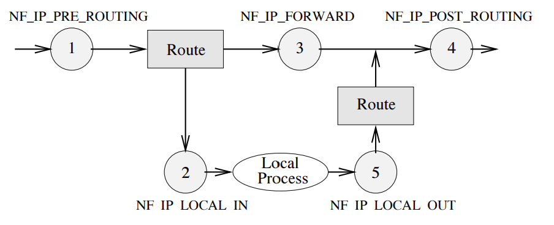

# 内核防火墙 - Netfilter

## Netfilter 内核框架

Netfilter 是 Linux 内核中的一个**防火墙软件框架**，用于管理网络数据包。不仅具备数据包**内容修改**以及数据包**过滤**等防火墙功能，也具有**网络地址转换 (NAT)** 的功能。

Netfilter 在 Linux 协议栈中引入了五个**钩子函数** (hook) ，内核模块可以向钩子注册回调函数，每个数据包都会经过这些钩子函数，从而触发执行**回调函数**。通过这种方式，内核程序可以在不同时间、位置完成对数据包的控制。

|        钩子        |                           触发时机                           |
| :----------------: | :----------------------------------------------------------: |
| NF_IP_PRE_ROUTING  |   所有经过完整性检查的 IP 包都会通过此钩子，在路由决策之前   |
|   NF_IP_LOCAL_IN   |  经过路由查找后，送往本机（目的地址在本地）的包会通过此钩子  |
|   NF_IP_FORWARD    | 不是本地产生的并且目的地不是本地的包（即转发的包）会通过此钩子 |
|  NF_IP_LOCAL_OUT   |          所有本地生成的发往其他机器的包会通过该钩子          |
| NF_IP_POST_ROUTING |       所有包在离开本机之前会通过该钩子，在路由决策之后       |

钩子函数在数据包传输过程中的位置关系如下图所示：



## 用户空间工具

经典的 Netfilter 钩子系统的数据包过滤部分由 ip_tables、ip6_tables、arp_tables、ebtables 四个**内核模块**组成，它们提供了一个基于表的系统，用于定义可以过滤或转换数据包的防火墙规则。这些表可以被对应的**用户空间**的工具所管理，分别是：

- `iptables`
- `ip6tables`
- `arptables`
- `ebtables`

其中最常用的为 `iptables`。用户通过 `iptables` 软件提供的命令行工具即可根据需求生成对应的回调函数，与 `iptables` 关联的内核模块将该回调函数注册在 Netfilter 相关钩子处。用户无需编写内核模块即可完成流量控制。

### nftables

`nftables` 是从内核 3.13 版本引入的新的数据包过滤框架，旨在替代现用的 `iptables` 框架。`nftables` 引入了一个新的命令行工具 `nft`，取代了之前的 `iptables`、`ip6iptables`、`arptables`、`ebtables` 等各种工具。

综上所述，Netfilter 系统提供了内核模块和用户空间两个层次的管理方式，通常我们只需要利用 `iptables` 或者 `nftables` 命令行工具来管理规则，如果用户代码需要直接与内核模块通信的话，还需要利用 Netlink 套接字完成。

## iptables

### iptables 结构

iptables 使用表 (tables) 来组织其规则 (rules)。

每条**规则**都包括**匹配**和**动作**两部分，是最小单元。

- 匹配可以有多条，比如匹配端口、IP、数据包类型等。匹配还可以包括模块（如conntrack、recent等），实现更复杂的过滤。
- 动作只能有一个，通过 -j 指定，如 ACCEPT、DROP、RETURN、SNAT、DNAT 等。

规则按照**功能类型**分为不同的表。Netfilter 提供了以下几种表：

- filter：用于过滤
- nat：用于网络地址转换
- mangle：用于对报文进行修改
- raw：用于决定数据包是否被状态跟踪机制处理
- security：用于根据安全策略处理数据包

其中，filter 表和 nat 表最常使用。

在表内部，规则又被进一步组织为链 (chains)，链与钩子函数一一对应，表示**何时触发这些规则**。所有链默认都是没有任何规则的，用户可以按需要添加规则。Netfilter 内置的五条链与五个钩子函数对应关系为：

- PREROUTING: NF_IP_PRE_ROUTING
- INPUT: NF_IP_LOCAL_IN
- FORWARD: NF_IP_FORWARD
- OUTPUT: NF_IP_LOCAL_OUT
- POSTROUTING: NF_IP_POST_ROUTING

每个表根据功能不同，具有不同的链，其对应关系如下。

| Tables↓/Chains→ | PREROUTING | INPUT | FORWARD | OUTPUT | POSTROUTING |
| :-------------: | :--------: | :---: | :-----: | :----: | :---------: |
|       raw       |     ✓      |       |         |   ✓    |             |
|     mangle      |     ✓      |   ✓   |    ✓    |   ✓    |      ✓      |
|   nat (DNAT)    |     ✓      |       |         |   ✓    |             |
|     filter      |            |   ✓   |    ✓    |   ✓    |             |
|    security     |            |   ✓   |    ✓    |   ✓    |             |
|   nat (SNAT)    |            |   ✓   |         |        |      ✓      |

通常情况下，链的执行顺序如下所示。

- **目的地址是本机的数据包**: `PREROUTING` -> `INPUT`
- **目的地址是其他的数据包**: `PREROUTING` -> `FORWARD` -> `POSTROUTING`
- **本地生成数据包**: `OUTPUT` -> `POSTROUTING`

例如，目的地址是本机的数据包到来之后，首先经过 `raw`, `mangle`, and `nat` 表中 `PREROUTING` 链。接着经过  `mangle`, `filter`, `security` 和  `nat`  表中的 `INPUT` 链，最后到达本地套接字。

### 规则语法

规则包括匹配部分和目标部分：

- 匹配部分（matches）：数据包需要满足的所有条件。
- 目标部分（target）：数据包匹配所有条件后的动作。

目标部分可以是：

- 用户自定义的链：如果条件匹配，跳转到用户定义的链继续处理。如果数据包成功穿过用户链，目标将移动到原始链的下一个规则。
- 内置特定值：如果条件匹配，数据包的动作立刻被决定，并且处理过程会停止。包括 `ACCEPT`，`DROP`，`QUEUE`，`RETURN`。
- 目标扩展：如果条件匹配，可以被终止，也可以不被终止。例如 `REJECT`，`LOG`。

目标使用 `-j, --jump` 或者 `-g, --goto` 选项指定，两者的区别是：

- jump 选项类似于函数跳转返回。如果链 A jump 到用户链 B，执行完用户链 B 或遇到 RETURN 之后，将返回调用链 A，并且继续执行匹配下一条规则。
- goto 选项类似于 goto 语句。如果链 A goto 到用户链 B，执行完用户链 B 或遇到 RETURN 之后，相当于链 A 已经执行完毕，此时将返回调用 A 的前一条链。

查看表中所有规则：

```
iptables -nvL
iptables -nvL --line-numbers # useful for insert,replace and delete a rule
```

在表中**添加/重命名/删除/重置**链：

```
iptables [-t table] -N chain  # creates a chain in a table

iptables [-t table] -E old-chain new-chain # Rename the user specified chain to the user supplied name.

iptables [-t table] -X [chain]
iptables -X      # deletes all empty non-default chains in a table
iptables -X [chain_name]   # deletes the specific empty non-default chains in a table

iptables [-t table] -F [chain]
iptables -F      # flushes all the chains in its current table
iptables -F [chain_name]   # flushes the specific chain in its current table
```

在链中**增加/插入/替换/删除/查看是否存在**规则：

```
iptables -A chain rule-specification    # append a rule to a chain
iptables -I chain [rulenum] rule-specification  # insert a rule at a specific position on the chain, default is 1, which is the head of the chain.
iptables -R chain rulenum rule-specification  # replacing a rule in the selected chain
iptables -D chain rule-specification    # delete a rule by specification
iptables -D chain rulenum       # delete a rule by number. Rules are numbered starting at 1
iptables -C chain rule-specification    # Check whether a rule matching the specification does exist in the selected chain.
```

### 规则示例

以下是一些 iptables 的示例：

查看规则列表

```
iptables -nvL           # 如不指定表，则使用默认表 filter 表，其他操作同理。
iptables -t nat -nvL    # 显示 nat 表规则列表
```

端口

```
iptables -A INPUT -p tcp --dport 22 -j DROP   # 添加规则：禁止 TCP 目的端口 22 
iptables -D INPUT -p tcp --dport 22 -j DROP   # 删除规则：禁止 TCP 目的端口 22
iptables -A INPUT -p tcp --dport 22 -j ACCEPT   # 添加规则：允许 TCP 目的端口 22
```

IP

```
iptables -A INPUT -s 192.168.0.4 -j ACCEPT
```

Ping

```
iptables -A INPUT -p icmp --icmp-type echo-request -j DROP
```

状态

```
iptables -A INPUT -m state --state ESTABLISHED,RELATED -j ACCEPT
```

NAT

```
iptables -I FORWARD -m state --state RELATED,ESTABLISHED -j ACCEPT
iptables -I INPUT   -m state --state RELATED,ESTABLISHED -j ACCEPT
iptables -t nat -I OUTPUT -d 55.55.55.55/32 -j DNAT --to-destination 10.0.0.30
iptables -t nat -I PREROUTING -d 55.55.55.55/32 -j DNAT --to-destination 10.0.0.30
iptables -t nat -I POSTROUTING -s 10.0.0.30/32 -j SNAT --to-source 55.55.55.55
```

端口映射

```
iptables -t nat -I OUTPUT -d 55.55.55.55/32 -p tcp -m tcp --dport 80 -j DNAT --to-destination 10.10.10.3:80
iptables -t nat -I POSTROUTING -m conntrack ! --ctstate DNAT -j ACCEPT
iptables -t nat -I PREROUTING -d 55.55.55.55/32 -p tcp -m tcp --dport 80 -j DNAT --to-destination 10.10.10.3:80
```

重置规则（谨慎使用）

```
iptables -F             # Delete all rules in chain or all chains
iptables -t nat -F
iptables -t mangle -F
iptables -X             # Delete a user-defined chain
```

LOG 目标可以记录命中规则的数据包，命中之后不会影响原本的转发流程。在丢弃数据包之前，通过 LOG 目标记录下来

```
iptables -N logdrop
iptables -A logdrop -m limit --limit 5/m --limit-burst 10 -j LOG
iptables -A logdrop -j DROP
```

如果有规则想要记录后丢弃，只需要将动作跳转到 logdrop 链即可。

```
iptables -A INPUT -m conntrack --ctstate INVALID -j logdrop
```

另外，可以使用 `ulogd` 来代替默认的 LOG 目标。

更多使用方式可以 `man iptables` 或 `iptables --help`。

## 参考

- [SDN handbook](https://tonydeng.github.io/sdn-handbook/)
- [a-deep-dive-into-iptables-and-netfilter-architecture](https://www.digitalocean.com/community/tutorials/a-deep-dive-into-iptables-and-netfilter-architecture)
