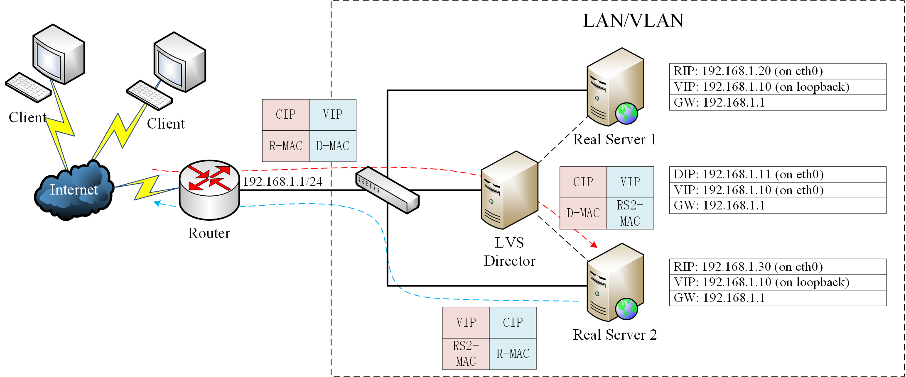
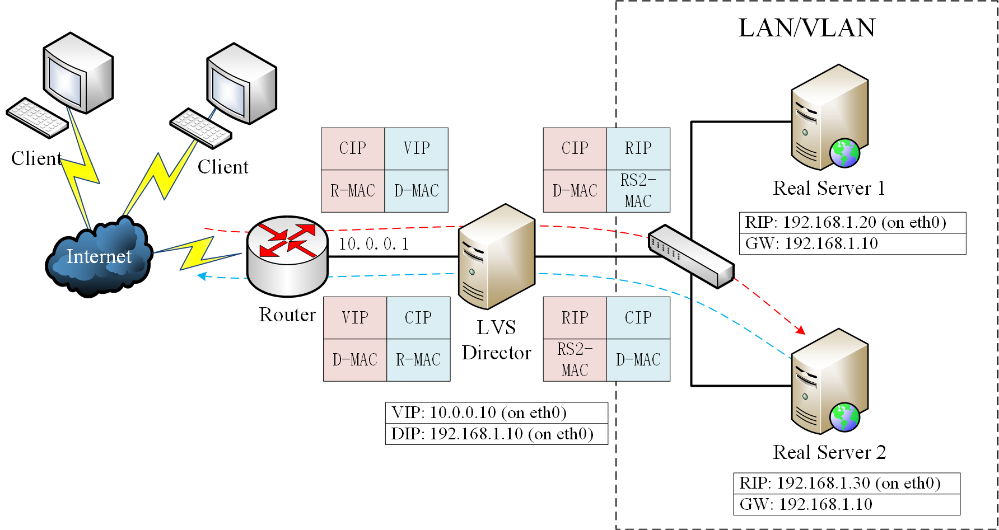
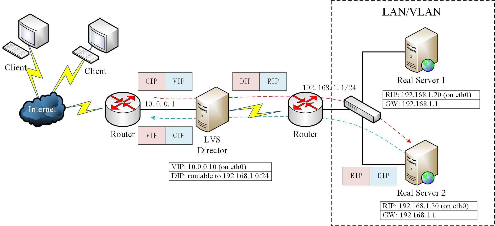
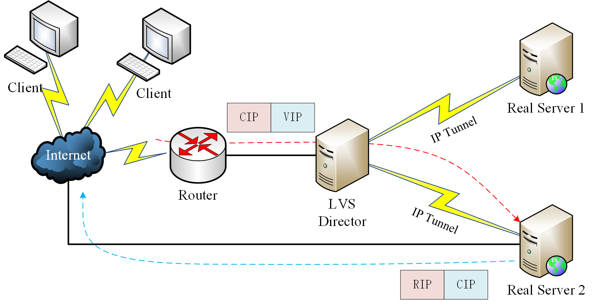

# Linux 内核负载均衡

Linux Virtual Server (lvs)  是一个虚拟的服务器集群系统，是 Linux 内核自带的负载均衡器，也是目前性能最好的软件负载均衡器之一。LVS 包括 `ipvs` 内核模块和 `ipvsadm` 命令行工具两部分。

在 LVS 中，节点分为 Director Server 和 Real Server 两个角色，其中 Director Server 是负载均衡器所在节点，而 Real Server 则是后端服务节点。

## 基本概念
|         术语/缩写         | 解释                                                         |
| :-----------------------: | ------------------------------------------------------------ |
|      Client Computer      | 请求服务的客户端                                             |
|       LVS Director        | 负载均衡器接收客户端服务请求，并均衡到特定的“真实服务器”以处理请求。 |
|     RS (Real Server)      | 负载均衡器背后用于代表该 LVS 集群提供服务的真实服务器。      |
| VIP (Virtual IP address)  | Director 用于向客户端提供服务的 IP 地址                      |
|   RIP (Real IP address)   | RS 的真实 IP 地址                                            |
| DIP (Director IP address) | Director 用于和 RS 通信的 IP 地址                            |
|  CIP (Client IP address)  | 客户端的 IP 地址                                             |

# 调度器 (Scheduler)
LVS 实现了多种负载均衡调度器，常用的包括：
- Round-robin (ip_vs_rr.c)：轮询将收到的访问请求按照顺序轮流调度到不同的服务器上，不管后端真实服务器的实际连接数和系统负载。
- Weighted round-robin (ip_vs_wrr.c)：加权轮询给 RS 设置权重，权重越高，那么分发的请求数越多，权重的取值范围0–100。根据每台服务器的性能，给每台服务器添加权值，如果 RS1 的权值为 1，RS2 的权值为 2，那么调度到 RS2 的请求会是 RS1 的 2 倍。权值越高的服务器，处理的请求越多。这种算法是对 rr 算法的一种优化和补充。
- Least-connection (ip_vs_lc.c)：最少链接根据后端 RS 的连接数来决定把请求分发给谁，RS1 连接数比 RS2 连接数少，那么请求就优先发给 RS1。
- Weighted least-connection (ip_vs_wlc.c)：上述的一种补充。

其他算法包括：
- Locality-based least-connection (ip_vs_lblc.c)
- Locality-based least-connection with replication (ip_vs_lblcr.c)
- Destination hashing (ip_vs_dh.c)
- Source hashing (ip_vs_sh.c)
- Shortest expected delay (ip_vs_sed.c)
- Never queue (ip_vs_nq.c)

# 转发模式
LVS 可以基于多种方式工作，主要包括：
- 直接路由 (DR)
- 网络地址转换 (NAT)
- 完全网络地址转换 (FullNAT)
- IP 隧道 (IP Tunneling)

LVS 不同的转发方式具有不同的网络架构，也导致了不同的性能。

## Virtual Server via Direct Routing
直接路由 (DR) 的特点是：LVS 和 RS 在同一个 LAN/VLAN，多个 RS 和 LVS 共用同一个 VIP，然后依据 MAC 地址来在 LVS 和多个 RS 之间转发。

具体流程为：入站请求走 LVS，LVS 修改目的 MAC，将其转发给真正的 RS，RS 的回复报文绕过 LVS 直接发给 Client。具体数据包流向如下图所示。其中 LVS 和 RS 虽然有虚线连接，但只表示逻辑上的连接，实际数据包是通过交换机转发的。

由于大部分情况下都是请求包小，回复包大，LVS 不容易成为流量瓶颈，同时 LVS 只需要修改进来的包的 MAC 地址，因此 DR 模式性能很好。

但同时这种模式也具有明显的缺点：
- 要求 LVS 和 RS 在同一个 LAN/VLAN，扩展性不够好。
- RS 需要配置 VIP 同时特殊处理 ARP。
- 配置比较复杂（需要将 VIP 配置到 lo 接口，避免直接将请求发到 RS）。
- 不支持端口映射。

## Virtual Server via NAT
NAT 模式基于 NAT 技术完成转发，类似于 NAT 路由器的功能，只不过多了负载均衡的过程，这种方式配置简单，支持端口映射（看名字就知道），并且 RIP 一般是私有地址。其数据包流向如下图所示：

这种模式的缺点为：
- LVS 必须有一个接口和所有 RS 在同一个 LAN/VLAN。
- 进出流量都要走 LVS 转发，LVS 容易成为瓶颈。
- 一般而言需要将 LVS 配置成 RS 的网关。

## Virtual Server via FullNAT
完全 NAT 模式是 NAT 模式的一个变种，与 NAT 模式不同，FullNAT 模式不仅将目的 IP 修改为 RIP，并且将源 IP 修改为 DIP，这样 DIP 和 RIP 不必非得在同一个二层网络之中，两者只需要 IP 互通即可。

但这种模式也有缺点：
- RS 看不到 CIP（NAT 模式下可以看到）。
- 进出流量还是都走的 LVS，容易成为瓶颈（跟 NAT 一样都有这个问题）。


因为 CIP 被修改掉了，RS 只能看到 LVS 的 DIP，可将 CIP 放入 TCP 包的 Option 中传递给 RS，RS 上一般部署自己写的模块来从 Options 中读取 CIP，这样 RS 能看到 CIP 了, 当然这不是一个开源的通用方案。


## Virtual Server via IP Tunneling
IP 隧道模式利用了 IP 隧道技术来打通 LVS 和 RS 之间的通信。当请求包到达 LVS 后，LVS 将请求包封装成一个新的 IP 报文，新的 IP 包的目的 IP 是某一 RS 的 IP，然后转发给 RS，RS 收到报文后 IPIP 内核模块解封装，取出用户的请求报文发现目的 IP 是 VIP，而自己的 tun 虚拟网卡上配置了这个 IP，从而愉快地处理请求并将结果直接发送给客户。

这种方式的运行过程十分类似于 DR 模式，只不过 DR 模式基于 MAC 转发，而 IP 隧道模式基于 IPIP 协议路由。

这种方式的优点是：
- 集群节点可以跨二层。
- 跟 DR 一样，响应报文直接发给 Client，LVS 没有性能瓶颈。

同时也存在了一定的缺点：
- RS 上必须安装运行 IPIP 模块。
- 多增加了一个 IP 头，增加了开销。
- LVS 和 RS 上的 tun 虚拟网卡上配置同一个 VIP（类似 DR）。

# 四层 LB vs 七层 LB
LVS 通常用来实现四层负载均衡，通过发布虚拟 VIP 和四层的端口号，来决定哪些流量需要做负载均衡。

七层的负载均衡就是基于虚拟的 URL 或主机 IP 的负载均衡：在四层负载均衡的基础上，再考虑应用层的特征，比如同一个 Web 服务器的负载均衡，除了根据 VIP 加端口辨别是否需要处理的流量，还可根据七层的 URL、浏览器类别、语言来决定是否要进行负载均衡。

实现七层负载均衡的软件有：
- nginx：只在 http 协议和 mail 协议上功能比较好，性能与 haproxy 差不多。
- tengine：阿里基于 nginx 的开源七层 LB。
- haproxy
- apache

除此之外，还有二层负载均衡和三层负载均衡，由于应用程度不广泛，故不再讨论。

# 参考
- [LVS Documentation](http://www.linuxvirtualserver.org/Documents.html)
- [LVS wikepedia](https://en.wikipedia.org/wiki/Linux_Virtual_Server)
- [DR mode of LVS load balancing cluster deployment](https://programmer.group/dr-mode-of-lvs-load-balancing-cluster-deployment.html)
