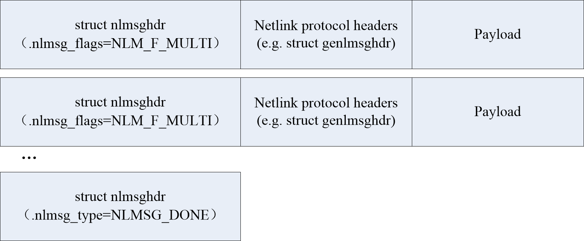

# Netlink

## Netlink 简介

Linux 系统将内存空间分为内核空间和用户空间，内核运行在内核空间中，应用程序运行在用户空间中。Netlink 协议是基于套接字的进程间通信（IPC）机制，它可用于**用户空间进程**和**内核**之间或者**用户空间进程之间**的**双向数据传输**。

当应用程序需要获取内核参数，或者与内核进行通信时，可以采用 Netlink 协议。另外，Linux 上还有其他方式可以实现与内核交互：

- `ioictl()` 系统调用：C 标准库中有同名的 wrapper 函数可以直接使用。
- `procfs` proc 虚拟文件系统：这是个文件系统，通常是挂载到 `/proc`，允许内核以文件的形式向用户空间输出内部信息，这些文件并没有实际存在于磁盘中，但是可以通过 cat 以及 > shell 重定向运算符写入。例如 `/proc/net/` 下存放了和网络有关的参数，例如路由表等。特别的，`/proc/sys` 接口提供了一种在用户空间读取或修改内核变量的值的方式，其同名 wrapper 函数和命令 `sysctl` 可以直接使用。

相对于其他用户和内核通信方式，Netlink 具有以下优点：

- Netlink 是一种**异步通信机制**，并且是双向通信的。
- 使用 Netlink 的内核部分可以采用模块的方式实现。

Netlink 套接字是网络应用程序与内核通信时最新的首选机制，IPROUTE2 包中大多数命令（`ip`）都使用此接口。对 Linux 而言，Netlink 代表的就是 BSD 世界中的路由套接字 (routing socket)，但 Netlink 的应用却不只包括网络应用程序。

Netlink 常见应用场景：

- 用户空间的进程和内核的通信： Netlink 最常见的应用场景就是用户空间应用程序发送请求给内核，比如设置或者读取接口的 IP 地址，然后接受并处理内核返回的信息，这个回复信息要么是请求出错的信息，要么就是请求成功的通知信息。
- 用户空间内进程之间的通信： Netlink 也可以直接作为用户空间应用程序之间的进程间通信机制，但这种方式并不常见，通常会代之以 Unix 域套接字。 Netlink 并不限制在两个对等通信节点之间，任意一个节点都可以和其他的对等点进行通信，并且 Netlink 支持多播，即一条消息可以由多个节点同时接收到。
- 侦听内核的多播通知：此类 Netlink 通信是一种非常常见的应用方式，此方式可以让用户空间那些需要处理特定内核事件的的守护进程侦听内核反馈的消息或事件。这些应用程序进程通常会订阅内核使用的某个多播组，内核则在某些事件发生的时候通过它来通知订阅该组播组的进程。

## Netlink 协议族

Netlink 的早期实现是用于程序与内核中的固定系统进行通信，例如与网络、音频等系统。因此，Netlink 协议族包含了许多 Netlink 协议，它们被用于与不同的子系统进行通信，这些协议都是预定义好的，称为经典 Netlink 协议（Classic Netlink），主要定义在 `Netlink.h` 中。使用这些协议时，通信的双方是应用程序和预定义的内核子系统。

```c
#define NETLINK_ROUTE 0     /* Routing/device hook                */
#define NETLINK_UNUSED 1    /* Unused number                */
#define NETLINK_USERSOCK 2  /* Reserved for user mode socket protocols     */
#define NETLINK_FIREWALL 3  /* Unused number, formerly ip_queue        */
#define NETLINK_SOCK_DIAG 4 /* socket monitoring                */
#define NETLINK_NFLOG 5     /* netfilter/iptables ULOG */
#define NETLINK_XFRM 6      /* ipsec */
#define NETLINK_SELINUX 7   /* SELinux event notifications */
#define NETLINK_ISCSI 8     /* Open-iSCSI */
#define NETLINK_AUDIT 9     /* auditing */
#define NETLINK_FIB_LOOKUP 10
#define NETLINK_CONNECTOR 11
#define NETLINK_NETFILTER 12 /* netfilter subsystem */
#define NETLINK_IP6_FW 13
#define NETLINK_DNRTMSG 14        /* DECnet routing messages */
#define NETLINK_KOBJECT_UEVENT 15 /* Kernel messages to userspace */
```

为了支持内核模块的动态注册和退出，Netlink 引入了通用 Netlink 协议（Generic Netlink）。通过 Generic Netlink，用户可以在自己编写的内核模块和用户空间程序之间使用自定义协议通信。

```c
#define NETLINK_GENERIC 16
```

## Netlink 套接字

### 用户态

用户态应用使用标准的 socket API 就可以使用 Netlink 提供的强大功能。

```c
#include <asm/types.h>
#include <sys/socket.h>
#include <linux/Netlink.h>

Netlink_socket = socket(AF_NETLINK, SOCK_RAW, Netlink_family);
```

其中 `Netlink_family` 表示了 Netlink 通信使用的协议。在 Linux 中已经预先定义了许多协议供用户使用，如前文所述。

Netlink socket 的使用和传统 socket 十分接近，大致类似于：

```c
fd = socket(AF_NETLINK, SOCK_RAW, NETLINK_GENERIC);

/* format the request */
send(fd, &request, sizeof(request));
n = recv(fd, &response, RSP_BUFFER_SIZE);
/* interpret the response */
```

### 内核态

与用户态程序不同，内核态程序需要使用专门的内核 API 来使用 Netlink。

```c
struct sock *Netlink_kernel_create(
    struct net *net, int unit, struct Netlink_kernel_cfg *cfg);
```

## Netlink 寻址

Netlink 协议是基于套接字的进程间通信（IPC）机制，它的寻址方案是基于 32 位的**端口号**（之前被称为 PID），此端口号用于唯一地标识每一个对等通信节点。端口 0 保留给内核使用，表示每个 Netlink 协议簇中内核部分的套接字，其他的端口则通常指的是用户空间的套接字。

注意： 最初通常使用进程标识符（PID）作为本地端口号，但这种方式随着线程化 Netlink 应用程序的引入而失效，因为这类进程需要多个套接字。为解决此项冲突，libnl 以进程标识符为基数再加上一个偏移量来生成唯一的端口号，此方式可以让一个进程使用多个套接字。出于向后兼容方面的考虑，第一个套接字还是以进程标识符作为端口号。

Netlink 使用 `sockaddr_nl` 结构体来表示地址。

```c
struct sockaddr_nl {
    sa_family_t     nl_family;  /* AF_NETLINK */
    unsigned short  nl_pad;     /* Zero */
    pid_t           nl_pid;     /* Port ID */
    __u32           nl_groups;  /* Multicast groups mask */
};
```

`nl_pid` 为单播通信端口号，用于唯一标识一个单播通信实体。

作为本地地址时：如果置 0，则内核自动使用进程 PID 来进行填充，如果用户在 bind 前为该变量赋值，则由应用程序保证该值的唯一性。

```c
memset(&src_addr, 0, sizeof(src_addr));
src_addr.nl_family = AF_NETLINK;
src_addr.nl_pid = getpid(); /* self pid */        // this line can be omitted
bind(sock_fd, (struct sockaddr *)&src_addr, sizeof(src_addr));
```

作为对端地址时：如果目的是内核则填 0，如果是用户应用则填写该 nl_pid 值。

```c
memset(&dest_addr, 0, sizeof(dest_addr));
dest_addr.nl_family = AF_NETLINK;
dest_addr.nl_pid = 0; /* For Linux Kernel */
sendto(sock_fd, ..., ..., 0, (struct sockaddr *)&dest_addr, sizeof(dest_addr));
```

以上是 Netlink 单播通信，其中 `nl_groups` 应当设为 0。但 Netlink 还支持 Netlink 组通信。内核模块或用户应用可以把消息多播给一个 Netlink 组，属于该 neilink 组的任何内核模块或应用都能接收到该消息，内核事件向用户态的通知机制就使用了这一特性。

`nl_groups` 为组播通信组掩码，某位为 1 表示希望加入该组。由于位数限制，因此 Netlink 最多具有 32 个组。目前 ROUTE Netlink 组定义位于 `rtNetlink.h`，格式为 `RTMGRP_*`，以下是常用的几个：

- RTMGRP_LINK - 当网卡变动时会触发这个多播组，例如插拔网线、增减网卡设备、启用禁用接口等。
- RTMGRP_IPV4_IFADDR - 当 ipv4 地址变动时会触发这个多播组，例如修改 IP。
- RTMGRP_IPV4_ROUTE - 当 ipv4 路由变动时会触发这个多播组。

?> 只有 root 用户可以对组进行 send 或者 listen 操作。从 Linux 3 开始，NETLINK_KOBJECT_UEVENT, NETLINK_GENERIC, NETLINK_ROUTE 和 NETLINK_SELINUX 组允许其他用户接收消息，但所有组都不允许其他用户发送消息。

## Netlink 消息

Netlink 协议是基于消息的，消息由字节流表示，由一个或多个 `nlmsghdr` Netlink 消息头部及其有效载荷构成。与 IP 协议栈中嵌套的头部（Ethernet > IP > TCP）类似，Netlink 消息头部后面可能还存在 Netlink 协议相关头部，例如 Gerneric Netlink 使用的 `genlmsghdr`。



如果字节流中包含多条消息，则最后一条消息的类型为 `NLMSG_DONE`，其余所有消息的 nlmsg_flags 属性都被设置 `NLM_F_MULTI` 有效。

### 消息宏定义

Netlink 消息的操作一般通过标准 `NLMSG_*` 宏完成，具体包括：

```c
// 对齐字节数
#define NLMSG_ALIGNTO    4U
// 得到 len 字节进行 4 字节对齐后实际占用的字节数
#define NLMSG_ALIGN(len) ( ((len)+NLMSG_ALIGNTO-1) & ~(NLMSG_ALIGNTO-1) )
// 获取消息头长度
#define NLMSG_HDRLEN     ((int) NLMSG_ALIGN(sizeof(struct nlmsghdr)))
// 获取具有 len 字节数据的整个消息的真实长度
#define NLMSG_LENGTH(len) ((len) + NLMSG_HDRLEN)
// 获取具有 len 字节数据的消息实际占用的字节数（字节对齐）
#define NLMSG_SPACE(len) NLMSG_ALIGN(NLMSG_LENGTH(len))
// 获取数据部分首地址
#define NLMSG_DATA(nlh)  ((void*)(((char*)nlh) + NLMSG_LENGTH(0)))
// 得到下一个消息首地址，同时 len 变为剩余长度
#define NLMSG_NEXT(nlh,len)     ((len) -= NLMSG_ALIGN((nlh)->nlmsg_len), \
                  (struct nlmsghdr*)(((char*)(nlh)) + NLMSG_ALIGN((nlh)->nlmsg_len)))
// 判断是否是合法消息
#define NLMSG_OK(nlh,len) ((len) >= (int)sizeof(struct nlmsghdr) && \
               (nlh)->nlmsg_len >= sizeof(struct nlmsghdr) && \
               (nlh)->nlmsg_len <= (len))
// 得到减去 len 字节对齐长度后剩余数据长度。一般用于多消息字节流，每次减去一个消息长度。
#define NLMSG_PAYLOAD(nlh,len) ((nlh)->nlmsg_len - NLMSG_SPACE((len)))
```

初始化一个包含 hello 字符串的 Netlink 消息的简单步骤为：

```c
nlh = (struct nlmsghdr *)malloc(NLMSG_SPACE(MAX_PAYLOAD));
memset(nlh, 0, NLMSG_SPACE(MAX_PAYLOAD));
nlh->nlmsg_len = NLMSG_SPACE(MAX_PAYLOAD);
nlh->nlmsg_pid = getpid();
nlh->nlmsg_flags = 0;
strcpy(NLMSG_DATA(nlh), "Hello");
```

Netlink 消息可以通过 `sendto` 函数发送。

```c
sendto(nl->sock, &nlh, nlh.nlmsg_len, 0, (struct sockaddr *)&dest_addr, sizeof(dest_addr))
```

### 消息格式

Netlink 消息头部格式如下：

```c
struct nlmsghdr {
      __u32   nlmsg_len;      /* Length of message including headers */
      __u16   nlmsg_type;     /* Generic Netlink Family (subsystem) ID */
      __u16   nlmsg_flags;    /* Flags - request or dump */
      __u32   nlmsg_seq;      /* Sequence number */
      __u32   nlmsg_pid;      /* Port ID, set to 0 */
};
```

- 总长度：消息包括 Netlink 消息头部在内的总字节数。
- 消息类型：消息类型指明了消息的有效载荷的类型。Netlink 协议定义了多个标准的消息类型。每个协议簇都可能定义了额外的消息类型。
- 消息标志：消息标志可以用来更改消息类型的行为。
- 序列号：Netlink 允许通过序列号来关联回复和请求。需要注意的是，这里的序列号和 TCP 这类的协议的序列号是不一样的，Netlink 的序列号并不强制使用。序列号唯一的用途就是把一条应答消息和相应的请求消息联系起来，序列号是以单个套接字为基础来管理。例如一条错误消息中可以引用导致错误的那条请求消息。
- 端口号：端口号指明了这条消息需要发往哪个对等节点。如果没有指定端口号，那么这条消息会被投递给同一个协议簇中第一个匹配的内核端套接字。

### 消息类型

Netlink 在请求消息（requests）、通知消息（notifications）和应答消息（replies）的 处理上是有区别的。请求消息设有 NLM_F_REQUEST 标志位，它用来向接收方请求某种响应 。一般来说请求消息都是从用户空间发送到内核的。虽然不是强制规定，但每次发送的请求 消息序列号都应该是上一个序列号加一。

由于请求自身的特性，接收方在收到请求消息之后可能会发送另一条 Netlink 消息来响应 这个请求。应答消息的序列号必须和它响应的那条请求消息的序列号一致。

通知消息则没有那么严谨，它不需要应答，所以序列号通常是被设置成 0 的。

消息的类型主要是由消息头部中 16 位的消息类型字段确定的。Netlink 定义了如下标准消息类型：

- NLMSG_NOOP - 无需任何操作，消息必须被丢弃
- NLMSG_ERROR - 错误消息或者是 ACK，
- NLMSG_DONE - 分段序列的结束
- NLMSG_OVERRUN - 通知消息越界错误

### 消息标志

NLM_F_REQUEST - 请求消息
NLM_F_MULTI - 分片消息
NLM_F_ACK - 请求了 ACK 回复
NLM_F_ECHO - 请求回应这个请求消息。

NLM_F_ROOT - 返回树的根节点。
NLM_F_MATCH - 返回所有匹配的节点。
NLM_F_ATOMIC - 已废弃，以前用来请求一个原子操作
NLM_F_DUMP - 返回一个含有所有对象的列表（NLM_F_ROOT|NLM_F_MATCH）

NLM_F_REPLACE - 如果对象存在的话，替换它。
NLM_F_EXCL - 如果这个对象存在的话，就不用更新它。
NLM_F_CREATE - 如果对象不存在的话，创建它。
NLM_F_APPEND - 在对象列表的末尾添加新的对象。

## Netlink 示例

### 用户代码

```c
#include <linux/Netlink.h>
#include <stdio.h>
#include <stdlib.h>
#include <string.h>
#include <sys/socket.h>
#include <unistd.h>

#define NETLINK_USER 31

#define MAX_PAYLOAD 1024 /* maximum payload size*/
struct sockaddr_nl src_addr, dest_addr;
struct nlmsghdr *nlh = NULL;
struct iovec iov;
int sock_fd;
struct msghdr msg;

int main()
{
    sock_fd = socket(PF_NETLINK, SOCK_RAW, NETLINK_USER);
    if (sock_fd < 0)
        return -1;

    memset(&src_addr, 0, sizeof(src_addr));
    src_addr.nl_family = AF_NETLINK;
    src_addr.nl_pid = getpid(); /* self pid */

    bind(sock_fd, (struct sockaddr *)&src_addr, sizeof(src_addr));

    memset(&dest_addr, 0, sizeof(dest_addr));
    dest_addr.nl_family = AF_NETLINK;
    dest_addr.nl_pid = 0; /* For Linux Kernel */
    dest_addr.nl_groups = 0; /* unicast */

    nlh = (struct nlmsghdr *)malloc(NLMSG_SPACE(MAX_PAYLOAD));
    memset(nlh, 0, NLMSG_SPACE(MAX_PAYLOAD));
    nlh->nlmsg_len = NLMSG_SPACE(MAX_PAYLOAD);
    nlh->nlmsg_pid = getpid();
    nlh->nlmsg_flags = 0;

    strcpy(NLMSG_DATA(nlh), "Hello");

    iov.iov_base = (void *)nlh;
    iov.iov_len = nlh->nlmsg_len;
    msg.msg_name = (void *)&dest_addr;
    msg.msg_namelen = sizeof(dest_addr);
    msg.msg_iov = &iov;
    msg.msg_iovlen = 1;

    printf("Sending message to kernel\n");
    sendmsg(sock_fd, &msg, 0);
    printf("Waiting for message from kernel\n");

    /* Read message from kernel */
    recvmsg(sock_fd, &msg, 0);
    printf("Received message payload: %s\n", NLMSG_DATA(nlh));
    close(sock_fd);
}
```

### 内核代码

```c
#include <linux/module.h>
#include <net/sock.h> 
#include <linux/Netlink.h>
#include <linux/skbuff.h> 
#define NETLINK_USER 31

struct sock *nl_sk = NULL;

static void hello_nl_recv_msg(struct sk_buff *skb)
{

    struct nlmsghdr *nlh;
    int pid;
    struct sk_buff *skb_out;
    int msg_size;
    char *msg = "Hello from kernel";
    int res;

    printk(KERN_INFO "Entering: %s\n", __FUNCTION__);

    msg_size = strlen(msg);

    nlh = (struct nlmsghdr *)skb->data;
    printk(KERN_INFO "Netlink received msg payload:%s\n", (char *)nlmsg_data(nlh));
    pid = nlh->nlmsg_pid; /*pid of sending process */

    skb_out = nlmsg_new(msg_size, 0);
    if (!skb_out) {
        printk(KERN_ERR "Failed to allocate new skb\n");
        return;
    }

    nlh = nlmsg_put(skb_out, 0, 0, NLMSG_DONE, msg_size, 0);
    NETLINK_CB(skb_out).dst_group = 0; /* not in mcast group */
    strncpy(nlmsg_data(nlh), msg, msg_size);

    res = nlmsg_unicast(nl_sk, skb_out, pid);
    if (res < 0)
        printk(KERN_INFO "Error while sending bak to user\n");
}

static int __init hello_init(void)
{

    printk("Entering: %s\n", __FUNCTION__);
    //nl_sk = Netlink_kernel_create(&init_net, NETLINK_USER, 0, hello_nl_recv_msg, NULL, THIS_MODULE);
    struct Netlink_kernel_cfg cfg = {
        .input = hello_nl_recv_msg,
    };

    nl_sk = Netlink_kernel_create(&init_net, NETLINK_USER, &cfg);
    if (!nl_sk) {
        printk(KERN_ALERT "Error creating socket.\n");
        return -10;
    }

    return 0;
}

static void __exit hello_exit(void)
{

    printk(KERN_INFO "exiting hello module\n");
    Netlink_kernel_release(nl_sk);
}

module_init(hello_init); module_exit(hello_exit);

MODULE_LICENSE("GPL");
```

其中内核模块程序可以通过以下 Makefile 编译链接，然后通过 `insmod hello.ko` 来载入。

```makefile
obj-m = hello.o
KVERSION = $(shell uname -r)
all:
    make -C /lib/modules/$(KVERSION)/build M=$(PWD) modules
clean:
    make -C /lib/modules/$(KVERSION)/build M=$(PWD) clean
```

## NETLINK_ROUTE

这段代码定义了一个枚举类型 rtattr_type_t，其中包含了 Netlink Route 子系统中所支持的属性类型。具体说明如下：

- RTA_UNSPEC：未指定类型
- RTA_DST：目标网络地址
- RTA_SRC：源网络地址
- RTA_IIF：路由表项输入网络接口索引
- RTA_OIF：路由表项输出网络接口索引
- RTA_GATEWAY：网关地址
- RTA_PRIORITY：路由表项优先级
- RTA_PREFSRC：首选源地址
- RTA_METRICS：度量值
- RTA_MULTIPATH：多路径
- RTA_PROTOINFO：协议信息（已不再使用）
- RTA_FLOW：流量控制
- RTA_CACHEINFO：缓存信息
- RTA_SESSION：会话信息（已不再使用）
- RTA_MP_ALGO：多路径算法（已不再使用）
- RTA_TABLE：路由表编号
- RTA_MARK：标记
- RTA_MFC_STATS：多播转发统计信息
- RTA_VIA：途经中间节点
- RTA_NEWDST：新的目标网络地址
- RTA_PREF：首选路由项
- RTA_ENCAP_TYPE：封装类型
- RTA_ENCAP：封装数据
- RTA_EXPIRES：过期时间
- RTA_PAD：填充
- RTA_UID：用户ID
- RTA_TTL_PROPAGATE：TTL传播
- RTA_IP_PROTO：IP协议
- RTA_SPORT：源端口
- RTA_DPORT：目标端口
- __RTA_MAX：最大值

- struct rtmsg *rtm; 后面跟着 rtattr
- struct ndmsg *ndm; 后面跟着 rtattr

### 监测网卡示例

```c
#include <arpa/inet.h>
#include <errno.h>
#include <linux/rtnetlink.h>
#include <memory.h>
#include <net/if.h>
#include <stdio.h>
#include <sys/socket.h>

// little helper to parsing message using netlink macroses
void parseRtattr(struct rtattr* tb[], int max, struct rtattr* rta, int len) {
    memset(tb, 0, sizeof(struct rtattr*) * (max + 1));

    while (RTA_OK(rta, len)) { // while not end of the message
        if (rta->rta_type <= max) {
            tb[rta->rta_type] = rta; // read attr
        }
        rta = RTA_NEXT(rta, len); // get next attr
    }
}

int main() {
    int fd = socket(AF_NETLINK, SOCK_RAW, NETLINK_ROUTE); // create netlink socket

    if (fd < 0) {
        printf("Failed to create netlink socket: %s\n", (char*)strerror(errno));
        return 1;
    }

    struct sockaddr_nl local;  // local addr struct
    char buf[8192];            // message buffer
    struct iovec iov;          // message structure
    iov.iov_base = buf;        // set message buffer as io
    iov.iov_len = sizeof(buf); // set size

    memset(&local, 0, sizeof(local));

    local.nl_family = AF_NETLINK;                                           // set protocol family
    local.nl_groups = RTMGRP_LINK | RTMGRP_IPV4_IFADDR | RTMGRP_IPV4_ROUTE; // set groups we interested in
    local.nl_pid = getpid();                                                // set out id using current process id

    // initialize protocol message header
    struct msghdr msg;
    {
        msg.msg_name = &local;           // local address
        msg.msg_namelen = sizeof(local); // address size
        msg.msg_iov = &iov;              // io vector
        msg.msg_iovlen = 1;              // io size
    }

    if (bind(fd, (struct sockaddr*)&local, sizeof(local)) < 0) { // bind socket
        printf("Failed to bind netlink socket: %s\n", (char*)strerror(errno));
        close(fd);
        return 1;
    }

    // read and parse all messages from the
    while (1) {
        ssize_t status = recvmsg(fd, &msg, MSG_DONTWAIT);

        //  check status
        if (status < 0) {
            if (errno == EINTR || errno == EAGAIN) {
                usleep(250000);
                continue;
            }

            printf("Failed to read netlink: %s", (char*)strerror(errno));
            continue;
        }

        if (msg.msg_namelen != sizeof(local)) { // check message length, just in case
            printf("Invalid length of the sender address struct\n");
            continue;
        }

        // message parser
        struct nlmsghdr* h;

        for (h = (struct nlmsghdr*)buf; status >= (ssize_t)sizeof(*h);) { // read all messagess headers
            int len = h->nlmsg_len;
            int l = len - sizeof(*h);
            char* ifName;

            if ((l < 0) || (len > status)) {
                printf("Invalid message length: %i\n", len);
                continue;
            }

            // now we can check message type
            if ((h->nlmsg_type == RTM_NEWROUTE) || (h->nlmsg_type == RTM_DELROUTE)) { // some changes in routing table
                printf("Routing table was changed\n");
            } else { // in other case we need to go deeper
                char* ifUpp;
                char* ifRunn;
                struct ifinfomsg* ifi; // structure for network interface info
                struct rtattr* tb[IFLA_MAX + 1];

                ifi = (struct ifinfomsg*)NLMSG_DATA(h); // get information about changed network interface

                parseRtattr(tb, IFLA_MAX, IFLA_RTA(ifi), h->nlmsg_len); // get attributes

                if (tb[IFLA_IFNAME]) {                         // validation
                    ifName = (char*)RTA_DATA(tb[IFLA_IFNAME]); // get network interface name
                }

                if (ifi->ifi_flags & IFF_UP) { // get UP flag of the network interface
                    ifUpp = (char*)"UP";
                } else {
                    ifUpp = (char*)"DOWN";
                }

                if (ifi->ifi_flags & IFF_RUNNING) { // get RUNNING flag of the network interface
                    ifRunn = (char*)"RUNNING";
                } else {
                    ifRunn = (char*)"NOT RUNNING";
                }

                char ifAddress[256];   // network addr
                struct ifaddrmsg* ifa; // structure for network interface data
                struct rtattr* tba[IFA_MAX + 1];

                ifa = (struct ifaddrmsg*)NLMSG_DATA(h); // get data from the network interface

                parseRtattr(tba, IFA_MAX, IFA_RTA(ifa), h->nlmsg_len);

                if (tba[IFA_LOCAL]) {
                    inet_ntop(AF_INET, RTA_DATA(tba[IFA_LOCAL]), ifAddress, sizeof(ifAddress)); // get IP addr
                }

                switch (h->nlmsg_type) { // what is actually happenned?
                case RTM_DELADDR:
                    printf("Interface %s: address was removed\n", ifName);
                    break;

                case RTM_DELLINK:
                    printf("Network interface %s was removed\n", ifName);
                    break;

                case RTM_NEWLINK:
                    printf("New network interface %s, state: %s %s\n", ifName, ifUpp, ifRunn);
                    break;

                case RTM_NEWADDR:
                    printf("Interface %s: new address was assigned: %s\n", ifName, ifAddress);
                    break;
                }
            }

            status -= NLMSG_ALIGN(len); // align offsets by the message length, this is important

            h = (struct nlmsghdr*)((char*)h + NLMSG_ALIGN(len)); // get next message
        }

        usleep(250000); // sleep for a while
    }

    close(fd); // close socket

    return 0;
}
```

### 路由表

### MAC 转发表

### 邻居表

## NETLINK_GENERIC

## NETLINK_NETFILTER

## 参考

- [Introduction to Netlink](https://www.kernel.org/doc/html/next/userspace-api/Netlink/intro.html)
- [Monitoring Linux networking state using Netlink](https://olegkutkov.me/2018/02/14/monitoring-linux-networking-state-using-Netlink/)
- [How to use Netlink socket to communicate with a kernel module?](https://stackoverflow.com/questions/3299386/how-to-use-Netlink-socket-to-communicate-with-a-kernel-module)
- [man 7 netlink](https://www.man7.org/linux/man-pages/man7/netlink.7.html)
