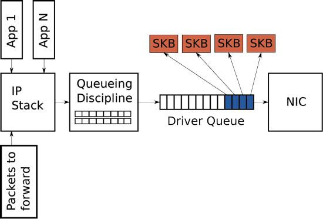
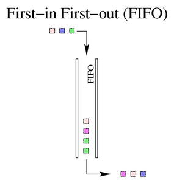
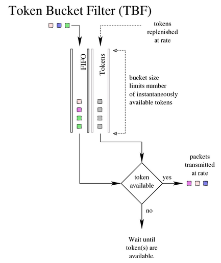

# Linux 内核流量控制

流量控制 (Traffic Control, TC) 是 Linux 内核提供的流量限速、整形和策略控制机制。它以 qdisc-class-filter 的树形结构来实现对流量的分层控制。

## 流量控制概念
- 整形 (Shaping)：整形器（shaper）是将数据包延迟，从而使得数据包传输速度满足特定速率。

- 调度 (Scheduling)：调度器（scheduler）负责数据包如何在队列中组织。

- 分类 (Classifying)：分类器（classifying）将流量分类到不同队列中。

- 策略 (Policing)：策略器在特定队列中测量和限制流量。
- 丢弃 (Dropping)：丢弃机制可以将整个数据包、整个流或是整个分类都丢弃掉。
- 标记 (Marking)：标记是一种更改数据包的机制。

## 流量控制组件
对于流量控制而言，Linux 内核通过几个组件直接或间接的实现了流量控制的若干元素概念。主要以 `qdisc-class-filter` 的树形结构来实现对流量的分层控制。

| 传统元素           | Linux 组件                                                   |
| ------------------ | ------------------------------------------------------------ |
| 整形 (Shaping)     | class 提供整形功能                                           |
| 调度 (Scheduling)  | qdisc 是调度器，可以是简单的 FIFO，也可以是复杂的包含 class 和其他 qdiscs 的 HTB。 |
| 分类 (Classifying) | filter 对象通过 classifier 对象的代理执行分类功能。          |
| 策略 (Policing)    | policer 作为 filter 的一部分存在。                           |
| 丢弃 (Dropping)    | 要丢弃流量，需要使用带有“丢弃”动作的 policer 配合 filter 进行过滤。 |
| 标记 (Marking)     | dsmark qdisc 用于标记。                                      |

### 队列调度 (qdisc)

qdisc 是一个调度器，每个输出接口都有一种调度器，默认是 FIFO。Linux 下可用的其他 qdiscs 将根据该调度器的规则重新排列进入调度器队列的数据包。

qdisc 是流量控制的主要组成部分，也称为队列规则 (queuing discipline)，根据有无层级可以划分为两种：
- 分类 qdiscs 可以包括 class，并且提供附加 filter 的接口。
    - 分层令牌桶 (HTB, Hierarchical Token Bucket)
- 无类 qdiscs 不能包含任何 class，也无法将 filter 附加到无类 qdisc。
    - 先入先出队列 (FIFO, First-In First-Out)
    - 快速 FIFO 队列 (pfifo_fast)
    - 随机公平队列 (SFQ, Stochastic Fair Queuing)
    - 令牌桶过滤 (TBF, Token Bucket Filter)

每个接口都包括两个端口：
- egress 用于 outbound traffic
- ingress 用于 inbound traffic

其中，主流和常用的是 egress qdisc，也称为 root qdisc。

对于接口上接受的流量，将进入 ingress qdisc，它不允许创建任何子类，而仅作为可附加过滤器的对象存在。出于实际目的，入口 qdisc 只是一个方便的对象，在其上附加了策略器以限制网络接口上接受的流量。

简而言之，egress qdisc 可以进行更多操作，因为它包含真实的 qdisc 和流量控制系统的全部功能。ingress qdisc 只能支持 policer。

### 类 (class)
class 只存在于分类 qdisc 中，class 可以包括多个子类或者一个独立的子队列。

任何类都可以附加任意数量的过滤器，使得流量可以进入子类或者重新分类/丢弃进入特定类别的流量。

叶子类是 qdisc 中的终端类，它包含一个 qdisc（默认 FIFO），并且永远不会包含子类。任何包含子类的类都是内部类（或根类），而不是叶子类。

### 过滤器 (filter)
过滤器是 Linux 流量控制系统中最复杂的组件。过滤器提供了一种方便的机制可以将流量控制的几个关键要素粘合在一起，其最明显的作用是对数据包进行分类，Linux 允许用户使用多个不同的 filter 或单个 filter 将数据包分类到输出队列中。
- 过滤器必须包含分类器部分
- 过滤器可能包含策略器部分

可以将过滤器附加到 **classful qdisc** 或 **class** 上。排队的数据包始终首先进入 root qdisc，在遍历附加到 root qdisc 的 filter 之后，可以将包定向到任何子类（可以具有自己的 filter），在该子类中包可以进行进一步分类。

### 分类器 (classifier)
可以使用 tc 进行操作的过滤器对象可以使用几种不同的分类机制，其中最常见的是 u32 分类器。u32 分类器允许用户根据数据包的属性选择数据包，分类器是可用作过滤器的一部分的工具，以识别数据包或数据包元数据的特征。Linux 分类器对象类似于流量控制 classifying 概念的基本操作和机制。

### 策略器 (policer)
策略器的基本机制仅在 Linux 流量控制中用作过滤器的一部分。策略器要求在指定速率之上执行一项操作，而在指定速率之下执行另一项操作。

尽管策略和整形都是限制带宽使用的流量控制的基本元素，但**策略器永远不会延迟流量**，它只能根据指定的标准执行操作。

### 标识符 (handle)
每个 class 和分类 qdisc 在流量控制结构中都需要一个唯一的标识符，也称为 handle，由 `major:minor` 两部分数字组成。
- major：此参数对内核完全没有意义。用户可以使用任意编号方案，但是流量控制结构中具有相同父对象的所有对象必须共享 major 号。对于直接附加到 root qdisc 的对象，常规编号方案从 1 开始。
- minor：minor 为 0，则表示该对象是 qdisc，其他值表示该对象是 class，具有共同父母的 class 必须具有唯一的 minor 号。


## Linux 网络栈与队列
在数据传输路径上，Linux 网络栈和队列的关系可以简化为下图表示



驱动程序队列（Diver queue）位于网络栈和网络接口控制器（NIC）之间。此队列通常实现为先进先出（FIFO）环形缓冲区，只需将其视为固定大小的缓冲区即可。驱动程序队列不包含数据包数据，它由指向其他数据结构的描述符组成，这些数据称为套接字内核缓冲区（SKB），这些数据结构保存着数据包数据，并在整个内核中使用。

## iproute2 工具 (tc)
`iproute2` 是一套命令行实用程序，可操纵内核结构以在计算机上进行 IP 网络配置。其中 `tc` 是唯一用于流量控制的命令行工具。

tc 命令使用方式：
```
[root@leander]# tc
Usage: tc [ OPTIONS ] OBJECT { COMMAND | help }
where  OBJECT := { qdisc | class | filter }
       OPTIONS := { -s[tatistics] | -d[etails] | -r[aw] }
```

tc qdisc 命令使用方式：
```
[root@leander]# tc qdisc add    \ (1)
>                  dev eth0     \ (2)
>                  root         \ (3)
>                  handle 1:0   \ (4)
>                  htb            (5)
```

tc class 命令使用方式：
```
[root@leander]# tc class add    \ (1)
>                  dev eth0     \ (2)
>                  parent 1:1   \ (3)
>                  classid 1:6  \ (4)
>                  htb          \ (5)
>                  rate 256kbit \ (6)
>                  ceil 512kbit   (7)
```

tc filter 命令使用方式：
```
[root@leander]# tc filter add               \ (1)
>                  dev eth0                 \ (2)
>                  parent 1:0               \ (3)
>                  protocol ip              \ (4)
>                  prio 5                   \ (5)
>                  u32                      \ (6)
>                  match ip port 22 0xffff  \ (7)
>                  match ip tos 0x10 0xff   \ (8)
>                  flowid 1:6               \ (9)
>                  police                   \ (10)
>                  rate 32000bps            \ (11)
>                  burst 10240              \ (12)
>                  mpu 0                    \ (13)
>                  action drop/continue       (14)
```

## qdisc

### 先入先出队列 (FIFO, First-In First-Out)

FIFO 算法构成所有 Linux 网络接口（pfifo_fast）上默认 qdisc 的基础，它不对数据包进行整形或重新排列，而仅仅只是在接收并排队后尽快传输数据包。FIFO qdisc 也是在所有新创建的 class 中使用的 qdisc，直到另一个 qdisc 或一个 class 替换它。



但是，真实的 FIFO qdisc 必须具有大小限制（缓冲区大小），以防止数据包入队速度大于出队速度时产生溢出。Linux 实现了两个基本的 FIFO qdiscs：
- pfifo 基于字节
- bfifo 基于数据包

无论使用哪种 FIFO，队列的大小都由参数 limit 定义，对于 pfifo 单位为分组，而对于 bfifo 单位为字节。

```
tc qdisc ... add pfifo [ limit packets ]
tc qdisc ... add bfifo [ limit bytes ]
```

对于 pfifo，默认值为接口的 txqueuelen, 可通过 `ip` 命令或 `ifconfig` 命令查看，一般为 1000。该值范围为 [0, UINT32_MAX]。

对于 pfifo，默认值为接口的 txqueuelen * MTU，该值范围为 [0, UINT32_MAX] 字节。

### 快速 FIFO 队列 (pfifo_fast)
快速 FIFO 队列使用了三个 pfifo，并**根据 TOS 字段或者用户自定义的优先级字典**将不同的数据包入队不同的 FIFO，是 Linux 的默认队列实现。


需要注意的是，三个队列并非同时出队，当数字较小的队列（高优先级，lower bands）阻塞时，数字较大的队列（低优先级，higher bands）将永远不会出队。

因此该队列可用于流量的优先级处理，这与 prio 队列非常相似。

### 随机公平队列 (SFQ, Stochastic Fair Queuing)
随机公平队列也使用了多个 FIFO 队列，与 pfifo_fast 队列依据优先级不同， sfq 队列根据**流 (flow)** 来决定数据包的流向。


默认情况下，sfq 队列的散列函数根据数据包的以下三个值来计算散列值，相同的散列值的数据包视为同一个流，因此会进入相同的队列。
- Source address
- Destination address
- Source and Destination port

出队时采用 round robin 轮转算法，每个流都按顺序得到发送机会，这也是该队列公平的体现，从而保证了每一个流都不会被其它流所淹没。SFQ 之所以被称为“随机”，是因为它并不是真的为每一个流创建一个队列，而是使用一个散列算法把所有的流映射到有限的几个队列中去。

用户可以通过参数来决定散列的细节，例如：
- divisor：散列桶的大小。
- limit：SFQ 最大长度。
- depth：每条流的最大长度。
- perturb：每隔多长时间更新一次散列函数，以达到更好的公平性。
- ... 

更多参数细节不再列出。

另外，用户可以通过 filter 来改变散列函数，通过允许用户控制使用哪种哈希算法来分配对网络带宽的访问，用户可以达到更公平的带宽实际分配。

sfq 队列的用处在于：如果你的链路已经塞满了，而你想保证不会有某一个流独占出口带宽，使用随机公平队列可以达到此效果。

### 令牌桶过滤 (TBF, Token Bucket Filter)
此 qdisc 建立在令牌和存储桶上，它只是对接口上传输的流量进行整形。为了限制数据包从特定接口出队的速度，TBF qdisc 是理想的解决方案，它只是将传输的流量减慢到指定的速率（令牌入桶的速率）。



其 tc 语法如下（为了便于观看做了额外的换行，并且将参数用 `**`标识）：
```
tc  qdisc  ...  tbf 
    rate *rate* 
    burst *bytes/cell* 
    ( latency *ms* | limit *bytes* ) 
    [ mpu *bytes* [ peakrate *rate* mtu *bytes/cell* ] ]
```

- rate：令牌入桶速率，也就是限制发送的速率。

- burst：缓存区最大容量，也就是桶的容量。这决定了瞬发流量的峰值能达到多少，通常更高的整形要求需要更大的缓存。

- limit 或 latency：队列中最多允许多少字节等待令牌可用；或者最多允许等待多长时延。超过 limit 或 latency 的部分可能会被丢弃。

- mpu：最小分组单位（Minimum Packet Unit）, 它决定了令牌的最低消耗。

**tbf 队列是 classless 还是 classful ?** 在 tc 主文档（man page）和各类教程中，tbf 队列是无类 qdisc，但是 `man tc-tbf` 可以发现在描述开头就指出其为分类队列：

> The Token Bucket Filter is a classful queueing discipline available for traffic control with the tc(8) command.

通过实践可以发现每当创建一个 tbf qdisc 时，便会同时生成一个对应的 class。
```
$ sudo tc qdisc add dev veth handle 1: root tbf burst 20480 limit 20480 mtu 1514 rate 32000bps
$ tc qdisc show dev veth 
qdisc tbf 1: root refcnt 2 rate 256Kbit burst 20Kb lat 0us 
$ tc class show dev veth 
class tbf 1:1 parent 1: 
```

当有其他 qdisc 指定该 tbf 为 parent 时，该 class 将会增加 leaf 字段。有趣的是，即使其他 qdisc 的 parent-id 不为 1:1（例如 1:4），但只要 parent-id 的 major 值为 tbf 的 handle 值即可作为 tbf 的叶子队列。如果此时有另一个 qdisc 将 parent-id 设置为 1:1 时，也就是将 tbf qdisc 作为 classful qdisc 使用，将会报错。

综上所述，tbf 实现上为 classful qdisc，因为其有默认 class，同时在语义上保留了 classless 的特点，因为 tbf 无法完成分流的功能， 这个特性使得用户可以方便的将 tbf 串联进某个 qdisc 处理链的中间用于限制带宽。具体见实践章节。


### 网络模拟器 (NETEM, Network Emulator)
网络模拟器是流量控制系统的一个增强工具，可以在接口的输出端增加一些网络数据包特性，包括：时延、丢包、重复等。

### 分层令牌桶 (HTB, Hierarchical Token Bucket)
见实践相关章节

## 实践
### 搭建本地环境
利用 Linux 命名空间隔离机制，搭建一个本地的测试环境，在虚拟网卡上进行 tc 命令的测试，不影响机器当前的物理网卡设置。

```
ip netns add tcns
ip link add veth type veth peer name eth0
ip link set eth0 netns tcns
ip address add 192.168.1.1/24 dev veth
ip netns exec tcns ip addr add 192.168.1.2/24 dev eth0
ip link set veth up
ip netns exec tcns ip link set eth0 up
ip address show veth
ip netns exec tcns ip address show eth0
```

根据以上脚本可以搭建一个 tcns 命名空间，其 IP 地址为 192.168.1.2/24，接口为 eth0；可以在本机执行 ping 192.168.1.2 测试联通性。

```
sudo sh config.sh       # 设置环境
sudo ip netns del tcns  # 清空设置
ping 192.168.1.2        # 测试联通性
```

我们所有的 tc 设置都设置到 veth 接口，从而验证流量控制。

### 限制带宽
使用令牌桶 qdisc 将接口最高速率限制到 256Kbit/s，设置缓冲区和最大排队字节数均为 20Kb，没有时延。
```
$ tc qdisc add dev veth handle 1:0 root tbf burst 20480 limit 20480 mtu 1514 rate 32000bps
$ tc qdisc show dev veth
qdisc dsmark 1: root refcnt 2 indices 0x0001 default_index 0x0000 
qdisc tbf 2: parent 1: rate 256Kbit burst 20Kb lat 0us
```

使用 iperf 工具测速，结果如下：
```
$ sudo ip netns exec tcns iperf -s 
Server listening on TCP port 5001
TCP window size:  128 KByte (default)
[  4] local 192.168.1.2 port 5001 connected with 192.168.1.1 port 34594
[ ID] Interval       Transfer     Bandwidth
[  4]  0.0-15.8 sec   489 KBytes   254 Kbits/sec
```


### 模拟时延和丢包
使用 netem 来模拟一些物理特性，这里设置了 5ms 时延和 5%丢包。
```
$ tc qdisc add dev veth handle 1:0 root netem delay 5ms loss 5%
$ tc qdisc show dev veth 
qdisc netem 1: root refcnt 2 limit 1000 delay 5.0ms loss 5%
```

使用 ping 命令测试一下
```
$ ping 192.168.1.2
PING 192.168.1.2 (192.168.1.2) 56(84) bytes of data.
64 bytes from 192.168.1.2: icmp_seq=1 ttl=64 time=5.09 ms
64 bytes from 192.168.1.2: icmp_seq=2 ttl=64 time=5.18 ms
64 bytes from 192.168.1.2: icmp_seq=3 ttl=64 time=5.27 ms
64 bytes from 192.168.1.2: icmp_seq=4 ttl=64 time=5.08 ms
...

--- 192.168.1.2 ping statistics ---
24 packets transmitted, 23 received, 4.16667% packet loss, time 23045ms
rtt min/avg/max/mdev = 5.080/5.184/5.273/0.062 ms
```

除了 delay 和 loss 常规设置之外，还可以：
- 通过 distribution 设置时延的分布函数。
- 通过一些参数可以为丢包率的设置引入一些概率分布和随机性。
- 通过 corrupt 设置噪声导致的比特错误，支持引入相关性等参数。
- 通过 duplicate 设置包重复率，支持引入相关性等参数。
- ...

### 综合：限制带宽+模拟时延和丢包
通过 tbf 和 netem 结合使用同时限制带宽，并且为接口增加时延。

```
$ sudo tc qdisc add dev veth handle 1: root netem limit 10240 delay 10ms loss 5%
$ sudo tc qdisc add dev veth handle 10: parent 1:1 tbf burst 20480 limit 20480 mtu 1514 rate 32000bps
$ sudo tc qdisc show dev veth
qdisc netem 1: root refcnt 2 limit 10240 delay 20.0ms loss 5%
qdisc tbf 10: parent 1:1 rate 256Kbit burst 20Kb lat 0us 
```

重复上述测试方法，可以看到参数设置生效。

netem 中也有设置 rate 的参数，但是限速会一定程度上影响 delay，因此通过 tbf 来进行限制带宽更加精准。

### 多级流量分类
使用分层令牌桶完成多级流量分类。

首先在接口的 root 处创建一个 htb qdisc，设置默认类为 1:30。接着创建一个根分类以及三个子类，并设置相应的速率，同时包括 burst 以及 ceil。最后为

```
tc qdisc add dev veth root handle 1: htb default 30
tc class add dev veth parent 1: classid 1:1 htb rate 6mbit burst 15k
tc class add dev veth parent 1:1 classid 1:10 htb rate 5mbit burst 15k
tc class add dev veth parent 1:1 classid 1:20 htb rate 3mbit ceil 6mbit burst 15k
tc class add dev veth parent 1:1 classid 1:30 htb rate 1kbit ceil 6mbit burst 15k
tc qdisc add dev veth parent 1:10 handle 10: sfq perturb 10
tc qdisc add dev veth parent 1:20 handle 20: sfq perturb 10
tc qdisc add dev veth parent 1:30 handle 30: sfq perturb 10
```

查看创建的 qdisc 以及 class：

```
$ tc qdisc show dev veth 
qdisc htb 1: root refcnt 2 r2q 10 default 0x30 direct_packets_stat 24 direct_qlen 1000
qdisc sfq 10: parent 1:10 limit 127p quantum 1514b depth 127 divisor 1024 perturb 10sec 
qdisc sfq 20: parent 1:20 limit 127p quantum 1514b depth 127 divisor 1024 perturb 10sec 
qdisc sfq 30: parent 1:30 limit 127p quantum 1514b depth 127 divisor 1024 perturb 10sec 
$ tc class show dev veth 
class htb 1:1 root rate 6Mbit ceil 6Mbit burst 15Kb cburst 1599b 
class htb 1:10 parent 1:1 leaf 10: prio 0 rate 5Mbit ceil 5Mbit burst 15Kb cburst 1600b 
class htb 1:20 parent 1:1 leaf 20: prio 0 rate 3Mbit ceil 6Mbit burst 15Kb cburst 1599b 
class htb 1:30 parent 1:1 leaf 30: prio 0 rate 1Kbit ceil 6Mbit burst 15Kb cburst 1599b 
```

使用 iperf 测试带宽为 5.75M，因为此时没有别的流量，其 ceil 值生效。查看统计信息确认所有流量进入了 30: 队列。

```
$ tc -s qdisc show dev veth 
qdisc htb 1: root refcnt 2 r2q 10 default 0x30 direct_packets_stat 24 direct_qlen 1000
 Sent 7956658 bytes 5291 pkt (dropped 0, overlimits 3100 requeues 0) 
 backlog 0b 0p requeues 0
qdisc sfq 30: parent 1:30 limit 127p quantum 1514b depth 127 divisor 1024 perturb 10sec 
 Sent 7950694 bytes 5263 pkt (dropped 0, overlimits 0 requeues 0) 
 backlog 0b 0p requeues 0
qdisc sfq 10: parent 1:10 limit 127p quantum 1514b depth 127 divisor 1024 perturb 10sec 
 Sent 0 bytes 0 pkt (dropped 0, overlimits 0 requeues 0) 
 backlog 0b 0p requeues 0
qdisc sfq 20: parent 1:20 limit 127p quantum 1514b depth 127 divisor 1024 perturb 10sec 
 Sent 0 bytes 0 pkt (dropped 0, overlimits 0 requeues 0) 
 backlog 0b 0p requeues 0
```

一旦在 root 上设置了分类 qdisc 以及 class，就必须使用 filter 来指示哪个类应处理哪个包。接下来使用 filter 来将流量分到不同的 class 中。

我们采用如下的过滤方案：
- TCP 目的端口为 5001 的包进入 1:10 class 处理
- TCP 目的端口为 5002 的包进入 1:20 class 处理
- IP 目的地址为 192.168.1.2/32 的包进入 1:30 class 处理
- 其余默认走 1:30 类

```
tc filter add dev veth protocol ip parent 1: prio 1 u32 match ip dport 5001 0xffff flowid 1:10
tc filter add dev veth protocol ip parent 1: prio 1 u32 match ip dport 5002 0xffff flowid 1:20
tc filter add dev veth protocol ip parent 1: prio 2 u32 match ip dst 192.168.1.2/32 flowid 1:30
```

使用 iperf 测试，在 192.168.1.2 上建立两个 tcp server 分别监听 5001 和 5002 端口，观察过滤情况。


## 参考
- [Traffic Control HOWTO](https://tldp.org/HOWTO/Traffic-Control-HOWTO/index.html)
- [Queueing in the Linux Network Stack](https://www.linuxjournal.com/content/queueing-linux-network-stack)
- [Traffic Control Manual For Lab1](https://www.cs.unm.edu/~crandall/netsfall13/TCtutorial.pdf)
- [Implementing Rate Control in NetEm](http://home.ifi.uio.no/paalh/students/AndersMoe.pdf)
- [Netem wiki](https://wiki.linuxfoundation.org/networking/netem)
- [Advanced traffic control, Archwiki](https://wiki.archlinux.org/index.php/Advanced_traffic_control)
