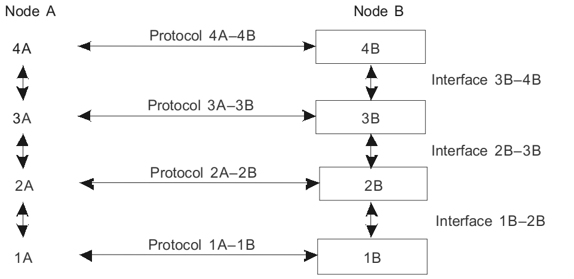
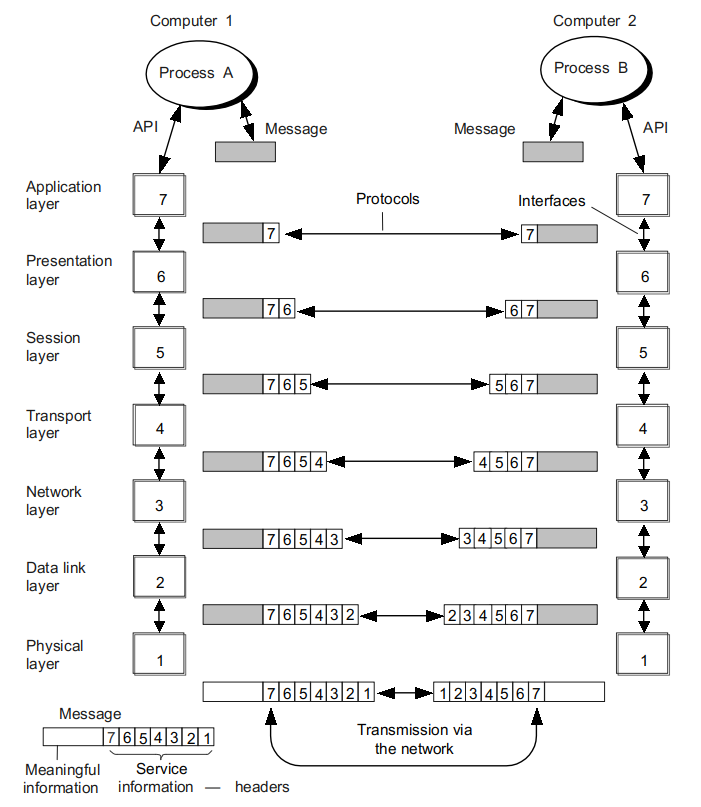
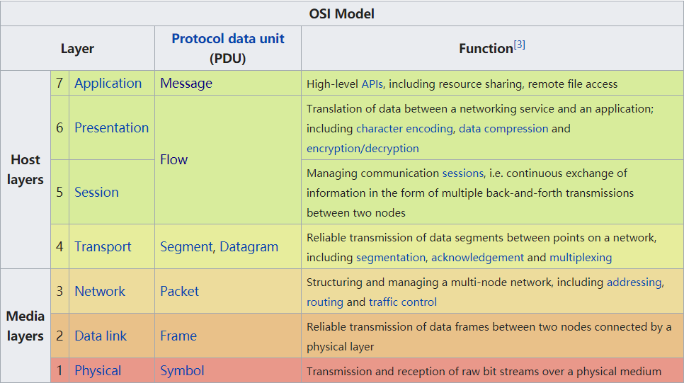
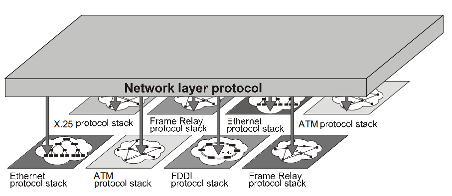
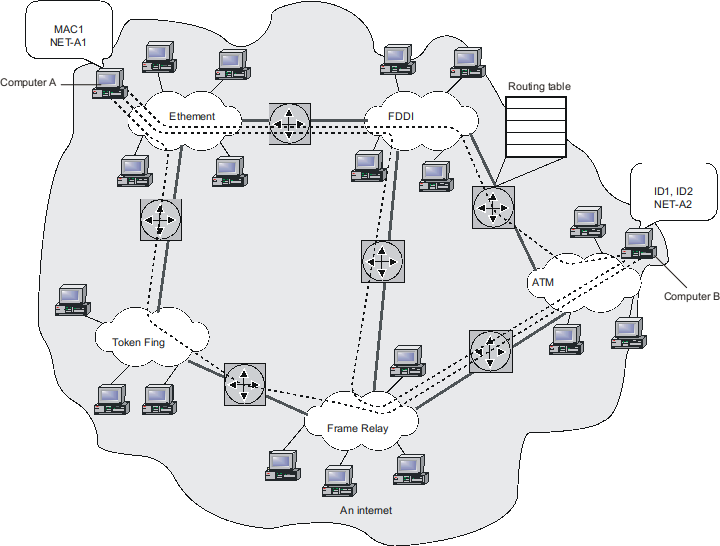
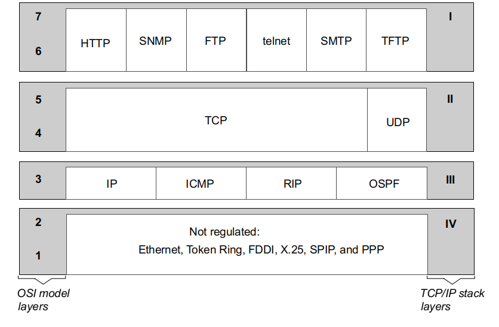
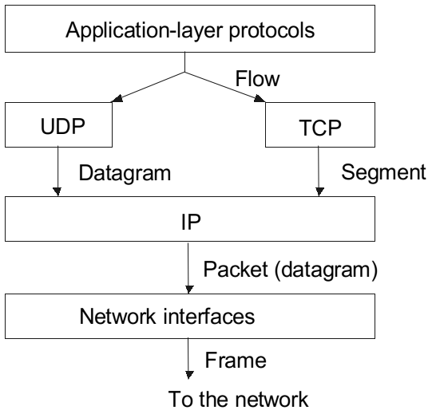
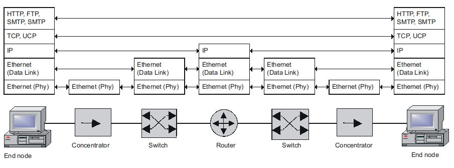

# 网络体系架构与标准

## 分层架构与通信协议

任何复杂的工作都需要分解来完成，在计算机网络中，网络体系结构将网络节点交互这一问题纵向分解为一系列子问题，每一个子问题通过一个网络模块来解决，网络模块之间通过**通信协议**进行交互。一个能够实现网络节点交互的、层级化组织的协议集被称为**协议栈** (protocol stack)，或称协议集 (protocol set)、协议族/簇 (protocol suite)。

每个网络模块可以看做是一个黑盒，模块有两类接口：

1. 本地层级的上层和下层有服务接口(service interface) 或层间接口 (interlayer interface)，其定义了下面一层对相邻上一层提供的**服务**。
2. 对另一方交互工具的对等接口 (peer-to-peer interface)，这种类型的接口也称之为**协议 (protocol)** 。

下图描述了两个节点间通信的接口 (interface) 和协议 (protocol)：

!> 协议定义了不同节点上运行的同一层模块的交互规则，而接口定义了在同一节点上相邻层模块间的交互规则。实质上两者都是物体间交互过程的标准化描述，因此下文将两者统称为通信协议。低层次 (arch.assets layers) 的通信协议通常由硬件和软件共同实现，更高层 (host layers) 的通信协议通常只由软件实现。

!> 通信协议需要遵循标准，只有标准化的协议才能更广泛的流行。通信协议的标准一般由国际或国家的标准化组织来完成，Internet 是全球最流行的互联系统，定义 Internet 标准的文件被称为**请求批注** (Re quest For Comment, RFC)。全世界成千上万的大学、科研机构、硬件、软件厂商等的 IT 工作者参与了该标准的开发，因此 RFC 成了事实上的国际标准。所有 RFC 文档都可以在 [http://www.rfc-editor.org](http://www.rfc-editor.org/) 访问或免费下载。

## OSI 模型

既然网络协议是分层架构，那么如何设计每一层的任务呢？在 20 世纪 80 年代，包括 ISO 和 ITU-T 包括在内的几个国际标准化组织开发了**开放系统互连 (Open Systems Interconnection, OSI) 模型**，这一模型后来在计算机网络的发展中发挥了重要作用。OSI 模型不包含任何特定协议栈的描述，它的目的是描述一个通用的网络互联架构，因此，它常常被称为**参考模型** (reference model)。OSI 模型将通信工具划分为七层，每一层负责网络互连的一个方面。

应用程序可以使用这套七层的系统工具，实现自己的交互协议。为了这一目的，**应用程序编程接口 (Application Programming Interface, API)** 被提供给程序员，通过使用 API，应用程序可以将它的请求发送给最高的层——应用层。**但是，事实上，大多数通信协议栈提供给程序员直接调用底层服务，如 TCP/IP 中，我们可以直接通过 socket 编程操作运输层**。

假设计算机 1 上的应用程序 A 要和计算机 2 上的应用程序 B 通信：

1. 应用程序 A 请求一个应用层服务，应用层软件以标准格式生成一个报文 (message)，并添加**报文头部 (header)**。
2. 报文逐层向下传递，在每一层中，依据上一层的头部信息，完成自己层需要的动作，并添加自己的头部信息到报文中。
3. 最后到达物理层，物理层将真正的比特流通过物理线路传送到目标机器。这时，报文携带所有层的头部。
4. 在目标机器上，报文顺序逐层向上传递，完成每一层的指示，并删除头部，最后报文信息到达应用程序 B。

!> 在某些层的协议中，除了在报文的开始添加头部 (header) 之外，还会在报文的末端添加尾部 (trailer)。

不同层协议的数据交换单元有一个通用的名称——**协议数据单元 (Protocol Data Unit, PDU)** 。专门的术语用来指示不同层的数据交换单元：**帧 (frame)、分组 (packet)、数据报 (datagram) 以及数据段 (segment)** 。

### 物理层 (Physical Layer)

物理层使用诸如同轴电缆、双绞线、光纤这样的物理链路，处理字节流的传输。物理层不关心它传输信息的意义，从它的角度看，这些信息是需要根据指定的时钟频率 (预定义的相邻比特间的间隔)，无损传输到目的地的比特流。

物理层的功能在**所有连接到网络的设备中实现**，就计算机而言，物理层的功能或是通过**网络适配器**完成，或是通过**串口**完成。

以太网的 10Base-T 标准是一个物理层协议的例子。这一标准定义了电缆为带有100欧姆阻抗的非屏蔽三类双绞线，**RJ45** 接口，最大段长度 100 米，线上数据表示为**曼彻斯特编码**，以及其他传输媒体和电信号的特点。

### 数据链路层 (Data Link Layer)

数据链路层的 PDU 通常称为**帧 (frame)** ，对于局域网和广域网，数据链路层的功能相差很多，局域网和广域网的技术相差很多，因此数据链路层必须提供以下功能：

- 在局域网中，保证**任何两个网络节点**间帧的传送。
- 在广域网中，保证**两个通过单一链路连接的节点**间帧的传送。

对于互联局域网，或者广域网中任意两个节点间帧的传送，需要使用更高层的网络工具，我们将在下一节讨论。

数据链路层需要**提供接口**给下面物理层和上一次网络层。对于网络层来的分组，将其**封装成帧**。对于物理层来的比特，利用**帧同步/帧定界**技术来从二进制比特流中提取帧。

**差错检验**是数据链路层的另一项任务，这是为了防止网卡软硬件 Bug、电缆不可靠、信号干扰而造成信号失真或数据错误，目前广泛通过添加**帧校验序列 (FCS) 以及循环冗余校验算法 (CRC)** 来实现。

如果使用共享介质网络，在将帧传送的物理层传输之前，数据链路层必须保证**介质的可用性**，这个功能往往被分为一个独立的子层——**介质访问控制子层 (Medium Access Control, MAC)** 。

数据链路层的协议由计算机，网桥，交换机，路由器实现。在计算机中，数据链路层的功能由网络适配器和其驱动程序共同实现。

数据链路层地址通常在一个网络内传输帧，更高层的地址用来在网络间转发分组。也就是说，在局域网传输中，某些情况下，你可以直接将应用层架构在链路层上，没必要使用网络层和传输层的工具。然而，为了保证对于任何拓扑，网络中报文的高质量传输，仅仅使用数据链路层是不够的，对于 OSI 模型中，这些任务由网络层和传输层完成。

### 网络层 (Network Layer)

网络层将多个网络连接起来，创建了统一的运输系统，因此被称为**互联网络 (internetwork)** ，或者简称为**互联网 (internet)** 。

请不要将**互联网 (internet)** 与**因特网 (Internet)** 混淆，后者是建立在 TCP/IP 技术基础上，最著名的互联网的实现，这一网络覆盖全世界。

下图中有许多网络，每一个都使用了特定的数据链路层技术，例如以太网，令牌环，帧中继，ATM 等，基于这些技术，每个网络都可以在本地网络中将两个用户连接起来，**但不可以传输数据到其他网络中**。原因是非常明显的，因为这些网络拥有不同的编址方式，帧格式，协议运行逻辑。广域网和局域网的技术有更多差别，同样是分组交换技术，许多广域网采用了虚电路技术。

连接这些技术相差甚远的网络，正是网络层的功能。网络层的功能由**协议**和**称为路由器的特殊设备**实现。

路由器 (router) 具有多个网络，每一个都连接到网络中，因此路由器的接口可以被认为是不同网络的接口。路由器的实现可以基于通用计算机，由软件模块来实现，但大部分基于专用的硬件电路。

与二层网络一样，在互联网络中，我们必须保证**每个节点都有一个在整个互联网络范围中唯一的地址**，这样的地址被称为**网络地址 (network address) 或全局地址 (global address)** 。这样互联网络中的节点可能有两个地址，一个是本地/硬件地址，另一个是网络地址。网络层的分组必须标识网络地址，这是分组路由的依据。

路由 (routing) 是网络层的重要的任务，路由本质上是一个寻路的过程，即如何将网络分组从一个节点传输到另一个节点。路由器负责收集互联网络的拓扑信息，创建交换表，这里称为**路由表 (route table)** 。

显而易见的是，不同网络可能帧格式不同，为了在下一个网络中传输分组，**路由器需要将分组封装到新的帧**。大致的过程为：路由器收到帧，提取分组，进行一些处理，然后将其封装到新帧的数据段中。

总的来说，网络层有两类协议：

1. 可被路由的协议 (routed protocols)，它实现了在网络上进行分组转发的底层机制，例如 TCP/IP 网络中的 IPv4 协议。
2. 路由协议 (routing protocols)，它是进行路由决策的协议，通常运行于路由器中，通常不被用户察觉，例如 TCP/IP 网络中的 RIP，OSPF 协议。

### 运输层 (Transport Layer)

运输层为应用程序或上层提供了所需可靠性的数据传输服务。OSI 模型定义了五级运输服务，从 0 到 4 等级依次升高，根据它们提供的服务质量区别这些级别。

**所有的运输层及以上协议都由安装在网络终端节点的软件工具 —— 网络操作系统的部件实现。**

### 会话层 (Session Layer)

会话层保障了多个参与方之间交互的控制。事实上，使用会话层的应用程序并不多，这一层很少以**独立协议**的形式出现，而是和应用层结合在一起。

### 表示层 (Presentation Layer)

表示层处理通过网络传输的信息的表示形式，而不改变他们的内容。字符编码，数据压缩以及加密和解密在这一层完成，它们保证了应用服务数据交换的安全性，这类协议的一个例子是**安全套接字层 (Secure Socket Layer, SSL)**。

### 应用层 (Application Layer)

应用层实际上是用户用来访问共享网络资源 (例如文件、网页等) 的一系列协议。应用层的协议数据单元 (PDU) 通常被称为**报文 (message)**。目前著名的应用层协议包括：

- Web 使用的 HTTP、HTTPS 协议等
- 电子邮件使用的 SMTP 协议、POP 协议 等；
- 查询域名 IP 地址的 DNS 协议等；

## TCP/IP 协议栈

如果说OSI模型是协议设计白皮书，那么协议栈就是协议具体实现，历史上出现过比较著名的协议栈包括：

- OSI 协议栈
- TCP/IP 协议栈
- IPX/SPX 协议栈
- NetBIOS/SMB 协议栈
- DECnet 协议栈
- SNA 协议栈

大部分协议栈已经消失在历史的长河中了，需要注意，OSI 协议栈和 OSI 模型不同：

- OSI 模型是开放互联系统之间交互的概念性描述，作为协议栈实现的参考。
- OSI 协议栈是完全符合 OSI 模型的一系列特定的协议规范，是网络交换的具体实现。

TCP/IP 协议栈由美国国防部发起，如今已随着 Internet 的发展成为**全球最流行，最广为使用的协议栈**。这也是我们如今学习的主要内容，在其他文章中，我们还将详细讨论。

以下是 TCP/IP 协议栈中广泛使用的协议。

### 应用层

TCP/IP 栈的应用层将系统提供的服务和应用层结合起来。通过多年累计已经形成了大量的服务，包括 FTP，HTTP 等。

### 运输层

TCP/IP 栈的运输层为应用层提供了如下两类服务：

- 保证递送 - 传输控制协议 (TCP)
- 尽力运输 - 用户数据报协议 (UDP)

### 网络层

TCP/IP 栈的网络层也被称为互联网层，是整个体系的核心，他保证分组在互联网络中转发。IP 协议是网络层的主要协议，除此之外，还包括一些路由协议和辅助功能协议。

TCP/IP 栈的低层解决了一个更为简单的问题：**只负责组织和其他网络技术的交互**。TCP/IP 将互联网络中的任何网络视为路由传输的工具。因此，其任务被简化为：

- 定义将 IP 分组封装为中间网络 PDU 的方法
- 定义将网络地址转化为中间网络技术使用的地址的方法

简单的说就是：TCP/IP 协议栈不管你底层使用了什么数据链路层技术（是局域网还是广域网），甚至不管你底层是不是数据链路层（哪怕是另一个 IP 网络），只要你可以把你的数据包封装到 IP 包里面，并且提供网络地址转换的技术，就可以当作 IP 网络的底层承载网络。

这样开放的方式使得对于任何网络，只要开发特定的接口就可以将其纳入 TCP/IP 协议栈中，它支持所有流行的网络技术，因此它迅速的风靡了。**特别的，TCP/IP 协议栈允许将网络包含进互联网络中，而无论这些网络层数有多少**。这样可能造成一种网络协议工作在另一层网络协议之上，看似与 OSI 模型相违背，但对于 TCP/IP 栈来说，这是非常正常的，如今风靡的各种隧道技术，正是利用了这样层层套娃的特性。

### 链路层

每一种通信协议操作特定的所传输的数据单元，称为协议数据单元 (Protocol Data Unit, PDU)。

- 流 (stream) -> 段 (segment)
- 数据报 (datagram) 是无连接协议中常用的 PDU 名称，一般用于 UDP，但有时也用于 IP。
- 分组 (packet) 用于 IP 协议，称为 IP 分组。
- 帧 (frame) 是 IP 分组为了之后在网络上传输而被封装进去的任何技术的 PDU。**以太网帧，ATM 信元，X.25 分组，都被 TCP/IP 栈认为是帧**。

## TCP/IP 协议栈和 OSI 模型

如果经过的阅读，你会发现 OSI 模型是如此的优雅，每一层的功能十分清晰。上层请求下层，下层为上层提供服务，同一层的模块负责完成一个共同任务。在协议中，上层 PDU 被封装进下层 PDU 中。但大多数情况下，栈的开发者牺牲模块结构来加速栈的运行，这造成了协议栈和 OSI 模型的对应相当一般。

例如，在 TCP/IP 网络中，IP 用来转发分组，而 RIP 和 OSPF 是路由协议，理应属于同一层。然而 RIP 报文被封装到 UDP 数据报，OSPF 报文被封装到 IP 分组。

如今，大部分的网络学习者只会学习到 TCP/IP 协议栈，因此，我们应当按照功能模块去学习和认知网络，而不应该死板的按照每一层的协议去学习。例如，ARP 协议，IP 协议，DHCP 协议，DNS 协议，NAT 协议都是和地址相关的，但他们分别工作在各个层，融会起来学习就会明白 TCP/IP 中的编址技术，了解其后的历史和原理，也就会明白为什么需要硬件地址，网络地址，域名地址，以及这些地址是如何解决网络中的问题的。

将 OSI 模型与 TCP/IP 协议栈结合考虑，可以将协议栈分为五层架构。

