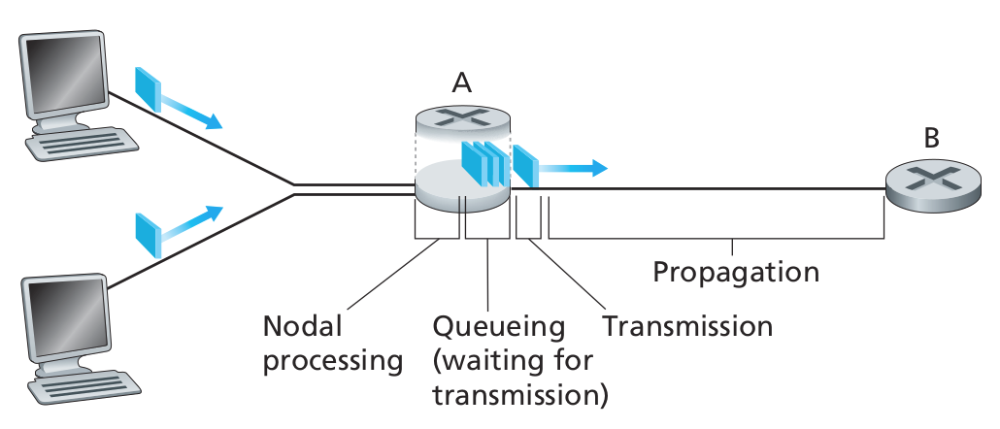

# 网络基础

网络 (networks) 是一个复杂的东西，因此网络 (networking) 同时又是一门复杂的技术，涉及到通信技术，算法，协议，编程语言，操作系统，服务器，网络设备等方方面面，不仅需要**软硬结合**的功力，还涉及不少**理论和工程**方面的知识。从 1969 年美国国防部的 ARPA 网开始，到如今「大物移云」的时代，多种网络技术、架构、协议轮番登场，有的如今仍然存在，有的却因为这样或者那样的原因退出了历史的舞台中，网络经历了演变，并正在演变...

## 网络类型

根据不同的划分准则，网络有多种划分方式。

按照交换技术可分为：
- 电路交换网络
- 分组交换网络

按照覆盖区域可分为：
- 广域网：例如 Internet 因特网，跨越大陆。
- 城域网：例如某省中国移动网络。
- 局域网：例如家用网络。
- 个域网：例如蓝牙网络。

按照拓扑结构可分为
- 星型
- 总线型
- 网状型
- ...

按照物理链路特点可以分为
- 点到点网络 (point to point, P2P) ：在一个网段内只能存在两个节点，即便强制连接第三节点，最终也无法正常的通讯。例如 ppp（华为默认）或 hdlc（思科默认）网络，也就是说没有物理寻址。
- 多路访问网络 (multi-access, MA) ：在一个网段内的节点数量不限制。
- 广播型多路访问 (Broadcast MA) ：在一个 MA 网络中同时存在广播机制。例如以太网。
- 非广播型多路访问技术 (Non BMA) ：在一个MA网络中没有广播机制。例如帧中继网络。

## 网络特性

### 时延类型

**节点总时延**由处理时延 (processing delay)、排队时延 (queueing delay)、传输时延 (transmission delay) 和传播时延 (propagation delay) 共同决定。

$$ d_{node} = d_{proc} + d_{queue} + d_{trans} + d_{prop} $$ 

- **处理时延**主要包括检查分组首部和决定将该分组导向何处所需要的时间。高速路由器的处理时延通常是微妙或耕地数量级。
- **排队时延**是分组在链路上等待传输的时间。一个特定的分组的排队时延长度将取决于先前到达的正在排队等待向链路传输的分组数量。实际的排队时延可以是毫秒到微妙量级。
- **传输时延**是将分组的所有比特推向链路（或者说发射）所需要的时间，该时间与分组长度 $L$ (bit) 和链路传输速率 $R$ (bps)有关，即 $L\over R$ 。
- **传播时延**

### QoS

## 物理层技术

### 传输链路

### 数据编码

### 无线传输

### 传输网络

## 广域网

## 参考

- [Computer Networking: a Top-Down Approach, 8th Edition](https://media.pearsoncmg.com/ph/esm/ecs_kurose_compnetwork_8/cw/)
