# IP 寻址

在 TCP/IP 网络中，为什么有各种各样的地址？为什么有了 MAC 地址，还需要 IP 地址？既然 有了 IP 地址，为什么还需要域名？他们之间有什么关系？其实，这些问题都可以总结为 **TCP/IP 网络中的寻址 (addressing) 技术**。

## 从社交看地址多样化

当你向你的国内朋友描述自己的位置的时候，你告诉他：“我的地址是北京邮电大学”，他会立刻知道你在哪里，这在你的大学生圈子里很常用，你在北邮，他在华科，大学的名字就是一种本地地址，在国内的你们很容易就知道对方的地址了。

当你向一个外国友人描述你的地址时，你和他说：“我的地址是北京邮电大学”，他肯定一脸懵逼。这时候，聪明的你立刻想到了经纬度，你自信的告诉他：“我的地址是 (39.96°N, 116.35°E)” 这是国际上都懂的位置表达方式，只要精度足够精确，那么一定能够准确的描述你的位置。相信我，如果你真的这么说了，恐怕外国小哥得费劲的查一查才能知道你在哪里。

经纬度是给机器用的，它足够精确但又非常不直观。相比于告诉外国小哥你的经纬度坐标，更好的方法就是告诉他你的地址是：“10 Xitucheng Rd, Beitaipingzhuang, Haidian District, Beijing, China.” 即使他不能准确的一下说出你的确切位置，但立刻就能对你的地址有一个感性的认知——你在中国北京海淀区的某个地方。事实上，这样的树形的层级表达方式正是今天人类社会普遍采用的寻址方式。

如果将国内社交比作局域网通信，将国际社交比作互联网通信，那么这些地址就有如下对应关系

| 社交地址 | TCP/IP 地址 |                      特点                      |
| :------: | :---------: | :--------------------------------------------: |
|  大学名  |  MAC 地址   |              在国内圈子里可以使用              |
|  经纬度  |   IP 地址   | 国际通用寻址规则，对人类不友好，适合机器使用。 |
| 层级地址 |  域名地址   |         国际通用寻址规则，对人类友好。         |

这就是为什么 TCP/IP 网络中有这么多地址的原因！在感性的认识了地址之后，在后文笔者将会从专业的角度来阐述 TCP/IP 网络中的寻址技术。

## 寻址的目的

TCP/IP 寻址技术旨在解决以下问题：

- **协调使用不同类型地址**：无论二层使用了什么局域网技术，只要都通过 TCP/IP 网络接入，那么就可以互相通信。
- **确保地址唯一性**：TCP/IP 网络中的任意一个通信结点，其地址应该具有全局唯一性。
- **配置网络接口和网络应用程序**：这意味着上层应用程序可以根据基于该地址配置软件，与其他节点进行通信。

## 地址的类型

为了区分不同的网络接口，TCP/IP 网络使用以下三种地址：

- 本地地址/硬件地址 (local/hardware addresses)
- 网络地址/IP 地址 (netwrok/IP addresses)
- 符号地址/域名 (DNS names)

### 本地地址

大多数 LAN 技术，如**以太网、FDDI以及令牌环**使用 **MAC 地址 (MAC addresses)** 定义接口，但也有一些其他的技术使用不同的寻址机制，如 X.25、ATM和帧中继。这些寻址机制在相关技术组建的网络中使用**唯一地址**，**这种自治的网络中使用排他的寻址系统来实现内部目标的唯一标识，以保证节点的连接性。**

然而，当这样的网络连接到其他不同网络时，这些地址就不能通用了。在 TCP/IP 中，这些地址成为上层网间技术的元素，它们所扮演的角色应该是相同的，所以无论是 MAC 地址或者是其他什么地址，都统一称为**本地 (硬件) 地址** (local/hardware addresses)。

“本地”这一术语意味着**该地址在组成网络而非整个互联网中有效**。需要注意的是，组成网络可以同时建立在 WAN 技术 (X.25、帧中继等) 和 LAN 技术 (以太网、令牌环等) 上，术语“本地”也被用于 LAN 中，但这里有着一定的区别，这里代表着**将网络局限在小范围内的技术特征**。

“硬件”这一术语意味着**通常本地地址是固化在硬件中的**。例如 MAC 地址，一般不可以改变。

### IP 网络地址

为了完成网络互联的任务，TCP/IP 需要有自己的**全局寻址系统**，并且这个寻址系统不依赖于组成网络中的节点寻址方法。该寻址系统必须提供统一的方法来唯一的标识互联网上的每个接口。

很自然的一种方法是：唯一标识所有的网络，再唯一标识网路中的节点。这样**网络地址由网络号和主机号组成**。这正是 IPX/SPX 网络的编址思路，这看似是很高明的设计，因为本地地址在那个子网中天然就有唯一性，然而这却使得网络地址与本地地址紧耦合，使得网络地址依赖于本地技术，限制了适用领域。这也是 IPX/SPX 没有风靡的原因，不过，IPX/SPX 本来就是被设计成在某种特定的互联网中使用的。

在 TCP/IP 网络中，节点号使用**与本地技术无关，但能唯一标识子网中该节点的数字串**。也就是如今的通用 IP 地址，也正是 TCP/IP 网络的特征。

### 域名 (Domain names)

TCP/IP 网络的硬件和软件根据 IP 地址识别计算机，但人类还是更倾向使用**可读性更好的符号来识别计算机**。因此，TCP/IP 网络必须有为主机提供符合名称以及将其映射为 IP 地址的机制。

**互联网的接口符号标示符依据层次建立**。各个部分由小数点隔开，如`个人主机名称.主机组 (组织) 的名称.更大的组织名称.更高的域.[...].最高域`。是不是很像人类在邮政系统中使用的树形层级表达方式呢？

由于 IP 地址和符号间不存在依赖关系，因此，符号映射到 IP 的唯一方法就是**使用表格**。TCP/IP 使用特殊的分布式服务 —— 域名系统 (DNS) 来实现。网络管理员建立一张映射表实现 IP 地址到符合地址的映射。

## 地址的联系

北京邮电大学、(39.96°N, 116.35°E)、"10 Xitucheng Rd, Beitaipingzhuang, Haidian District, Beijing, China." 其实表示的都是一个地址，三者可以通过某种方式互相转换，只是这种转换方式很难具体的表示出来。

类似的，MAC 地址、IP 地址、域名之间也有一个对应的转换关系，这种转换关系以标准**网络协议**的形式呈现，在 TCP/IP 网络中，主要涉及到以下两种协议：

- 地址解析协议 (Address Resolution Protocol, ARP)：负责 MAC 和 IP 地址的互相转换。
- 域名系统 (Domain Name System, DNS)：负责 IP 地址到与域名的互相转化。

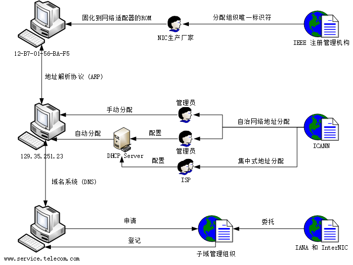

MAC 地址是二层地址，IP 地址是三层地址，而域名是七层地址，**通常转换方向是自上而下**的：即根据域名得到 IP 地址，根据 IP 地址得到 MAC 地址。

## IP 地址

我们已经知道，在 TCP/IP 网络中，节点 IP 地址使用与本地技术无关但能**唯一标识该节点的数字串**表示。这本应该是一个十分简单的定义过程，然而由于历史原因，却成为一个复杂而又丑陋的问题，其直接结果就是如今的 TCP/IP 网络中使用了两种 IP 地址：

- IPv4 (Internet Protocol version 4)
- IPv6 (Internet Protocol version 6)

1981 年，IETF 定义了 32 位 IP 地址的 IPv4，因为 IP 地址是唯一的，所以 32 位的 IPv4 地址最多可以表示 $2^{128}$ 个地址，约为 42.9 亿。这对于当时的互联网来说真是个天文数字，然而随着互联网的快速成长，IPv4 的 42 亿个地址最终于 2011 年 2 月 3 日用尽，用尽指的是 ICANN 将所有地址段分配给各个 ISP，但由于早期编码和分配上的问题，很多区域的编码实际上被空出或不能使用。

IPv6 是 IP 的最新版本，用作互联网的网络层协议。用它来取代 IPv4 主要是为了解决 IPv4 地址枯竭问题，同时它也在其他方面对于 IPv4 有许多改进。128 位的 IPv6 的 IP 地址数量最高可达 $2^{128}$，约为 $3.4 × 10^{38}$ 个，届时每个人家居中的每件电器，每件对象，甚至地球上每一粒沙子都可以拥有自己的 IP 地址。

IPv6 的设计目的是取代 IPv4，然而长期以来 IPv4 在互联网流量中仍占据主要地位。这是因为**网络地址转换**及**无类别域间路由**等技术可延缓了网络地址匮乏的现象，我们将在后文讨论这些技术是如何影响 IP 协议发展的，在本节我们首先关心的是基本的 IP 地址。

### IPv4 地址

IPv4 地址（以下简称 IP 地址）用 32 位二进制数表示，为便于使用，常以 `XXX.XXX.XXX.XXX` 形式表现，`XXX` 为一个十进制数字，其范围为 `[0, 255]`，该表示方法称为**点分十进制**。

[Key IPv4 Addressing RFCs](http://www.ipamworldwide.com/ipam/ipv4-rfcs.html)

- [RFC 791 - INTERNET PROTOCOL](https://tools.ietf.org/html/rfc791)

### IPv6 地址

详细内容查看 [RFC 2373 - IP Version 6 Addressing Architecture](https://tools.ietf.org/html/rfc2373)

## 网络地址转换 - NAT

网络地址转换 (Network address translation, NAT) 是一种在数据包经过流量路由设备传输时，通过修改数据包 IP 报头中的网络地址信息，将 IP 地址空间**重新映射**到另一个地址的方法。最初使用该技术是为了避免在网络移动或更换 ISP 时为每个主机分配一个新地址。后来面对 IPv4 地址耗尽的问题时，它成为一个节省公网地址的流行工具，NAT 网关的一个公网 IP 可以用于整个专用网络。

### 基本 NAT (One-to-one NAT)

In this type of NAT, only the IP addresses, IP header checksum and any higher level checksums that include the IP address are changed.

最简单的 NAT 类型提供 IP 地址的**一对一转换**。 [RFC 2663 - IP Network Address Translator (NAT)](https://tools.ietf.org/html/rfc2663) 将此类型的 NAT 称为基本 NAT，也成为一对一 NAT。

在这种类型的 NAT 中，仅 IP 地址、IP 头校验和以及包括该 IP 地址的所有更高级别的校验和更改。基本 NAT 可用于互连地址不兼容的两个 IP 网络。

以下是一个基本 NAT 转换的例子，NAT 设备中维护了一个NAT 映射表 (NAT Translation Table) 用来在转换时查询。

|    内网 IP    |     外网 IP     |
| :-----------: | :-------------: |
| 192.168.1.55  | 219.152.168.222 |
| 192.168.1.59  | 219.152.168.223 |
| 192.168.1.155 | 219.152.168.224 |

### 动态 NAT

动态 NAT 和静态 NAT 一样，在较小的网络中并不常见，但在具有复杂网络的大型公司中可以找到。动态 NAT 与静态 NAT 的不同之处在于，静态 NAT 提供内网到公网静态 IP 地址的一对一映射，而动态 NAT 通常使用一组可用的公共 IP 地址。

### NAPT (One-to-many NAT)

由于公网 IP 比较宝贵，大多数 NAT 将多个私网 IP 主机映射到一个公网 IP 地址。多个私网 IP 的主机流量在发出时源地址都会转换成公网 IP，然而为了能弄清楚回来的流量到底属于原来的哪个主机，需要更改更多的地方。由于大部分网络流量使用 TCP 协议和 UDP 协议，因此通过更改端口号来消除歧义，从而确定某个返回数据包属于私网中哪台主机的回复，由于更改了 IP 和端口号，这种类型的 NAT 称为 NAPT (Network Addresss and Port Translation)，其他的名字包括 PAT、IP 伪装、 多对一 NAT 等。事实上，由于使用的广泛性 NAPT 也逐渐成为了 NAT 的代名词。


|   内网 IP & Port   |  外网 IP & Port   |
| :----------------: | :---------------: |
| 192.168.100.3:3855 | 145.12.131.7:6282 |
|  192.168.100.4:80  | 145.12.131.7:9201 |
| 192.168.100.5:4465 | 145.12.131.7:9202 |

IP 伪装 (IP masquerading) 是一种将整个 IP 地址空间（通常由私有 IP 地址组成）隐藏在一个公共地址空间的单个 IP 地址后面的技术，隐藏的地址被更改为单个（公共）IP 地址，作为传出 IP 数据包的源地址，因此它们看起来不是源自隐藏的主机，而是源自路由设备本身。现在 IP 伪装和 NAT 基本成为同义词。

一对多 NAT 是 IPv4 地址耗尽的实用解决方案，甚至大型网络也可以使用单个公共 IP 地址连接到 Internet。同时也正是由于这个原因，如今互联网上绝大多数服务器都静静的躺在 NAT 后面，大大节省了 IPv4 地址，因此使得 IPv6 的推广受到了巨大的阻碍。

### SNAT

**源网络地址转换 (Source NAT)** 用于解决**内网主机主动发起连接访问公网上的服务**时的问题。试想一下，假设内网 `192.168.1.1` 的主机给 `12.124.33.6` 的外网服务器发送请求，即使通过路由，请求数据包到达外网服务器，但由于响应 IP 是个内网地址，并没有该网段的路由，因此响应数据包是无法回复给发送主机的。

因此，NAT 将**内部 IP 源地址**转换成**公有 IP**，并发送给公网上的服务；当公网上的服务返回时，NAT 会将回复数据包中的目的地址从公网 IP 转换为私网 IP，再发给发起连接的内网主机。

SNAT 与我们日常生活息息相关，是 NAT 的基本功能。

### DNAT

**目的网络地址转换 (Destination NAT)** 用于解决**公网主机主动发起连接访问私网上的服务**时的问题。由于私网地址是不可路由的地址，因此公网主机只能请求路由器/网关的公网 IP 地址，如果该路由器配置了 DNAT，则 DNAT 将**公网 IP 目的地址** 转换为私有 IP 并发给私网上的服务器，当私网服务器回复时，NAT 会将回复数据包的目的地址从私网 IP 转换为公网 IP，再发给发起连接的公网主机。

DNAT 通常用于在公共可访问 IP 地址上发布位于专用网络中的服务，也称为**端口转发**。当在整个服务器上使用 DNAT 时，该服务器将暴露于 WAN，也被称为 DMZ。

主动发起的公网主机可能是真正的公网主机，也可能是经过 NAT 之后拥有公网地址的私网主机，这两者是不可区分的。因此，从某种程度上来看，DNAT 的端口转发解决了**公对私**和**私对私**两种问题，下文中我们通过 NAT 穿透技术将会了解到更多解决私对私问题的方案。

### NAT 穿透 (NAT Traversal)

当位于不同 NAT 之后的两个对等方尝试进行通信时，会出现 NAT 穿透问题，解决此问题的一种方法是使用**端口转发**，另一种方法是使用各种 **NAT 打孔技术 (NAT hole punching)**。关于穿透技术请查看 [NAT Traversal](https://en.wikipedia.org/wiki/NAT_traversal#Network_address_translation)。

## 地址解析协议 - ARP

地址解析协议 (Address Resolution Protocol, ARP) 是一个通过解析网络层地址来找寻数据链路层地址的网络传输协议，它在 IPv4 中极其重要，其 RFC 文档为 [RFC 826 -  An Ethernet Address Resolution Protocol](https://tools.ietf.org/html/rfc826)。ARP 是通过网络地址来定位 MAC 地址，在很多网路层和数据链接层之间得以实现，但最常用的还是将 IPv4 地址转换为 MAC 地址。

> 在 IPv6 中邻居发现协议（NDP）用于代替地址解析协议（ARP）。

### 基本功能

在以太网协议中规定，**同一局域网**中的一台主机要和另一台主机进行直接通信，必须要知道目标主机的 MAC 地址。而在 TCP/IP 协议中，网络层和传输层只关心目标主机的 IP 地址。这就导致在以太网中使用 IP 协议时，数据链路层的以太网协议接收到上层 IP 协议提供的数据中，只包含目的主机的 IP 地址。于是需要一种方法，根据目的主机的 IP 地址，获得其 MAC 地址。这就是 ARP 协议要做的事情。所谓**地址解析就是主机在发送帧前将目标 IP 地址转换成目标 MAC 地址的过程**。

当发送主机和目的主机**不在同一个局域网**中时，即便知道对方的 MAC 地址，两者也不能直接通信，必须经过**路由转发**才可以。所以此时，发送主机通过 ARP 协议获得的将不是目的主机的真实 MAC 地址，而是一台可以通往局域网外的路由器的 MAC 地址。于是此后发送主机发往目的主机的所有帧，都将发往该路由器，通过它向外发送。这种情况称为**委托 ARP** 或 **ARP 代理 (ARP Proxy)**。

### 数据包结构

地址解析协议的消息格式很简单，仅包含单一的**地址解析请求或响应**。ARP 消息的长度取决于上下两层地址的大小：

- 上层地址由所使用的网络协议类型决定（通常是 IPv4 地址）。
- 下层地址则由上层协议所使用的硬件或虚拟链路层的类型决定（通常是 MAC 地址）。

消息的报头中包含了这两层地址的**类型**以及**长度**信息，此外还包含了表示请求（1）和应答（2）的**操作码**。数据包的**有效载荷 (Payload)** 为收发双方的硬件地址、协议地址，总计四个地址。数据包结构如下：

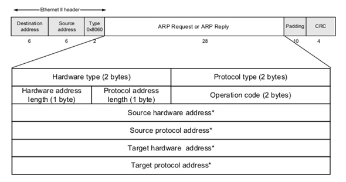

| 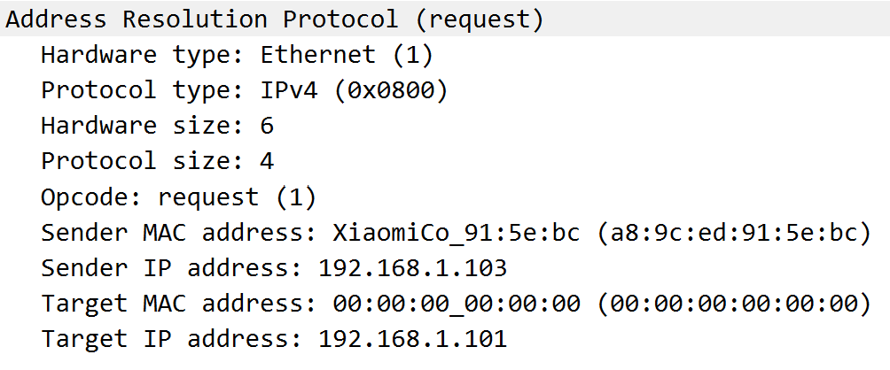 | 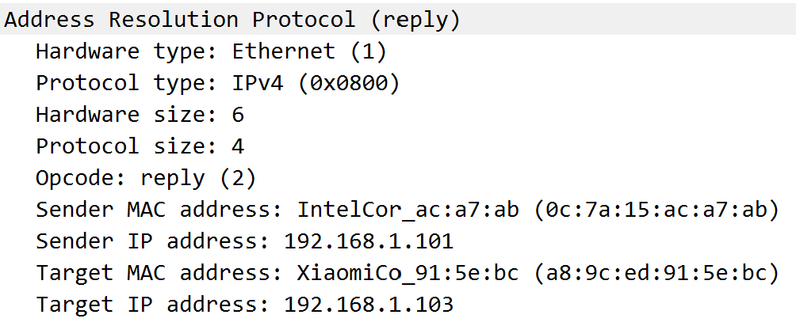 |
| ------------------------------------------------- | --------------------------------------------- |

### 传统 ARP 流程

ARP 的核心解析流程非常简单，只有两个步骤：

1. 发送方发送 ARP Request 数据包获取接收方的 MAC 地址。请求数据包类型是**广播**，因此局域网中所有主机都可以收到该请求，但只有真正的接收方才会作出回应。
2. 接收方回复 ARP Reply 数据包响应发送发。响应数据包类型是**单播**，将会单独回复给发送发。


以下是使用 Wireshark 抓取的同一局域网中一台手机和一台电脑进行 ARP 的过程：

```
XiaomiCo_91:5e:bc       Broadcast           Who has 192.168.1.101? Tell 192.168.1.103
IntelCor_ac:a7:ab       XiaomiCo_91:5e:bc   192.168.1.101 is at 0c:7a:15:ac:a7:ab
```

### ARP 缓存

每次通信发送方都需要根据接收方 IP 地址将其 MAC 地址填写到发送数据帧中，那么每一次都需要地址解析吗？答案是否定的，在每台安装有 TCP/IP 协议的电脑或路由器里都有一个 **ARP 缓存表**，表里的 IP 地址与 MAC 地址是一对应的，可以通过 `arp -a` 命令来查看。

使用 ARP 缓存的好处至少有两个：

- 对于本机来说，加快解析 MAC 地址速度。
- 对于本网络来说，减少 ARP 广播量，节省网络资源。

因此，当主机 A 向主机 B 发送数据发送数据时，主机 A 会在自己的 ARP 缓存表中寻找是否有目标 IP 地址，如果找到就直接把目标 MAC 地址写入帧里面发送；如果未找到，就会发起一次对 B 主机的 ARP Request，当收到 B 主机的 ARP Reply 时，便把 IP-MAC 映射写入 ARP 缓存中，以便下次使用。

ARP 缓存可以包含**动态条目**和**静态条目**。

- 动态条目随时间推移自动添加和删除，在一段时间内如果表中的某一行动态条目没有使用，就会被删除，这样可减少缓存表的长度，加快查询速度。
- 静态项目一直保留在缓存中，直到重新启动计算机为止。

> 接收到新的 ARP 应答数据包后，即使尚未过期的 ARP 缓存条目也将被覆盖，ARP 协议中没有任何方法可以使主机对另一方进行身份验证，因此也给 ARP 攻击提供了可乘之机。

### 免费 ARP

免费 ARP (Gratuitous ARP) 是一种**不需要由 ARP 请求触发的 ARP 响应**，免费 ARP 作为**广播**发送，作为节点宣布或更新其 IP-MAC 映射到整个网络的方式。

操作码设置为 2，表示响应，尽管该数据包的产生实际上并非是由一个请求引起的，这就是也是免费 ARP 名字的由来。发送 MAC 和发送 IP 包含启动程序正在通告的 ARP 映射，这两个是 ARP 数据包的重要部分。

目标 MAC 地址为 ffff.ffff.ffff，但实际上，该字段的内容无关紧要，在免费 ARP 中将其忽略，ARP的某些实现将在该字段中使用 0000.0000.0000。

免费 ARP 通常有三种作用：

- 更新 ARP 映射
- 宣布节点存在
- 用于冗余备份

#### 更新 ARP 映射

第一个作用非常简单，如果节点的IP到MAC映射发生更改，则节点可以使用免费ARP更新网络上其他主机的ARP映射。
如果用户手动修改其MAC地址-他们保留了相同的IP地址，但是现在有了新的MAC地址，则可能会发生这种情况。
因此，必须更新与此用户通信的所有节点的ARP映射。
话虽如此，手动更改MAC地址的情况很少见。
但是，有时您会在冗余的云或虚拟环境中看到这种情况，在该环境中，特定的虚拟机（VM）会“跳转”到新的物理盒中-相同的VM的IP地址现在由另一台物理机提供。

#### 宣布节点存在

免费 ARP 的第二个作用是主机刚加入网络时，它可以使用免费 ARP 向网络宣告它的存在。激发此操作的意图很有用，**这是一种在不要求主机进行传统 ARP 过程的情况下，抢先填充相邻主机的 ARP 缓存的尝试**。

但是，主机无权缓存每个收到的免费 ARP 中的 ARP 映射，结果使得这种作用几乎变得无用，但是它不会造成重大危害。因此不建议这种行为。


该用例经常与尝试检测可能的重复 IP 地址混淆，但是此过程未使用免费ARP，为了检测 IP 地址冲突，主机将使用 ARP 探针和 ARP 公告，后文会描述这个过程。


#### 冗余 (Redundancy)

在使用两个设备之间的冗余或故障转移的情况下，免费 ARP 的用例更为重要。

使用冗余，通常会遇到两种情况：

- 两个设备共享一个 IP 地址，但是每个设备都有自己的 MAC 地址。
- 两个设备同时共享一个 IP 地址和一个 MAC 地址。

在这两种情况下，免费 ARP 对于确保 IP 地址在两个冗余设备之间切换时的持续通信能力至关重要。

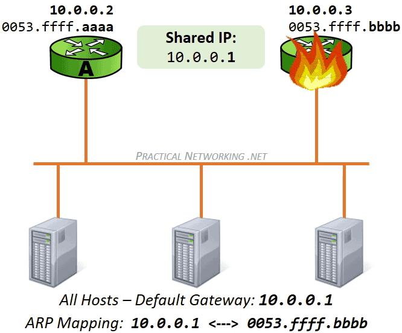

### ARP 探针和 ARP 公告

这两种方法都在**重复地址检测 (Duplicate Address Detection)** 的过程中使用。这个想法是：如果一台主机获得并使用了恰好在网络上正在使用的 IP 地址，将会导致这两台主机的网络连通性出现问题，因此对于主机来说，首先测试 IP 地址的唯一性是有益的。

确定是否正在使用 IP 地址的一种方法是使用 **ARP 探针 (ARP Probe)**，该过程非常简单，发送了一些 ARP 探针（通常为 3 个），如果没有人响应，就通过 **ARP 公告 (ARP Announcement)** 正式声明该 IP 地址。

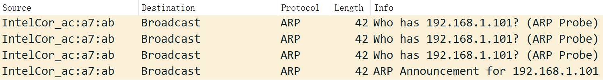

#### ARP 探针包结构

ARP 探针用于轮询网络以**确认 IP 地址尚未使用**。发送时将 Opcode 字段设置为 1，表示 ARP 请求。这个想法是，如果所请求的 IP 地址已经被使用，则 ARP 探针的发起者将期望原始所有者的响应。因此，ARP 探针是一个可能引起响应的请求。

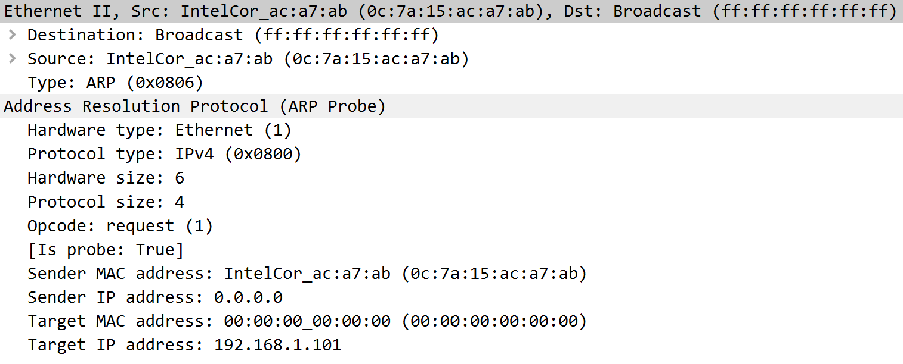

- 发送 MAC 地址设置为发起方的 MAC 地址
- 发送 IP 地址设置为 0.0.0.0。
- 目标 MAC 地址设置为 0000.0000.0000
- 目标 IP 地址设置为要探测的 IP 地址

**探针数据包中没有提供完整的映射**。发送 IP 设置为全零，这意味着它无法映射到发送 MAC 地址。目标 MAC 地址全为零，这意味着它无法映射到目标 IP 地址。这是有意的，因为发送 ARP 探针的原因是为了防止 IP 冲突，如果目标 IP 地址已被使用，则网络上的其他主机基于ARP 探针的内容无意中更新其 ARP 缓存将是非常不可取的。这也是 ARP 探针和免费 ARP 之间的主要区别。免费 ARP 旨在更新网络上的所有 ARP 缓存，而 ARP 探针则故意阻止更新ARP 缓存以继续保护 IP 地址免遭冲突。

#### ARP 公告包结构

如果 ARP 探针包引起来自该 IP 的 ARP 响应，则发起主机将认为该 IP 地址是唯一的，并将发送 ARP 公告以**正式在该网络中声明其 IP 地址**。

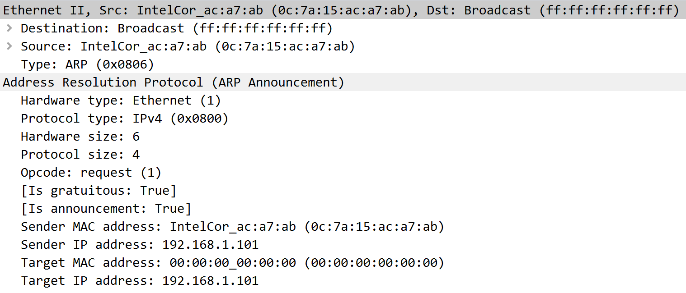

ARP 公告包结构与上述 ARP 探针包结构相同，**不同之处在于公告包存在完整的映射**。发送 MAC 地址和发送 IP 地址创建了完整的 ARP 映射，网络上的主机可以在其 ARP 表中使用这对映射。像免费 ARP 一样，目标 MAC 地址也被忽略，在此示例中为 0000.0000.0000，在某些实现中使用 ffff.ffff.ffff 代替。

ARP 公告与免费 ARP 非常相似，但有一个明显的例外就是两者**操作码不同**：ARP 公告中的操作码设置为 1，表示请求，而典型的免费 ARP 会将操作码设置为 2。


ARP 公告与免费 ARP 非常相似，唯一的区别是操作码字段，尽管从技术上讲它们是不同的构造，但它们通常都被简单地称为免费 ARP。对于日常网络话题交流来说，这是一个琐碎的错误用语，但是有时有些不准确之处确实可以省去冗长的解释。


## 反向地址解析协议

与 ARP 根据网络层（三层）地址获取 MAC 地址（二层）不同，反向地址解析协议 Inverse ARP (InARP) 执行相反的流程，其用于从数据链路层（第2层）地址获取其他节点的网络层地址（例如IP地址）。

还有一种反向地址解析协议 Reverse ARP (RARP) 与 InARP 类似，其区别在于：在 InARP 中，请求主机查询**另一个主机**的第三层地址，而 RARP 用于获取**主机本身**的第三层地址，以进行地址配置。

两种协议都很少被用到，其中 RARP 相关功能如今已被 DHCP 取代。

## ARP 代理

当发送主机 A 和目的主机B **不在同一个局域网**中时，A 和 B 经过**网关**（一般是 IP 路由器）中转进行通信。所以此时发送主机通过 ARP 协议获得的将不是目的主机的真实 MAC 地址，而是一台可以通往局域网外的路由器的 MAC 地址。于是此后发送主机发往目的主机的所有帧，都将发往该路由器，通过它向外发送，这种情况称为**委托 ARP** 或 **ARP 代理 (ARP Proxy)**。

### 经典例子

假设有一个如下的网络拓扑


当 B 请求 D MAC 地址时，B 的 ARP 请求是完全正常的，但是 B 收到的 ARP 响应却与传统 ARP 响应包不同，其区别为代理 ARP 响应包的**发送 MAC 地址是路由器的 MAC，发送 IP 地址是 D 的 IP 地址**。路由器代理了对于 D 的请求。

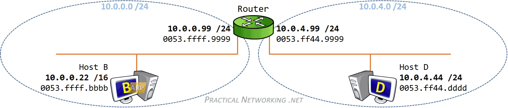

ARP 代理只响应那些在自己的路由表里能找到的网段，而不是用自己的 MAC 地址响应主机所有的 ARP 请求。

我们大部分的流量不都是通过网关发出去的吗？难道只要是跨局域网通信都会用到代理 ARP 吗？事实上不是这样的，如果用 Wireshark 抓包，你会发现当你 Ping 外网地址的时候，并不会抓到路由器的代理 ARP 响应包，这是因为当**主机配置默认路由**时，该 ARP 请求直接请求的就是网关的 MAC 地址，并不涉及代理 ARP，在配置了网关的设备上是不会出现代理 ARP 问题的。

那什么情况下会用到 ARP 代理？注意我们的例子中主机 B 上的子网位数的配置，似乎只有在这种“怪异”的场合才会用到代理 ARP，B 和 D 通信，B 以为 D 在自己的子网内，便直接发 ARP 请求，路由器接到这个 ARP 请求，然后发现请求的 IP 地址在自己直连的网段中（在路由表中能找到），这样，就用 0053.ffff.9999 接口响应了这个 ARP 请求，完成了代理 ARP。

### NAT 中的 ARP 代理

前面我们讨论了代理 ARP 在未正确配置网关主机中的用例，如果主机正确配置了网关，那么几乎不会产生代理 ARP。但是，**代理 ARP 有一个非常合法且必要的用例，它与网络地址转换 (NAT)有关**。

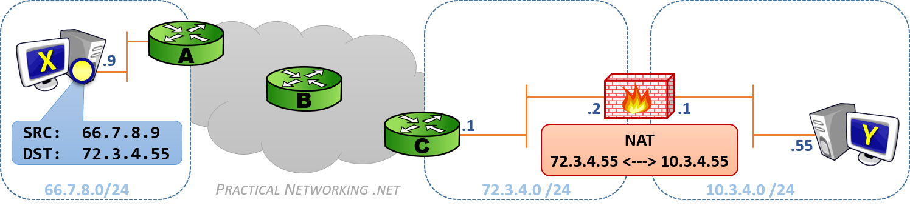

我们的防火墙在 72.3.4.0/24 网络中的 IP 地址为 72.3.4.2，同时还配置了静态 NAT，可将 IP 地址 72.3.4.55 转换为 10.3.4.55，这个 IP 地址属于主机 Y，Y 的内网 IP 地址为 10.3.4.55，主机 X 是使用 IP 66.7.8.9 在互联网另一端的某个主机。

如果主机 X 向主机 Y 发送了一个数据包（源 IP 66.7.8.9，目的 IP 72.3.4.55），该数据包通过 Internet 路由到达路由器 C。路由器 C 向 72.3.4.0/24 网络发起 ARP 请求以确定拥有 IP 地址 72.3.4.55 的 MAC 地址。

但是，防火墙已配置为将数据包从 72.3.4.55 转换为 10.3.4.55 的 NAT，它知道它必须接收发往 72.3.4.55 的数据包，以便将数据包传递到主机 Y。因此，**防火墙将使用代理 ARP** 代表主机 Y 响应路由器 C 对 IP 地址 72.3.4.55 的 ARP 请求。

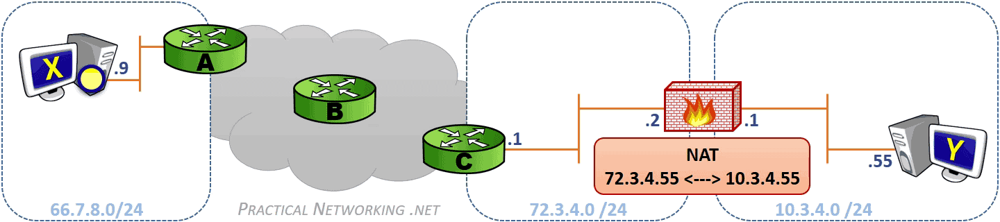

> 在 10.3.4.0/24 网段上，从 NAT 接口 10.3.4.1 到 主机 Y 10.3.4.55 还会发生一次正常的 ARP 过程。

### ARP 欺骗/攻击

ARP 是一个简单的一问一答式协议，并且是无状态协议，网络主机将自动缓存它们收到的任何 ARP 答复，无论网络主机是否请求它们，接收到新的 ARP 应答数据包后，即使尚未过期的 ARP 条目也将被覆盖。同时由于缺乏任何安全验证措施，也使得坏人可以通过 ARP 欺骗/毒化/攻击  (ARP spoofing/poisoning/attack) 控制你的网络流量。

如果说 ARP 代理是网关欺骗了 ARP 请求的发送方，冒充了通信的接收方；那么 ARP 欺骗就是坏人欺骗了接收方，冒充了 ARP 请求的发送方，当接收方给发送方发数据时，可以将数据包转给发送方达到偷听效果，或是篡改数据包达到伤害效果，或是什么也不做，达到发送发断网效果。

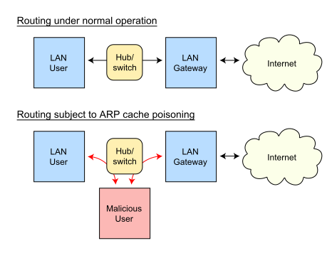

攻击者聆听局域网上的 MAC 地址。它只要收到两台主机洪泛的 ARP Request，就可以进行欺骗活动。

- User、Gateway 都洪泛了ARP Request，攻击者现在有了两台主机的 IP、MAC 地址，开始攻击。
- 攻击者发送一个ARP Reply 给 Gateway，把此包的 Sender IP 设为 User IP ，Sender MAC 设为攻击者自己的 MAC 地址。
- Gateway 收到 ARP Reply 后，更新它的 ARP 缓存，把缓存条目 (IP_User, MAC_User) 改为 (IP_User, MAC_Malicious)
- 当 Gateway 要发送数据包给 User 时，它根据 ARP 缓存来封装数据帧报头，把目的 MAC 地址设为 MAC_Malicious，而非 MAC_User。
- 当交换机收到 Gateway 发送给 User 的数据包时，根据此包的目的 MAC 地址 (MAC_Malicious) 而把数据包转发给攻击者。
- 攻击者收到数据包后，可以把它存起来后再发送给 User，达到偷听效果。攻击者也可以篡改数据后才发送数据包给 User，造成伤害。

## DNS

### 层次符号名称

最初为 LAN 开发的操作系统 (NetBIOS, Microsoft Windows, IBM OS/2) 采用了**平面符号名称**，因为 LAN 中的计算机通常较少。为了建立符号名称到 MAC 地址的映射，采用了广播请求机制，与 ARP 类似。但对于采用 TCP/IP 栈的大型、地理分布广泛的网络，这样的方法是不行的。

TCP/IP 栈采用的是 DNS (Domain Name System) 域名系统，它是一种组织成**域层次结构**的计算机和网络服务命名系统。域名的层次与文件系统的文件名层次相类似，名称始于树根，用 `.` 表示

### 基本功能

DNS 作为一个分布式数据库，提供**将主机名和域名转换为 IP 地址**的服务，能够使人更方便的访问互联网。DNS 是一个应用层协议，使用 **TCP/UDP 端口 53**。

### DNS 解析


### DNS 缓存

为了加速查询 IP 地址的过程， DNS 服务器为经过他们的所有响应广泛采用缓存机制，为了使 DNS 服务器及时地处理网络中发生的变化，响应只在短时间内被缓存，通常为几小时到几天。


### DNS over TLS

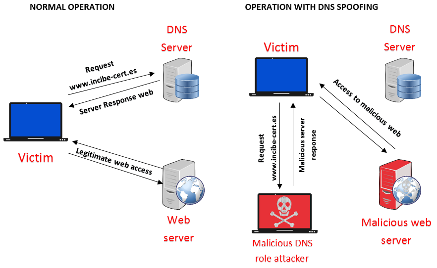

[RFC 7858 - DNS over TLS](https://tools.ietf.org/html/rfc7858) 可以解决这个问题。

## DHCP

动态主机设置协议 (Dynamic Host Configuration Protocol, DHCP) 是一个用于 IP 网络的网络协议，位于 OSI 模型的应用层，使用 **UDP** 协议工作，主要有两个用途：

- 用于内部网或网络服务供应商自动分配 IP 地址给用户
- 用于内部网管理员对所有电脑作中央管理

动态主机设置协议 DHCP 是一种使网络管理员能够集中管理和自动分配 IP 网络地址的通信协议。在 IP 网络中，每个连接 Internet 的设备都需要分配唯一的 IP 地址。DHCP 使网络管理员能从中心结点监控和分配 IP 地址。当某台计算机移到网络中的其它位置时，能自动收到新的 IP 地址。

DHCP 使用了租约的概念，或称为计算机 IP 地址的有效期。租用时间是不定的，主要取决于用户在某地连接 Internet 需要多久，这对于教育行业和其它用户频繁改变的环境是很实用的。透过较短的租期，DHCP 能够在一个计算机比可用 IP 地址多的环境中动态地重新配置网络。DHCP 支持为计算机分配静态地址，如需要永久性 IP 地址的 Web 服务器。

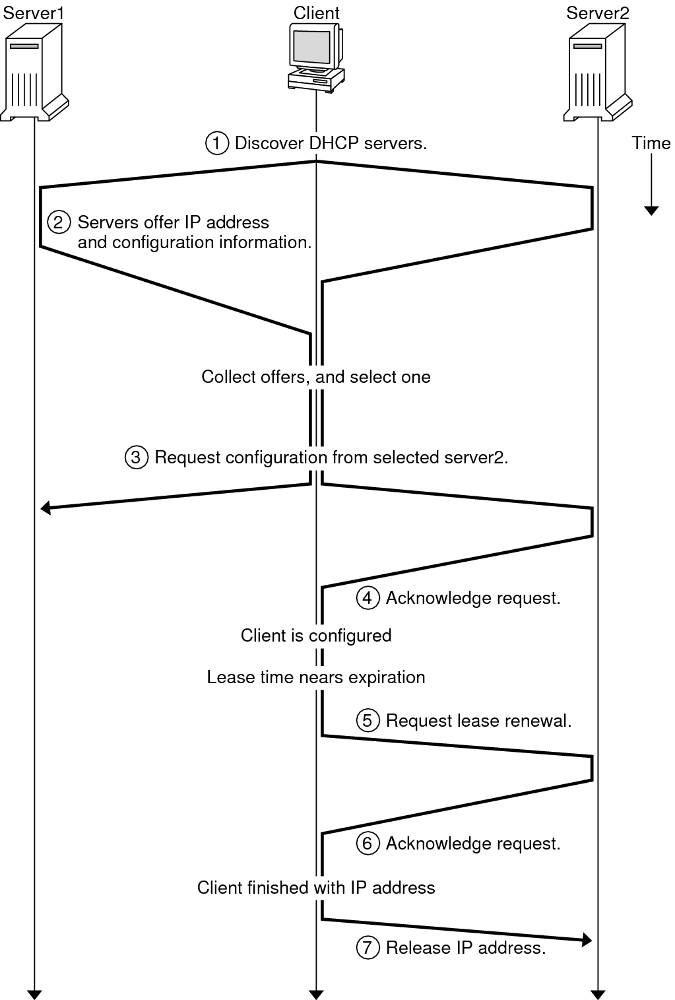

详细解释参阅 [How DHCP Works](https://docs.oracle.com/cd/E37838_01/html/E61005/dhcp-overview-3.html)

## 参考

- [Address Resolution Protocol](https://en.wikipedia.org/wiki/Address_Resolution_Protocol#ARP_spoofing_and_Proxy_ARP)
- [Network address translation](https://en.wikipedia.org/wiki/Network_address_translation#DNAT)
- [NAT Traversal](https://en.wikipedia.org/wiki/NAT_traversal#Network_address_translation)
- [ARP spoofing](https://en.wikipedia.org/wiki/ARP_spoofing)
- [Traditional ARP](https://www.practicalnetworking.net/series/arp/traditional-arp/)
- [Proxy ARP](https://www.practicalnetworking.net/series/arp/proxy-arp/)
- [Gratuitous ARP](https://www.practicalnetworking.net/series/arp/gratuitous-arp/)
- [ARP Probe and ARP Announcement](https://www.practicalnetworking.net/series/arp/arp-probe-arp-announcement/)
- [ARP Use case](https://www.erg.abdn.ac.uk/users/gorry/course/inet-pages/arp.html)
- [DNS 解析流程](https://aws.amazon.com/cn/route53/what-is-dns/)
- [Protect your DNS requests with DNS over TLS](https://www.incibe-cert.es/en/blog/protect-your-dns-requests-dns-over-tls)
- [Dynamic Host Configuration Protocol](https://en.wikipedia.org/wiki/Dynamic_Host_Configuration_Protocol)
