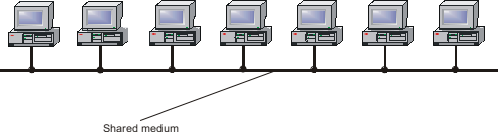
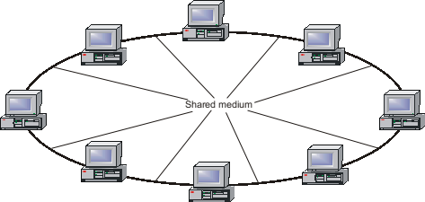
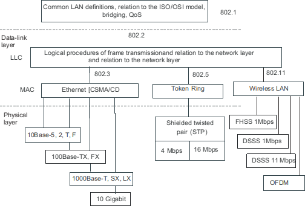
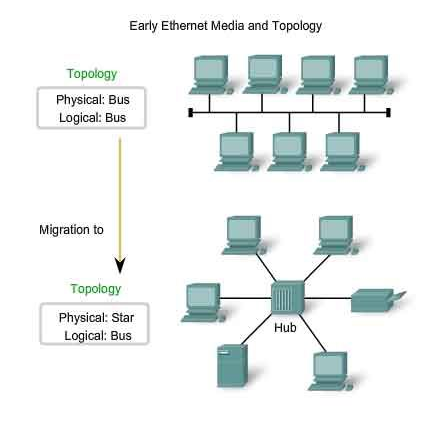
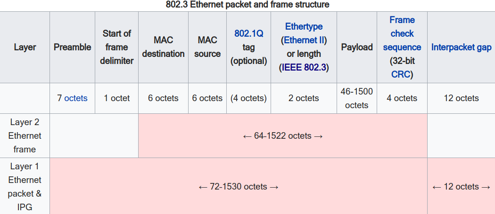

# 局域网

局域网 (Local Area Networks, LANs) 是当代所有计算机网络的重要组成部分。如果观察某个广域网 (WAN) 的结构，例如 Internet 或者一个大规模企业网，你会发现，**几乎所有的网络信息资源都集中在局域网 (LAN) 中，广域网只是连接众多 LAN 的传输器。**

## 局域网简介

### LAN 的目的

目前，组建 LAN 的目的大概有三种 (互相不冲突)：
1. 连接计算机，提供局域网内计算机间的数据交换。如：某个企业组成的内网，通过内网公司内的计算机可以进行互相访问。
2. 连接广域网，提供局域网内计算机和 Internet 的连接。组建因特网访问是为了整个 LAN 而不是某个用户。
3. 连接电信网。例如，电话和传输网。

LAN 技术经历了相当长的发展，从共享 LAN 到交换 LAN，技术层出不穷。 如今，LAN 有着小型化的趋势，一种新的网络个域网 (Persona Area Network, PAN) 已经出现，主要用来连接几百米内的个人用户电子设备。

现代 LAN 几乎被一个完整的网络技术系列所统治：**以太网 (Ethernet)**。除了大名鼎鼎的以太网，LAN 还包括**令牌环**、**光纤分布式数据接口 (FDDI)** 和 100VG-AnyLAN (目前已淘汰)。

### LAN 的产生 - 共享介质
在20 世纪 70 年代末，早期 LAN 研究人员的目标是找到一种**简单而又廉价**的方法，连接一个较小区域（比如一栋大楼）内的数百台计算机，使它们成为一个计算机网络。在初期，并不考虑将 LAN 连接到广域网的问题。

而如今，**LAN 最重要的目的之一是连接计算机**，这些计算机在一栋楼中（或彼此很近），通过本地服务器，提供网络用户信息访问功能。同时，**LAN 也提供一种简便的方法将计算机分组连接到广域网 (如 Internet)** ，例如，火车站或家庭 LAN，这种 LAN 的主要目的并不是为了本地用户间彼此进行数据交换，而是使得本地用户可以访问因特网而已。

为了简单化，早期 LAN 的研究人员决定使用**共享数据传输介质 (shared data transmission media)** 。所谓共享介质可以是**无线电信道**，也可以是**同轴电缆**。

20 世纪 70 年代初，夏威夷大学首次使用 ALOHA 无线电网络测试这种技术。所有发送端共用某个频带进行数据传输，这个特殊频带的无线电信道就是一个共享介质。

不久以后，这种思想被用于**有线 LAN**。一个连续段的同轴电缆就如同一个共用的无线介质，所有计算机都连接到这个段，当有一个传送器发送信号时，所有接收器都接受到信号，就好像无线电波一样。例如，一个同轴以太网的星型拓扑大致如下图所示。

在令牌环和 FDDI 中，共享介质同以太网不同，这些网络基于**物理环路的拓扑结构**，每个节点通过电缆与另外两个节点相连，由于任何时候只有一台计算机可以使用环路传送数据，因此，这些电缆是共享的。

使用共享介质，优点是**简化了网络节点的操作逻辑**。因为某个时间只能有一次数据传输，就没有缓存、转接节点、流量控制和拥塞控制了。

共享介质的主要缺点是**可延拓性差 (poor scalability)** 。共享介质的利用率超过一定阈值，访问介质的队列开始非线性增加，网络实际上变得不可用。ALOHA 很低，大概是 18%，以太网大约为 30%，令牌环和 FDDI 约为 60%~70%。

目前仍然使用广泛的共享介质局域网有：
- 无线局域网 IEEE 802.11 
- 蓝牙个域网
- 使用集线器连接的以太网

### LAN 的发展 - 共享和交换
实际上，20 世纪 80 年代的所有技术都是在物理层使用**共享介质** (shared media) 方法连接计算机。20 世纪 90 年代，LAN 开始引入交换技术。交换 LAN 和共享 LAN 使用的协议是一样的，只是采用**全双工**的工作方式。尽管交换 LAN 十分流行，但共享技术仍然经常用于新旧技术中，**因此，共享和交换并不是替代关系，两种技术是共存的。**

目前，**LAN 交换机**已经十分流行，以至于非网络人员基本也听过交换机的大名。但交换机本质上并没有改变 LAN 共享介质的性质，而是通过将 LAN 划分为不同的**微网段** (microsegment)，其中虽然微网段仍然是共享介质的，但每一个主机都会直接接入交换机的一个端口，因此个人、家庭使用的以太网局域网已经几乎没有共享介质。

## 局域网协议栈

LAN 技术仅仅执行 OSI 模型的最低两层功能，即**物理层**和**数据链路层**功能。

但 LAN 中的节点仍然支持数据链路层之上的协议，这些协议安装在网络节点中并通过它们执行。其实，网络节点的功能与特定 LAN 技术没有关联。网络和传输协议对于 LAN 节点是必须的，因为 LAN 节点要和其他 LAN 节点通信，其路径可能包括 WAN 链路，因此需要有网络层的协议转换，当然，如果能保证通信仅限于单个 LAN，那么应用层可以直接操作数据链路层。但这种受限的通信能力无法满足实际需求，因此，每个连接到 LAN 的计算机都支持整个协议栈。

因此，一种网络协议通过逻辑链路控制层 (LLC) 执行，LAN 中的数据链路层也分为两个子层：
- 逻辑链路控制层 (LLC)：通过**操作系统中的软件模块**执行。
- 介质访问控制层 (MAC)：通过**硬件 (网络适配器)** 和**软件 (网络适配器驱动程序)** 执行。

### MAC 层
主要功能：
- **保证访问共享介质**
- 使用物理层设备的功能在**端节点间传送帧**

共享介质的访问方法有：
- 随机访问 (Random access)，基于分散式 (decentralized)
- 确定访问 (Deterministic access)
    - 令牌传递 (Token passing)，基于分散式 (decentralized)
    - 轮询 (Polling)，通常基于集中式 (centralized)，也可以基于分散式 (decentralized)

帧的传送由 MAC 层执行，与所选访问方式无关。
- 帧格式化 (Frame formatting)。这个阶段，帧字段填满从高层获得的信息，包括源地址和目的地址、用户数据和高层协议代码，创建完成后，计算校验和并放入对应字段。
- 帧传输到介质 (Frame transmission into the medium)。帧创建后，当节点访问共享介质时，MAC 层把帧传送到物理层 。
- 帧接收 (Frame reception)。

### LLC 层
主要功能：
- 建立与它相邻的网络层的接口
- 按预定的可靠性级别确保帧传输

LLC 的接口功能 (interface function) 包括在 MAC 层和网络层之间传送用户和控制数据。

LLC 的第二个功能：**确保可靠的帧传输 (ensuring reliable frame delivery)** 。LLC 协议支持多种操作模式，提供不同的运输服务质量，LLC 向高层提供三种类型的运输服务：
1. LLC1 - 无需发送确认的无连接服务。与 MAC 相似，因此整个 LAN 技术使用**数据报模式**操作，出错后恢复由高层协议执行。**在 TCP/IP 协议栈中，确保可靠数据传送的任务由 TCP 执行，LLC 总工作在 LLC1模式下。**
2. LLC2 - 具有出错和丢失帧恢复功能的面向连接的服务。传输前建立逻辑连接，LLC2 使用滑动窗口算法实现。
3. LLC3 - 带发送确认的无连接服务。LLC1 和 LLC2 的折中，**无需确认连接但要确认接收**。

### IEEE 802.x 标准
IEEE 802委员会负责 **LAN 技术的标准化**，其成果为 IEEE 802.x 标准体系。每个工作组专注于一个领域，并分配一个代号，如 802.x，其中 x 为数字；其下协议命名为 802.xy 协议，y 为英文字母。

## 以太网

**以太网 (Ethernet) 是当今最常用的 LAN 标准**，同时也是第一个建议使用共享介质进行网络访问的技术。

以太网这一术语一开始作为一种传输速率为 **10Mb/s 的数据传输网络标准**而成为 DEC、Intel 和 美国施乐公司的**专用标准**，后来被 IEEE 802.3 工作组标准化，从此成为**国际标准**。随着**传统以太网 (10Mb/s)** 的普及，后续出现了**快速以太网 (100Mb/s)、千兆以太网 (1000Mb/s)、10G以太网 (10000Mb/s)** 。所以，以太网这一术语代表着多重含义。

介质访问控制 (MAC) 作为介质共享算法是任何 LAN 技术中最重要的特性，**以太网使用随机访问方法作为介质共享机制**。
### 以太网历史

以太网技术起源於施樂帕洛阿尔托研究中心的先锋技术项目。人们通常认为以太网发明于1973年，当年鲍勃.梅特卡夫 (Bob Metcalfe) 给他PARC的老板写了一篇有关以太网潜力的备忘录。但是梅特卡夫本人认为以太网是之后几年才出现的。在1976年，梅特卡夫和他的助手David Boggs发表了一篇名为 以太网：區域计算机网络的分布式封包交换技术的文章。

1979年，梅特卡夫为了开发个人电脑和局域网离开了施乐 (Xerox) ，成立了3Com公司。3Com对DEC、英特尔和施乐进行游说，希望与他们一起将以太网标准化、规范化。这个通用的以太网标准于1980年9月30日提出。当时业界有两个流行的非公用网络标准令牌环网和ARCNET，在以太网浪潮的冲击下他们很快萎缩并被取代。而在此过程中，3Com也成了一个国际化的大公司。

梅特卡夫曾经开玩笑说，Jerry Saltzer为3Com的成功作出了贡献。Saltzer在一篇与他人合著的很有影响力的论文中指出，在理论上令牌环网要比以太网优越。受到此结论的影响，很多电脑厂商或犹豫不决或决定不把以太网接口做为机器的标准配置，这样3Com才有机会从销售以太网网卡大赚。这种情况也导致了另一种说法“以太网不适合在理论中研究，只适合在实际中应用”。也许只是句玩笑话，但这说明了这样一个技术观点：通常情况下，网络中实际的数据流特性与人们在局域网普及之前的估计不同，而正是因为以太网简单的结构才使局域网得以普及。梅特卡夫和Saltzer曾经在麻省理工学院MAC项目 (Project MAC) 的同一层楼工作，当时他正在做自己的哈佛大学毕业论文，在此期间奠定了以太网技术的理论基础。

### 以太网发展
以太网的发展包括：提高带宽、改进媒体访问控制技术以及使用多种物理层媒介等。LAN 的发展经历了从共享介质到交换式，以太网的发展大致可以分为四个阶段，**但本质上也是从共享介质到交换式**。

- 共享介质 (shared media) -- 共享
- 使用中继器和集线器 (repeaters and hubs) -- 共享
- 桥接和交换(bridging and switching) -- 共享和交换
- 高级网络 (advanced networking) -- 共享和交换

### 以太网类型

随着发展，以太网形成了多种类型，各类以太网的差别主要在**通信速率**和**物理介质规范 (通信媒介，或者说线材)** 。其中，速度从 10 Mbit/s 到 100 Gbit/s，甚至如今 (2018年) 期待的 400 Gbit/s，物理媒介有**同轴电缆、双绞线、光纤**等。**因此，同样的网络协议栈软件可以在大多数以太网上运行。**依据速度，大致可划分为：
- 早期的以太网：以太网的雏形，在公司内部使用，速率为 1Mbps，如今大部分规格已经过时。
- 10Mbps 以太网 (传统以太网)：IEEE 标准化的以太网。
- 100Mbps 以太网 (快速以太网)：IEEE 在 1995 年发表的网络标准，能提供达 100Mbps 的传输速度
- 1Gbps 以太网 (千兆以太网)
- 10Gbps 以太网
- 100Gbps 以太网

尽管类型不同，但从 100BASE-TX 以后，以太网引入了**自动协商 (autonegotiation) **技术，两个通信设备之间可以协商共同的传输参数，例如包括速度和双工模式等，这保证了不断向前发展的协议和标准可以后向兼容 (backward compatible)，提升了网络的健壮性。

使用最多的规范分别是 **10BASE-T**，**100BASE-TX**，和 **1000BASE-T**，均使用**双绞线 (twisted pair cables)** 和 **RJ45 水晶头接口 (8P8C modular connectors, or RJ45)** ，运行速度分别为 10 Mbit/s，100 Mbit/s，和 1 Gbit/s。

光纤以太网 (Fiber optic variants of Ethernet) 在大型网络中也十分常见，旨在提供**更高性能，更好电气性能隔离，长距离通信**的网络。

同时，千兆以太网速度之上的网络，如，10G 以太网，通常与更低速的网络有较大的不同，需要特别关注。

对于阅读本文的以太网初学者，不需要过多关注以太网物理层特性 。

### 以太网拓扑
以太网的标准拓扑结构为**总线型拓扑**，但当前的高速以太网 (100BASE-T、1000BASE-T标准) 为了减少冲突，将能提高的网络速度和使用效率最大化，使用交换机 (Switch hub) 来进行网络连接和组织。如此一来，以太网的拓扑结构就成了**星型**；但在逻辑上，以太网仍然使用**总线型拓扑和CSMA/CD (Carrier Sense Multiple Access/Collision Detection，即载波多重访问/碰撞侦测) 的总线技术**。

如今的大型高级以太网，存在交换机层级结构，这时网络拓扑可能是**树型**，但逻辑上每一段仍然是总线型，总体大致可以看做总线型。其实，拓扑本质并没有改变。

### 以太网帧结构
IEEE 802.3 定义的以太网标准提供了 MAC 层帧格式，又因为在 IEEE 802.2 标准中，**MAC 帧必须包含 LLC 层帧**，因此，按照 IEEE 标准，以太网只能使用**一种数据链路层帧**，帧头是 MAC 子层和 LLC 子层帧头的组合。

然而，实际上以太网使用四种帧格式。下列是一些最流行的，IEEE 802.3 委员会的成果：
- **以太网 DIX / 以太网 II (Ethernet II frame, or Ethernet Version 2, or DIX frame)**
- 原始 802.3 (Novell raw IEEE 802.3)
- IEEE 802.3 以太网 (802.3/802.2, or IEEE 802.2 Logical Link Control (LLC) frame)
- 以太网 SNAP (IEEE 802.2 Subnetwork Access Protocol (SNAP) frame)

帧的差异导致不兼容，然而，今天，所有的网络适配器和他们的驱动器、网桥、交换机或路由器都能执行所有用到的以太网帧格式，必要的识别是自动执行的。

现在使用最广的是第一种帧头格式，共计 14 字节，包括：

- 目的 MAC 6 字节
- 源 MAC 6 字节
- 类型 2 字节

其中 MAC 地址表示形如 `0c:06:01:03:fb:34`。

## 交换网络高级特性

### 网桥和交换机

全双工 LAN 

自学习算法

### 生成树算法

### 链路聚合算法

### 虚拟局域网

## 无线局域网

## 蓝牙网络

## 其他局域网

### 令牌环

### FDDI

