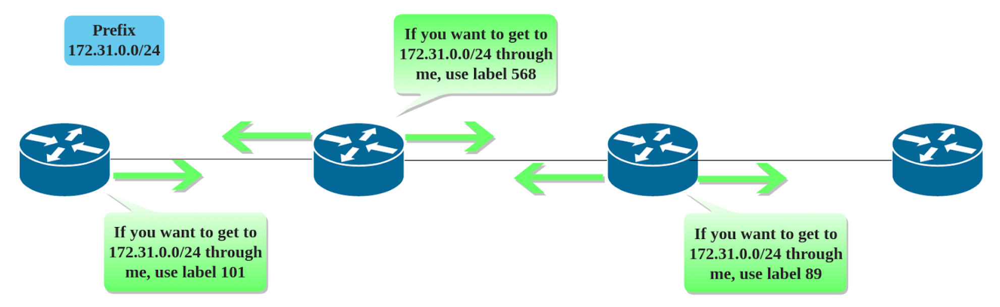
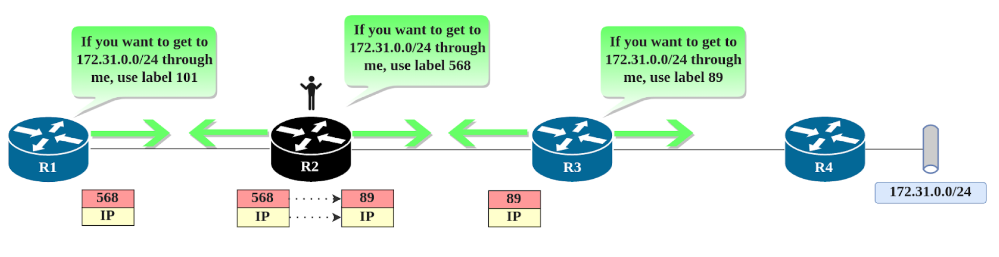
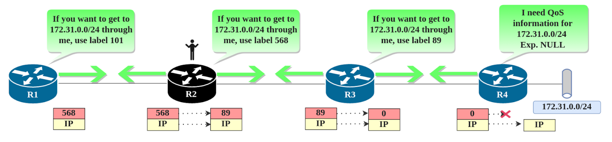
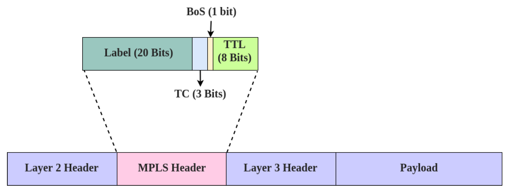

# MPLS

多协议标签交换技术 (Multi Protocol Label Switching, MPLS) 

A frequently mentioned term that causes buzzing in some ears and intrigue in others is MPLS. Multi Protocol

Label Switching is a complex technology whose functioning relies in sharply calibrated mechanisms working

together, resembling the internal mechanics of Swiss watch. In this blog post, I intend to introduce you to

this technology, not reinventing the wheel, but to make it simpler, as building towers with plastic blocks.

 

Before getting into the nitty-gritty of MPLS, let's talk about what it is, from where it came, and why it is so popular.

## MPLS 起源

上世纪 90 年代，各大 ISP开始部署 Frame Relay、ATM 以及 IP-over-ATM 网络，各种技术层出不穷的原因很简单：需要更高的吞吐量和更低的延迟！

ATM’s method of transport was based on virtual circuits that were identified using a pair of simple values

named Virtual Paths (VPs) and Virtual Channels (VCs). Each switch had to check the header of the cell (ATM’s

type of frame with a fixed length) to determine the next hop based on VPI/VCI values. The forwarding decision

process was rather simple: For every port, an ATM switch maintained a table with each row saying: “If a

cell comes in with this particular VPI/VCI combination, rewrite it to the following VPI’/VCI’ combination and

send it out this interface”. It was the task of signalling in ATM to make sure that for a pair of communicating

endpoints, these forwarding tables in adjacent ATM switches would neatly point to each other - the outgoing

VPI/VCI combination of an upstream ATM switch would match the expected incoming VPI/VCI combination

of the adjacent downstream switch along the entire path. 

Frame Relay used DLCIs (Data Link Connection Identifiers) instead, which were, as with ATMs VCs, locally significant values for each router. Transport

was possible by matching and rewriting simple values between devices, instead of creating any kind of

mapping or association, or even changing the frame format, simplicity made it very efficient and attractive.

帧中继改用 DLCI（数据链路连接标识符），与 ATM VC 一样，它是每个路由器的本地有效值。通过在设备之间匹配和重写简单值来实现传输，而不是创建任何类型的映射或关联，甚至更改帧格式，简单性使其非常高效和有吸引力。

IP forwarding on the other hand, required a router to receive the frame, open the IP packet and compare

the destination IP with its routing table, looking for an entry that matched the destination IP in the

longest possible prefix. The first lookup might not have sufficed, though. The routing table entry might

have only contained a next hop IP address without an outgoing interface information, and so the router

would need to perform another lookup, this time for the next hop IP address. This recursion process

could potentially take several iterations until a routing entry would be found that pointed out a specific

interface. Then the router had to consult the ARP (or any other Layer3-to-Layer2 mapping) table to

understand what Layer2 address should be used when forwarding the packet through the immediate

next-hop. Only after all this process, the router was (finally) able to send a packet out. This way of routing

IP packets was also called process switching, and was the basic mode to perform IP routing functions.

 

What was the difference between ATM or Frame Relay, and IP routing? Forwarding simply by doing exact

matching between integers was easier than performing a set of operations for process switching that

were CPU intensive, specifically for IP and its longest prefix matching. In addition to that, IP forwarding

was usually done in software, since constructing a device to perform these actions in hardware instead

was expensive and difficult. For ATM and Frame Relay, their address values were of fixed lengths, able

to be used straight away without any additional computation. This made them considerably easier to

implement in hardware and the overall forwarding process was swift and less painful. Implementation of those

technologies showed in comparison: reduced delay, bottlenecks in the CPU and no long lasting processes.

 

有人试图将 IP 和 ATM 结合起来，这就是 IP-over-ATM 出现的方式。但是将两个协议站在街道两侧的协议（每个协议都有自己的堆栈）交织在一起变得复杂。可扩展性限制和复杂的互操作性迟早会使其成为一个挑战，而一切都在时间流逝，行业需要解决方案。

在接下来的几年中，不同的供应商构思了几种解决方案，称为多层交换，其工作方式与他们试图成功的前身类似。但是，他们都未能达到这一里程碑。1997年，IETF决定成立一个工作组，创建一个可互操作的多层交换标准。它是利用一个聪明的想法创建的，这个想法在过去看起来很有前途，并且以类似的方式用于以前的WAN协议：标签！

Several solutions were conceived by different vendors in the following years, called multilayer switching, working in a similar way as the predecessor they were trying to succeed. But, none of them were able to reach that milestone. In 1997, the IETF decided to start a working group to create an interoperable multilayer switching standard. It was created making use of a clever idea that looked promising in the past and was in place in a similar way for previous WAN protocols: labels!

 

MPLS became quickly a must and its adoption was increasing over the time, until now, when it’s the

facto standard for Service Providers. Nowadays, thanks to advances in hardware engineering, there

is really no difference in performance between forwarding based on IP addresses or labels, as it is

all done in hardware, yet the real tangible value lies in what you can build using MPLS and what it is

able to support. Its scalability and interoperability, along with the services and infrastructures you can

run on top of it, made it a key tool to drive businesses and networks to a new horizon.

现在我们知道为什么 MPLS 变得流行，那么它是如何工作的呢？MPLS 的工作方式与书签类似：它告诉路由器在路由表中的确切位置

查找特定前缀。通常，路由器需要在其路由表中执行逐行查找对于特定条目，以便它可以正确转发/路由数据包，但是，如果可以阻止这种努力怎么办

从发生超过需要的事情？如果有书签怎么办？是的！这就是MPLS所做的。

And now that we know why MPLS became popular, what about how it works?

MPLS works in a similar way as bookmarks do: It tells routers where exactly in the routing table to

look for an specific prefix. Usually, a router needs to perform a row-by-row lookup in its routing table

for a specific entry so it can forward/route a packet properly but, what if that effort could be prevented

from happening more than needed? What if a bookmark was available? Yes! That’s what MPLS does.

当路由器启用了 MPLS 时，它将**为其路由表中的每个前缀分配一个唯一的编号**。一旦分配了编号，路由器便会将这些信息向所有邻居传送，消息类似于：“前缀 X.X.X.X 在我的路由表中位于 Y 行中，因此，如果您想将我用作 X.X.X.X 的下一跳，请在该数据包上贴上带有数字 Y 的标签，以便我可以立即跳转到第 Y 行并更快地转发数据包”。于是，所有邻居路由器都知道了：发往该路由器的 X.X.X.X 网段数据包，只需要使用 Y 标记即可通过该路由器正确转发。

因此，整个交换可以通过事先在两个路由器之间传递整数（即标签）来完成，即：**每个路由器向其邻居通告分配给其路由表中每个前缀的本地标签号**。 

 

在每个路由器中，相同的前缀关联了不同的本地有效标签，并且在邻居间无差别扩散。那么标签如何在路由器之间通告呢？其中最基本的协议是**标签分发协议（Label Distribution Protocol, LDP）**。LDP 协议允许路由器之间建立连接，创建、通告以及存储标签映射，LDP 协议允许路由器之间建立会话，创建、通告和存储标签绑定，帮助填充标签信息库（Label Information Base, LIB）和标签转发信息库（Label Forwarding Information Base, LFIB）的内容。

大致流程如下：

1. 通过 Hello 报文（目的地址为 224.0.0.2，UDP 端口 646）发现运行 LDP 的路由器。
2. 通过 TCP 端口 646 建立会话连接。
3. 标签通告和接收。
4. 将标签存储在 LIB 中。
5. 通过标签表 LIB 和路由表 RIB 内容构造标签转发表 LFIB（其过程类似于 IP 转发中通过路由表 RIB 构造转发表 FIB）。
6. 会话保持（发送保活、更新和错误信息）。

在上述过程中，构建 LFIB 和 LIB 是最小化转发延迟的关键部分。让我们快速描述它们，以便我们可以清楚地了解它们。

在 LIB 中， 

To define the LIB, we need to remember in which way the labels are advertised, indiscriminately, without paying attention what prefix and label is being advertised and who is or is not the next hop for it. When a router binds a prefix with a label number, that association is called local binding for that router. Any binding received from another router, is called remote binding (because comes from another neighbor, its not local). So, in plain words, regarding bindings, from any router’s perspective: “what is not mine (local) is remote”.

LIB 是一个数据库，其功能是存储目标网络/前缀和标签的关联关系，其中关联关系包括路由器本地产生的或者从邻居接收到的。LIB 本身不用于执行转发决策，而是指导 LFIB 的生成。

| 目标网络/前缀 | 标签 |  类型  |
| :-----------: | :--: | :----: |
| 172.31.0.0/24 | 100  |  本地  |
| 172.31.1.0/24 | 100  | 邻居 1 |
|      ...      |      |        |

当标签通告完成时，就可以进行转发了，那么不同类型的标签是如何使用呢？假设我们是路由器 R2，我们可以看到标签是如何在每个路由器中起作用的，收到的标签编号是入口标签（incoming/ingress label），发送的标签编号是出口标签（outgoing/egress label）。

通过 LDP，路由器将其本地关联向其邻居通告，同时将其他路由器通告的远程关联存储在 LIB 中。上图中，R2 向 R1 通告 `172.31.0.0/24 - 568` 关联，R1 将该关联作为远程

The way forwarding happens involves knowing local and remote bindings and thinking in perspective. Using LDP, routers advertise their local bindings to their neighbors. All bindings received through LDP will be stored as remote bindings in the LIB. For example, in the picture above, after R2 advertises the label 568 for 172.31.0.0/24 to R1, R1 will store this binding as a remote binding in its LIB. Later, R1 can use this label whenever sending packets to 172.31.0.0/24 through R2. Therefore, for a router, its outgoing label is next hop’s incoming label, and also, your outgoing label is your next hop’s local label.

 

In the same scenario we used before to explain LDP advertisements, some new details are added to see the

big picture. Now we know where the destination network is and the path we will follow: R1 -> R2 -> R3 -> R4.

 

If you place yourself on top of R2, you will see that the local label R2 has advertised for 172.31.0.0/24

earlier (568) is the label R1 uses to send the packets for 172.31.0.0/24 through R2. Since R2 does not have

172.31.0.0/24 directly connected, it has to forward the packets downstream to its own next-hop which is R3.

Because R3 (also called the downstream router) earlier advertised that its own label mapping for 172.31.0.0/24

was 89, R2 (also called the upstream router) will swap the incoming label 568 on top of that packet with the

label 89, and forward the relabeled packet to R3.

 

We can conclude that: downstream routers advertise labels that upstream routers use to send labeled

[packets.In](http://packets.in/) an analogous way as with IP routing, is not efficient to have a huge list of destinations and bindings

and when the time to forward packets comes, jump into it like a kid into a ball pit. To make this task quicker and

efficient, the LFIB is constructed.

 

To build the LFIB it requires the router to collect and combine information from multiple sources/tables. An

entry for a specific network in the LFIB would be created in several steps. First, the router would check its

routing table (RIB) to find the next hop towards that network. Then, it would check in its LIB which one is

the label advertised by that next hop (downstream router) for that prefix. Then, with that information, and its

incoming label for that prefix, the entry is built in the LFIB. The essential parts of the LFIB entry would be:

Incoming label assigned by the router itself, outgoing label learned from the proper next hop, and next hop

information.

 

Now that we have labels, tables, structures and forwarding clear, what are the operations required to move

packets here and there?

 

MPLS works relying in 3 processes when handling packets, as mentioned before, using labels. Those

operations are:

• Label Push or Imposition

• Label Swap

• Label Pop

 

When these operations are performed by a router, it is called LSR

(Label Switching Router). These functions are explained as follows:

 

Label Push: Happens when a packet arrives to a LSR and it pushes or imposes a label on top of

the IP packet, or another label, in case there is a label already on top. One of the situations where

this occurs is when a packet arrives to a MPLS capable network and will be transported through it.

 

Label Swap: This operation is performed if an LSR receives a labeled packet and it will be

forwarded to its next hop as a labeled packet. Since each LSR assigns a locally significant

label number for each destination network or prefix, forwarding them means replacing the

incoming label with the outgoing label advertised by its next hop in the remote binding.

 

Label Pop: Pop operation is implemented by removing the label from the packet,

or in the case the packet possesses more than one label, removing the top

label of the label stack (a label stack is a “pile” of labels on top of a packet).

 

If a PUSH happens when a router receives a packet that will traverse the

MPLS network, and a SWAP occurs in each intermediary hop to accommodate

downstream router label, how does a LSR know when to POP them?

 

To ensure this takes place in the correct moment, there is a mechanism called Penultimate Hop

Popping, and its implemented to pop/remove the label one hop before its destination. It works in a clever way: the LSR having the destination network directly connected or summarized, advertises

a specific label binding for that prefix using the reserved label range. Let’s take a closer look.

 

Among the numbers used for labels, the range from 0 to 15 is reserved, and some of

those numbers are used by the protocol itself to perform operations. Although there are

several label numbers in the reserved range, we will take a look to the most used ones:

 

Label Number 3 or Implicit NULL: This label number is advertised by the ultimate router (the one just

next to the destination) so that the upstream neighbor POPs the label from the packet before sending it.

The purpose is to prevent double lookups in the ultimate LSR. If a labeled packet arrived, the LSR would

have to perform a lookup in the LFIB to realize the label must be removed, and then another one, but this

time in the FIB (regular IP lookup) to find the next hop information and outgoing interface. If the label is

removed by the penultimate hop LSR, the first (and unnecessary) lookup is prevented from happening.

 

 

Label numbers 0 and 2 (IPv4 and IPv6) or Explicit NULL: Although removing the label one hop before

helps to prevent a second lookup, it also has a downside. QoS information can be poured in the MPLS

header making use of the TC (Traffic Class) bits, but, if the label is removed one hop before, the QoS

information is also lost. This label is used to prevent PHP (Penultimate Hop Popping) behavior from happening.

The explicit NULL label will be advertised by the ultimate LSR (depending on IP version - 0 for IPv4 and

2 for IPv6) and the upstream neighbor will send the packet using that number. Once it is received, the

ultimate LSR will remove the implicit NULL label and check the QoS information to forward it accordingly.

Label number 1 or Router Alert: This label is used to troubleshoot MPLS as it assures packets are

sent in “safe” mode to guarantee their arrival to their destination. When a LSR receives a packet with

label 1, it will bypass hardware forwarding and will be punted to the CPU (process switched). The label 1 is not shown in the LFIB as it is forwarded by software. The forwarding is slightly different

from the rest of the labels, because label 1 is not removed in each hop it goes through. The LSRs

will swap the labels as commonly done (using contents of LFIB) and then label 1 will be placed on

top of the existing label before forwarding, to guarantee it will be process switched by the next LSR.

 

 

目前为止，我们只是谈到了标记的数据包，现在让我们详细看看 MPLS 标签的内容及其在数据包中的位置：

如上所示，MPLS 首部长度为 32 比特（4 字节），位于二层帧头和三层包头之间，具体包括：

- Label (20 bits): Identifies the label value used by LSRs to forward the packet through a MPLS enabled network. The value range for this field is <0 - 1,048,575> (220-1).
- Traffic Class (3 bits): The traffic class field, formerly known as EXP field, is used to carry traffic class information so QoS policies can be implemented in the MPLS network by checking the value in the header.
- Bottom Of Stack (1 bit): MPLS allows multiple labels to be placed onto a packet. They are then treated as a stack; the bottom label is the one closest to the Layer 3 header, the top label is the one closest to the Layer 2 header, and LSRs always operate on the top label only (with the exception of Router Alert label). To be able to tell which label is the last one -the bottom one - the BoS bit will be set to 1 on the bottom label, and to 0 on all other labels.
- Time to Live (TTL) (8 bits): Analogous to IP forwarding, it is used to keep track of the number of hops that a labeled packet can take (or the number of routers it can traverse in its journey to its destination) before being dropped. Used as loop prevention mechanism. Range of values is <0 - 255> (28-1). Packets are forwarded and one unit it subtracted from the current value at each hop/router, this operation is repeated until it reaches its destination or the value reaches 0 (and it is dropped).

 到目前为止，我们已经讨论了有关MPLS的许多主题，一些历史和几个组件，这些组件协同工作以提供一种传输方法，其应用是当今常见且有吸引力的特征。
