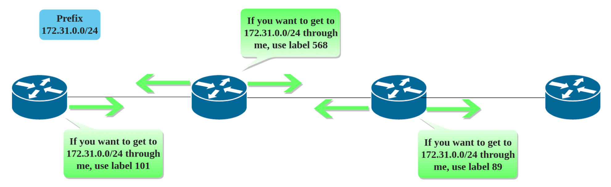
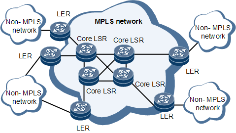
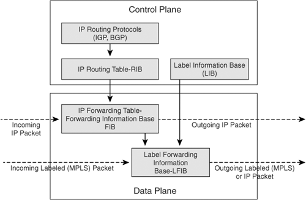
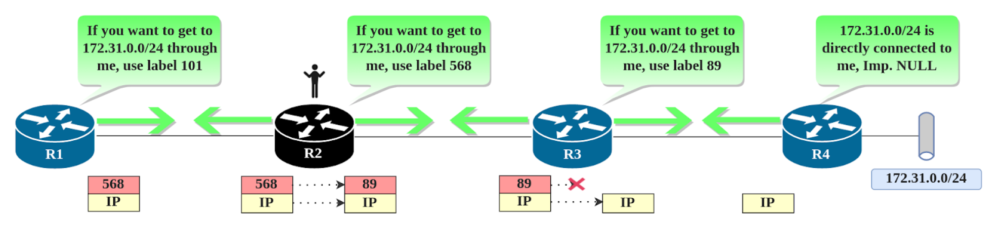
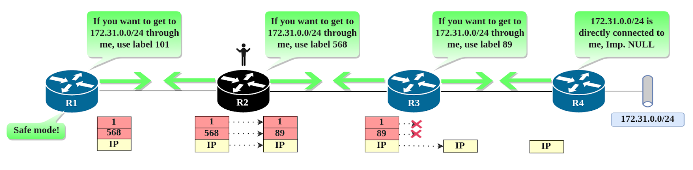

# 多协议标签交换 - MPLS

多协议标签交换技术 (Multi Protocol Label Switching, MPLS) 的发展经历了复杂的历程，本文将介绍 MPLS 的起源，以及为何是它变得广受欢迎。

## MPLS 原理

在计算机网络采用了分组交换，其中面向无连接的数据报交换被因特网所采用，最终发展成为了 IP 路由转发技术。当数据包进入 IP 网络中，每个路由器都是独立做出**路由决策**，路由决策包含两部分：

- 分类：将特定的数据包归属为一个**等价转发类**（Forwarding Equivalence Classes，FECs）。
- 查找：查找 FEC 对应的**下一跳**（next hop）。

对于 IP 路由来说，分类是依据最常掩码匹配得到的。如果两个数据包最长掩码匹配相同，则认为这两个数据包属于同一个 FEC，则转发到相同的下一跳。

具体而言，IP 路由转发步骤如下：

1. 从输入队列中取出一个数据包，检查完整性和 TTL。
2. 解封二层帧，解析三层报文头部目的 IP 地址。
3. 将目的 IP 地址与路由表项（网络地址）逐项进行逻辑与运算，若运算结果和表项相同，则认为匹配。
4. 在路由表中匹配最长掩码网络的表项，获取其出端口。
5. 使用 ARP 协议获取下一跳接口的物理地址。
6. 将三层路由报文重新封装为二层帧，将数据包放入输出队列，进而转发给下一跳路由器。

在 IP 路由转发中，实际上路由器最终目的是获取下一跳，但是 IP 数据包中并没有下一跳信息，因此只能进行解包匹配。我们可以精心构造路由表的数据结构，例如 Linux 内核使用哈希和 trie 树的查找算法来进行快速匹配，那 MPLS 是如何进行“加速”的呢？在 MPLS 网络中，**数据包可以直接告诉路由器该数据包所匹配的网络前缀在路由表中的确切位置**！数据包来临时，路由器可以取出数据包中的“书签”，直接跳转到路由表中的确切位置，这就是 MPLS 的原理。

当路由器启用了 MPLS 时，它将**为其路由表中的每个网络前缀分配一个唯一的编号**。一旦分配了编号，路由器便会将这些信息向所有邻居传送，消息类似于：“前缀 `X.X.X.X` 在我的路由表中位于 `Y` 行中，因此，如果您想将我用作 `X.X.X.X` 的下一跳，请在该数据包上贴上带有数字 `Y` 的标签，以便我可以立即跳转到第 `Y` 行并更快地转发数据包”。于是，所有邻居路由器都知道了：发往该路由器的 `X.X.X.X` 网段数据包，只需要使用 `Y` 标记即可通过该路由器正确且快速的转发。

因此整个交换可以通过事先在两个路由器之间传递整数（即标签）来完成，当网络数据包在 MPLS 网络中传输时，路由决策都是基于标签的。路由器不再需要对网络数据包进行解包，并且标签是个整数，以整数作为 key，可以达到 `O(1)` 的查找时间，大大减少了路由决策的时间。**标签**即 MPLS 中的 L，是作为网络数据包的一部分，随着网络数据包传输的。

MPLS 网络就是由支持 MPLS 的设备组成的网络，其采用什么网络协议传输并不重要。因为数据包一旦进入了 MPLS 网络，那么网络数据包的内容就不再重要，路由决策（包括 FEC 归属的计算，next hop 的查找）都是基于标签来进行的。这也就是 MPLS 中 multi protocol 的含义。

MPLS 从诞生以来因其加速转发能力而迅速发展，并且随着时间的推移，它的采用率一直在增加。如今由于硬件的进步，基于 IP 地址或标签的转发在性能上实际上没有区别，因为它都是在硬件中完成的。但 MPLS 如今已成为服务提供商的事实标准，只因**它在其他方面具备更多的价值**！它的可扩展性和互操作性，以及在其上运行的服务和基础设施，使其成为推动企业和网络迈向新视野的关键工具。

## MPLS 网络

在进行 MPLS 介绍之前，有必要对 MPLS 中的一些术语和角色做一些解释。MPLS 网络是由支持 MPLS 的互联设备（路由器）构成的网络。

- LER（Label Edge Router）：MPLS 网络的边缘设备。包括：
  - MPLS ingress node：进入 MPLS 网络的节点，也就是 MPLS 网络的入口路由器。该设备计算出 IP 协议报文归属的 FEC，并把相应的标签放入 IP 协议报文中。
  - MPLS egress node：出 MPLS 网络的节点，也就是 MPLS 的出口路由器。IP 协议报文在这里回到传统的路由系统中。
- LSR（Label Switching Router）：支持 MPLS 转发的路由器。如果一个 LSR 有一个邻接的节点在 MPLS 网络之外，那么这个 LSR 就是 LER。注意，这里的 MPLS 网络之外可以是传统路由网络或另一个 MPLS 网络。没错，MPLS 网络可以叠加，也就是 Muti Protocol 也包含 MPLS 协议自己。
- LSP（Label Switching Path）：特定的 FEC 中的 IP 协议报文所经过的 LSR 的集合。LSP 通常也被称为 MPLS tunnel。

## MPLS 转发流程

传统的路由网络中，路由器是基于路由做转发。控制面可以采用 IGP/BGP 等动态路由器协议来发现路由，也可以采用静态路由配置路由。总之，路由协议会生成**路由表**（RIB），路由表包含了所有的转发信息。接着，路由器根据路由表选出最佳路由，生成**转发表**（FIB）下发给数据面，用于 IP 转发。

对于 MPLS 网络，路由器仍然是沿着 IP 路由确定的路径进行转发，只不过是基于标签做转发（交换），MPLS 网络控制面运行**标签交换协议**（LEP），路由器可以收集标签，生成**标签表**（LIB），同时结合 FIB 生成**标签转发表**（LFIB）下发给数据面，用于标签转发。因此，MPLS 并不是独立的东西，其层级架构如图所示。

LIB 里记录了两种标签：

- 本地标签（Local label）：LSR 对路由表中的每个网络前缀分配一个唯一的本地标签，本地标签是和 IP prefix 相关的。这个标签需要告知邻居，以便于邻居可以将其封装到数据包内，这样收到该标签的数据包，就知道要去往哪个网络。
- 邻居标签（Remote label）：LSR 通过收集的其所有邻居发来的标签作为邻居标签，邻居标签即邻居的本地标签。当需要发送数据时，需要将该信息注入数据包，以便于邻居可以进行查表转发。

也就是说，每个路由器通过标签交换协议，向其邻居通告分配给自己路由表中每个前缀的本地标签号。路由器将本地标签和邻居标签存储到标签表中。

上图中，R2 向 R1 通告 `172.31.0.0/24 - 568` 关联，R1 将该关联作为远程关联存储下来，接着，R1可以使用该标签通过 R2 向 172.31.0.0/24 网络发送数据。因此对于路由器来说，其出口标签就是下一跳端口上的入口标签，也就是下一跳路由器的本地标签。当 R2 收到 R1 发送的数据时，由于 172.31.0.0/24 并不是直连网络，因此 R2 将会通过 R3 转发数据包。同 R1 一样， R3 也已经事先将其本地关联  `172.31.0.0/24 - 89` 通告给 R2，R2 此时将数据包中的 568 标签号替换为 89，然后向 R3 转发。上图中 R2 的标签表如下：

| 目标网络/前缀 | 标签 |       类型       |
| :-----------: | :--: | :--------------: |
| 172.31.0.0/24 | 568  |      Local       |
| 172.31.0.0/24 | 101  | Remote (from R1) |
| 172.31.0.0/24 |  89  | Remote (from R3) |

根据标签表和转发表，则 R2 生成的标签转发表如下：

| 入标签（本地标签） | 出标签（邻居标签） | 网络前缀（Prefix） |  下一跳（Nexthop）   |
| :----------------: | :----------------: | :----------------: | :------------------: |
|        568         |         89         |   172.31.0.0/24    | R3 与 R2 相连接口 IP |

我们发现，数据包在 R2 中转发时做了一次标签替换，然后就完成了标签转发。这个过程有点类似于 MAC 地址转发，在经过一个网段后，MAC 地址被重新改写了。其实，LSR 处理数据包时，对标签的操作包括三种：

- 标签压栈（Label Push）：数据包进入 LER 时，在 IP 数据包或另一个标签之前添加标签。
- 标签替换（Label Swap）：数据包在 LSR 中转发时，将入口标签（本地标签）替换为出口标签（邻居标签）。
- 标签出栈（Label Pop）：数据包在离开 MPLS 网络时，需要将顶层标签弹出。这样其他网络设备看到的就是正常的 IP 数据包。

## MPLS 数据包

目前为止，我们只是谈到了标签标记的数据包，现在让我们详细看看 MPLS 标签的内容及其在数据包中的位置：

如上所示，MPLS 首部长度为 32 比特（4 字节），位于二层帧头和三层包头之间，因此也常常被认为是 2.5 层协议。具体包括：

- 标签 (20 bits)：用于 LSR 转发数据包，范围是 0 至 1,048,575。
- 流量分类 (3 bits)：用于在 MPLS 中实现 QoS。
- 栈底标识 (1 bit)：MPLS 支持多标签嵌套在同一个数据包中，栈底是最靠近三层数据包的标签，栈顶是最靠近二层数据包的标签。LSR 一般只操作栈顶标签。1 表示栈底，即最后一个标签，再 POP 之后便成为正常的 IP 报文。
- 生存时间 (TTL) (8 bits):：TTL 在 IP 协议里面的作用主要是防止环路和用于 traceroute 等工具。MPLS 里面的 TTL 作用是一样的。当数据包进入 MPLS 网络，网络层中的 TTL 会被拷贝至 MPLS 的 TTL，每一次转发，TTL 减1，0 视为丢弃。数据包出 MPLS 网络，MPLS 中的 TTL 会拷贝至网络层中。

## MPLS 控制面

通过前文我们已经了解到了控制面生成的产物标签表和转发表，以及数据是如何在 MPLS 网络之间转发的。接下来将介绍标签是如何在路由器之间通告的，即标签交换协议（LEP）。

MPLS 网络架构中并没有规定一种 LEP，因为 LEP 协议所做的事情并不复杂，并且仅仅是自身与邻居之间进行通信。因此，实际上有多重实现协议：

- 标签分发协议（Label Distribution Protocol, LDP）
- MP-BGP
- RSVP
- ...

这些协议都规定了下游 LSR 如何将本地标签通告给上游 LSR。这样上游 LSR 给下游 LSR 传输 MPLS 数据包时，才知道要事先打上什么标签。本文介绍最常用的 LDP 协议。LDP 协议包含两部分：

- 组播 Hello 消息：通过 Hello 报文（目的地址为 224.0.0.2，UDP 端口 646）发现运行 LDP 的路由器。路由器使用 router id 作为 LDP 身份标识符，router id 一般设为 loopback 口的 IP。
- TCP 会话：通过 TCP 端口 646 建立会话连接，并且进行会话保持（发送保活、更新和错误信息）。会话建立在两个 router id 的 IP 之间，通过 TCP 报文交换标签信息。

综上所述，LSR 通过组播获取当前所有 LDP 邻居，然后与所有邻居建立 TCP 会话来交换 prefix-label binding，这样 LSR 就可以知道所有与自己相连的标签信息，并且在 LIB 中存储为 remote label，这样 LIB 就构建好了。

假设 R1 需要与  `172.31.0.0/24` 网段进行通信，需要沿途的 LSR 都建立好转发路径才可以，即 LSP 建立之后才可以进行通信。LSP 的建立是从终点向起点并行开始的。

R2 向上游和下游都发布了 568 的标签信息，然而该信息对于下游 R3 而言是没有用的，因为该网段在 R3 上的代价更低，不会通过 R2 进行转发，因此也不会写入标签表中。因此，虽然会交换所有的标签信息，但只有最优的才会起作用，这与路由算法相同，本质上还是路由优先算法决定的。

## MPLS 特殊标签

通过建立 LSP，数据包可以通过 LSP 顺利到达 R4，然后 R4 做两件事：

- 将标签弹出，这样就获得了一个 IP 数据包。
- 在本地路由中查找网段，发现是直连路由，然后转发至  `172.31.0.0/24` 网段中。

这样所有的 MPLS 流程就完成了，但是仍然有优化空间。MPLS 使用**特殊标签（0-15）**来实现特殊功能。

细品一下可以发现，在 上述R4 中实际上已经可以直接处理 IP 路由包了，因为该网段是直连的，不再需要 MPLS 了，因此在 R3 中就已经可以将标签弹出了，这就是**倒数第二跳弹出机制**（ Penultimate Hop Popping, PHP），通过 PHP 机制可以优化一点转发性能。

在 PHP 机制下，LSR 为直连路由生成 `Implicit NULL(3)` 特殊标签，然后通告给上游 LSR。当上游 LSR 发现出口标签是 Imp. NULL 时，也不再进行查找，便会直接弹出标签。这样最后一跳路由器在收到 IP 报文后，不再需要查找 LFIB。

PHP 机制也有一个缺陷，假如 MPLS 头中包含了 QoS 信息，即 TC 字段有效。那么 R4 收到的数据已经丢失了该部分信息。因此，R4 需要一个特殊标签用于避免这种情况发生，这就是 `Explicit NULL(0 for ipv4, 2 for ipv6)` 标签。当上游 LSR 发现出口标签是 Exp. NULL 时，直接替换为该标签。这样最后一跳路由器可以获取 QoS 信息。

另外，还有一个特殊标签 `Router Alert(1)` 用于启动安全模式，当 LSR 收到标签 1 时，其跳过硬件转发而上送到 CPU 处理，然后正常完成标签操作后，再将 1 放入标签栈顶，来保证下一个 LSR 也启动安全处理模式。

## MPLS L3 VPN

前问题过，MPLS 的转发优势已经不明显，目前其中最重要的作用就是用于构建 VPN 网络。

### 概念

MPLS L3 VPN 是 MPLS 最广泛的应用。MPLS L3 VPN又称为 **BGP/MPLS IP VPN**，由 [RFC4364](https://link.zhihu.com/?target=https%3A//tools.ietf.org/html/rfc4364) 定义。这不是某个特定的而技术或者协议，而是一些技术的集合应用。

## 参考

- [MPLS基础 - 知乎肖宏辉](https://zhuanlan.zhihu.com/p/27232535)
- [MPLS control plane - 知乎肖宏辉](https://zhuanlan.zhihu.com/p/27340628)
- [MPLS L3 VPN - 知乎肖宏辉](https://zhuanlan.zhihu.com/p/27539826)
- [RFC 3031 - Multiprotocol Label Switching Architecture](https://datatracker.ietf.org/doc/html/rfc3031)
- [RFC 4364 -  BGP/MPLS IP Virtual Private Networks (VPNs)](https://datatracker.ietf.org/doc/html/rfc4364)

