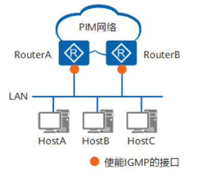
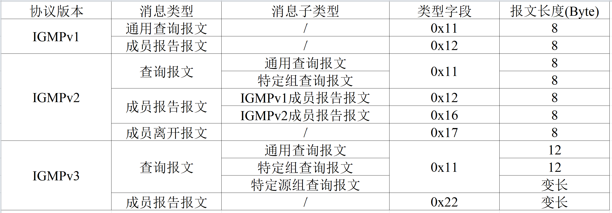
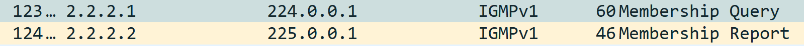
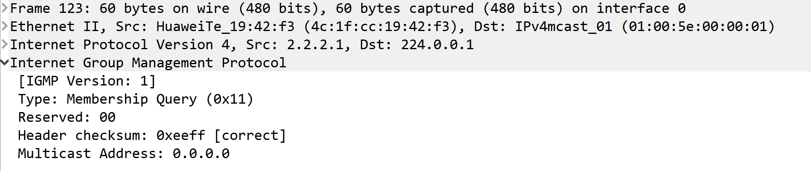
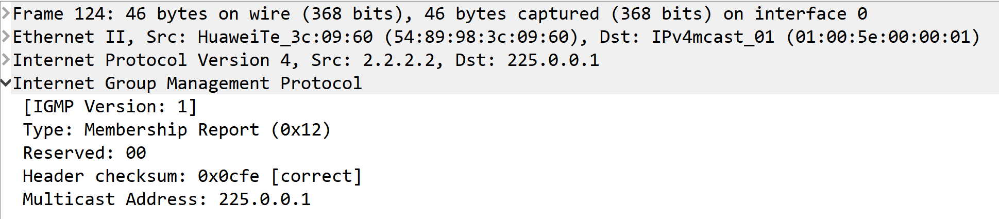
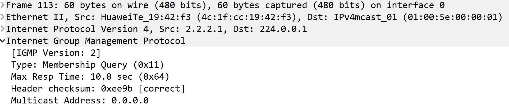
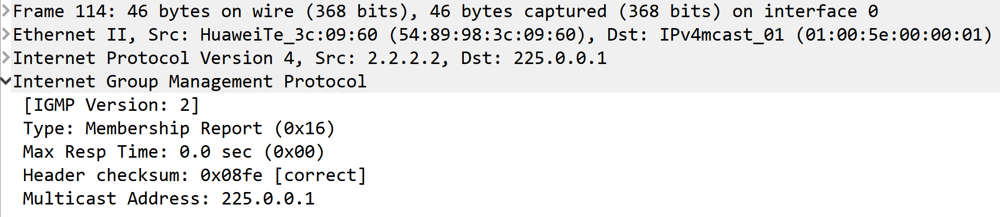
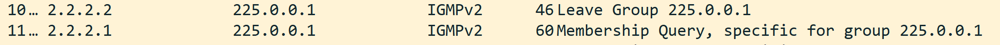
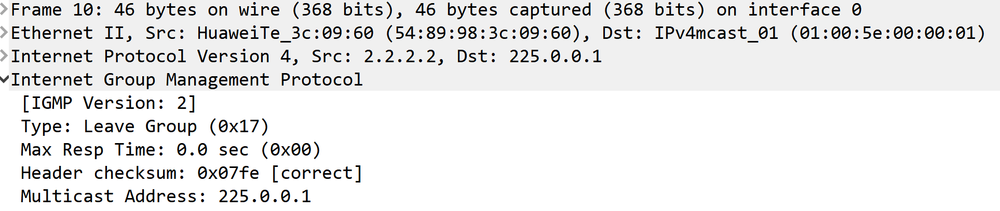
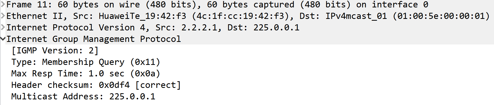

# IP 组播路由 - IGMP

IGMP（Internet Group Management Protocol）是负责 IPv4 组播成员管理的协议，运行在组播网络中的最后一段，即三层网络设备与用户主机相连的网段内。IGMP 协议在**主机端**实现组播组成员加入与离开，在上游的**三层设备**中实现组成员关系的维护与管理，同时支持与上层组播路由协议的信息交互。

到目前为止，IGMP 有三个版本：

- IGMPv1：定义了基本的组成员查询和报告过程
- IGMPv2：在此基础上添加了查询器选举和组成员离开的机制
- IGMPv3：增加的主要功能是成员可以指定接收或指定不接收某些组播源的报文。

所有 IGMP 版本都支持 ASM 模型。IGMPv3 可以直接应用于 SSM 模型。

## TL;NR

使能了 IGMP 协议的组播设备在网段中的角色有两个：

- 查询器：负责**发送查询报文**，并接收主机反馈的加入报文和离开报文，以此来了解与接收报文的接口连接的网段上有哪些组播组存在接收者（即组成员）。
- 非查询器：**只接收主机反馈的加入报文**，了解与接收报文的接口连接的网段上有哪些组播组存在接收者，并根据网段中查询器的动作确定当前网段中有哪些组播组成员离开。

## IGMPv1

IGMPv1 的工作方式十分简单，概括一下就是：查询器向网段内大喊：有没有需要加入组的？有的话请立即告诉我，现在没有想好的话，稍后谁想加入组了，请主动报告！

### 报文格式

IGMPv1 包括两种类型的报文：

- 通用查询报文（General Query）：查询器向共享网络上所有主机和路由器发送的查询报文，用于了解哪些组播组存在成员。
- 成员报告报文（Report）：主机向查询器发送的报告报文，用于申请加入某个组播组或者应答查询报文。

其格式为：

- Version（4 bit）: IGMP 版本，值为 1。
- Type（4 bit）
  - 0x1：表示普遍组查询报文。
  - 0x2：表示成员报告报文。
- Unused（1 Byte）
- Checksum（2 Byte）：IGMP 报文的校验和。校验和是IGMP报文长度（即IP报文的整个有效负载）的16位检测，表示IGMP信息补码之和的补码。Checksum字段在进行校验计算时设为0。当发送报文时，必须计算校验和并插入到Checksum字段中去。当接收报文时，校验和必须在处理该报文之前进行检验。
- Group Address (4 Byte)：组播组地址。在查询报文中，该字段设为0；在成员报告报文中，该字段为成员加入的组播组地址。

### 查询响应

假设 2.2.2.1 为查询器，2.2.2.2 为主机。其流程如下：

首先，IGMP 查询器周期性发送目的地址为 224.0.0.1（表示同一网段内所有主机和路由器）的通用查询报文。

接着， 收到该查询报文的组成员启动定时器 Timer-G1（一般为 0~10 秒随机值），假设组成员 HostA 上的 Timer-G1 首先超时，则立即发送目的地址为 G1 的成员报告报文。

!> 假如也想加入组 G1 的 HostB 收到此报告报文，则停止定时器 Timer-G1，不再发送针对 G1 的报告报文。这样报告报文被抑制，可以减少网段上的流量。

最后，IGMP 查询器接收到 HostA 的报告报文后，了解到本网段内存在组播组 G1 的成员，则向该网段转发组播数据。

### 新成员加入

主机 HostC 不等待通用查询报文的到来，主动发送针对 G2 的报告报文以声明加入。IGMP 查询器接收到 HostC 的报告报文后，了解到本网段内存在组播组 G2 的成员，则向该网段转发组播数据。

IGMPv1 没有专门定义离开组的报文。主机离开组播组后，便不会再对通用查询报文做出回应。

## IGMPv2

IGMPv2 的工作机制与 IGMPv1 基本相同，最大的不同之处在于 IGMPv2 增加了离开组机制。成员主机离开组播组时，会主动发送成员离开报文通知 IGMP 查询器；IGMP 查询器收到成员离开报文后，会连续发送特定组查询报文，询问该组播组是否还存在组成员。如果在一段时间内没有收到成员主机发送的报告报文，IGMP 查询器将不再维护该组的组成员关系。IGMPv2 可以使 IGMP 查询器及时了解到网段内哪些组播组已不存在成员，从而及时更新组成员关系，减少网络中冗余的组播流量。

### IGMPv2 报文格式

与 IGMPv1 相比，IGMPv2 的报文如下：

- 通用查询报文（General Query）：同 IGMPv1。
- 成员报告报文（Report）：同 IGMPv1。
- 成员离开报文（Leave）：成员离开组播组时主动向查询器发送的报文，用于宣告自己离开了某个组播组。
- 特定组查询报文（Group-Specific Query）：查询器向共享网段内指定组播组发送的查询报文，用于查询该组播组是否存在成员。

其格式为：

- Type（1 Byte）
  - 0x11：表示普遍组查询报文。
  - 0x12：表示成员报告报文。
  - 0x16：表示 IGMPv2 成员报告报文。
  - 0x17：表示成员离开报文。
- Max Response Time (1 Byte)：最大响应时间。该字段仅在 IGMP 查询报文中有效。
- Checksum（2 Byte）：同 IGMPv1。
- Group Address (4 Byte)：组播组地址。在查询报文中，该字段设为0；在成员报告报文中，该字段为成员加入的组播组地址。
  - 在普遍组查询报文中，该字段设为 0。
  - 在特定组查询报文中，该字段为要查询的组播组地址。
  - 在成员报告报文和离开报文中，该字段为成员要加入或离开的组播组地址。

### 查询响应

查询响应部分流程相同。

查询报文与 IGMPv1 类型相同，增加了最大响应时间字段，表示成员主机在收到 IGMP 查询器发送的通用查询报文后，需要在最大响应时间内做出回应。

对于 IGMPv2 而言，成员报告报文类型为 0x16，用于与 IGMPv1 区分。

### 成员离开

在 IGMPv2 中，主机 HostA 离开组播组 G1 的过程如下

首先
HostA 向本地网段内的所有组播路由器（目的地址为224.0.0.2）发送针对组 G1 的离开报文。

!> 这里目的 IP 为组地址。

查询器收到离开报文，会发送针对组 G1 的特定组查询报文。同时查询器启动组成员关系定时器（Timer-Membership = 发送间隔 x 发送次数）。

如果该网段内还存在组 G1 的其他成员（如 HostB），这些成员（HostB）在收到查询器发送的特定组查询报文后，会立即发送针对组 G1 的报告报文。查询器收到针对组 G1 的报告报文后将继续维护该组成员关系。

如果该网段内不存在组 G1 的其他成员，查询器将不会收到针对组 G1 的报告报文。在 Timer-Membership 超时后，查询器将删除（*，G1）对应的 IGMP 组表项。当有组 G1 的组播数据到达查询器时，查询器将不会向下游转发。

## IGMPv3

IGMPv3 主要是为了配合 SSM（Source-Specific Multicast）模型发展起来的，提供了在报文中携带组播源信息的能力，即主机可以对组播源进行选择。
