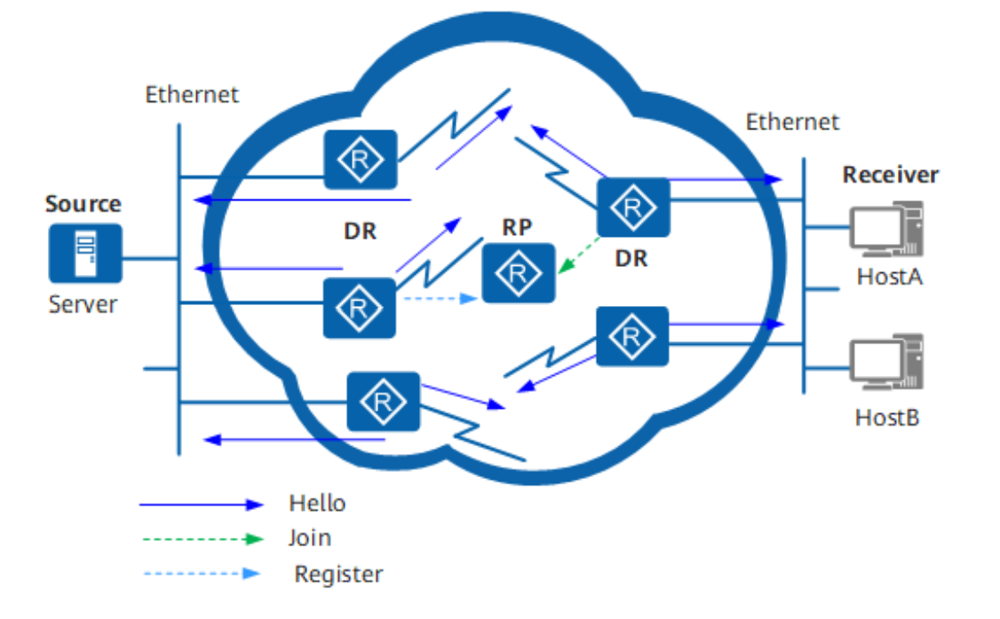
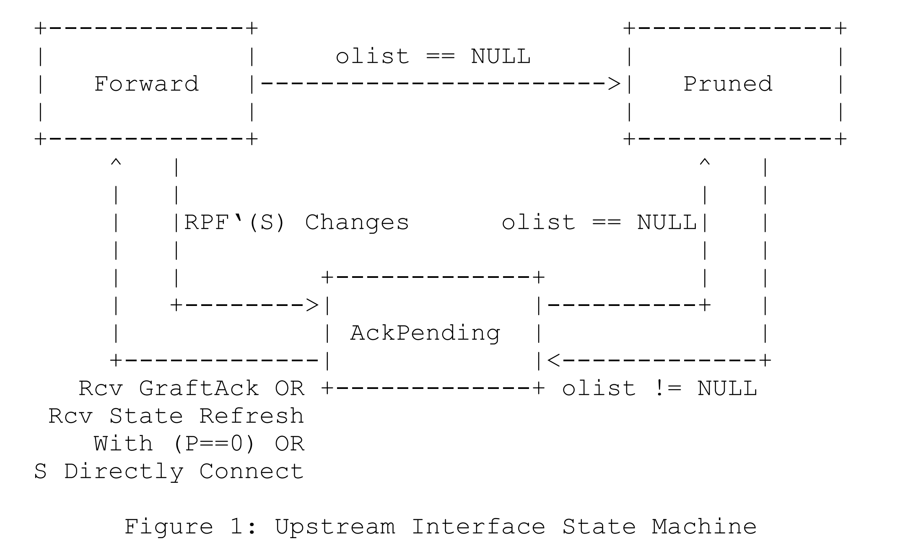
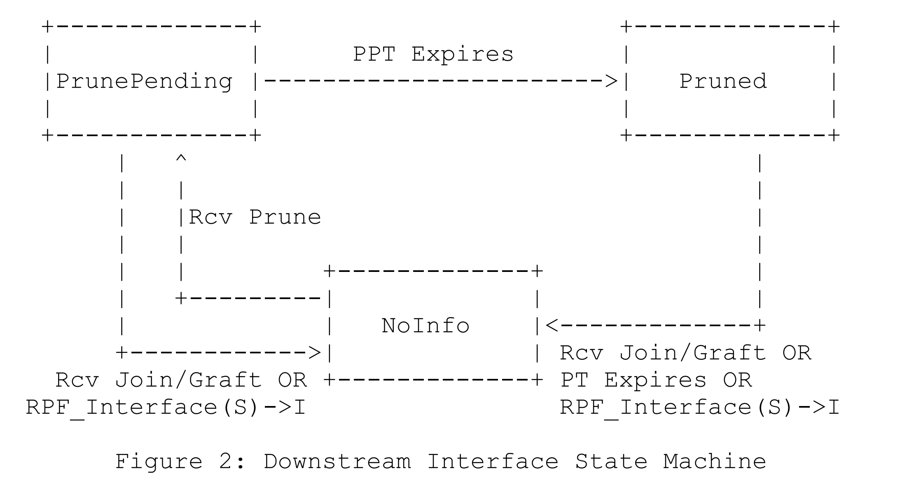

# IP 组播路由 - PIM

## PIM 简介
PIM（Protocol Independent Multicast）称为协议无关组播。这里的**协议无关指的是与单播路由协议无关**，即 PIM 不需要维护专门的单播路由信息。与单播路由通过多种路由协议算法来动态生成路由表项不同， PIM 协议只专注于组成员和组播源状态相关的信息，而选取路径的信息直接从单播路由表获取，这降低了 PIM 协议的复杂性，使其成为应用最广泛的域内组播协议。

在单播路由与转发中，单播报文沿着一条单点到单点的路径传输，路由器只需要考虑报文“需要到达的位置”，即目的地址，就知道从哪个接口转发出去。组播路由与转发则不同。由于组播报文的目的地址为组播地址，只是标识了一组接收者，无法通过目的地址来找到接收者的位置，但是组播报文的“来源位置”，即源地址是确定的。所以组播报文的转发主要是根据其源地址来保证转发路径正确性。

路由器收到一份组播报文后，会根据报文的源地址通过单播路由表查找到达“报文源”的路由，查看到“报文源”的路由表项的出接口是否与收到组播报文的入接口一致。如果一致，则认为该组播报文从正确的接口到达，从而保证了整个转发路径的正确性和唯一性。这个过程就被称为 RPF 检查。这里“正确的接口”通常被称为 RPF 接口，即 RPF 检查通过的接口。

## PIM 协议模式

经过多年发展，PIM 协议目前具有两种模式：
- 协议无关组播密集模式 PIM-DM（PIM-Dense Mode）
- 协议无关组播稀疏模式 PIM-SM（PIM-Sparse Mode）

其中，PIM-SM 按照组播模型不同，又可分为：
- PIM-SM (ASM)：任意源组播，简称 PIM-SM
- PIM-SM (SSM)：特定源组播，简称 PIM-SSM

SSM 模型与 ASM 模型之间的最大差异就是**是否指定了组播源**，PIM 协议模型如下图所示。

|      协议      | 模型分类 |                           适用场景                           |                           工作机制                           |
| :------------: | :------: | :----------------------------------------------------------: | :----------------------------------------------------------: |
|     PIM-DM     |   ASM    |        适合规模较小、组播组成员相对比较密集的局域网。        | 通过周期性“扩散-剪枝”维护一棵连接组播源和组成员的单向无环 SPT。 |
| PIM-SM （ASM） |   ASM    |     适合网络中的组成员相对比较稀疏，分布广泛的大型网络。     | 采用接收者主动加入的方式建立组播分发树，需要维护 RP、构建 RPT、注册组播源。 |
| PIM-SM （SSM） |   SSM    | 适合网络中的用户预先知道组播源的位置，直接向指定的组播源请求组播数据的场景。 | 直接在组播源与组成员之间建立 SPT，无需维护 RP、构建 RPT、注册组播源。 |

## PIM 基本概念与术语

为了便于描述 PIM 协议，首先解释一些基本术语与概念。

|     术语     |      英文/简写      | 解释                                                         |
| :----------: | :-----------------: | ------------------------------------------------------------ |
|  PIM 路由器  |          /          | 在接口上使能了 PIM 协议的路由器。                            |
|  基础路由表  |        MRIB         | 大多数情况下为单播路由表，用来决策 RPF。                     |
|  转发树信息  |         TIB         | 在标准规范中，PIM 协议和 IGMP 协议生成的信息按树型结构组织。 |
|  组播路由表  |      MFIB/MRT       | 一般软件将 TIB 实现为组播转发表/组播路由表，相对于查树信息，查表转发更加高效。 |
| 反向路径转发 |         RPF         | 组播入口必须同单播到该源的接口相同。                         |
|  组播分发树  |         MDT         | 以组播组为单位在路由器上建立的一点到多点的组播转发路径。     |
|  上游/下游   | Upstream/Downstream | 上下游是一个相对的概念，其中靠近组播源的一侧称为上游，靠近组播接受者的一侧称为下游。 |

PIM 网络以组播组为单位在路由器上建立一点到多点的组播转发路径。由于组播转发路径呈现树型结构，也称为**组播分发树** MDT（Multicast Distribution Tree）。组播分发树主要包括以下两种：

- 以组播源为根，组播组成员为叶子的组播分发树称为 **SPT**（Shortest Path Tree）。SPT 同时适用于 PIM-DM 网络和 PIM-SM 网络。
- 以 RP（Rendezvous Point）为根，组播组成员为叶子的组播分发树称为 **RPT**（RP Tree）。RPT 适用于 PIM-SM 网络。

**PIM 路由表项**即通过 PIM 协议建立的组播路由表项。PIM 网络中存在两种路由表项：`(S，G)` 路由表项或 `(*, G)` 路由表项。S 表示组播源，G 表示组播组，* 表示任意。

- `(S，G)` 路由表项主要用于在 PIM 网络中建立 SPT。对于 PIM-DM 网络和 PIM-SM 网络适用。
- `(*，G)` 路由表项主要用于在 PIM 网络中建立 RPT。对于 PIM-SM 网络适用。

PIM 路由表项中主要用于**指导转发的信息**如下：

- 组播源地址。
- 组播组地址。
- 上游接口（靠近网络）：本地路由器上接收到组播数据的接口，如 Int3。
- 下游接口（靠近主机）：将组播数据转发出去的接口，如 Int1、Int2。

## PIM 基本流程

### 邻居建立

开启了 PIM 协议的接口会对外发送 Hello 报文，Hello 报文源地址为接口地址，目的地址为组播地址 224.0.0.13，表示同一网段所有 PIM 路由器，TTL 为 1，不会扩散转发。

Hello 报文的作用如下：

1. 发现 PIM 邻居：只有建立邻居关系，才可以接受其他 PIM 协议报文。
2. 协调 PIM 协议报文参数：包括 DR 优先级、邻居保持时间等。
3. 维持邻居关系：PIM 路由器之间周期性地发送 Hello 报文，默认周期为 30 秒，邻居超时时间为 105 秒。

### DR 选举

在组播源或组成员所在的网段，如果源/接受者同时连接多台 PIM 路由器，则需要选举出 DR 来负责源端或组成员端组播报文的收发，DR 可视为该子网的 PIM 代理，接收者通过向 DR 发送 IGMP/MLD Join/Leave 消息来表明自己是否加入/退出该组播组。这些 PIM 路由器之间通过交互 Hello 报文成为 PIM 邻居，Hello 报文中携带 DR 优先级和该网段接口地址，PIM 路由器将自身条件与对方报文中携带的信息进行比较从而竞选出 DR。



在 ASM 模型中，DR 主要作用为：

- 在连接组播源的共享网段，由 DR 负责向 RP 发送 Register 注册报文。与组播源相连的 DR 称为源端 DR。
- 在连接组成员的共享网段，由 DR 负责向 RP 发送 Join 加入报文。与组成员相连的 DR 称为组成员端 DR。

### 断言

当一个网段内有多个相连的 PIM 路由器 RPF 检查通过向该网段转发组播报文时，则需要通过断言机制来保证只有一个 PIM 路由器向该网段转发组播报文。PIM 路由器在接收到邻居路由器发送的相同组播报文后，会以组播的方式向本网段的所有 PIM 路由器发送 Assert 报文，其中目的地址为永久组地址 224.0.0.13。其它PIM 路由器在接收到 Assert 报文后，将自身参数与对方报文中携带的参数做比较，进行 Assert 竞选，获胜一方继续进行数据转发。

## PIM DM

### 协议简介

PIM DM 协议由 **RFC 3973** 描述，是一种状态较为简单的协议，一般应用于**组播组成员规模相对较小**、**相对密集**的网络。DM 协议假定网络中的组成员分布非常稠密，每个网段都可能存在组成员。

当有活跃的组播源出现时，DM 致力于将组播源发来的组播报文**扩散（Flooding）**到整个网络的 PIM 路由器上，从而形成一棵以某组播源为根，以众多接收者为叶子的组播转发树。然而这颗组播转发树太过庞大，对于一个 PIM 路由器，如果某接口下游已经没有接收者，实际上已经无需再向该接口继续扩散，因此组播路由器会进行**剪枝（Prune）**操作，这样可以降低无效的网络流量。倘若被裁剪掉的分支由于下游路由器上有新的组成员加入，而希望重新恢复转发状态时，则进行**嫁接（Graft）**机制主动恢复其对组播报文的转发。

综上所述，PIM-DM 通过周期性的进行“扩散、剪枝、嫁接”，来构建并维护了若干棵**连接组播源和组成员的单向无环源最短路径树（Source Specific Shortest Path Tree, SPT）**，这些树以组播转发表的形式保存，每棵树对应了组播转发表的其中一个表项。

除此之外，PIM-DM 的关键工作机制包括邻居发现、扩散、剪枝、嫁接、断言和状态刷新。其中，扩散、剪枝、嫁接是构建SPT的主要方法。

### 协议状态信息

首先路由器需要保持通用信息。

- For each interface：
    - Hello Timer (HT)
    - State Refresh Capable
    - LAN Delay Enabled
    - Propagation Delay (PD)
    - Override Interval (OI)
    - For each neighbor:
        - Neighbor’s Gen ID.
        - Neighbor’s LAN Prune Delay
        - Neighbor’s Override Interval
        - Neighbor’s State Refresh Capability
        - Neighbor Liveness Timer (NLT)

其中主要是为每个接口维护邻居信息。

其次，路由器需要为每个 `(S, G)` 表项维护如下信息。

- For each interface:
    - Local Membership: State: One of {"NoInfo", "Include"}
    - PIM (S,G) Prune State: State: One of {"NoInfo" (NI), "Pruned" (P), "PrunePending"
        (PP)}
    - (S,G) Assert Winner State: State: One of {"NoInfo" (NI), "I lost Assert" (L), "I won
        Assert" (W)}
- Upstream interface-specific:
    - Graft/Prune State: 
        - State: One of {"NoInfo" (NI), "Pruned" (P), "Forwarding" (F), "AckPending" (AP) }
        - GraftRetry Timer (GRT)
        - Override Timer (OT)
        - Prune Limit Timer (PLT)
    - Originator State:
        - Source Active Timer (SAT)
        - State Refresh Timer (SRT)

### 数据转发规则

假设 `iif` 为数据入端口，`S` 为数据源地址，`G` 为组播组地址，`RPF_Interface(S)` 为通过 RPF 检查的接口。

首先，RPF 检查判断数据是否从正确的端口进入，即 `RPF_Interface(S) != iif` 时，数据包将会被丢弃，同时进入 Assert 流程。

如果 RPF 检查通过，则查看是否具有 `(S, G)` 表项，若没有则生成 `(S, G)` 表项，初始情况下该出接口列表为除 RPF 接口外所有 PIM 邻居接口，因此泛洪不会导致环路。若表项存在且不空，则将数据转发到列表中所有的接口。若表项存在且为空，则向上游发送 `(S, G)` 剪枝消息，表示下游已没有接受者，无需再向该路由器进行数据转发。

### 剪枝、加入和嫁接

向上游邻居发送 `(S, G)` 剪枝消息表示该路由器将不再需要从 S 发往 G 的消息。假设 C 有两个下游路由器 A 和 B，其中 A 希望继续接收数据，而 B 不希望继续接收数据，B 正常情况下会向上游 C 发送剪枝消息，有趣的是剪枝消息的目的 IP 为全体 PIM 路由器，因此若 A 和 B 处于同一 LAN 中时，A 也会受到该剪枝消息，此时，A 必须发送 Join 加入消息用来覆盖 B 的剪枝消息，这也是 PIM DM 中唯一需要发送加入消息的场合。最后，如果下游接受者想要重新加入转发树，将会发送嫁接消息。

#### Upstream 发送状态机



The Upstream(S,G) state machine for sending Prune, Graft, and Join messages is given below. There are three states.

- Forwarding (F) 转发状态
- Pruned (P) 剪枝状态
- AckPending (AP) 嫁接响应等待状态

three state-machine-specific timers:
- GraftRetry Timer (GRT(S,G)) ：如果上游没有回复 GA，则 GRT 超时，重发 G 报文，GRT 复位。若收到 GA，则取消 GRT。
- Override Timer (OT(S,G))：收到来自上游的剪枝报文，如果下游出口不空，则需要启动 OT，OT超时时发送 Join 报文以恢复上游对自己的转发。
- Prune Limit Timer (PLT(S,G))：如果上游已经时 P 状态，则 PLT 超时之前，为了限制 LAN 中的 P 报文数量，将不允许发送 P 报文。

#### Downstream 接收状态机



The Prune(S,G) Downstream state machine for receiving Prune, Join and Graft messages on interface I is given below
- NoInfo(NI) 正常转发状态
- PrunePending(PP) 剪枝等待状态：收到剪枝消息后，进入该状态等待下游邻居发送 Join 消息来覆盖该剪枝消息。
- Pruned(P) 剪枝状态：如果没有收到 Join 消息，则进入剪枝状态。

two timers:
- PrunePending Timer (PPT(S,G,I))：PPT 超时后进入剪枝状态，同时启动剪枝定时器 PT。
- Prune Timer (PT(S,G,I))：PT 超时后重新恢复转发，进入 NI 状态。可以使用 SR 报文一直刷新 PT，让下游一直不能恢复转发。


## PIM SM

### 协议简介

PIM SM 协议修订于 **RFC 7761** 描述，一般应用于**组播组成员规模相对较大**、**相对稀疏**的网络。相比于 DM 的“推送”模式，PIM-SM 模型使用“拉”模式转发组播报文，其核心思想为：在网络中维护一台重要的 PIM 路由器，称为 汇聚点 RP (Rendezvous Point)，其功能为：

- **维护组成员信息**：当网络中出现组成员（用户主机通过 IGMP 加入某组播组 G）时，最后一跳路由器向 RP 发送加入（Join） 报文，逐跳创建`(*, G）`表项，生成一棵以 RP 为根的 RPT。
- **维护组播源信息**：当网络中出现活跃的组播源（组播源向某组播组G发送第一个组播数据）时，第一跳路由器将组播数据封装在注册（Register ）报文中单播发往 RP，在 RP 上创建`(S, G)` 表项，注册源信息。

协议进一步可以分为以下三个阶段：

#### 阶段一：RP Tree

在 RP Tree 阶段，组播接收者只需表明自己感兴趣的组播组即可。

- 当接收者想加入组 G 时，向 DR 发送 IGMP Join 消息。DR 收到接收者发送的对于某个组 G 的 IGMP Join 消息时，便向 RP 发送一个对该组的 PIM Join 消息，即 `(*, G)` Join。该 Join 消息逐跳发送至 RP，沿途每一个 PIM 路由器都会建立 `(*, G)` 表项。当越来越多的接收者加入组 G 时，RP 就形成了一颗以自身为根的组播 G 分发树，即 RP Tree。RPT 也称为共享树，即所有组播源共享该树进行组播组 G 的数据分发。Join 消息将会周期性发送，以保证接收者一直在组中。
- 当接收者想退出组 G 时，向 DR 发送 IGMP Leave 消息。DR 收到接收者发送的对于某个组 G 的 IGMP Leave 消息时，便向 RP 发送一个对该组的 PIM Prune 消息，即 `(*, G)` Prune。Prune （剪枝）消息将会周期性发送，以保证接收者一直不接收该组消息。如果 剪枝消息没有发送，则又会恢复对该接收者的转发。

在 RP Tree 阶段，组播发送者只需要向某组发送组播数据即可。

- 源端 DR 收到组播数据，进行**单播封装**，直接发给 RP。这个过程称为 Registering，封装的数据包称为 PIM Register 消息。
- RP 收到单播数据包，进行**解封**，再沿 RPT 发送给组播接收者。

总结，在 RPT 阶段 ，组播数据将会打包成单播发给 RP，然后再根据组播路由表沿 RPT 发送到接收者。

#### 阶段二：Register-Stop

RPT 阶段有两个最大的问题：

- 频繁的封装-解封数据包消耗软硬件资源
- 数据包需要从源发到 RP，然后才能沿着 RPT 分发到接受者，这有可能绕远路。

因此，当 RP 从源端 S 接收到一个组 G 的 register 封装组播包时，会向 S 发送一个特定源组播加入消息，即 `(S, G)` Join。该 Join 消息逐跳发送至 S，沿途每一个 PIM 路由器都会建立 `(S, G)` 表项。此后，从 S 发来的 G 组播数据将会根据 `(S, G)` 表项向 RP 转发，该路径称为 Source-Specific Tree ，组播数最终到达 RP，然后再沿 RPT 发送到接收者，在转发到 RP 的过程中，如果经过已经包含  `(*, G)` 的路由器时，即两个树有交叉，则数据会从 SST 转发至 RPT，从而跳过 RP。

在上述 RP 构建 SST 过程中，当 RP 向 S 发送特定源组播加入消息时，组播封装包也在进行。如果数据包开始按照 `(S, G)` 进行转发，则 RP 会收到两份数据包。此时，RP 会丢弃封装数据包，并且向源端 DR 发送 Register-Stop 以表示停止封装不需要的数据包。

#### 阶段三：Shortest-Path Tree

虽然 SST 阶段解决了数据包封装解封的问题，但仍然没有完全优化转发路径。相比于直接经过最短路径，数据从组播源到组播接收者，都需要经过 RP ，而这可能会造成走弯路。因此，为了获取更低的时延和更高的带宽利用率，接收端 DR 可以选择将 RPT 切换至 SPT (Source Specific Shortest Path Tree)。

- 首先，接受端 DR 向组播源 S 发送一个 `(S, G)` Join 消息。
- 接着，沿途每一个 PIM 路由器都会建立 `(S, G)` 表项。
- 最后，该 Join 消息逐跳发送至 S 所在子网，或者到达一个已经拥有 `(S, G)` 表项的路由器。

此时，DR 或 DR 上游路由器，又将会收到两份数据，一份来自 RPT，一份来自 SPT。

- 第一次收到 SPT 数据时（他怎么知道是哪里来的？），丢弃从 RPT 发来的数据。
- 向 RP 发送 `(S, G, rpt)` Prune 消息。
- 该消息逐跳传播，告知沿途路由器 S 发往 G 的数据不能再沿此路转发。
- 最终，该消息发送至 RP，或者仍然需要该路径的路由器。

总结，在 SPT 阶段，数据从 S 到接收者经过最短路径传输。此时 RP 仍然会接收到 S 的数据，但是并不会沿着 RPT 发送到接收者。从接收者的角度来看，这就是最终的组播分发树状态。

IGMPv3 允许接收者只接收从指定源 S 发出的 G 组播数据。在这种情况下，接收端 DR 将会直接跳过向 RP 发送 `(*, G)` Join 消息而直接向 S 发送 `(S, G)` Join 消息，这个阶段称为指定源组播模式（PIM-SM/SSM）。PIM-SSM 使用 232.0.0.0 to 232.255.255.255 IP 地址。

相反的，IGMPv3 允许接收者只拒绝从指定源 S 发出的 G 组播数据。在这种情况下，接收端 DR 将会照常向 RP 发送 `(*, G)` Join 消息，但是却紧跟一个 `(S, G, rpt)` Prune 消息。

### RP 选举

PIM-SM 路由器需要知道每个组的 RP 地址，RP 可通过**动态选举**或静态配置。

一种常用的 BSR 选举机制（RFC 5059）流程大致如下：

- 首先，选举一个路由器作为 BSR (Bootstrap Router) 
    - 开始时，每个 PIM 路由器都认为自己是 BSR 候选者，因此都会发送 Bootstrap 报文。
    - 当收到其他人发来的 Bootstrap 消息时，每个 PIM 路由器执行相同的选举算法，异步算出唯一 BSR（由守护进程处理）。
- 接着，所有 RP 候选者向 BSR 发送单播 Advertisement 报文，报文中携带 C-RP 地址、服务的组范围和 C-RP 优先级。BSR 根据所有候选者 RP 发来的消息，汇总成为 RP-Set，周期性的通过 Boostrap 报文逐跳泛洪到全网。
- 最后，全网 PIM-SM 路由器都收到 RP-Set 消息，并设置 RP 地址，到此 RP 选举完成。

### 协议状态信息

TODO

### 数据转发规则

TODO

### 组播源注册处理

#### DR 发送注册消息

TODO

#### RP 接收注册消息

TODO

### 加入剪枝处理

#### 接收 `(*,G)` 加入/剪枝消息

- 加入消息：检查 `RP(G)`
- 剪枝消息：


When a router receives a Join`(*,G)`, it must first check to see whether the RP in the message matches RP(G) (the router’s idea of who the RP is). If the RP in the message does not match RP(G), the Join(*,G) should be silently dropped. (Note that other source list entries, such as (S,G,rpt) or (S,G), in the same Group-Specific Set should still be processed.) If a router has no RP information (e.g., has not recently received a BSR message), then it may choose to accept Join(*,G) and treat the RP in the message as RP(G). Received Prune(*,G) messages are processed even if the RP in the message does not match RP(G).

#### 接收 `(S,G)` 加入/剪枝消息

#### 接收 `(S,G,rpt)` 加入/剪枝消息

#### 发送 `(*,G)` 加入/剪枝消息

#### 发送 `(S,G)` 加入/剪枝消息

#### 周期性`(S,G,rpt)` 加入/剪枝消息

### 组播源发现协议 - MSDP

组播源发现协议（Multicast Source Discovery Protocol, MSDP）是为了解决多个 PIM-SM 域之间的互连而开发的一种域间组播解决方案，用来发现其他 PIM-SM 域内的组播源信息。MSDP目前只支持在 **IPv4** 网络部署，域内组播路由协议必须是 **PIM-SM (ASM)**。

随着网络规模的增大以及便于控制组播资源，管理员可能会将一个 PIM 网络划分为多个 PIM-SM 域，此时各个域中的 RP 无法了解其他域中的组播源信息，MSDP通过在不同 PIM-SM 域的路由器（通常在RP上）之间建立 MSDP 对等体，MSDP 对等体之间交互 SA（Source-Active）消息，共享组播源信息，最终可以使一个域内的组播用户接收到其他域的组播源发送的组播数据。

#### MSDP 对等体

MSDP 对等体之间交互 SA 消息，消息中携带组播源 DR 在 RP 上注册时的 `(s, G)` 信息。通过消息传递，任意一个 RP 发出的 SA 消息能够被其他所有的 RP 收到。

根据离组播源的位置，MSDP 对等体可分为：

- 源端 MSDP 对等体：源端 RP 创建 SA 消息并发送给远端 MSDP 对等体，通告在本 RP 上注册的组播源信息。
- 接收者端 MSDP 对等体：接收者端 MSDP 对等体在收到 SA 消息后，根据该消息中所包含的组播源信息，**跨域加入以该组播源为根的 SPT**；当来自该组播源的组播数据到达后，再沿 RPT 向本地接收者转发。

为了保证网络中所有 RP 都能参与源信息共享，且尽量缩小“MSDP 连通图”的规模，推荐的配置方案是：**在且仅在网络中所有 RP 上配置 MSDP 对等体**。

**MSDP 对等体通过 TCP 连接建立，使用端口 639。**

#### SA 消息转发

为了防止 SA 消息在 MSDP 对等体之间被循环转发，MSDP 对接收到的 SA 消息执行 RPF 检查，在消息传递的入方向上进行严格的控制。不符合 RPF 规则的 SA 消息将被丢弃。

当网络中存在多个 MSDP 对等体时，很容易导致 SA 消息在对等体之间泛滥。同时，MSDP 对等体对每一个到来的 SA 报文进行 RPF 检查，给系统造成很大的负担。将多个 MSDP 对等体加入同一个 Mesh Group，就可以大幅度减少在这些 MSDP 对等体之间传递的SA消息。

## PIM-SSM 

The Source-Specific Multicast (SSM) service model [6] can be implemented with a strict subset of the PIM-SM protocol mechanisms. Both regular IP Multicast and SSM semantics can coexist on a single router, and both can be implemented using the PIM-SM protocol. A range of multicast addresses, currently 232.0.0.0/8 in IPv4 and ff3x::/32 for IPv6, is reserved for SSM, and the choice of semantics is determined by the multicast group address in both data packets and PIM messages.

A PIM-SSM-only router MUST implement the following portions of this specification: o Upstream (S,G) state machine (Section 4.5.5) o Downstream (S,G) state machine (Section 4.5.2) o (S,G) Assert state machine (Section 4.6.1)

Hello messages, neighbor discovery, and DR election (Section 4.3) o Packet forwarding rules (Section 4.2)

```
oiflist = NULL
if( iif == RPF_interface(S) AND UpstreamJPState(S,G) == Joined ) {
	oiflist = inherited_olist(S,G)
} else if( iif is in inherited_olist(S,G) ) {
	send Assert(S,G) on iif
}
oiflist = oiflist (-) iif
forward packet on all interfaces in oiflist
```


## PIM 协议消息格式

PIM 协议消息承载于 IP 协议，协议号为 103。PIM 消息包括两部分：

- PIM 通用头 (PIM Header)
- PIM 消息内容 (PIM Data)

### PIM 通用头

PIM 消息头如下所示，共计 4 字节（4b+4b+8b+16b=32b=4B）。

```
 0                   1                   2                   3
 0 1 2 3 4 5 6 7 8 9 0 1 2 3 4 5 6 7 8 9 0 1 2 3 4 5 6 7 8 9 0 1
+-+-+-+-+-+-+-+-+-+-+-+-+-+-+-+-+-+-+-+-+-+-+-+-+-+-+-+-+-+-+-+-+
|PIM Ver|  Type |   Reserved    |            Checksum           |
+-+-+-+-+-+-+-+-+-+-+-+-+-+-+-+-+-+-+-+-+-+-+-+-+-+-+-+-+-+-+-+-+
```

其中，类型字段解释如下。

|     类型      |  值  |  组播模式   |               目的地址               |
| :-----------: | :--: | :---------: | :----------------------------------: |
|     Hello     |  0   |             |     Multicast to ALL-PIM-ROUTERS     |
|   Register    |  1   |             |            Unicast to RP             |
| Register-Stop |  2   |             | Unicast to source of Register packet |
|  Join/Prune   |  3   |             |     Multicast to ALL-PIM-ROUTERS     |
|   Bootstrap   |  4   |             |     Multicast to ALL-PIM-ROUTERS     |
|    Assert     |  5   |             |     Multicast to ALL-PIM-ROUTERS     |
|     Graft     |  6   | PIM-DM only |          Unicast to RPF’(S)          |
|   Graft-Ack   |  7   | PIM-DM only |  Unicast to source of Graft packet   |
|   C-RP-Adv    |  8   |             |       Unicast to Domain’s BSR        |


不同类型的 PIM 消息具有结构各异的消息内容，除此之外，PIM 消息类型也会影响 IP 头中的目的地址。因此，根据目的 IP 是单播地址还是组播地址，PIM 消息被分为单播消息和组播消息两种。其中，组播消息目的地址为 ALL-PIM-ROUTERS 组（224.0.0.13/IPv4，ff02::d/IPv6），TTL 为 1。

### 编码地址格式

PIM 消息内容中使用了大量的编码的地址格式，为了便于描述消息格式，首先介绍编码地址格式，该地址包括三种：

- 编码单播地址（Encoded-Unicast Address）
- 编码组播地址（Encoded-Group Address）
- 编码组播源地址（Encoded-Source Address）

Encoded-Unicast Address 格式如下：

```
+-+-+-+-+-+-+-+-+-+-+-+-+-+-+-+-+-+-+-+-+-+-+-+-+-+-+-+-+-+-+-+-+
| Addr Family | Encoding Type | Unicast Address
+-+-+-+-+-+-+-+-+-+-+-+-+-+-+-+-+-+-+-+-+-+-+-+-+...
```

- Addr Family  （1 字节）
- Encoding Type  （1 字节）
- Unicast Address  （IPv4 为 4 字节）

一般情况而言，EUA 通常为邻居 IP 地址。

Encoded-Group Address 格式如下：

```
+-+-+-+-+-+-+-+-+-+-+-+-+-+-+-+-+-+-+-+-+-+-+-+-+-+-+-+-+-+-+-+-+
| Addr Family | Encoding Type |B| Reserved |Z|    Mask Len      |
+-+-+-+-+-+-+-+-+-+-+-+-+-+-+-+-+-+-+-+-+-+-+-+-+-+-+-+-+-+-+-+-+
| Group multicast Address
+-+-+-+-+-+-+-+-+-+-+-+-+-+-+-+-+-+-+...
```

- Addr Family  （1 字节）
- Encoding Type  （1 字节）
- [B]idirectional PIM  
- Reserved 
- Admin Scope [Z]one  
- Mask Len 
- Group multicast Address（IPv4 为 4 字节）

Encoded-Source Address 格式如下：

```
+-+-+-+-+-+-+-+-+-+-+-+-+-+-+-+-+-+-+-+-+-+-+-+-+-+-+-+-+-+-+-+-+
| Addr Family | Encoding Type | Rsrvd |S|W|R|     Mask Len      |
+-+-+-+-+-+-+-+-+-+-+-+-+-+-+-+-+-+-+-+-+-+-+-+-+-+-+-+-+-+-+-+-+
| Source Address
+-+-+-+-+-+-+-+-+-+-+-+-+-+-+-+-+-+-...
```

- Addr Family  （1 字节）
- Encoding Type  （1 字节）
- Reserved：为 0。
- S The Sparse bit is a 1-bit value, set to 1 for PIM-SM. It is used for PIM version 1
    compatibility.
- W The WC (or WildCard) bit is a 1-bit value for use with PIM Join/Prune messages
- R The RPT (or Rendezvous Point Tree) bit is a 1-bit value for use with PIM Join/Prune
    messages (see Section 4.9.5.1). If the WC bit is 1, the RPT bit MUST be 1.
- Mask Len：掩码长度。
- Source Address：组播源 IP 地址。

### Hello 消息

Hello 消息采用 TLV 构建，其格式如下

```
 0                   1                   2                   3
 0 1 2 3 4 5 6 7 8 9 0 1 2 3 4 5 6 7 8 9 0 1 2 3 4 5 6 7 8 9 0 1
+-+-+-+-+-+-+-+-+-+-+-+-+-+-+-+-+-+-+-+-+-+-+-+-+-+-+-+-+-+-+-+-+
|PIM Ver|  Type |   Reserved    |            Checksum           |
+-+-+-+-+-+-+-+-+-+-+-+-+-+-+-+-+-+-+-+-+-+-+-+-+-+-+-+-+-+-+-+-+
|          OptionType           |           OptionLength        |
+-+-+-+-+-+-+-+-+-+-+-+-+-+-+-+-+-+-+-+-+-+-+-+-+-+-+-+-+-+-+-+-+
|                          OptionValue                          |
|                              ...                              |
+-+-+-+-+-+-+-+-+-+-+-+-+-+-+-+-+-+-+-+-+-+-+-+-+-+-+-+-+-+-+-+-+
|                               .                               |
|                               .                               |
|                               .                               |
+-+-+-+-+-+-+-+-+-+-+-+-+-+-+-+-+-+-+-+-+-+-+-+-+-+-+-+-+-+-+-+-+
|          OptionType           |           OptionLength        |
+-+-+-+-+-+-+-+-+-+-+-+-+-+-+-+-+-+-+-+-+-+-+-+-+-+-+-+-+-+-+-+-+
|                          OptionValue                          |
|                              ...                              |
+-+-+-+-+-+-+-+-+-+-+-+-+-+-+-+-+-+-+-+-+-+-+-+-+-+-+-+-+-+-+-+-+
```

其中包括：

- Holdtime TLV
    - Type=1
    - Length=2
    - Holdtime=全 0 表示立即删除邻居；全 1 表示永不超时；默认为 Hello 周期的 3 倍（105 秒）。

- DR Priority
    - Type=19
    - Length=4
    - DR Priority=4 字节整型

### Register 消息

TODO

S --> RP

### Register-Stop 消息

TODO

RP -> S

### Join/Prune 消息

加入剪枝消息发往上游组播源或者 RP。其中，加入消息用于构建 RPT 或者 SPT，剪枝消息用于删除路径。

```
 0                   1                   2                   3
 0 1 2 3 4 5 6 7 8 9 0 1 2 3 4 5 6 7 8 9 0 1 2 3 4 5 6 7 8 9 0 1
+-+-+-+-+-+-+-+-+-+-+-+-+-+-+-+-+-+-+-+-+-+-+-+-+-+-+-+-+-+-+-+-+
|PIM Ver|  Type |   Reserved    |            Checksum           |
+-+-+-+-+-+-+-+-+-+-+-+-+-+-+-+-+-+-+-+-+-+-+-+-+-+-+-+-+-+-+-+-+
|      Upstream Neighbor Address (Encoded-Unicast format)       |
+-+-+-+-+-+-+-+-+-+-+-+-+-+-+-+-+-+-+-+-+-+-+-+-+-+-+-+-+-+-+-+-+
|    Reserved   |   Num groups  |            Holdtime           |
+-+-+-+-+-+-+-+-+-+-+-+-+-+-+-+-+-+-+-+-+-+-+-+-+-+-+-+-+-+-+-+-+
|         Multicast Group Address 1 (Encoded-Group format)      |
+-+-+-+-+-+-+-+-+-+-+-+-+-+-+-+-+-+-+-+-+-+-+-+-+-+-+-+-+-+-+-+-+
|   Number of Joined Sources    |  Number of Pruned Sources     |
+-+-+-+-+-+-+-+-+-+-+-+-+-+-+-+-+-+-+-+-+-+-+-+-+-+-+-+-+-+-+-+-+
|          Joined Source Address 1 (Encoded-Source format)      |
+-+-+-+-+-+-+-+-+-+-+-+-+-+-+-+-+-+-+-+-+-+-+-+-+-+-+-+-+-+-+-+-+
|                               .                               |
|                               .                               |
+-+-+-+-+-+-+-+-+-+-+-+-+-+-+-+-+-+-+-+-+-+-+-+-+-+-+-+-+-+-+-+-+
|          Joined Source Address n (Encoded-Source format)      |
+-+-+-+-+-+-+-+-+-+-+-+-+-+-+-+-+-+-+-+-+-+-+-+-+-+-+-+-+-+-+-+-+
|          Pruned Source Address 1 (Encoded-Source format)      |
+-+-+-+-+-+-+-+-+-+-+-+-+-+-+-+-+-+-+-+-+-+-+-+-+-+-+-+-+-+-+-+-+
|                               .                               |
|                               .                               |
+-+-+-+-+-+-+-+-+-+-+-+-+-+-+-+-+-+-+-+-+-+-+-+-+-+-+-+-+-+-+-+-+
|          Pruned Source Address n (Encoded-Source format)      |
+-+-+-+-+-+-+-+-+-+-+-+-+-+-+-+-+-+-+-+-+-+-+-+-+-+-+-+-+-+-+-+-+
|                               .                               |
|                               .                               |
+-+-+-+-+-+-+-+-+-+-+-+-+-+-+-+-+-+-+-+-+-+-+-+-+-+-+-+-+-+-+-+-+
|         Multicast Group Address m (Encoded-Group format)      |
+-+-+-+-+-+-+-+-+-+-+-+-+-+-+-+-+-+-+-+-+-+-+-+-+-+-+-+-+-+-+-+-+
|   Number of Joined Sources    |  Number of Pruned Sources     |
+-+-+-+-+-+-+-+-+-+-+-+-+-+-+-+-+-+-+-+-+-+-+-+-+-+-+-+-+-+-+-+-+
|          Joined Source Address 1 (Encoded-Source format)      |
+-+-+-+-+-+-+-+-+-+-+-+-+-+-+-+-+-+-+-+-+-+-+-+-+-+-+-+-+-+-+-+-+
|                               .                               |
|                               .                               |
+-+-+-+-+-+-+-+-+-+-+-+-+-+-+-+-+-+-+-+-+-+-+-+-+-+-+-+-+-+-+-+-+
|          Joined Source Address n (Encoded-Source format)      |
+-+-+-+-+-+-+-+-+-+-+-+-+-+-+-+-+-+-+-+-+-+-+-+-+-+-+-+-+-+-+-+-+
|          Pruned Source Address 1 (Encoded-Source format)      |
+-+-+-+-+-+-+-+-+-+-+-+-+-+-+-+-+-+-+-+-+-+-+-+-+-+-+-+-+-+-+-+-+
|                               .                               |
|                               .                               |
+-+-+-+-+-+-+-+-+-+-+-+-+-+-+-+-+-+-+-+-+-+-+-+-+-+-+-+-+-+-+-+-+
|          Pruned Source Address n (Encoded-Source format)      |
+-+-+-+-+-+-+-+-+-+-+-+-+-+-+-+-+-+-+-+-+-+-+-+-+-+-+-+-+-+-+-+-+
```

- Unicast Upstream Neighbor Address：上游邻居单播地址
- Group Number：该消息包含几个组。
- 组条目
    - 组地址
    - 加入数量
    - 剪枝数量
    - 加入地址列表
    - 剪枝地址列表

### Bootstrap 消息

```
    0                   1                   2                   3
    0 1 2 3 4 5 6 7 8 9 0 1 2 3 4 5 6 7 8 9 0 1 2 3 4 5 6 7 8 9 0 1
   +-+-+-+-+-+-+-+-+-+-+-+-+-+-+-+-+-+-+-+-+-+-+-+-+-+-+-+-+-+-+-+-+
   |PIM Ver| Type  |N|  Reserved   |           Checksum            |
   +-+-+-+-+-+-+-+-+-+-+-+-+-+-+-+-+-+-+-+-+-+-+-+-+-+-+-+-+-+-+-+-+
   |         Fragment Tag          | Hash Mask Len | BSR Priority  |
   +-+-+-+-+-+-+-+-+-+-+-+-+-+-+-+-+-+-+-+-+-+-+-+-+-+-+-+-+-+-+-+-+
   |             BSR Address (Encoded-Unicast format)              |
   +-+-+-+-+-+-+-+-+-+-+-+-+-+-+-+-+-+-+-+-+-+-+-+-+-+-+-+-+-+-+-+-+
   |            Group Address 1 (Encoded-Group format)             |
   +-+-+-+-+-+-+-+-+-+-+-+-+-+-+-+-+-+-+-+-+-+-+-+-+-+-+-+-+-+-+-+-+
   | RP Count 1    | Frag RP Cnt 1 |         Reserved              |
   +-+-+-+-+-+-+-+-+-+-+-+-+-+-+-+-+-+-+-+-+-+-+-+-+-+-+-+-+-+-+-+-+
   |             RP Address 1 (Encoded-Unicast format)             |
   +-+-+-+-+-+-+-+-+-+-+-+-+-+-+-+-+-+-+-+-+-+-+-+-+-+-+-+-+-+-+-+-+
   |          RP1 Holdtime         | RP1 Priority  |   Reserved    |
   +-+-+-+-+-+-+-+-+-+-+-+-+-+-+-+-+-+-+-+-+-+-+-+-+-+-+-+-+-+-+-+-+
   |             RP Address 2 (Encoded-Unicast format)             |
   +-+-+-+-+-+-+-+-+-+-+-+-+-+-+-+-+-+-+-+-+-+-+-+-+-+-+-+-+-+-+-+-+
   |          RP2 Holdtime         | RP2 Priority  |   Reserved    |
   +-+-+-+-+-+-+-+-+-+-+-+-+-+-+-+-+-+-+-+-+-+-+-+-+-+-+-+-+-+-+-+-+
   |                               .                               |
   |                               .                               |
   +-+-+-+-+-+-+-+-+-+-+-+-+-+-+-+-+-+-+-+-+-+-+-+-+-+-+-+-+-+-+-+-+
   |             RP Address m (Encoded-Unicast format)             |
   +-+-+-+-+-+-+-+-+-+-+-+-+-+-+-+-+-+-+-+-+-+-+-+-+-+-+-+-+-+-+-+-+
   |          RPm Holdtime         | RPm Priority  |   Reserved    |
   +-+-+-+-+-+-+-+-+-+-+-+-+-+-+-+-+-+-+-+-+-+-+-+-+-+-+-+-+-+-+-+-+
   |            Group Address 2 (Encoded-Group format)             |
   +-+-+-+-+-+-+-+-+-+-+-+-+-+-+-+-+-+-+-+-+-+-+-+-+-+-+-+-+-+-+-+-+
   |                               .                               |
   |                               .                               |
   +-+-+-+-+-+-+-+-+-+-+-+-+-+-+-+-+-+-+-+-+-+-+-+-+-+-+-+-+-+-+-+-+
   |            Group Address n (Encoded-Group format)             |
   +-+-+-+-+-+-+-+-+-+-+-+-+-+-+-+-+-+-+-+-+-+-+-+-+-+-+-+-+-+-+-+-+
   | RP Count n    | Frag RP Cnt n |          Reserved             |
   +-+-+-+-+-+-+-+-+-+-+-+-+-+-+-+-+-+-+-+-+-+-+-+-+-+-+-+-+-+-+-+-+
   |             RP Address 1 (Encoded-Unicast format)             |
   +-+-+-+-+-+-+-+-+-+-+-+-+-+-+-+-+-+-+-+-+-+-+-+-+-+-+-+-+-+-+-+-+
   |          RP1 Holdtime         | RP1 Priority  |   Reserved    |
   +-+-+-+-+-+-+-+-+-+-+-+-+-+-+-+-+-+-+-+-+-+-+-+-+-+-+-+-+-+-+-+-+
   |             RP Address 2 (Encoded-Unicast format)             |
   +-+-+-+-+-+-+-+-+-+-+-+-+-+-+-+-+-+-+-+-+-+-+-+-+-+-+-+-+-+-+-+-+
   |          RP2 Holdtime         | RP2 Priority  |   Reserved    |
   +-+-+-+-+-+-+-+-+-+-+-+-+-+-+-+-+-+-+-+-+-+-+-+-+-+-+-+-+-+-+-+-+
   |                               .                               |
   |                               .                               |
   +-+-+-+-+-+-+-+-+-+-+-+-+-+-+-+-+-+-+-+-+-+-+-+-+-+-+-+-+-+-+-+-+
   |             RP Address m (Encoded-Unicast format)             |
   +-+-+-+-+-+-+-+-+-+-+-+-+-+-+-+-+-+-+-+-+-+-+-+-+-+-+-+-+-+-+-+-+
   |          RPm Holdtime         | RPm Priority  |   Reserved    |
   +-+-+-+-+-+-+-+-+-+-+-+-+-+-+-+-+-+-+-+-+-+-+-+-+-+-+-+-+-+-+-+-+
```

### Assert 消息

PIM 路由器在接收到邻居路由器发送的相同组播报文后，会以组播的方式向本网段的所有 PIM 路由器发送 Assert 报文，其中目的地址为永久组地址 224.0.0.13。

```
0                   1                   2                   3
0 1 2 3 4 5 6 7 8 9 0 1 2 3 4 5 6 7 8 9 0 1 2 3 4 5 6 7 8 9 0 1
+-+-+-+-+-+-+-+-+-+-+-+-+-+-+-+-+-+-+-+-+-+-+-+-+-+-+-+-+-+-+-+-+
|PIM Ver|  Type |   Reserved    |            Checksum           |
+-+-+-+-+-+-+-+-+-+-+-+-+-+-+-+-+-+-+-+-+-+-+-+-+-+-+-+-+-+-+-+-+
|              Group Address (Encoded-Group format)             |
+-+-+-+-+-+-+-+-+-+-+-+-+-+-+-+-+-+-+-+-+-+-+-+-+-+-+-+-+-+-+-+-+
|             Source Address (Encoded-Unicast format)           |
+-+-+-+-+-+-+-+-+-+-+-+-+-+-+-+-+-+-+-+-+-+-+-+-+-+-+-+-+-+-+-+-+
|R|                        Metric Preference                    |
+-+-+-+-+-+-+-+-+-+-+-+-+-+-+-+-+-+-+-+-+-+-+-+-+-+-+-+-+-+-+-+-+
|                             Metric                            |
+-+-+-+-+-+-+-+-+-+-+-+-+-+-+-+-+-+-+-+-+-+-+-+-+-+-+-+-+-+-+-+-+
```

### Graft 消息

嫁接消息格式与加入/剪枝消息格式相同，区别在于嫁接消息类型为 6，

### Graft-Ack 消息

嫁接相应消息与接收到的嫁接消息相同，只不过其类型需要改为 7，且上游邻居地址为嫁接消息的发送者地址。

### C-RP-Adv 消息

C−RPs 周期性向 BSR 发送单播 Candidate-RP-Advertisement 消息。

```
 0                   1                   2                   3
 0 1 2 3 4 5 6 7 8 9 0 1 2 3 4 5 6 7 8 9 0 1 2 3 4 5 6 7 8 9 0 1
+-+-+-+-+-+-+-+-+-+-+-+-+-+-+-+-+-+-+-+-+-+-+-+-+-+-+-+-+-+-+-+-+
|PIM Ver|  Type |   Reserved    |             Checksum          |
+-+-+-+-+-+-+-+-+-+-+-+-+-+-+-+-+-+-+-+-+-+-+-+-+-+-+-+-+-+-+-+-+
|  Prefix Count |   Priority    |             Holdtime          |
+-+-+-+-+-+-+-+-+-+-+-+-+-+-+-+-+-+-+-+-+-+-+-+-+-+-+-+-+-+-+-+-+
|              RP Address (Encoded-Unicast format)              |
+-+-+-+-+-+-+-+-+-+-+-+-+-+-+-+-+-+-+-+-+-+-+-+-+-+-+-+-+-+-+-+-+
|             Group Address 1 (Encoded-Group format)            |
+-+-+-+-+-+-+-+-+-+-+-+-+-+-+-+-+-+-+-+-+-+-+-+-+-+-+-+-+-+-+-+-+
|                               .                               |
|                               .                               |
|                               .                               |
+-+-+-+-+-+-+-+-+-+-+-+-+-+-+-+-+-+-+-+-+-+-+-+-+-+-+-+-+-+-+-+-+
|             Group Address n (Encoded-Group format)            |
+-+-+-+-+-+-+-+-+-+-+-+-+-+-+-+-+-+-+-+-+-+-+-+-+-+-+-+-+-+-+-+-+
```

其中:

- Prefix Count 表示消息中该 C-RP 通告的组地址数量，不能为 0。
- RP Address 表示该 C-RP 单播地址。
- Holdtime 表示该通告有效期，一般设为 2.5 倍 C-RP-ADV 消息周期。

## PIM 总结

- DM 和 SM 虽然共享数据包格式，但却不能直接交互。
- PIM 路由器无法通过 Hello 包来区分是 DM 邻居还是 SM 邻居。
- DM 的加入、剪枝、嫁接消息都是指定源的，因此无需和 SSM 协议进行区分。


## RFC

\- RFC 7761 4601

\- RFC 5059
