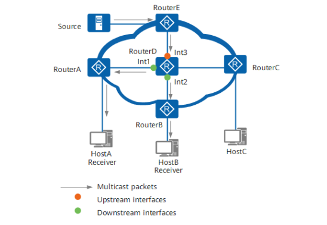
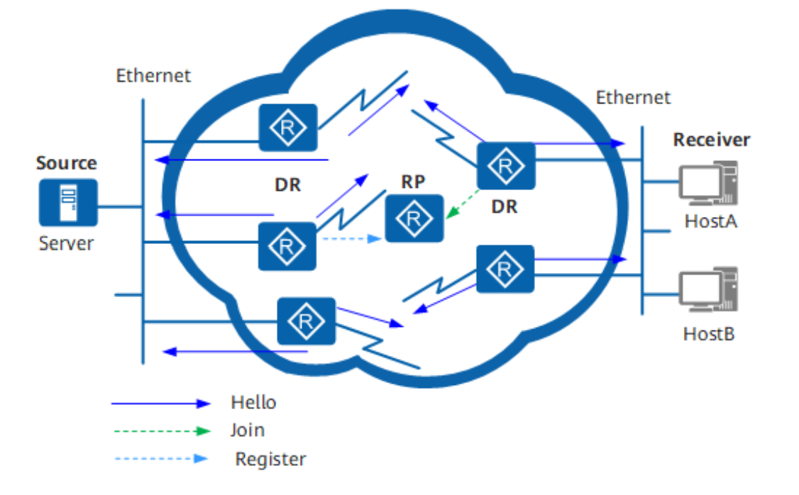
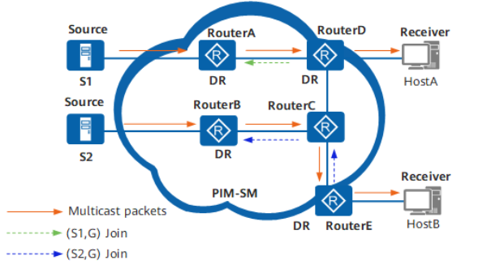

# IP 组播

## 组播简介
传统的 IP 通信有：单播（Unicast）、广播（Broadcast）以及组播（Multicast）。
- 对于单播通信，信息源为每个需要信息的主机都发送一份独立的单播 IP 报文，因此网络中传输的信息量与需要该信息的用户量成正比。
- 对于广播通信，信息源将广播 IP 报文发送给该网段中的所有主机，而不管其是否需要该信息。这样不仅存在信息安全性隐患，而且会造成同一网段中信息泛滥。因此该传输方式不利于与特定对象进行数据交互。
- 对于组播通信，信息源向组播地址发送一份组播 IP 报文，网络中只有需要该数据的主机（请求加入该组的主机）可以接收该数据，其他主机不能收到该数据。因此，组播可以很好的解决广播在“点到多点”的数据传输中的缺点。

组播适用于任何“点到多点”的数据发布，主要包含以下几方面：
- 多媒体、流媒体的应用。
- 培训、联合作业场合的通信。
- 数据仓库、金融应用（股票）。

## 组播网络

组播网络由组播源、组播路由器和组播接收者组成。其中，组播网络至少包含一个组播路由器。组播源向组播路由器发送目的 IP 为组播地址（例如 225.0.0.1）的组播报文，组播接收者向组播路由器发送加入某组播地址（例如 225.0.0.1）的请求，组播路由器负责将组播报文传输到每一个加入该组的接收者。
- 组播组：用 IP 组播地址进行标识的一个集合。
- 组播源：信息的发送者称为“组播源”，一个组播源可以同时向多个组播组发送数据，多个组播源也可以同时向一个组播组发送报文。组播源通常不需要加入组播组。
- 组播组成员：所有加入某组播组的主机便成为该组播组的成员。组播组中的成员是动态的，主机可以在任何时刻加入或离开组播组。
- 组播路由器：支持三层组播功能的路由器或交换机。

下图是一个组播网络示意图。

## 组播地址

为了使组播源和组播组成员进行通信，需要提供网络层组播，使用 IP 组播地址。同时，为了在本地物理网络上实现组播信息的正确传输，需要提供链路层组播，使用组播 MAC 地址。组播数据传输时，其目的地不是一个具体的接收者，而是一个成员不确定的组，所以需要一种技术将 IP 组播地址映射为组播 MAC 地址。

IANA 将 D 类地址空间分配给 IPv4 组播使用。IPv4 地址一共 32 位，D 类地址最高 4 位为 1110，因此地址范围从 224.0.0.0 到 239.255.255.255。

|                         地址范围                         |                             含义                             |
| :------------------------------------------------------: | :----------------------------------------------------------: |
|                  224.0.0.0～224.0.0.255                  | 永久组地址。IANA 为路由协议预留的 IP 地址（也称为保留组地址），用于标识一组特定的网络设备，供路由协议、拓扑查找等使用，不用于组播转发。 |
| 224.0.1.0～231.255.255.255 233.0.0.0～238.255.255.255 |                ASM 组播地址，全网范围内有效。                |
|                232.0.0.0～232.255.255.255                |         缺省情况下的 SSM 组播地址，全网范围内有效。          |
|                239.0.0.0～239.255.255.255                | 本地管理组地址，仅在本地管理域内有效。在不同的管理域内重复使用相同的本地管理组地址不会导致冲突。 |

常见的永久组地址包括

|  地址范围  |                   含义                   |
| :--------: | :--------------------------------------: |
| 224.0.0.1  | 网段内所有主机和路由器（等效于广播地址） |
| 224.0.0.2  |              所有组播路由器              |
| 224.0.0.4  |   DVMRP（距离矢量组播路由协议）路由器    |
| 224.0.0.5  |               OSPF 路由器                |
| 224.0.0.9  |               RIP-2 路由器               |
| 224.0.0.13 |                PIM 路由器                |

IANA 规定，IPv4 组播 MAC 地址的高 24 位为 `0x01005e`，第 25 位为 0，低 23 位为 IPv4 组播地址的低 23 位。由于 IPv4 地址 28 位中只有 23 位被映射到 MAC 地址，因此丢失了 5 位的地址信息，导致一些组播地址被映射到相同的 MAC 地址，网络管理员在分配地址时必须考虑这种情况。

## 服务模型

组播服务模型的分类是针对接收者主机的，对组播源没有区别。组播源发出的组播数据中总是以组播源自己的 IP 地址为报文的源地址，组播组地址为目的地址。

然而，接收者主机接收数据时可以对源进行选择，因此产生了 **任意源组播 ASM**（Any-Source Multicast）和 **特定源组播 SSM**（Source-Specific Multicast）两种服务模型。这两种服务模型使用不同的组播组地址范围。

|      对比      |          任意源组播 ASM          |           特定源组播 SSM           |
| :------------: | :------------------------------: | :--------------------------------: |
|    提供服务    |     仅针对组地址提供组播分发     | 针对特定源和组的绑定数据流提供服务 |
| 主机加入组播组 | 可以接收到任意源发送到该组的数据 |   只会收到指定源发送到该组的数据   |
|    组播地址    |  组地址必须在整个组播网络中唯一  |      组地址和组播源对保持唯一      |

## 组播协议族

在 IP 组播传输模型中，发送者不关心接收者所处的位置，只要将数据发送到约定的目的地址，剩下的工作就交给网络去完成。网络中的组播设备必须收集接收者的信息，并按照正确的路径实现组播报文的转发和复制。在组播的发展过程中，形成了一套完整的协议来完成此任务。

IPv4 组播协议族如下表所示。

| 协议                                                         | 功能                                                         | 备注                                                         |
| ------------------------------------------------------------ | ------------------------------------------------------------ | ------------------------------------------------------------ |
| 组播组管理协议IGMP（Internet Group Management Protocol）     | IGMP 是负责 IPv4 组播成员管理的协议，运行在组播网络中的最后一段，即三层网络设备与用户主机相连的网段内。IGMP 协议在主机端实现组播组成员加入与离开，在上游的三层设备中实现组成员关系的维护与管理，同时支持与上层组播路由协议的信息交互。 | 到目前为止，IGMP 有三个版本：IGMPv1、IGMPv2 和 IGMPv3。所有 IGMP 版本都支持 ASM 模型。IGMPv3 可以直接应用于 SSM 模型。 |
| 协议无关组播PIM（Protocol Independent Multicast）            | PIM 作为一种 IPv4 网络中的组播路由协议，主要用于将网络中的组播数据流发送到有组播数据请求的组成员所连接的组播设备上，从而实现组播数据的路由查找与转发。PIM 协议包括 PIM-SM（Protocol Independent Multicast Sparse Mode）协议无关组播稀疏模式和 PIM-DM（Protocol Independent Multicast Dense Mode）协议无关组播密集模式。PIM-SM适合规模较大、组成员相对比较分散的网络；PIM-DM适合规模较小、组播组成员相对比较集中的网络。 | 在PIM-DM模式下不需要区分ASM模型和SSM模型。在PIM-SM模式下根据数据和协议报文中的组播地址区分ASM模型和SSM模型：如果在SSM组播地址范围内，则按照PIM-SM在SSM中的实现流程进行处理。PIM-SSM不但效率高，而且简化了组播地址分配流程，特别适用于对于特定组只有一个特定源的情况。如果在ASM组播地址范围内，则按照PIM-SM在ASM中的实现流程进行处理。 |
| 组播源发现协议 MSDP（Multicast Source Discovery Protocol）   | MSDP是为了解决多个PIM-SM域之间的互连的一种域间组播协议，用来发现其他PIM-SM域内的组播源信息，将远端域内的活动信源信息传递给本地域内的接收者，从而实现组播报文的跨域转发。 | 只有PIM-SM使用ASM模型时，才需要使用MSDP。                    |
| 组播边界网关协议 MBGP（MultiProtocol Border Gateway Protocol） | MBGP实现了跨AS域的组播转发。适用于组播源与组播接收者在不同AS域的场景。 | -                                                            |
| IGMP Snooping & IGMP Snooping Proxy                          | IGMP Snooping功能可以使交换机工作在二层时，通过侦听上游的三层设备和用户主机之间发送的IGMP报文来建立组播数据报文的二层转发表，管理和控制组播数据报文的转发，进而有效抑制组播数据在二层网络中扩散。IGMP Snooping Proxy功能在IGMP Snooping的基础上使交换机代替上游三层设备向下游主机发送IGMP Query报文和代替下游主机向上游设备发送IGMP Report和Leave报文，这样能够有效的节约上游设备和本设备之间的带宽。 | 与IGMP对应，IGMP Snooping就是IGMP协议在二层设备中的延伸协议，可以通过配置IGMP Snooping的版本使交换机可以处理不同IGMP版本的报文。 |

IPv6 组播协族如下表所示。

| 协议                                                  | 功能                                                         | 备注                                                         |
| ----------------------------------------------------- | ------------------------------------------------------------ | ------------------------------------------------------------ |
| 组播侦听者发现协议MLD（Multicast Listener Discovery） | MLD是负责IPv6组播成员管理的协议，运行在组播网络中的最后一段，即三层组播设备与用户主机相连的网段内。MLD协议在主机端实现组播组成员加入与离开，在三层设备上实现组成员关系的维护与管理，同时支持与组播路由协议的信息交互。 | 到目前为止，MLD有两个版本：MLDv1和MLDv2。MLDv2版本可以直接应用于SSM模型，而MLDv1则需要通过使用SSM Mapping机制来支持SSM模型。MLD可以理解为IGMP的IPv6版本。两者的实现方式具有类比性，如MLDv1可以类比IGMPv2，MLDv2可以类比IGMPv3。 |
| PIM（IPv6）                                           | PIM（IPv6）作为一种IPv6网络中的组播路由协议，主要用于将网络中的组播数据流引入到有组播数据请求的组成员所连接的交换机上，从而实现组播数据流的路由查找与转发。PIM（IPv6）协议包括PIM-SM（IPv6）和PIM-DM（IPv6）两种模式。PIM-SM（IPv6）适合规模较大、组成员相对比较分散的网络；PIM-DM（IPv6）适合规模较小、组播组成员相对比较集中的网络。 | 在PIM-DM（IPv6）模式下不需要区分ASM模型和SSM模型。在PIM-SM（IPv6）模式下根据数据和协议报文中的组播地址区分ASM模型和SSM模型：如果在SSM组播地址范围内，则构建PIM-SM在SSM中的实现模式。PIM-SSM（IPv6）不但效率高，而且简化了组播地址分配流程，特别适用于对于特定组只有一个特定源的情况。如果在ASM组播地址范围内，则按照PIM-SM（IPv6）在ASM中的实现流程进行处理。 |
| MLD Snooping & MLD Snooping Proxy                     | MLD Snooping功能可以使交换机工作在二层时，通过侦听上游的三层设备和用户主机之间发送的MLD报文来建立组播数据报文的IPv6二层转发表，管理和控制组播数据报文的转发，进而有效抑制组播数据在二层网络中扩散。MLD Snooping Proxy功能在MLD Snooping的基础上使交换机代替上游三层设备向下游主机发送查询报文和代替下游主机向上游设备发送MLD Report和Done报文，这样能够有效的节约上游设备和本设备之间的带宽。 | MLD Snooping可以理解为IGMP Snooping的IPv6版本。              |

本文剩余部分仅针对 IPv4 网络进行讨论。

## ========================

## 组播协议 - PIM

RFC 4601 SM
RFC 3973 DM
RFC 4707 SSM

### PIM 协议简介

### PIM 协议模式

### PIM 基本概念

PIM 网络以组播组为单位在路由器上建立一点到多点的组播转发路径。由于组播转发路径呈现树型结构，也称为**组播分发树** MDT（Multicast Distribution Tree）。组播分发树主要包括以下两种：

- 以组播源为根，组播组成员为叶子的组播分发树称为 **SPT**（Shortest Path Tree）。SPT 同时适用于 PIM-DM 网络和 PIM-SM 网络。
- 以 RP（Rendezvous Point）为根，组播组成员为叶子的组播分发树称为 **RPT**（RP Tree）。RPT 适用于 PIM-SM 网络。

**PIM 路由器**是指在接口上使能了 PIM 协议的路由器，包括以下四种：

- 叶子路由器：与用户主机相连的 PIM 路由器，但连接的用户主机不一定为组成员，如 RouterA、RouterB、RouterC。
- 第一跳路由器：组播转发路径上，与组播源相连且负责转发该组播源发出的组播数据的PIM路由器。如 RouterE。
- 最后一跳路由器：组播转发路径上，与组播组成员相连且负责向该组成员转发组播数据的PIM路由器。如 RouterA、RouterB。
- 中间路由器：组播转发路径上，第一跳路由器与最后一跳路由器之间的PIM路由器。如 RouterD。

**PIM 路由表项**即通过 PIM 协议建立的组播路由表项。PIM 网络中存在两种路由表项：`(S，G)` 路由表项或 `(*, G)` 路由表项。S 表示组播源，G 表示组播组，* 表示任意。

- `(S，G)` 路由表项主要用于在 PIM 网络中建立 SPT。对于 PIM-DM 网络和 PIM-SM 网络适用。
- `(*，G)` 路由表项主要用于在 PIM 网络中建立 RPT。对于 PIM-SM 网络适用。

PIM 路由表项中主要用于**指导转发的信息**如下：

- 组播源地址。
- 组播组地址。
- 上游接口（靠近网络）：本地路由器上接收到组播数据的接口，如 Int3。
- 下游接口（靠近主机）：将组播数据转发出去的接口，如 Int1、Int2。

## PIM-SM

PIM-SM (ASM) 模型使用“拉”模式转发组播报文，其核心思想为：在网络中维护一台重要的 PIM 路由器，称为 汇聚点 RP (Rendezvous Point)，其功能为：

- **维护组成员信息**：当网络中出现组成员（用户主机通过 IGMP 加入某组播组 G）时，最后一跳路由器向 RP 发送加入（Join） 报文，逐跳创建`(*, G）`表项，生成一棵以 RP 为根的 RPT。
- **维护组播源信息**：当网络中出现活跃的组播源（组播源向某组播组G发送第一个组播数据）时，第一跳路由器将组播数据封装在注册（Register ）报文中单播发往 RP，在 RP 上创建`(S, G)` 表项，注册源信息。

### 邻居发现

开启了 PIM 协议的接口会对外发送 Hello 报文，Hello 报文源地址为接口地址，目的地址为组播地址 224.0.0.13，表示同一网段所有 PIM 路由器，TTL 为 1，不会扩散转发。

Hello 报文的作用如下：

1. 发现 PIM 邻居：只有建立邻居关系，才可以接受其他 PIM 协议报文。
2. 协调 PIM 协议报文参数：包括 DR 优先级、邻居保持时间等。
3. 维持邻居关系：PIM 路由器之间周期性地发送 Hello 报文。

### DR 竞选

在组播源或组成员所在的网段，如果同时连接多台 PIM 路由器，则这些 PIM 路由器之间通过交互 Hello 报文成为 PIM 邻居，Hello 报文中携带 DR 优先级和该网段接口地址，PIM 路由器将自身条件与对方报文中携带的信息进行比较，选举出 DR 来负责源端或组成员端组播报文的收发。

通俗而言，如果组播源/组成员网段具有多个 PIM 路由器，则需要选出一台代表路由器（Designated Router）来和 RP 沟通。大部分应用情况下，组播源/组成员所在网段只有一台 PIM 路由器，此时不存在 DR 竞争选举过程。

在 ASM 模型中，DR 主要作用为：

- 在连接组播源的共享网段，由 DR 负责向 RP 发送 Register 注册报文。与组播源相连的 DR 称为源端 DR。
- 在连接组成员的共享网段，由 DR 负责向 RP 发送 Join 加入报文。与组成员相连的 DR 称为组成员端 DR。

### RP 发现

汇聚点 RP 相当于 PIM 网络信息中心，网络中所有的路由器都必须知道 RP 的位置。一个 RP 可以同时为多个组播组服务，但一个组播组只能对应一个 RP。

RP 可以通过两种方式配置：

- 静态 RP：在网络中的所有 PIM 路由器上配置相同的 RP 地址。
- 动态 RP：在 PIM 域内选择几台 PIM 路由器，配置 C-RP（Candidate-RP，候选RP）来动态竞选出 RP。同时，还需要通过配置 C-BSR（Candidate-BSR，候选 BSR）选举出 BSR，来收集 C-RP 的通告信息，向 PIM-SM 域内的所有 PIM 路由器发布。

RP 发现的流程如下：

1. 每个 C-BSR 都认为自己是 BSR，向全网发送 Bootstrap 报文，其中携带 C-BSR 地址、C-BSR 的优先级。每台路由器都可以收到所有 C-BSR 的 Bootstrap 报文，通过竞选规则比较产生 BSR。
2. C-RP 向 BSR 发送 Advertisement 报文，其中携带 C-RP 地址、C-RP 优先级以及服务的组范围。
3. BSR 将这些信息汇总为 RP-Set，封装在 Bootstrap 报文中，发送给所有 PIM-SM 路由器。
4. 各 PIM 路由器收到 RP-Set，由于所有 PIM 路由器使用相同的 RP-Set 和竞选规则，所以得到统一的“组播组—RP”对应关系，并保存下来指导后续的组播操作。

### RPT 构建

PIM-SM **RPT 是一棵以 RP 为根，以存在组成员关系的 PIM 路由器为叶子的组播分发树**。当网络中出现组成员（用户主机通过 IGMP 加入某组播组 G）时，组成员端 DR 向 RP 发送 Join 报文，在通向 RP 的路径上逐跳创建 `(*, G)` 表项，生成一棵以 RP 为根的 RPT。

### 组播源注册

在 PIM-SM 网络中，任何一个新出现的组播源都必须首先在 RP 处“注册”，继而才能将组播报文传输到组成员。具体过程如下：

1. 组播源将组播报文发给源端 DR。
2. 源端 DR 接收到组播报文后，将其封装在 Register 报文中，发送给 RP。
3. RP 接收到 Register 报文，将其解封装，建立 `(S, G)` 表项，并将组播数据沿RPT发送到达组成员。

### SPT 构建

RP 是所有组播报文必经的中转站，当组播报文速率逐渐变大时，对 RP 形成巨大的负担。

RP 收到源端 DR 的注册报文后，解封装其中的组播报文，并沿 RPT 转发给组成员，同时 RP 会向源端 DR **逐跳**发送 Join 报文。发送过程中在 PIM 路由器创建 `(S, G)` 表项，从而建立了 RP 到源的 SPT。

**SPT 树建立成功后，源端 DR 直接将组播报文转发到 RP，使源端 DR 和 RP 免除了频繁的封装与解封装。**

### SPT 切换

组成员端 DR 周期性检测组播报文的转发速率，一旦发现 `(S, G)` 报文的转发速率超过阈值，则触发 SPT 切换：

- 组成员端 DR 向源端 DR 逐跳发送 Join 报文并创建 `(S, G)` 表项，**建立源端 DR 到组成员 DR 的 SPT**。
- SPT 建立后，组成员端 DR 会沿着 RPT 逐跳向 RP 发送剪枝报文，删除 `(*, G)` 表项中相应的下游接口。剪枝结束后，RP 不再沿 RPT 转发组播报文到组成员端。
- 如果 SPT 不经过 RP，RP 会继续向源端 DR 逐跳发送剪枝报文，删除 `(S, G)` 表项中相应的下游接口。剪枝结束后，源端 DR 不再沿“源端DR-RP”的 SPT 转发组播报文到 RP。

如果完成了上述的 SPT 切换过程，此时整个环境即是 PIM-SSM 模型。

## PIM-SSM

SSM 模型是借助 PIM-SM 的部分技术和 IGMPv3/MLDv2 来实现的，**无需维护 RP**、**无需构建 RPT**、**无需注册组播源**，可以**直接在源与组成员之间建立 SPT**。

SSM 的特点是**网络用户能够预先知道组播源**的具体位置。因此用户在加入组播组时，可以明确指定从哪些源接收信息。**组成员端 DR 了解到用户主机的需求后，直接向源端 DR 发送 Join 报文**。Join 报文逐跳向上传输，在源与组成员之间建立 SPT。

因此，在 SSM 模型中，PIM-SM 的关键机制包括邻居发现、DR 竞选和构建 SPT 三部分。其中，前两部分与 ASM 模型相同。

SPT 的建立过程如下：

1. 组成员端 DR 通过 IGMPv3/MLDv2 协议获取到组播用户需求，逐跳向源方向发送 Join 报文。
2. 沿途 PIM 路由器通过 Join 报文分别创建组播转发表项，从而建立 SPT。
3. SPT 建立后，源端就会将组播报文沿着 SPT 分发给组成员。

假设 HostA 需要收 S1 组播，HostB 需要收 S2 组播，则 RouterD 和 Router E 分别逐跳向 S1 和 S2 方向发送 Join 报文。此时沿途的 PIM 路由器建立了 `(S1, G)` 或  `(S2, G)` 表项，从而分别建立了源 S1 到组成员 HostA、源 S2 到组成员 HostB 的 SPT，后续按照 SPT 传输组播数据。

## PIM-DM

PIM-DM 使用“推（Push）模式”转发组播报文，一般应用于**组播组成员规模相对较小**、**相对密集**的网络。在实现过程中，它会假设网络中的组成员分布非常稠密，每个网段都可能存在组成员。当有活跃的组播源出现时，PIM-DM 会将组播源发来的组播报文扩散到整个网络的 PIM 路由器上，再裁剪掉不存在组成员的分支。

PIM-DM 通过周期性的进行“扩散（Flooding）—剪枝（Prune）”，来构建并维护**一棵连接组播源和组成员的单向无环 SPT**（Source Specific Shortest Path Tree）。如果在下一次“扩散-剪枝”进行前，被裁剪掉的分支由于其叶子路由器上有新的组成员加入而希望提前恢复转发状态，也可通过**嫁接（Graft）**机制主动恢复其对组播报文的转发。

PIM-DM 的关键工作机制包括邻居发现、扩散、剪枝、嫁接、断言和状态刷新。其中，扩散、剪枝、嫁接是构建SPT的主要方法。

### 扩散

当PIM-DM 网络中出现活跃的组播源之后，组播源发送的组播报文将在全网内扩散， PIM 路由器接收到组播报文，根据单播路由表进行 RPF 检查通过后，就会在该路由器上创建 `(s, G)` 表项，下游接口列表中包括除上游接口之外与所有 PIM 邻居相连的接口，后续到达的组播报文将从各个下游接口转发出去。

最后组播报文扩散到达叶子路由器，会出现以下两种情况：

- 若与该叶子路由器相连用户网段上存在组成员，则将与该网段相连的接口加入 `(s, G)` 表项的下游接口列表中，后续的组播报文会向组成员转发。
- 若与该叶子路由器相连用户网段上不存在组成员，且不需要向其下游PIM邻居转发组播报文，则执行剪枝动作。

### 剪枝

当 PIM 路由器接收到组播报文后，RPF 检查通过，但是下游网段没有组播报文需求。此时 PIM 路由器会向上游发送剪枝报文，通知上游路由器禁止相应下游接口的转发，将其从 `(s, G)` 表项的下游接口列表中删除。剪枝操作由叶子路由器发起，逐跳向上，最终组播转发路径上只存在与组成员相连的分支。

路由器为被裁剪的下游接口启动一个剪枝定时器，定时器超时后接口恢复转发。组播报文重新在全网范围内扩散，新加入的组成员可以接收到组播报文。随后，下游不存在组成员的叶子路由器将向上发起剪枝操作。通过这种周期性的扩散-剪枝，PIM-DM 周期性的刷新 SPT。

当下游接口被剪枝后：

- 如果下游叶子路由器有组成员加入，并且希望在下次“扩散-剪枝”前就恢复组播报文转发，则执行**嫁接**动作。叶子路由器会向上游发送 Graft 报文，请求上游路由器恢复相应出接口转发，将其添加在 `(s, G)` 表项下游接口列表中。
- 如果下游叶子路由器一直没有组成员加入，希望该接口保持抑制转发状态，则执行**状态刷新**动作。离**组播源最近的第一跳路由器**会周期性地触发 State Refresh 报文在全网内扩散。收到 State Refresh 报文的 PIM 路由器会刷新剪枝定时器的状态，从而达到一直抑制转发的作用。

### 断言
当一个网段内有多个相连的PIM路由器RPF检查通过向该网段转发组播报文时，则需要通过断言机制来保证只有一个PIM路由器向该网段转发组播报文。PIM路由器在接收到邻居路由器发送的相同组播报文后，会以组播的方式向本网段的所有PIM路由器发送Assert报文，其中目的地址为永久组地址224.0.0.13。其它PIM路由器在接收到Assert报文后，将自身参数与对方报文中携带的参数做比较，进行Assert竞选。

## 组播源发现协议 - MSDP

### 简介

组播源发现协议（Multicast Source Discovery Protocol, MSDP）是为了解决多个 PIM-SM 域之间的互连而开发的一种域间组播解决方案，用来发现其他 PIM-SM 域内的组播源信息。MSDP目前只支持在 **IPv4** 网络部署，域内组播路由协议必须是 **PIM-SM (ASM)**。

随着网络规模的增大以及便于控制组播资源，管理员可能会将一个 PIM 网络划分为多个 PIM-SM 域，此时各个域中的 RP 无法了解其他域中的组播源信息，MSDP通过在不同 PIM-SM 域的路由器（通常在RP上）之间建立 MSDP 对等体，MSDP 对等体之间交互 SA（Source-Active）消息，共享组播源信息，最终可以使一个域内的组播用户接收到其他域的组播源发送的组播数据。

### MSDP 对等体

MSDP 对等体之间交互 SA 消息，消息中携带组播源 DR 在 RP 上注册时的 `(s, G)` 信息。通过消息传递，任意一个 RP 发出的 SA 消息能够被其他所有的 RP 收到。

根据离组播源的位置，MSDP 对等体可分为：

- 源端 MSDP 对等体：源端 RP 创建 SA 消息并发送给远端 MSDP 对等体，通告在本 RP 上注册的组播源信息。
- 接收者端 MSDP 对等体：接收者端 MSDP 对等体在收到 SA 消息后，根据该消息中所包含的组播源信息，**跨域加入以该组播源为根的 SPT**；当来自该组播源的组播数据到达后，再沿 RPT 向本地接收者转发。

为了保证网络中所有 RP 都能参与源信息共享，且尽量缩小“MSDP 连通图”的规模，推荐的配置方案是：**在且仅在网络中所有 RP 上配置 MSDP 对等体**。

**MSDP 对等体通过 TCP 连接建立，使用端口 639。**

### SA 消息转发

为了防止 SA 消息在 MSDP 对等体之间被循环转发，MSDP 对接收到的 SA 消息执行 RPF 检查，在消息传递的入方向上进行严格的控制。不符合 RPF 规则的 SA 消息将被丢弃。

当网络中存在多个 MSDP 对等体时，很容易导致 SA 消息在对等体之间泛滥。同时，MSDP 对等体对每一个到来的 SA 报文进行 RPF 检查，给系统造成很大的负担。将多个 MSDP 对等体加入同一个 Mesh Group，就可以大幅度减少在这些 MSDP 对等体之间传递的SA消息。
