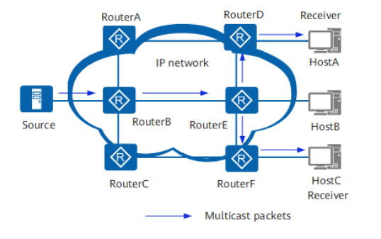

# IP 组播

## 组播简介
传统的 IP 通信有：单播（Unicast）、广播（Broadcast）以及组播（Multicast）。
- 对于单播通信，信息源为每个需要信息的主机都发送一份独立的单播 IP 报文，因此网络中传输的信息量与需要该信息的用户量成正比。
- 对于广播通信，信息源将广播 IP 报文发送给该网段中的所有主机，而不管其是否需要该信息。这样不仅存在信息安全性隐患，而且会造成同一网段中信息泛滥。因此该传输方式不利于与特定对象进行数据交互。
- 对于组播通信，信息源向组播地址发送一份组播 IP 报文，网络中只有需要该数据的主机（请求加入该组的主机）可以接收该数据，其他主机不能收到该数据。因此，组播可以很好的解决广播在“点到多点”的数据传输中的缺点。

组播适用于任何“点到多点”的数据发布，主要包含以下几方面：
- 多媒体、流媒体的应用。
- 培训、联合作业场合的通信。
- 数据仓库、金融应用（股票）。

## 组播网络

组播网络由组播源、组播路由器和组播接收者组成。其中，组播网络至少包含一个组播路由器。组播源向组播路由器发送目的 IP 为组播地址（例如 225.0.0.1）的组播报文，组播接收者向组播路由器发送加入某组播地址（例如 225.0.0.1）的请求，组播路由器负责将组播报文传输到每一个加入该组的接收者。
- 组播组：用 IP 组播地址进行标识的一个集合。
- 组播源：信息的发送者称为“组播源”，一个组播源可以同时向多个组播组发送数据，多个组播源也可以同时向一个组播组发送报文。组播源通常不需要加入组播组。
- 组播组成员：所有加入某组播组的主机便成为该组播组的成员。组播组中的成员是动态的，主机可以在任何时刻加入或离开组播组。
- 组播路由器：支持三层组播功能的路由器或交换机。

下图是一个组播网络示意图。

## 组播地址

为了使组播源和组播组成员进行通信，需要提供网络层组播，使用 IP 组播地址。同时，为了在本地物理网络上实现组播信息的正确传输，需要提供链路层组播，使用组播 MAC 地址。组播数据传输时，其目的地不是一个具体的接收者，而是一个成员不确定的组，所以需要一种技术将 IP 组播地址映射为组播 MAC 地址。

IANA 将 D 类地址空间分配给 IPv4 组播使用。IPv4 地址一共 32 位，D 类地址最高 4 位为 1110，因此地址范围从 224.0.0.0 到 239.255.255.255。

|                         地址范围                         |                             含义                             |
| :------------------------------------------------------: | :----------------------------------------------------------: |
|                  224.0.0.0～224.0.0.255                  | 永久组地址。IANA 为路由协议预留的 IP 地址（也称为保留组地址），用于标识一组特定的网络设备，供路由协议、拓扑查找等使用，不用于组播转发。 |
| 224.0.1.0～231.255.255.255 233.0.0.0～238.255.255.255 |                ASM 组播地址，全网范围内有效。                |
|                232.0.0.0～232.255.255.255                |         缺省情况下的 SSM 组播地址，全网范围内有效。          |
|                239.0.0.0～239.255.255.255                | 本地管理组地址，仅在本地管理域内有效。在不同的管理域内重复使用相同的本地管理组地址不会导致冲突。 |

常见的永久组地址包括

|  地址范围  |                   含义                   |
| :--------: | :--------------------------------------: |
| 224.0.0.1  | 网段内所有主机和路由器（等效于广播地址） |
| 224.0.0.2  |              所有组播路由器              |
| 224.0.0.4  |   DVMRP（距离矢量组播路由协议）路由器    |
| 224.0.0.5  |               OSPF 路由器                |
| 224.0.0.9  |               RIP-2 路由器               |
| 224.0.0.13 |                PIM 路由器                |

IANA 规定，IPv4 组播 MAC 地址的高 24 位为 `0x01005e`，第 25 位为 0，低 23 位为 IPv4 组播地址的低 23 位。由于 IPv4 地址 28 位中只有 23 位被映射到 MAC 地址，因此丢失了 5 位的地址信息，导致一些组播地址被映射到相同的 MAC 地址，网络管理员在分配地址时必须考虑这种情况。

## 服务模型

组播服务模型的分类是针对接收者主机的，对组播源没有区别。组播源发出的组播数据中总是以组播源自己的 IP 地址为报文的源地址，组播组地址为目的地址。

然而，接收者主机接收数据时可以对源进行选择，因此产生了 **任意源组播 ASM**（Any-Source Multicast）和 **特定源组播 SSM**（Source-Specific Multicast）两种服务模型。这两种服务模型使用不同的组播组地址范围。

|      对比      |          任意源组播 ASM          |           特定源组播 SSM           |
| :------------: | :------------------------------: | :--------------------------------: |
|    提供服务    |     仅针对组地址提供组播分发     | 针对特定源和组的绑定数据流提供服务 |
| 主机加入组播组 | 可以接收到任意源发送到该组的数据 |   只会收到指定源发送到该组的数据   |
|    组播地址    |  组地址必须在整个组播网络中唯一  |      组地址和组播源对保持唯一      |

## 组播协议族

在 IP 组播传输模型中，发送者不关心接收者所处的位置，只要将数据发送到约定的目的地址，剩下的工作就交给网络去完成。网络中的组播设备必须收集接收者的信息，并按照正确的路径实现组播报文的转发和复制。在组播的发展过程中，形成了一套完整的协议来完成此任务。

IPv4 组播协议族如下表所示。

| 协议                                                         | 功能                                                         | 备注                                                         |
| ------------------------------------------------------------ | ------------------------------------------------------------ | ------------------------------------------------------------ |
| 组播组管理协议IGMP（Internet Group Management Protocol）     | IGMP 是负责 IPv4 组播成员管理的协议，运行在组播网络中的最后一段，即三层网络设备与用户主机相连的网段内。IGMP 协议在主机端实现组播组成员加入与离开，在上游的三层设备中实现组成员关系的维护与管理，同时支持与上层组播路由协议的信息交互。 | 到目前为止，IGMP 有三个版本：IGMPv1、IGMPv2 和 IGMPv3。所有 IGMP 版本都支持 ASM 模型。IGMPv3 可以直接应用于 SSM 模型。 |
| 协议无关组播PIM（Protocol Independent Multicast）            | PIM 作为一种 IPv4 网络中的组播路由协议，主要用于将网络中的组播数据流发送到有组播数据请求的组成员所连接的组播设备上，从而实现组播数据的路由查找与转发。PIM 协议包括 PIM-SM（Protocol Independent Multicast Sparse Mode）协议无关组播稀疏模式和 PIM-DM（Protocol Independent Multicast Dense Mode）协议无关组播密集模式。PIM-SM适合规模较大、组成员相对比较分散的网络；PIM-DM适合规模较小、组播组成员相对比较集中的网络。 | 在PIM-DM模式下不需要区分ASM模型和SSM模型。在PIM-SM模式下根据数据和协议报文中的组播地址区分ASM模型和SSM模型：如果在SSM组播地址范围内，则按照PIM-SM在SSM中的实现流程进行处理。PIM-SSM不但效率高，而且简化了组播地址分配流程，特别适用于对于特定组只有一个特定源的情况。如果在ASM组播地址范围内，则按照PIM-SM在ASM中的实现流程进行处理。 |
| 组播源发现协议 MSDP（Multicast Source Discovery Protocol）   | MSDP是为了解决多个PIM-SM域之间的互连的一种域间组播协议，用来发现其他PIM-SM域内的组播源信息，将远端域内的活动信源信息传递给本地域内的接收者，从而实现组播报文的跨域转发。 | 只有PIM-SM使用ASM模型时，才需要使用MSDP。                    |
| 组播边界网关协议 MBGP（MultiProtocol Border Gateway Protocol） | MBGP实现了跨AS域的组播转发。适用于组播源与组播接收者在不同AS域的场景。 | -                                                            |
| IGMP Snooping & IGMP Snooping Proxy                          | IGMP Snooping功能可以使交换机工作在二层时，通过侦听上游的三层设备和用户主机之间发送的IGMP报文来建立组播数据报文的二层转发表，管理和控制组播数据报文的转发，进而有效抑制组播数据在二层网络中扩散。IGMP Snooping Proxy功能在IGMP Snooping的基础上使交换机代替上游三层设备向下游主机发送IGMP Query报文和代替下游主机向上游设备发送IGMP Report和Leave报文，这样能够有效的节约上游设备和本设备之间的带宽。 | 与IGMP对应，IGMP Snooping就是IGMP协议在二层设备中的延伸协议，可以通过配置IGMP Snooping的版本使交换机可以处理不同IGMP版本的报文。 |

IPv6 组播协族如下表所示。

| 协议                                                  | 功能                                                         | 备注                                                         |
| ----------------------------------------------------- | ------------------------------------------------------------ | ------------------------------------------------------------ |
| 组播侦听者发现协议MLD（Multicast Listener Discovery） | MLD是负责IPv6组播成员管理的协议，运行在组播网络中的最后一段，即三层组播设备与用户主机相连的网段内。MLD协议在主机端实现组播组成员加入与离开，在三层设备上实现组成员关系的维护与管理，同时支持与组播路由协议的信息交互。 | 到目前为止，MLD有两个版本：MLDv1和MLDv2。MLDv2版本可以直接应用于SSM模型，而MLDv1则需要通过使用SSM Mapping机制来支持SSM模型。MLD可以理解为IGMP的IPv6版本。两者的实现方式具有类比性，如MLDv1可以类比IGMPv2，MLDv2可以类比IGMPv3。 |
| PIM（IPv6）                                           | PIM（IPv6）作为一种IPv6网络中的组播路由协议，主要用于将网络中的组播数据流引入到有组播数据请求的组成员所连接的交换机上，从而实现组播数据流的路由查找与转发。PIM（IPv6）协议包括PIM-SM（IPv6）和PIM-DM（IPv6）两种模式。PIM-SM（IPv6）适合规模较大、组成员相对比较分散的网络；PIM-DM（IPv6）适合规模较小、组播组成员相对比较集中的网络。 | 在PIM-DM（IPv6）模式下不需要区分ASM模型和SSM模型。在PIM-SM（IPv6）模式下根据数据和协议报文中的组播地址区分ASM模型和SSM模型：如果在SSM组播地址范围内，则构建PIM-SM在SSM中的实现模式。PIM-SSM（IPv6）不但效率高，而且简化了组播地址分配流程，特别适用于对于特定组只有一个特定源的情况。如果在ASM组播地址范围内，则按照PIM-SM（IPv6）在ASM中的实现流程进行处理。 |
| MLD Snooping & MLD Snooping Proxy                     | MLD Snooping功能可以使交换机工作在二层时，通过侦听上游的三层设备和用户主机之间发送的MLD报文来建立组播数据报文的IPv6二层转发表，管理和控制组播数据报文的转发，进而有效抑制组播数据在二层网络中扩散。MLD Snooping Proxy功能在MLD Snooping的基础上使交换机代替上游三层设备向下游主机发送查询报文和代替下游主机向上游设备发送MLD Report和Done报文，这样能够有效的节约上游设备和本设备之间的带宽。 | MLD Snooping可以理解为IGMP Snooping的IPv6版本。              |

本文剩余部分仅针对 IPv4 网络进行讨论。

