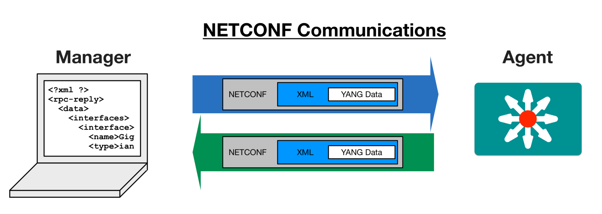
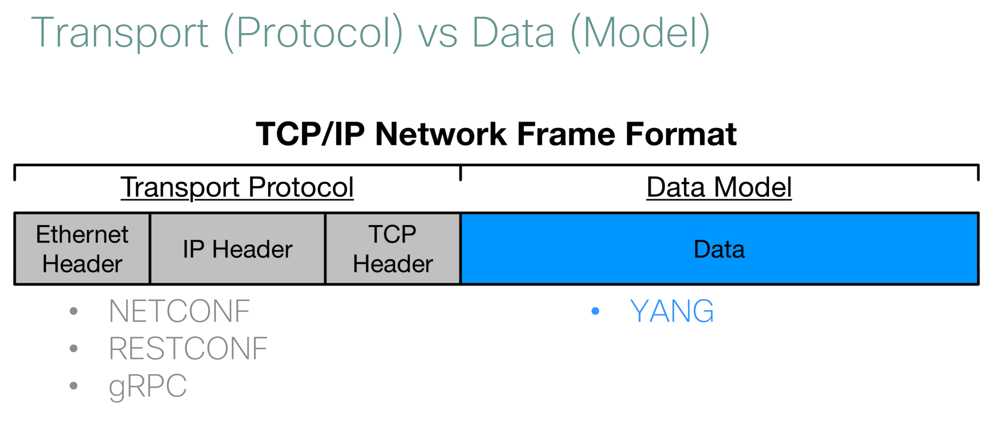
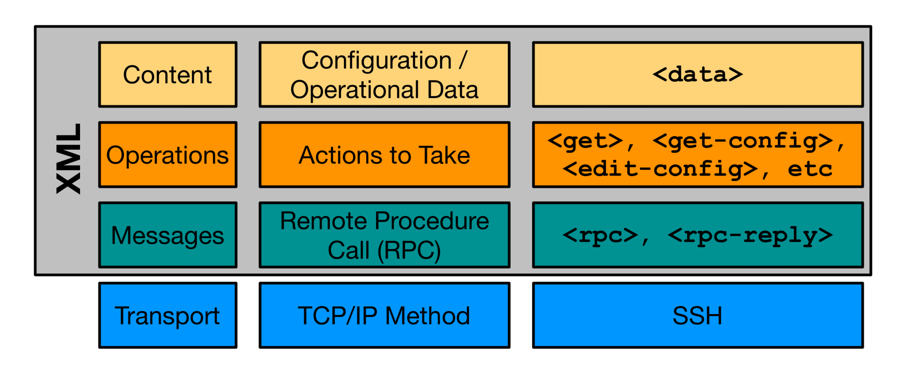
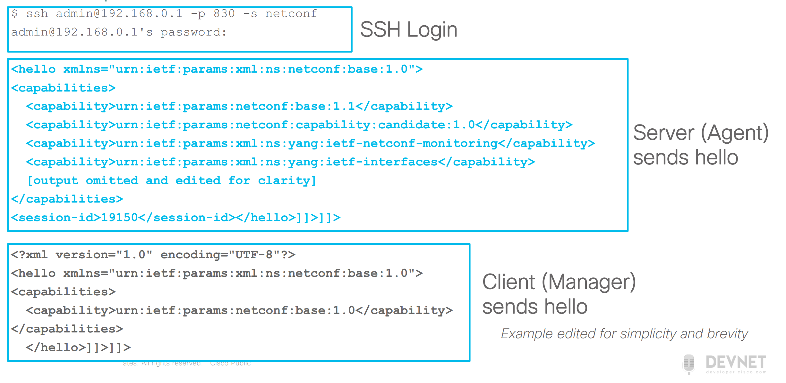
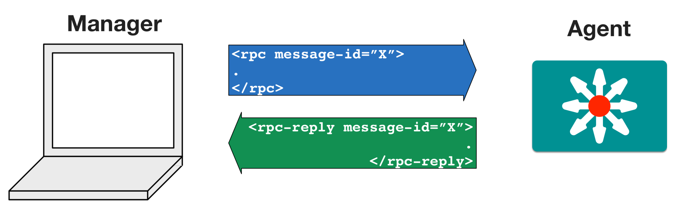
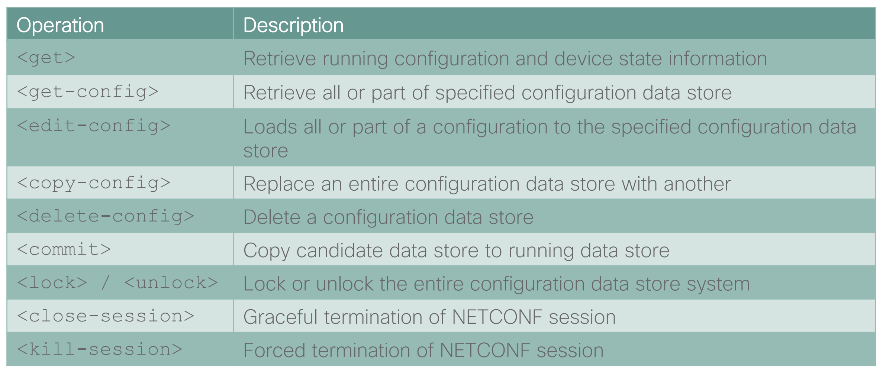
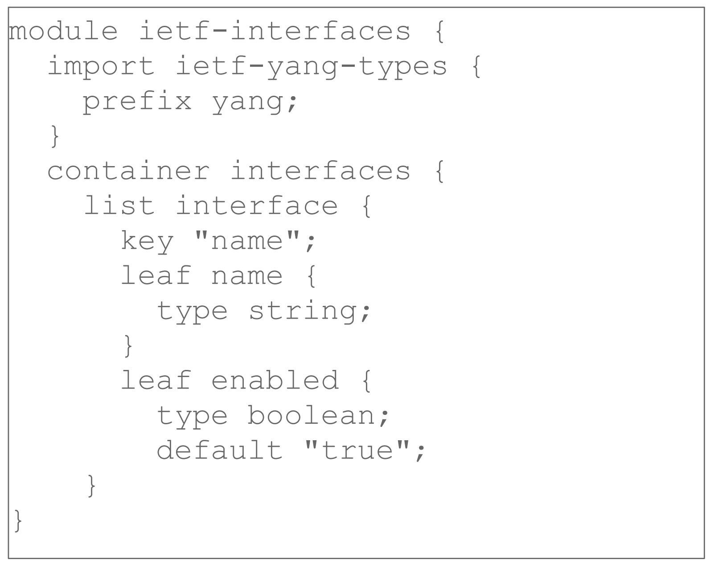
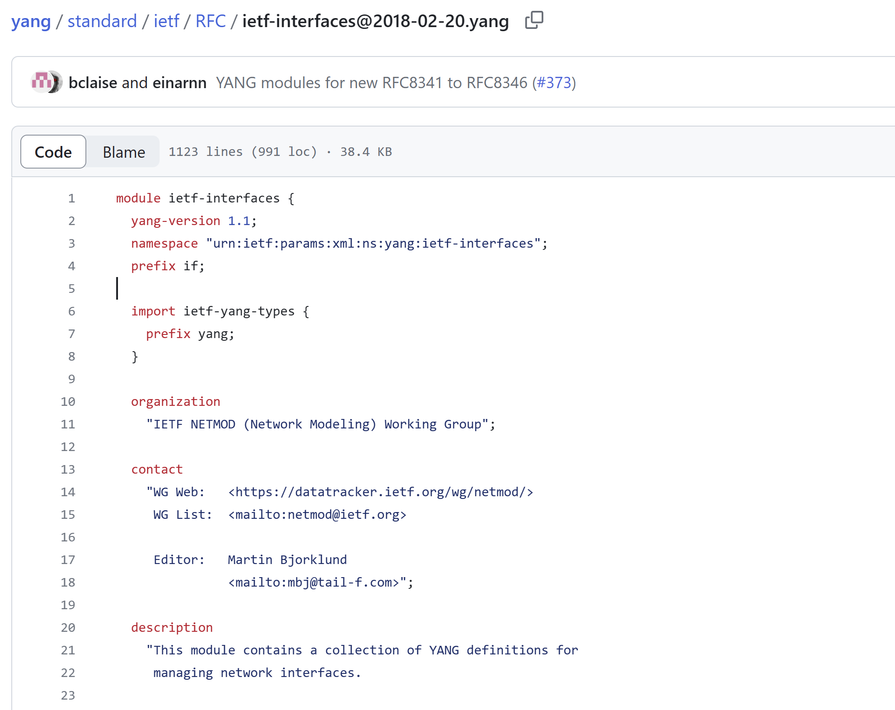
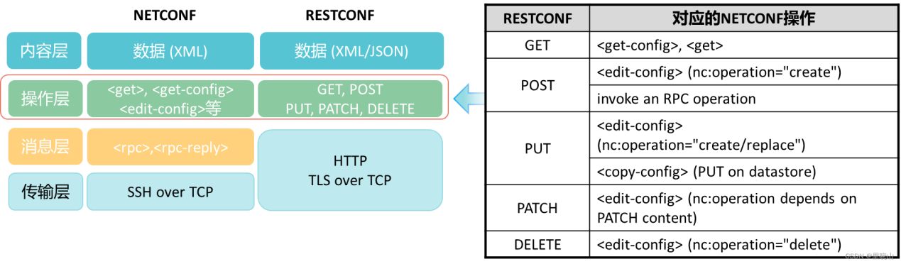

# NETCONF & YANG

NETCONF 最初在 2006 年由 RFC 4741 描述，最近为 RFC 6241。NETCONF 协议采用了 CS 架构，通过 NETCONF 协议即可在 Manager（客户端）和 Agent（服务端）之间传输 YANG DATA。



类似于 TCP/IP 协议栈中报文传输，NETCONF 传输协议和 YANG 数据模型共同完成了信息传输过程。



!> 除了 NETCONF 协议，RESTCONF 和 gRPC 等也可用作传输协议，然而数据建模一般均使用 YANG 数据。

## NETCONF 协议

NETCONF 协议栈包括四层，其中底层传输层采用了 SSH 协议，上层协议以 XML 格式作为承载形式实现。



### 传输 - SSH with XML

客户端和服务端互相建立 SSH 安全连接，并且交互 hello xml 来完成基本握手。



在 Hello 过程中，双方会交换其 NETCONF 兼容性信息，用于进行协商，以防止“不认识”对方发来的消息。

随后，NETCONF 使用标准的 XML 格式来传输数据。格式如下：

```xml
<?xml version='1.0' encoding='UTF-8'?>
<some-message>
</some-message>
```

### 消息 - RPC

NETCONF 协议使用了 RPC-based 通信模型，NETCONF 通信双方使用 `<rpc>` 和 `<rpc-reply>` 元素来提供与传输层协议无关的 NETCONF 请求和应答。



在每条消息中进行 NETCONF 的操作，例如获取配置、修改配置、删除配置、提交配置、关闭会话等。以 `get-config` 操作为例，假设客户端发送 `rpc` 消息用来请求配置。

```xml
<rpc message-id="101"
    xmlns="urn:ietf:params:xml:ns:netconf:base:1.0">
    <get-config>
        <source>
            <running/>
        </source>
    </get-config>
</rpc>
```

当服务端收到 `rpc` 请求后，回复一条 `rpc-reply` 消息，回复消息有三种情况：

- rpc 请求解析错误：使用 `<rpc-error>` 元素回复。
- rpc 请求正确，但无需返回任何内容：使用 `<ok>` 元素回复。
- rpc 请求正确，需返回内容：使用 `<data>` 元素回复。

```xml
<rpc-reply message-id="101"
    xmlns="urn:ietf:params:xml:ns:netconf:base:1.0">
    <rpc-error>
        <error-type>rpc</error-type>
        <error-tag>missing-attribute</error-tag>
        <error-severity>error</error-severity>
        <error-info>
            <bad-attribute>message-id</bad-attribute>
            <bad-element>rpc</bad-element>
        </error-info>
    </rpc-error>
</rpc-reply>

<rpc-reply message-id="101"
    xmlns="urn:ietf:params:xml:ns:netconf:base:1.0">
    <data>
        <!-- contents here... -->
    </data>
</rpc-reply>

<rpc-reply message-id="101"
    xmlns="urn:ietf:params:xml:ns:netconf:base:1.0">
    <ok/>
</rpc-reply>
```

### 操作- Operations

在请求消息中包含了需要执行的操作，例如获取配置、修改配置、删除配置、提交配置、关闭会话等。



后文通过示例详细讨论。

### 过滤器

假设需要获取部分 XML 内容，而不是整个 data 的内容，可以使用 NETCONF 默认的 subtree filtering。

subtree 过滤器是用 XML 元素嵌套关系组织而成的，下面是一个 get 操作的过滤器模板，只需要将过滤器置入 `<filter type="subtree">` 元素中即可。

```xml
<?xml version="1.0" encoding="UTF-8"?>
<rpc message-id="getBGPNBRstate" xmlns="urn:ietf:params:xml:ns:netconf:base:1.0">
    <get>
        <filter type="subtree">
        </filter>
    </get>
</rpc>
```

假设需要过滤，并获取 user 内容，其过滤模板如下：

```xml
<?xml version="1.0" encoding="UTF-8"?>
<rpc message-id="getBGPNBRstate"
    xmlns="urn:ietf:params:xml:ns:netconf:base:1.0">
    <get>
        <filter>
            <configure xmlns="urn:nokia.com:sros:ns:yang:sr:conf">
                <system>
                    <security>
                        <user-params>
                            <local-user>
                                <user>
                                </user>
                            </local-user>
                        </user-params>
                    </security>
                </system>
            </configure>
        </filter>
    </get>
</rpc>
```

我们注意到，实质上 subtree 过滤器只是提供了一个树形结构，用于进行数据匹配，上述过滤器路径可以抽象为 `/configure/system/security/user-params/local-user/user`。

使用这种路径过滤被称为 XPATH 过滤器，XPATH 过滤器不是标准行为，需要进行兼容性确认，确保服务端支持该特性。

!> 用户如何知道 subtree 过滤器的结构？答案是需要根据 yang 模型来构造，可以通过 pyang 等工具生成过滤器模板，参见客户端开发章节。

### 数据库

NETCONF 的配置数据存储于 datastore 中，根据种类，可以分为：

- running 运行时数据库，必须含有。
- candidate 候选者数据库，兼容性指定。当修改了配置后，并不立即生效。
- startup 开始数据库，可以进行预配置等，兼容性指定。

## YANG

YANG 广义上而言有三种含义：

- YANG modeling language
- YANG Data Model
- YANG Data

### YANG 数据建模语言

YANG 数据建模语言（YANG modeling language）：作为一种建模语言，其具有一定的语法，通过语言的形式，来精准描述一个模块的数据结构。



### YANG 数据模型

YANG 数据模型（YANG DATA Model）是用 YANG 建模语言描述的一个实体结构。在网络领域，通过 YANG 数据模型，可以精确的描述一个设备的 interface，例如“接口名”、“接口速率”、“接口类型”等属性的集合，构成了 interface 的 Data Model，这样一个系统化的模型即 YANG 模型。同样的，YANG 模型还可以用于描述服务。目前，YANG 模型可以大致分为两类：

- 业界标准（Industry Standard）：由 IETF, ITU, OpenConfig 起草的相关模型，其中大部分已经由 RFC 标准化。
- 厂商标准（Vendor Specific）：由 Cisco、Huawei 等厂商起草的标准，用于描述私有内容。

各种 YANG 模型可以在开源网站下载

- <https://github.com/YangModels/yang>
- <https://github.com/openconfig/public>

一个具体的 YANG 数据模型文件以 `.yang` 作为后缀。



为了可读性，YANG 模型可以通过许多具体形式表述，例如：

- YANG Language
- Clear Text
- XML
- JSON
- HTML/JavaScript

### YANG 数据

YANG 数据（YANG Data）即是由 YANG 模型描述的一个具体设备的数据，一般以 XML 或 JSON 等形式来描述。在 NETCONF 协议中，传输的内容即 XML 形式的 YANG 数据。

## NETCONF 客户端

假设已经有一个网络设备（Agent）支持 NETCONF 协议，并且提供了 YANG 模型文件。以 Python 语言为例，以下展示如何进行客户端开发，来构建我们自己的 Manager。

### `ncclient`

首先，选择 NETCONF 客户端开发库 `ncclient`，通过库可以同服务端建立 NETCONF 连接，发送具有不同操作的 NETCONF 请求，并接收服务端响应。

```py
with manager.connect(host=host, port=830, username='root', password='root', hostkey_verify=False) as m:
    assert(":xpath" in m.server_capabilities)
    c = m.get_config(source=datastore, filter=('xpath', expr))
    with open("%s.xml" % host, 'w') as f:
        f.write(c.xml)
```

### `pyang`

接着，选择 `pyang` 库作为 YANG 模型辅助工具，进行 YANG 模型的校验、转换以及代码生成。

!> 使用 `pyang` 命令时，通常需要指定 yang 文件搜索路径，但系统中的 yang 文件可能是分散的，因此，为了避免找不到路径问题，建议将系统中所有需要的文件放置于一个目录中，例如 `$HOME/yang/modules`，然后在该目录下执行命令。

服务端提供了 yang 模型文件，但开发者可能并不十分清楚如何根据模型文件构造 data 的结构，或者开发者根据 yang 模型文件，人工构造出了一个 XML 结构，但并不知道其是否合法。基于以上情况，可以使用 `pyang` 命令生成 XML 数据实例模板：

```shell
pyang -f sample-xml-skeleton --sample-xml-skeleton-defaults --sample-xml-skeleton-path "/ripd/" module.yang -o module.xml
```

其中：`--sample-xml-skeleton-defaults` 可以在实例中填充默认值，`--sample-xml-skeleton-path` 可以指定 XPATH 路径，从而只生成感兴趣的部分。

如果需要转换为 JSON 实例数据（例如采用 RESTCONF 协议时），可以通过以下命令获取：

```shell
export PYANG_XSLT_DIR=/home/liyj/.local/share/yang/xslt # if pyang is installed in user path
pyang -f jsonxsl module.yang -o module.xsl
xsltproc -o module.json module.xsl module.xml
```

获取到 XML 数据实例模板后，可以采用一些 XML 相关的编程技巧，利用模板构造数据，最后通过 NETCONF 协议发出，这样就可以构建出一个私有的 NETCONF-YANG 客户端。

## NETCONF 服务端

TODO

## RESTCONF 协议

RESTCONF 在 2017 由 RFC 8040 进行标准化。RESTCONF 基于 HTTP 协议，使用与 NETCONF 相同的数据存储 YANG 模型数据。

RESTCONF 与 NETCONF 很像，不仅是实现的效果类似，实际上也具有相当多的相似之处。RESTCONF 出现的最重要的原因就是使用 HTTP 作为传输协议，这将节省公司自动化运维的成本，因为大部分接口都是采用 HTTP 实现的，而 NETCONF 是建立在 SSH/TCP 上传输 raw XML 实现的协议。



NETCONF 通过节点关系来定位资源，而 RESTCONF 通过 URL 来定位资源。

## 参考

- [Getting XML data sample for a given leaf in a YANG model](https://netdevops.me/2020/getting-xml-data-sample-for-a-given-leaf-in-a-yang-model/)
- [NETCONF subtree filtering by example](https://netdevops.me/2020/netconf-subtree-filtering-by-example/)
- [ncclient examples](https://aristanetworks.github.io/openmgmt/examples/netconf/ncclient/)
- [pyang examples](https://aristanetworks.github.io/openmgmt/examples/pyang/)
- [netconf - rfc6241](https://www.rfc-editor.org/rfc/rfc6241)
