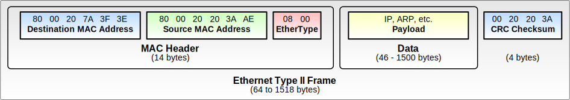
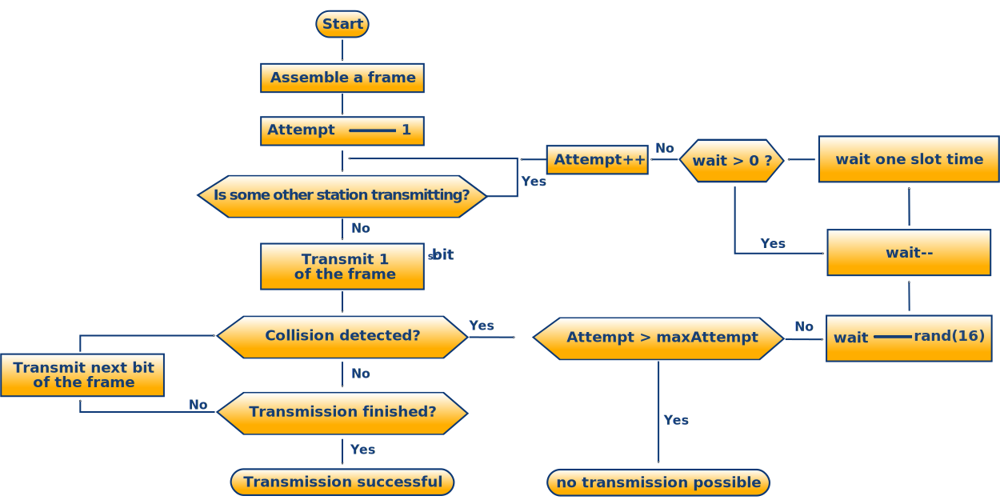
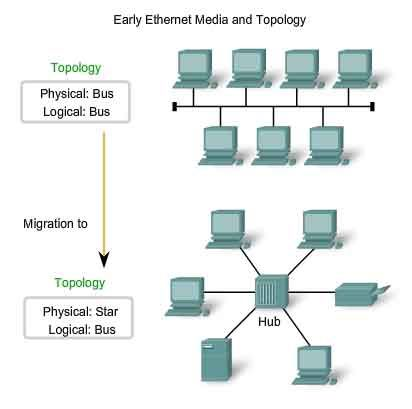

## 以太网

**以太网 (Ethernet) 是当今最常用的 LAN 标准**，同时也是第一个建议使用共享介质进行网络访问的技术。以太网开始作为一种传输速率为 **10Mb/s 的数据传输网络标准**而成为 DEC、Intel 和 美国施乐公司的**专用标准**，后来被 IEEE 802.3 工作组标准化，从此成为**国际标准**。随着**传统以太网 (10Mb/s)** 的普及，后续出现了**快速以太网 (100Mb/s)**、**千兆以太网 (1000Mb/s)**、**10G以太网 (10000Mb/s)**。所以，以太网这一术语代表着多重含义。

介质访问控制 (MAC) 作为介质共享算法是任何 LAN 技术中最重要的特性，**以太网使用随机访问方法作为介质共享机制**。

### 帧结构

由于以太网是先工程化后标准化的协议，因此实际上以太网多种帧格式。在 IEEE 802 标准中，数据链路层被分为以下两层：

- 逻辑控制层（LLC 层）：负责面向连接的高级控制。
- 媒体介入控制层（MAC 层）：负责数据封装、差错检测。

然而目前以太网帧都是用来承载没有连接的 IP 数据包，因此实际上 LLC 层并不存在。鉴于此，目前以太网的帧格式包括：

- 以太网 DIX / 以太网 II (Ethernet II frame, or Ethernet Version 2, or DIX frame)：是最常见的帧类型。并通常直接被IP协议使用。
- IEEE 802.3 以太网 (802.3/802.2, or IEEE 802.2 Logical Link Control (LLC) frame)：用于携带 LLC 帧。
- 以太网 SNAP (IEEE 802.2 Subnetwork Access Protocol (SNAP) frame)：IEEE 802.3 以太网的拓展。
- 原始 802.3 (Novell raw IEEE 802.3)：不常见，被淘汰。

以太网 II 的帧结构如下：

### 共享式以太网

早期的以太网（1/10Mbps）使用**同轴电缆**进行传输，所有的通信信号都在**共享介质 (shared media)**上传输，即使信息只是想发给其中的一个终端，也需要使用广播的形式发送给线路上的所有电脑，虽然在正常情况下，网络接口卡会滤掉不是发送给自己的信息，但是这带来了以下的缺点：

- 所有的通信共享带宽，**半双工通信**方式，当发送方发送信息时，不仅其他终端不可发送，连真正的接收端也不能发送数据，网络速度慢。
- 共享介质通信需要**介质访问控制协议**来进行协调，决定什么时候由谁进行通信。
- 所有终端都可以接收到信息，**安全性较差**。

如果说速度和安全性是相对可以接受的缺点，那么接入协议就是不可避免的。以太网使用 **CSMA/CD (Carrier-sense multiple access with collision detection)** 协议作为介质访问控制协议，该协议细节和流程如下图所示。

该协议的思路大致是不断对链路进行冲突检测，如果线路空闲，则启动传输；如果线路繁忙，持续等待直到线路空闲。就像在没有主持人的座谈会中，所有的参加者都通过一个共同的介质（空气）来相互交谈。每个参加者在讲话前，都礼貌地等待别人把话讲完。如果两个客人同时开始讲话，那么他们都停下来，分别随机等待一段时间再开始讲话。这时，如果两个参加者等待的时间不同，冲突就不会出现。如果传输失败超过一次，将延迟指数增长后再次尝试。

在共享式以太网中，中继器和集线器 (repeaters and hubs) 可以进行物理拓扑的延伸，其区别是：

- 中继器进行物理信号的放大，用来解决同轴电缆最大传输距离限制问题。
- 集线器淘汰了同轴电缆，可以方便的将多个网段点对点地连起来，使得网络更加可靠，接线更加方便。

### 交换式以太网

为了解决共享式以太网的缺点，交换式以太网逐步发展。共享式以太网的标准拓扑结构为**总线型拓扑**，但当前的高速以太网 (100BASE-T、1000BASE-T标准) 为了减少冲突，将能提高的网络速度和使用效率最大化，使用交换机 (Switch) 来进行网络连接和组织。如此一来，以太网的拓扑结构就成了**星型**。

交换式以太网的好处是：

- 物理层采用双绞线 (twisted pair cables) 进行**全双工通信**，包括 10BASE-T，100BASE-TX，和 1000BASE-T 规格，运行速度分别为 10 Mbit/s，100 Mbit/s，和 1 Gbit/s，不再是共享介质通信。
- 交换机采用**端口学习机制**转发数据帧，而不是简单的广播。

### 高级交换网络

#### STP 生成树协议

#### 802.1Q VLAN 协议

## Wi-Fi 和 802.11 标准

**Wi-Fi**又称“无线热点”或“无线网络”，是一种基于 **IEEE 802.11** 标准的无线局域网技术实现。

## 路由

## UDP 协议

## TCP 协议

