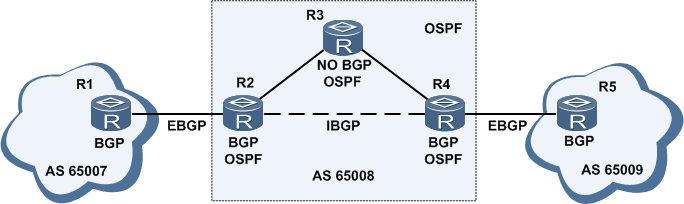
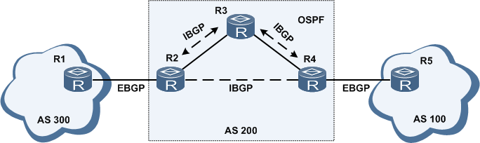
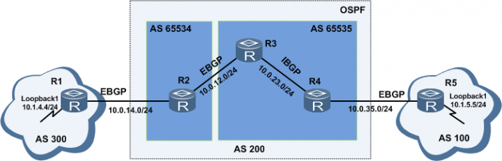
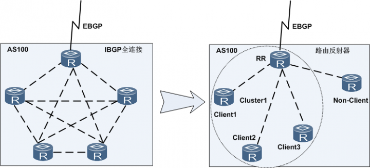
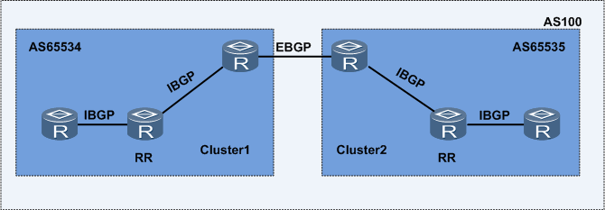

# IP 路由 - BGP 协议

## BGP 简介

为方便管理规模不断扩大的网络，网络被分成了不同的**自治系统**（Autonomous System, AS），路由只在自治系统内部传播，因此缩小了网络规模。用于 AS 域内路由选择的协议称为**内部网关协议** (Interior Gateway Protocol, IGP)，常见的协议包括：

- RIP：距离矢量协议，多用于小型网络。
- IS-IS：链路状态协议，多用于运营商网络。
- OSPF：链路状态协议，多用于企业中大型网络。
- EIGRP：CISCO 私有路由协议，增强型距离矢量协议。

与此对应，**外部网关协议** (Exterior Gateway Protocol, EGP) 被用于实现在 AS 之间动态交换路由信息。包括：

- EGP：最初 EGP 的一种实现，但是 EGP 设计得比较简单，只发布网络可达的路由信息，而不对路由信息进行优选，同时也没有考虑环路避免等问题，很快就无法满足网络管理的要求。
- BGP：边界网关协议 (Border Gateway Protocol, BGP) 是一种实现自治系统之间路由可达、避免路由环路，并选择最佳路由的**距离矢量**路由协议。目前 BGP 已经成为事实上唯一的外部网关协议。

BGP 发展至今，早期发布的三个版本已经很少使用。

- BGP-1 (RFC 1105)
- BGP-2 (RFC 1163)
- BGP-3 (RFC 1267)

1994 年开始使用 BGP-4 (RFC 1771)，2006 年之后 BGP 的使用版本固定下来，分别是：

- 单播 IPv4 网络使用的版本是 BGP-4 (RFC 4271)。
- 其他网络使用的版本是多协议拓展 BGP，即 MultiProtocol-BGP，简称 MP-BGP (RFC 4760)，该协议对 BGP-4 进行了扩展，来达到在不同网络中应用的目的，BGP-4 原有的消息机制和路由机制并没有改变。
  - MP-BGP 在 IPv6 单播网络上的应用称为 BGP4+
  - MP-BGP 在 IPv4 组播网络上的应用称为 MBGP (Multicast BGP)
  - 其他统称 MP-BGP。

## BGP 的产生

AS 是指在一个实体管辖下的拥有相同选路策略的 IP 网络，每个 AS 都被分配一个唯一的 AS 号，用于区分不同的 AS。

【图】

能不能使用现有的 IGP 协议来进行 AS 之间的路由交换呢？首先链路状态协议（OSPF、ISIS）不适合用于交换 AS 之间的路由，因为链路状态协议需要拥有全局拓扑，这样会导致每一台路由器上都生成庞大的数据库。那么采用 RIP 这种距离矢量协议可以吗？很明显 RIP 有两个致命的问题：

1. RIP 协议 30 秒进行一次全量更新，AS 之间路由数量较多，很可能 30 秒都发送不完，这样带宽都被路由协议报文占满了，严重影响业务通信。
2. RIP 基于 UDP 协议实现，大量的 UDP 报文很可能丢失，造成路由不同步。

因此，需要重新设计一种新的距离矢量协议用于 AS 之间路由交换，这就是 BGP 产生的原因。因此，BGP 的两个核心思想就是：

1. AS 之间路由较多，不适合全量更新，应当为**增量更新**。
2. **基于 TCP 可靠通信**进行路由交换。

## BGP 核心思想

BGP 基于 TCP（179 端口）设计，那么就不能使用 RIP 那种通过组播 Hello 的方式进行邻居发现和维护了，需要设计新的机制。 TCP 建立连接必须知道对端 IP 地址，且路由可达。因此就有静态配置或动态配置两种方式，BGP 采用了静态配置的方式，只要双方路由可达，就可以建立连接。静态配置具有两个好处：

1. 可以与对端设备用任何 IP 建立邻居关系，而不是局限于某个固定接口的 IP，这样就可以采用回环口建立邻居，使得路由更加稳定。
2. 可以跨越多个设备建立邻居，用于 AS 内部建立 BGP 连接（后文详述）。

建立邻居之后，就可以在这个 TCP 连接之上传输路由了，具体流程如下：

- BGP 使用 **OPEN 报文**建立邻居，若建立失败，则过一段时间后再次尝试建立。
- BGP 邻居建立后，使用 **UPDATE 报文**进行路由表同步。
- 路由同步完成后，通过定期发送 **KEEPALIVE 报文**维持 TCP 连接，这样可以不用重新建立连接，立刻进行路由更新。
- BGP 通过发送 **NOTIFICATION 报文**中断 BGP 连接。
- 如果 3 个保活周期没有收到对端的保活报文，则拆除 TCP 连接，并且删除从对方收到的所有路由。

下图是一个典型的 BGP 组网图，其中包含三个 AS，AS 之间运行 BGP 协议，AS 65008 内部运行 OSPF 协议，其中 R3 上没有 OSPF 协议。BGP 根据连接建立的角色，又分为两种：

- EBGP：运行于 AS 之间两台设备建立的 BGP 关系。
- IBGP：运行于 同一 AS 之内两台设备建立的 BGP 关系。

既然有了 OSPF，为何要有 IBGP 呢？假设没有 IBGP，R2 学到的 AS 65007 的路由和 R4 学到的 AS 65009 的路由是无法交互的。要想实现交互，则 R2 和 R4 必须将庞大的 BGP 路由和 OSPF 路由互相引入，这样 R1 上的路由才能扩散到 R5 上，然而，将数十万级别的 BGP 路由引入 IGP 中是无法容忍的。从上文可知，BGP 的邻居建立无需物理上相邻，只需路由可达即可，因此通过引入 IBGP，就可以实现 R2 和 R4 之间的路由同步。

## BGP 路由黑洞

上文介绍了 BGP 的核心思想，但上图中的网络存在一个严重问题。虽然全网控制面路由已经收敛了，但是转发面上数据包是却无法传输！这种现象称为**路由黑洞**。这是因为 R3 上并不知道任何关于 BGP 路由的信息，当 R1 给 R5 发送数据包时，R3 路由表内查询不到 R5 的网段，因此会丢弃数据。

为了避免这种情况，BGP 采用了**同步机制**：BGP 向 EBGP 邻居通告自 IBGP 邻居的学到的路由时，必须保证该路由也存在于 IGP 中。简而言之，同步机制保证了 AS 域中路由的一致性。可是这不是又回到 BGP 与 IGP 互相引入的问题了吗？显然这个代价是无法接受的，但这仍然是一种可行的方案，因此一般 BGP 同步机制是默认关闭的。 BGP 需要其他的方式来解决路由黑洞问题。

- 物理全连接：任何两个路由器之间均为直连，那么 R2 就可以直接将数据转发至 R4，该方案弊端在于随着节点的增加，需要新增的链路数量几何增长。
- 逻辑全连接：任何两个路由器之间均建立 IBGP 连接，该方案弊端在于随着节点的增加，IBGP  的连接数也会几何增长。

根据逻辑全连接的思路，BGP 提出了两种方案解决 IBGP 连接数量过多的问题。

### 联盟

联盟（Confederation）机制采用降低 AS 规模的思路来解决该问题。将 AS 域再次划分为多个 AS 域，被分割的 AS 称为**联盟**，分割后的多个 AS 称为**成员自治系统**，但联盟之外的 AS 将整个联盟视为一个 AS。成员自治系统之内运行 IBGP 全连接，成员自治系统之间运行一种特殊的 EBGP，称为**联盟 EBGP**。

AS 号分为两种：

- 公有 AS：范围为 1-64511
- 私有 AS：范围为 65512-65535，共计 1024 个。

成员自治系统可以采用私有 AS 号。

### 路由反射器

路由反射器（Route Reflector）机制采用了构建一个逻辑上的星型网络来解决该问题。星型拓扑结构是用一个节点作为中心节点，其他节点直接与中心节点相连构成的网络。因此，反射机制中指定一个路由器成为 RR，作为整个 IBGP 连接网络的核心，其他设备和 RR 建立 IBGP 连接即可。

此时，网络中的设备角色包括：

- 路由反射器 RR：允许把从 IBGP 对等体学到的路由反射到其他 IBGP 对等体的 BGP 设备。
- 客户机 Client：与 RR 形成反射邻居关系的 IBGP 设备。
- 非客户机 Non-Client：既不是 RR 也不是客户机的 IBGP 设备。在 AS 内部所有非客户机与所有 RR 之间仍然必须建立全连接关系。

- 始发者 Originator：在 AS 内部始发路由的设备。
- 集群 Cluster：RR 及其客户机的集合。

RR 向 IBGP 邻居发布路由规则如下：

- 从非客户机学到的路由，发布给所有客户机。

- 从客户机学到的路由，发布给所有非客户机和客户机（发起此路由的客户机除外）。
- 从 EBGP 对等体学到的路由，发布给所有的非客户机和客户机。

联盟和路由反射器都是在大规模自治系统中减少 IBGP 对等体数量的有效方法，有时两者共同使用将会更加方便。

## 路由环路

BGP 是一种距离矢量路由协议，因此必须考虑防止环路机制。BGP 中分两种情况设计了防环机制。

### EBGP

EBGP 发生路由环路的**根本原因是路由的起源和经过的 AS 是不明确的**。因此，在路由传递时，附加上其经过的 AS 列表，路由器收到路由后检查 AS 列表，若包含自身 AS 号，则表示该路由已经在本 AS 内传播过，则不接收该路由。

### IBGP

IBGP路由环路产生的原因和 EBGP 类似，但是由于 IBGP 是在 AS 内部建立的 BGP 关系，所以无法通过记录路由经过的 AS 号来进行防环。对于 IBGP，协议采用了类似 RIP 的水平分割的机制，称之为 IBGP 水平分割，其内容为：从 IBGP 对等体接收到的路由不会通告给其他的IBGP邻居。

## BGP 属性

## 路由聚合

## 路由选路

## 参考

参考：<https://forum.huawei.com/enterprise/zh/thread-243715.html>
