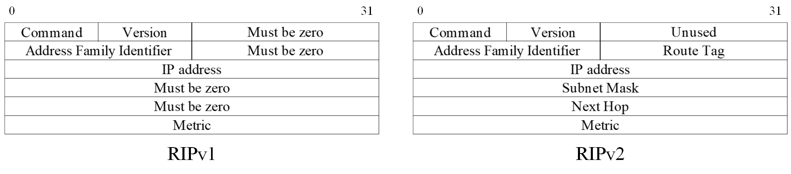
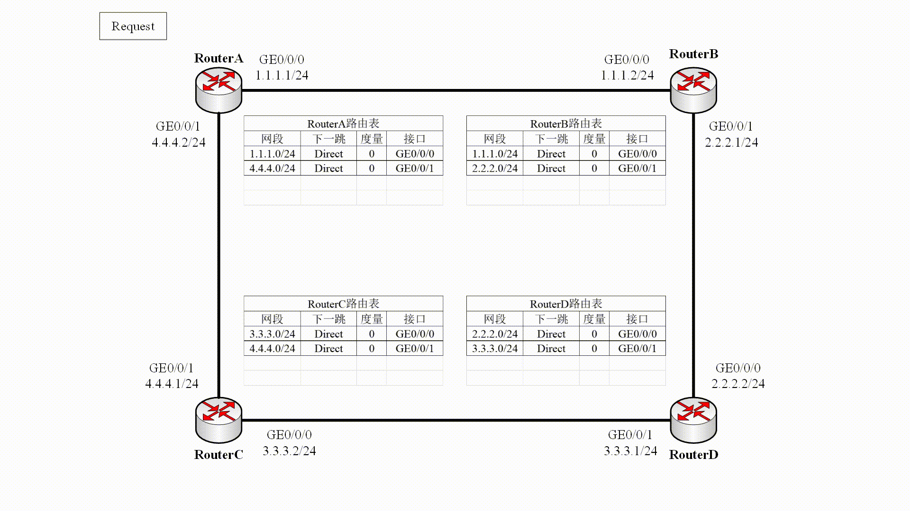

# RIP 协议

## RIP 简介

路由信息协议（Routing Information Protocol, RIP）是一种较为简单的**内部网关协议**。RIP 协议基于**距离矢量**算法的协议，并使用**跳数作为度量**来衡量到达目的网络的距离。协议通过 UDP 报文进行路由信息交换。

## RIP 报文格式

RIP 的协议报文采用 **UDP** 封装，报文的源、目的端口均是 520 端口。RIP 定义了两种报文，它们分别是：

- 请求 (Request) 报文：用于向邻居请求全部或部分 RIP 路由信息。
- 响应 (Response) 报文：报文中携带着路由以及该路由的度量值等信息。以下几种情况将会发送该报文：
  - 需要回应邻居的请求报文。
  - 当具备可宣告网段时，自发的发送 RIP 路由更新。
  - 路由变动时触发更新。

RIP 具有两个版本，其中 RIPv2 是对 RIPv1 的补充，两种报文格式如下图所示。

RIPv2 的增强之处在于：

- 支持外部路由标记（Route Tag），可以在路由策略中根据 Tag 对路由进行灵活的控制。
- 报文中携带掩码信息，支持路由聚合和无分类路由。
- 支持指定下一跳，在广播网上可以选择到目的网段最优下一跳地址。
- 支持以**组播方式**发送更新报文，默认采用组播 **224.0.0.9** 地址。
- 支持对协议报文进行验证，增强安全性。

RIPv2 报文主要包括两部分：

- RIP 头部（固定 4 字节）
  - 命令：01: Request; 02: Response
  - 版本：01: RIPv1; 02: RIPv2
  - 保留：2 字节全 0
- 路由条目（每个 20 字节）
  - 地址协议族：2 字节。IPv4 取值为 0x0002。
  - 路由标记：2 字节。用于标记外部重分布进 RIP 中的路由，一般为全 0。
  - IP 地址：4 字节。路由的目的网络地址。
  - 掩码：4 字节。目的网络的子网掩码。
  - 下一跳：4 字节。表示一个比通告路由器更优的下一跳地址，若为全 0 则表示通告路由器地址是最优地址。
  - 度量值：4 字节。在 RIP 中度量即跳数，在响应报文中为跳数，在请求报文中为 16。

## RIP 基本原理

RIP 启动时初始路由表仅包含本设备的一些直连接口路由。相邻设备通过互相学习路由表项后，才能实现各网段路由互通。

RIP 路由形成的过程如下：

- RIP 协议启动之后，A 会向**相邻**的交换机**广播/组播**一个 Request **请求报文**。
- B 从接口接收到 A 发送的 Request 报文后，把自己的 **RIP 路由表封装**在 Response **响应报文**内，然后向该接口对应的网络**广播**。
- A 根据 B 发送的响应报文进行路由选择，形成自己的路由表。

RIP 按照这种**路由通告**方式进行**路由选择**和**路由更新**，交换机并不了解整个网络的拓扑，只知道到达目的网络的**距离**、以及到达该目的网络的**方向**或**接口**。

### 路由初始化

在 RIP 网络中，缺省情况下设备到与它直接相连网络的跳数为 0，经过一个设备可达的网络的跳数为 1，其余依此类推。即：**度量值等于从本网络到达目的网络间的设备数量**。

此外，为了防止 RIP 路由在网络中被无限泛洪使得跳数累加到无穷大，同时也为了限制收敛时间，因此 RIP规定度量值取 0～15 之间的整数，大于或等于 16 的跳数被定义为无穷大，即目的网络或主机不可达。因此，RIP 不适合在大型网络中应用。

### 路由选择

当路由器收到 Respond 包之后，会将其中的路由条目提取加入自己的路由表，若已有该网段路由，则选择度量较小的保留。

### 路由更新

RIP 路由更新主要包括两种方式：

- 定时更新：RIP 更新信息发布是由**更新定时器**控制的，当此定时器超时时，立即发送更新报文。**默认发送周期为 30 秒**。
- 触发更新：当路由信息发生变化时，立即向邻居设备发送触发更新报文，而**不用等待更新定时器超时**，从而避免产生路由环路。

### 路由维护

每一条路由表项对应两个定时器：

- 老化定时器：当学到一条路由并添加到 RIP 路由表中时，老化定时器启动。如果老化定时器超时，设备仍没有收到邻居发来的更新报文，则把该路由的度量值置为 16（表示路由不可达），并启动垃圾收集定时器。
- 垃圾收集定时器：如果在垃圾收集定时器倒计时结束前，不可达路由没有收到来自同一邻居的更新报文，则该路由将从 RIP 路由表中彻底被删除。

### 路由防环

#### 水平分割

RIP 从某个接口学到的路由，不会从该接口再发回给邻居路由器。这样不但减少了带宽消耗，还可以防止路由环路。

水平分割在不同网络中实现有所区别，分为按照**接口**和按照**邻居**进行水平分割。

- 广播网、P2P 和 P2MP 网络中按照接口进行水平分割。

- NBMA 网络由于一个接口上连接多个邻居，所以是按照邻居进行水平分割的。路由就会按照单播方式发送，同一接口上收到的路由可以按邻居进行区分。从某一接口的对端邻居处学习到路由，不会再通过该接口发送回去。

#### 毒性逆转

毒性反转的原理是 RIP从某个接口学到路由后，从原接口发回邻居路由器，并将该路由的开销设置为16（即指明该路由不可达）。利用这种方式，可以清除对方路由表中的无用路由。