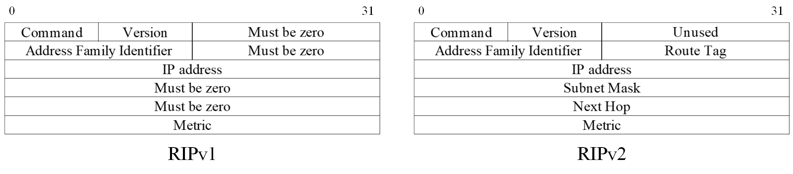
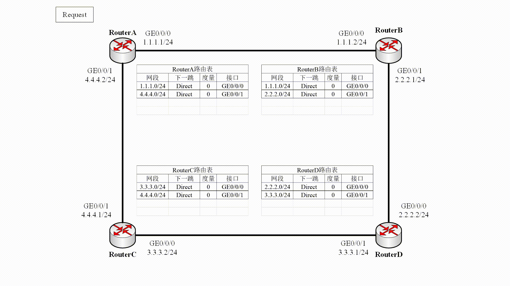

# IP 路由

## 路由概述

### 路由基本原理

**路由器（Router）**是一种典型的网络连接设备，用来进行路由选择和报文转发。路由器根据收到**报文的目的地址**选择一条合适的路径（包含一个或多个路由器的网络），然后将报文传送到下一个路由器，路径终端的路由器负责将报文送交目的主机。

**路由**就是报文从源端到目的端的路径。当报文从路由器到目的网段有多条路由可达时，路由器可以根据**路由表**中最佳路由进行转发。**最佳路由**的选取与发现此路由的路由协议的优先级、路由的度量有关。

- 当多条路由的协议优先级与路由度量都相同时，可以实现负载分担，缓解网络压力；
- 当多条路由的协议优先级与路由度量不同时，可以构成路由备份，提高网络的可靠性。

路由器转发数据包的关键是**路由表**（Routing Table）和**转发表**（Forwarding Information Base），路由器通过路由表选择路由，通过 FIB 表指导报文进行转发。

无论何种平台的设备，路由表总是包括以下部分：

- 目的网段：表示此路由的目的地址。
- 掩码：表示目的地址子网掩码长度。
- 协议：表示学习此路由的路由协议。
- 路由协议优先级：。针对同一目的地，可能存在不同下一跳、出接口等多条路由，优先级高者将成为当前的最优路由。
- 路由开销：当到达同一目的地的多条路由具有相同的路由优先级时，路由开销最小的将成为当前的最优路由。
- 下一跳地址：指明数据转发的下一个设备端口地址。
- 出接口：指明数据将从本地路由器哪个接口转发出去。

【图】

在路由表选择出路由后，路由表会将激活路由下发到 FIB 表中。当报文到达路由器时，会通过查找 FIB 表进行转发。FIB 表的匹配遵循**最长匹配原则**。查找 FIB 表时，报文的目的地址和 FIB 中各表项的掩码进行按位“逻辑与”，得到的地址符合 FIB 表项中的网络地址则匹配，最终选择一个最长匹配的 FIB 表项转发报文。

### 路由分类

根据路由目的地的不同，路由可划分为： 

- 网段路由：目的地为网段，IPv4 地址子网掩码长度小于 32 位或 IPv6 地址前缀长度小于 128 位。
- 主机路由：目的地为主机，IPv4 地址子网掩码长度为 32 位或 IPv6 地址前缀长度为 128 位。

根据目的地与该路由器是否直接相连，路由又可划分为： 

- 直连路由：目的地所在网络与路由器直接相连。
- 间接路由：目的地所在网络与路由器非直接相连。

根据目的地址类型的不同，路由还可以分为：

- 单播路由：表示将报文转发的目的地址是一个单播地址。
- 组播路由：表示将报文转发的目的地址是一个组播地址。

本文内容聚焦于**单播路由**。

### 自治系统

在互联网中，**自治系统 AS**（Autonomous System）是指在一个（有时是多个）实体管辖下的所有 IP 网络和路由器的网络，它们对互联网执行共同的路由策略。一个 AS 内的所有网络都被分配同一个 AS 号，属于一个行政单位管辖。

### 路由协议

**路由协议**是路由器之间维护路由表的规则，用于发现路由，生成路由表，并指导报文转发。依据来源的不同，路由可以分为三类：

- 直连路由：通过链路层协议发现的路由。
- 静态路由：通过网络管理员手动配置的路由。
- 动态路由：通过动态路由协议发现的路由。

静态路由配置方便，对系统要求低，适用于拓扑结构简单并且稳定的小型网络。缺点是不能自动适应网络拓扑的变化，需要人工干预。动态路由协议有自己的**路由算法**，能够自动适应网络拓扑的变化。缺点是对系统的要求高于静态路由，并将占用一定的网络资源和系统资源。

对动态路由协议的分类可以采用以下不同标准：

根据作用范围不同，路由协议可分为：

- 内部网关协议 IGP（Interior Gateway Protocol）：在一个自治系统内部运行。
- 外部网关协议 EGP（Exterior Gateway Protocol）：运行于不同自治系统之间。

根据使用算法不同，路由协议可分为**距离矢量协议**（Distance-Vector Protocol）和**链路状态协议**（Link-State Protocol），两种算法的主要区别在于发现路由和计算路由的方法不同。

常用路由协议分类如下表所示：

|              | 内部网关协议 | 外部网关协议 |
| ------------ | ------------ | ------------ |
| 距离矢量协议 | RIP、EIGRP   | BGP          |
| 链路状态协议 | OSPF、IS-IS  |              |

### 路由可靠性

#### 负载分担

当到达同一目的地存在同一路由协议发现的多条路由时，且这几条路由的开销值也相同，那么就满足负载分担的条件。

#### 路由备份

#### 快速重路由

## RIP 协议

### RIP 简介

路由信息协议（Routing Information Protocol, RIP）是一种较为简单的**内部网关协议**。RIP 协议基于**距离矢量**算法的协议，并使用**跳数作为度量**来衡量到达目的网络的距离。协议通过 UDP 报文进行路由信息交换。

### RIP 报文格式

RIP 的协议报文采用 **UDP** 封装，报文的源、目的端口均是 520 端口。RIP 定义了两种报文，它们分别是：

- 请求 (Request) 报文：用于向邻居请求全部或部分 RIP 路由信息。
- 响应 (Response) 报文：用于发送 RIP 路由更新，报文中携带着路由以及该路由的度量值等信息。

RIP 具有两个版本，其中 RIPv2 是对 RIPv1 的补充，两种报文格式如下图所示。

RIPv2 的增强之处在于：

- 支持外部路由标记（Route Tag），可以在路由策略中根据 Tag 对路由进行灵活的控制。
- 报文中携带掩码信息，支持路由聚合和无分类路由。
- 支持指定下一跳，在广播网上可以选择到目的网段最优下一跳地址。
- 支持以**组播方式**发送更新报文，默认采用组播 **224.0.0.9** 地址。
- 支持对协议报文进行验证，增强安全性。

RIPv2 报文主要包括两部分：

- RIP 头部（固定 4 字节）
  - 命令：Request/Response
  - 版本：RIPv1/RIPv2
- 路由条目（每个 20 字节）
  - 地址协议族：
  - 路由标记：
  - IP 地址：
  - 掩码：
  - 下一跳：
  - 度量值：

### RIP 基本原理

RIP 启动时初始路由表仅包含本设备的一些直连接口路由。相邻设备通过互相学习路由表项后，才能实现各网段路由互通。

RIP 路由形成的过程如下：

- RIP 协议启动之后，A 会向**相邻**的交换机**广播/组播**一个 Request **请求报文**。
- B 从接口接收到 A 发送的 Request 报文后，把自己的 **RIP 路由表封装**在 Response **响应报文**内，然后向该接口对应的网络**广播**。
- A 根据 B 发送的响应报文进行路由选择，形成自己的路由表。

RIP 按照这种**路由通告**方式进行**路由选择**和**路由更新**，交换机并不了解整个网络的拓扑，只知道到达目的网络的**距离**、以及到达该目的网络的**方向**或**接口**。

#### 路由初始化

在 RIP 网络中，缺省情况下设备到与它直接相连网络的跳数为 0，经过一个设备可达的网络的跳数为 1，其余依此类推。即：**度量值等于从本网络到达目的网络间的设备数量**。

此外，为了防止 RIP 路由在网络中被无限泛洪使得跳数累加到无穷大，同时也为了限制收敛时间，因此 RIP规定度量值取 0～15 之间的整数，大于或等于 16 的跳数被定义为无穷大，即目的网络或主机不可达。因此，RIP 不适合在大型网络中应用。

#### 路由选择

当路由器收到 Respond 包之后，会将其中的路由条目提取加入自己的路由表，若已有该网段路由，则选择度量较小的保留。

#### 路由更新

RIP 路由更新主要包括两种方式：

- 定时更新：RIP 更新信息发布是由**更新定时器**控制的，当此定时器超时时，立即发送更新报文。**默认发送周期为 30 秒**。
- 触发更新：当路由信息发生变化时，立即向邻居设备发送触发更新报文，而**不用等待更新定时器超时**，从而避免产生路由环路。

#### 路由维护

每一条路由表项对应两个定时器：

- 老化定时器：当学到一条路由并添加到 RIP 路由表中时，老化定时器启动。如果老化定时器超时，设备仍没有收到邻居发来的更新报文，则把该路由的度量值置为 16（表示路由不可达），并启动垃圾收集定时器。
- 垃圾收集定时器：如果在垃圾收集定时器倒计时结束前，不可达路由没有收到来自同一邻居的更新报文，则该路由将从 RIP 路由表中彻底被删除。

### 路由防环

#### 水平分割

RIP 从某个接口学到的路由，不会从该接口再发回给邻居路由器。这样不但减少了带宽消耗，还可以防止路由环路。

水平分割在不同网络中实现有所区别，分为按照**接口**和按照**邻居**进行水平分割。

- 广播网、P2P 和 P2MP 网络中按照接口进行水平分割。

- NBMA 网络由于一个接口上连接多个邻居，所以是按照邻居进行水平分割的。路由就会按照单播方式发送，同一接口上收到的路由可以按邻居进行区分。从某一接口的对端邻居处学习到路由，不会再通过该接口发送回去。

#### 毒性逆转

毒性反转的原理是 RIP从某个接口学到路由后，从原接口发回邻居路由器，并将该路由的开销设置为16（即指明该路由不可达）。利用这种方式，可以清除对方路由表中的无用路由。

## OSPF 协议

## IS-IS 协议

### IS-IS 简介

IS-IS（Intermediate System to Intermediate System）属于内部网关协议，是一种链路状态协议，使用最短路径优先算法进行路由计算。IS-IS 协议最初是由 ISO 为其 CLNP 网络设计的动态路由协议，但随着 TCP/IP 协议栈的流行，为了提供对 IP 网络的支持，IETF 对其进行了扩充，使之能够同时应用在 TCP/IP 和 OSI 中，称为集成 IS-IS。

### IS-IS 基本概念

为了支持大规模的路由网络，IS-IS 自治系统内采用了域的概念，每个路由器都只属于一个区域。物理上整个网络由多个独立的域组成，而逻辑上整个网络形成**骨干区域**与**非骨干区域**两级的分层结构。

根据所属区域及功能，IS-IS 路由器分为三种类型：

- Level-1路由器：部署在非骨干区域，负责区域内路由。
- Level-2路由器：部署在骨干区域，负责区域间的路由。
- Level-1-2路由器：部署在骨干区域，负责非骨干区域与骨干区域相连。

【图】

具体而言：

| 路由器分类       | 可建立邻居类型                                               | 功能                                                         |
| ---------------- | ------------------------------------------------------------ | ------------------------------------------------------------ |
| Level-1路由器    | 同一区域的 Level-1 和 Level-1-2 路由器                       | 负责维护本区域 Level-1 的 LSDB，到本区域外的报文转发给最近的 Level-1-2 路由器。 |
| Level-2路由器    | 同一或者不同区域的 Level-2 路由器、其它区域的 Level-1-2 路由器 | 负责不同区域间通信                                           |
| Level-1-2 路由器 | 与同一区域的 Level-1 和 Level-1-2 路由器形成 Level-1 邻居关系； 与其他区域的 Level-2 和 Level-1-2 路由器形成Level-2 邻居关系。 | Level-1-2 路由器维护两个 LSDB，Level-1 的 LSDB 用于区域内路由，Level-2 的 LSDB 用于区域间路由。 |

IS-IS 只支持两种类型的网络，根据物理链路不同可分为：

- 广播链路：如 Ethernet、Token-Ring 等。 
- 点到点链路：如 PPP、HDLC 等。 

### IS-IS 基本原理

IS-IS 是一种链路状态路由协议，每一台路由器都会生成一个 LSP，它包含了该路由器所有使能 IS-IS 协议接口的链路状态信息。通过跟相邻设备建立 IS-IS 邻接关系，互相更新本地设备的 LSDB，可以使得 LSDB 与整个 IS-IS 网络的其他设备的 LSDB 实现同步。然后根据 LSDB 运用 SPF 算法计算出 IS-IS 路由。如果此 IS-IS 路由是到目的地址的最优路由，则此路由会下发到 IP 路由表中，并指导报文的转发。

## BGP 协议

### BGP 简介

为方便管理规模不断扩大的网络，网络被分成了不同的自治系统（Autonomous System, AS）。外部网关协议 EGP（Exterior Gateway Protocol）被用于实现在 AS 之间动态交换路由信息。但是 EGP 设计得比较简单，只发布网络可达的路由信息，而不对路由信息进行优选，同时也没有考虑环路避免等问题，很快就无法满足网络管理的要求。

边界网关协议（Border Gateway Protocol, BGP）是一种实现自治系统之间路由可达、避免路由环路，并选择最佳路由的**距离矢量**路由协议。早期发布的三个版本分别是

- BGP-1 (RFC1105)
- BGP-2 (RFC1163)
- BGP-3 (RFC1267)

1994 年开始使用 BGP-4 (RFC1771)，2006 年之后 BGP 的使用版本固定下来，分别是：

- 单播 IPv4 网络使用的版本是 BGP-4 (RFC4271)。
- 其他网络使用的版本是 MP-BGP (RFC4760)，该协议对 BGP-4 进行了扩展，来达到在不同网络中应用的目的，BGP-4 原有的消息机制和路由机制并没有改变。
  - MP-BGP 在 IPv6 单播网络上的应用称为 BGP4+
  - MP-BGP 在 IPv4 组播网络上的应用称为 MBGP (Multicast BGP)

参考：https://forum.huawei.com/enterprise/zh/thread-243715.html

### BGP 目的

直接引入路由，但是同步开销太大。

路由传递成功，数据包不行。路由黑洞，解决方案：1，引入路由，代价高。2，物理全练接。3，逻辑全连接。

解决上一部分问题，1，联盟，2反射

- 联盟思路：通过划分成员自治系统降低自治系统规模，成员 AS 之间建立联盟 EBGP
- 反射思路：指定一个路由器成为 RR，作为整个 IBGP 全连接网络的核心。

路由环路：

### BGP 基本概念

BGP 使用 TCP 作为其传输层协议（端口号为179），
