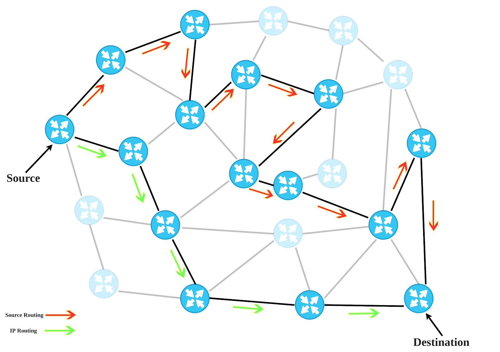

# Segment Routing

## SR 背景

Segment Routing 是路由领域的一个新宠儿，特别契合于自治网络或集中式控制网络（如 SDN），SR 与 MPLS 和 IPv6 两种技术深度绑定。因此，在学习 SR 之前需要对这两种技术做到基本熟悉。

### 源路由

SR 是一种**源路由协议**（Source Routing），在 RFC 791 中，定义了 IPv4 基本的路由模型是**基于目的地址转发**，对于一个给定数据包，路由器只能根据其目的地址来选择路由（选择下一跳），发送者以及数据包其他字段均不能影响路径转发。然而，IPv4 还规定了**源路由**模式，通过 **IP 选项域**字段来实现发送者对于转发路径的更多控制，这意味着发送者可以为数据包指定转发路径，控制数据包如何到达目的地。例如图中绿色是一条常规路由转发使用的最短路径，红色是源路由选择的转发路径。

在 IPv4 中有两种源路由协议，两者均是**在 IP 首部选项域字段存入一个逐跳列表**实现，这个列表也称作**路由数据**。

- **Loose Source and Record Route** (LSRR)：松散是指逐跳列表中的**下一跳节点不需要直接相连**，只需要指定一个大致的转发路径即可。如果两跳不直接相连，则由路由器决定具体转发到哪个节点。
- **Strict Source and Record Route** (SRRR)：严格是指逐跳列表中的**下一跳节点必须是直接相连**的。如果路由器发现逐跳列表里不是直接相连的，则会丢弃该数据。

综上所述，源路由的显著特点是路由编码在数据包中，沿途路由器无需再保存路由表等数据，只需要按照数据包中的指示转发即可，减轻了路由器负担。但与此同时却对数据发送者要求更高，等于是将这部分开销转移了。相对于分布式路由，源路由更适用于集中控制网络，发送者可以通过指定路径更为方便的实现转发优化、流量控制等。但与此同时，赋予发送者主机如此巨大的权限也带来了一定的安全问题，因此目前大部分路由器的源路由功能都不会默认开启。

### MPLS 简介

暂时先全放到这里，如果太多考虑单独列出。

### SR 简介

我们已经讨论了 MPLS-TE，并注意到它是一个非常有用且广泛部署的 MPLS 应用程序，但它在可扩展性和可管理性方面存在问题，两者都涉及控制和管理平面方面。

但是，如果将显式路径编码到数据包中的责任交给入口路由器而不是发送主机，则可以解决安全问题。另外，如果有一种方法可以将此显式路径信息编码为标记的数据包，以便启用 MPLS 功能的网络可以处理它们，而无需在所需路径上的所有路由器上存储其他状态，它将解决 MPLS-TE 可扩展性的问题。这是 SR 路由的两个关键思想，它结合了 MPLS 和源路由的优点。

But what if the responsibility of encoding the explicit path into the packet was given to an ingress router instead of the sending host? the security issues would no longer be a concern. And if there was a way to encode this explicit path information into labeled packets so that a MPLS-enabled network could process them without needing to store additional state on all routers along the desired path, it would resolve the issues with MPLS-TE scalability. These are the two key ideas of Segment Routing that combines the best from MPLS and Source Routing.

将显式路径编码到数据包中可以被视为将一系列指令放入数据包中。一粒盐，几乎就像“左转，然后直行，然后右转，然后再次右转，然后直行接下来的 10 公里”。分段路由利用了这个想法：它的显式路径是放置在数据包中的一组有序指令，路由器在转发数据包时执行这些指令。分段路由中的每个指令称为一个分段，其自己的编号称为分段 ID （SID），正如我们稍后将了解的，有多种分段类型。为了在数据包中表示这些指令，分段路由需要选择合适的编码 - 对于支持 MPLS 的网络，自然编码只不过是一个标签堆栈，每个标签代表一个特定的分段。MPLS 标签值将携带各个分段的分段 ID。

Encoding an explicit path into a packet can be seen as putting a sequence of instructions into the packet. With a grain of salt, it is almost like "turn left, then go straight, then turn right, then right again, and then straight for the next 10 kilometers". Segment Routing leverages this idea: **Its explicit path is an ordered set of instructions placed into the packet**, with the routers executing these instructions as they forward it. Each **instruction** in Segment Routing is called a **segment**, **has its own number called the Segment ID (SID)**, and as we will learn later, there are multiple segment types. To represent these instructions in a packet, Segment Routing needs to choose a suitable encoding - and **for** **MPLS-enabled networks, the natural encoding is nothing else than a label stack**, with **each label representing one particular segment. The MPLS label values would carry the Segment IDs of individual segments.**

From a pure MPLS forwarding perspective, Segment Routing again builds on top of the basic MPLS forwarding paradigm and does not change how the labeled packets are forwarded, similar to other MPLS applications. Regarding control plane operations, there are two significant changes to the well-used MPLS control plane policies that deserve to be mentioned:

- For certain segment types, the labels have preferably identical values on all routers in the SR domain and so have global significance
- Label bindings to segments are advertised by OSPF or IS-IS; LDP is not used

To summarize: **In Segment Routing, the path a packet follows is represented by a stack of labels pushed down to the packet by an edge router.** Each label represents a segment - a particular forwarding instruction that determines how the packet will be forwarded.

Having said this, we have understood that they are instructions, but now we need to determine how the routers identify these segments. Let’s define the classes of segments we can encounter.

In Segment Routing, there are two segment classes:

- Global Segment
- Local Segment

**A global segment is an ID value bearing significance inside the entire SR domain.** This means that **every node in the SR domain knows about this value and assigns the same action to the associated instruction in its LFIB**. **The reserved label range used for these purposes is <16000 - 23999>**, it is called **Segment Routing Global Block** (SRGB) and **it is a vendor-specific range**, therefore, other vendors may use a different range.

**A local segment**, on the other hand, **is an ID value holding local significance, and only the originating node** (the router advertising it) **can execute the associated instruction.** As this range is only relevant for that particular node, **these values are not in the SRGB range** but in the locally configured label range.

Segment Routing recognizes many particular types of segments that belong either to the global or the local segment class. Let’s have a look at some of them:

**IGP Prefix Segment:** A globally significant segment which is distributed by IGPs (IS-IS/OSPF) and whose path is computed as the shortest path towards that specific prefix. This also allows it to be ECMP-aware. The actual SID value of an IGP Prefix Segment is configured by the administrator on a per-interface basis, and it is also the administrator’s responsibility to make sure that this value is unique in the entire SR domain. Typically, the SID would be configured on loopback interfaces to identify nodes in the cloud. An IGP Prefix Segment is very similar to a loose source routing hop. This is shown in Figure 4:

## Overview

段路由（Segment Routing），以下简称 SR。

需要一点IGP的拓展

不需要 LDP 和 RSVP-TE

每个路由器（节点）和每条链路（邻居）都有一个段 ID（Segment Identifier, SID）。

- 节点 SID 是全局唯一的，网络管理员从保留块中为每一个路由器分配一个节点 SID。
- 邻居 SID 是局部唯一的，路由器自动从 SID 保留块之外为路由器每个连接邻居路由器的接口分配一个 邻居 SID。

## Segments

段（segment）是指令的标识符，指令包括转发（forwarding）和服务（service）两种。

### Global and Local Segments

### IGP segments

#### IGP Prefix Segment

包含 IGP 计算出的 IP 地址前缀。Node SID 是一种包含节点的 Loopback 地址的特定格式 Prefix SID。

【图】

#### IGP Adjacency Segment

Adjacency SID：包含路由器与邻居的邻居关系。Adjacency SID 是针对单个路由器局部唯一的。

【图】

#### 组合

【图】

## SR 数据平面

SR 协议数据面

- MPLS
- IPv6

### SR MPLS 数据平面

SR MPLS 数据平面复用已有的 MPLS 数据平面：

- Segment -> label
- Segment list -> label stack

可以使用 PHP 特性和 Explicit-Null 功能。

#### 转发流程

【图-总体图】

-----R1-------------- R2 ---------------- R3 --------- R4

pl --- pl+16004 ------  pl+16004 ----------pl ----------

- push
- swap
- pop
- exp-null

#### SRGB

范围：16000-23999

Label=Prefix-SID index + SRGB range

E.g. Prefix 1.1.1.65/32 with prefix-SID index 65 gets label 16065

建议所有节点 SRGB 相同，不同可以，但没必要。转发时会减去base值看index值。

#### 标签动态分配

label range

- 0-15：special
- 16-15999：static MPLS labels
- 16000-23999：srgb
- 24000-up：dynamic label allocation

大多数 MPLS 应用使用 LSD Label Switching Database 动态分配的标签。

- LDP，RSVP，L2VPN，BGP（LU，VPN），ISIS（Adj-SID），OSPF（Adj-SID），TE（Binding-SID）

## SR IGP 控制平面

使用 IGP 协议来分发 segment

### SR IS-IS 控制平面

- 支持 IPv4、IPv6 协议
- Prefix-SID loopback 接口
- Adj-SID 邻居接口
- Prefix-to-SID mappiing advertisements（mapping server）
- MPLS PHP and Exp-NULL

#### 各种extensions

在 IS-IS 协议中，通过定义一些新的 IS-IS sub-TLV，用于 SR 来通告设备相关的能力和 segments。

| sub-TLVs                       | 解释 |
| ------------------------------ | ---- |
| SR Capability sub-TLV (2)      |      |
| Prefix-SID sub-TLV (3)         |      |
| Prefix-SID sub-TLV (3)         |      |
| Prefix-SID sub-TLV (3)         |      |
| Prefix-SID sub-TLV (3)         |      |
| Adjacency-SID sub-TLV (31)     |      |
| LAN-Adjacency-SID sub-TLV (32) |      |
| Adjacency-SID sub-TLV (31)     |      |
| LAN-Adjacency-SID sub-TLV (32) |      |
| SID/Label Binding TLV (149)    |      |

draft-ietf-isis-segment-routing-extensions-02

### SR OSPF 控制平面

- 支持 IPv4、IPv6 协议
- Prefix-SID loopback 接口
- Adj-SID 邻居接口
- Prefix-to-SID mappiing advertisements（mapping server）
- MPLS PHP and Exp-NULL

#### 【各种Extensions】

draft-ietf-ospf-segment-routing-extensions-02

## 参考

- [https://www.segment-routing.net/](https://www.segment-routing.net/)

- [Introduction to Segment Routing](https://learningnetwork.cisco.com/s/blogs/a0D3i000002SKP6EAO/introduction-to-segment-routing)
- 
