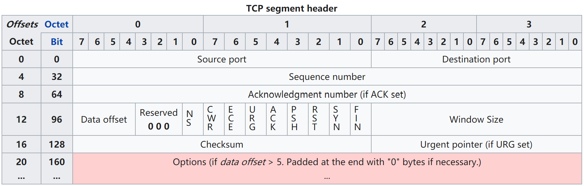
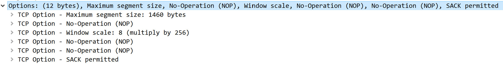
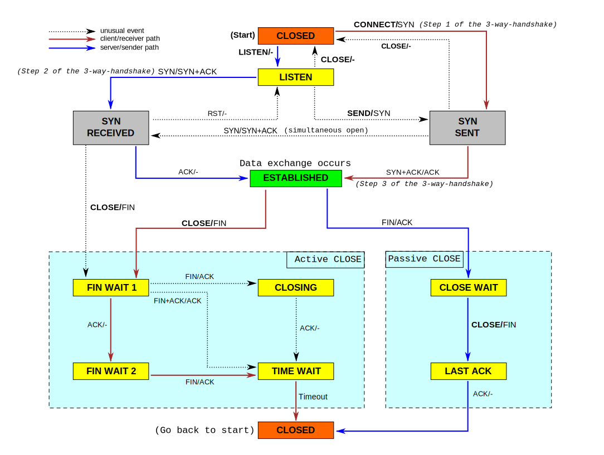
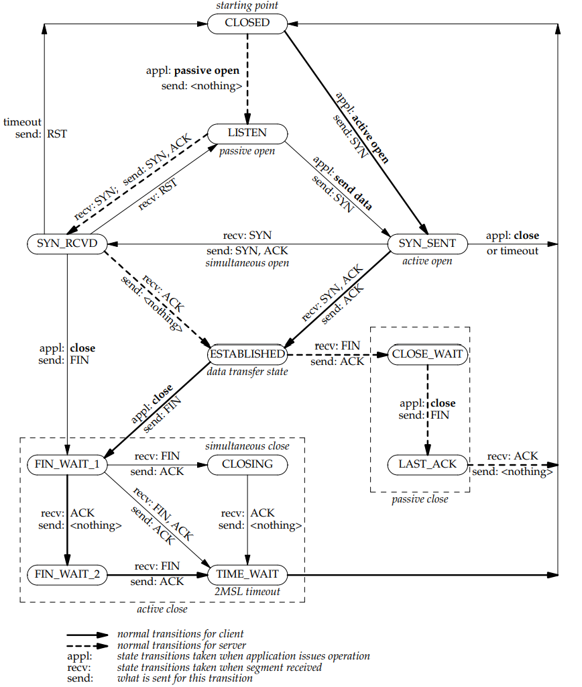
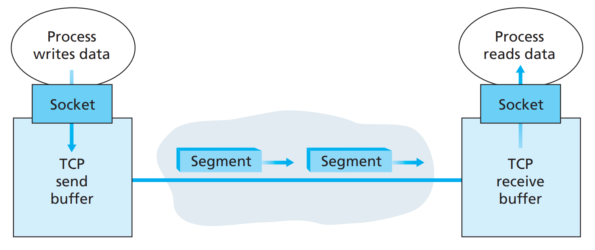
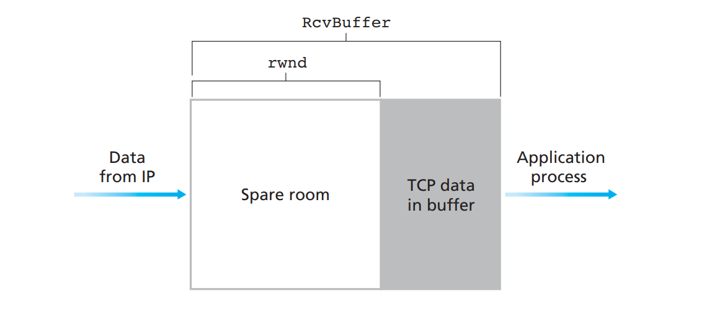
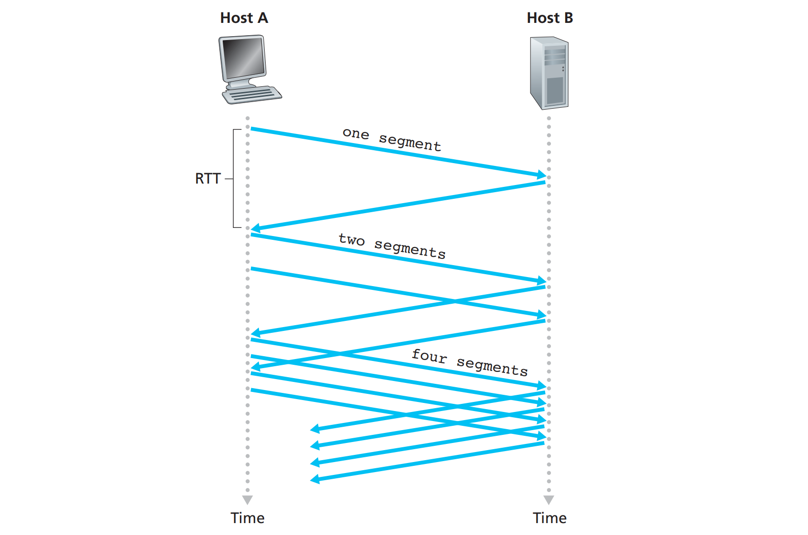
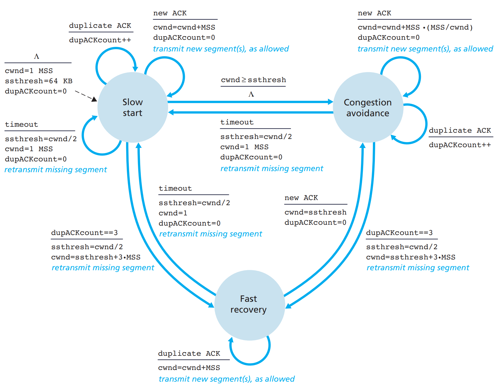

# TCP

## TCP 服务模型
传输控制协议 (Transmission Control Protocol, TCP) 是一种**面向连接的、可靠的、基于字节流**的传输层通信协议，由 IETF 的 [RFC 793 - TCP](https://tools.ietf.org/html/rfc793) 定义。

在计算机网络 OSI 模型中，它完成**传输层**所指定的功能，用户数据报协议 (UDP) 是同一层内另一个重要的传输协议。在因特网协议族中，TCP 是位于 IP 之上，应用层协议之下的中间层协议。不同主机的应用层之间经常需要可靠的、像管道一样的连接，但是 IP 层仅提供不可靠的包交换，因此 TCP 传输中使用了若干机制保证了连接的可靠性。

传输时，应用层向 TCP 层发送 8 位字节表示的数据流，TCP 从**数据流 (Data flow)** 中接收数据，将其分为多个块，并添加一个 TCP 头以创建一个 **TCP 段**(segment)。然后，TCP 段将会加上 IP 头封装为 **IP 数据报** (IP packet/datagram)，由它来透过网络将包传送给接收端实体的 TCP 层。

## TCP 段结构

TCP 报文段由头 (header) 和数据 (data) 组成。
- 段头部分：包含
    - **必填字段**：10 个部分，共 20 字节。
    - **可选的扩展字段**：0 - 40 字节（必须可以被 4 整除）
    - 填充字段：用于确保 TCP 头在 32 位边界上结束并开始数据部分，由零填充。
- 数据部分：位于头部之后，是携带的有效载荷，即上层应用程序数据。



> TCP 数据包/报文 (TCP packet) 一词在非正式和正式使用中都出现过，而在更精确的术语中，TCP 的 PDU 应该为段。但是不论是英语还是中文，TCP 段叫起来似乎有些拗口，所以本文也采用 TCP 报文这样的说法。


### 必填字段 (20 Bytes)

部分|长度|解释
---|---|---
源端口 (Source port)|16 bits|指示应用数据的源头。
目的端口 (Destination port) |16 bits|指示应用数据的目的。
序列号 (Sequence number) |32 bits|如果 SYN 标志为 1：则为初始序列号 (ISN)。此时对应的 ACK 为该 ISN + 1。</br>如果 SYN 标志为 0：则为数据第一个字节的累计序列号。
确认号 (Acknowledgment number) |32 bits|如果设置了 ACK 标志，则此字段的值是 ACK 发送方**期望接收的下一个序列号**，也就是**确认收到的最后一个字节的序列号**。
数据偏移 (Data Offset)|4 bits|以 4 字节为单位计算出的数据段开始地址的偏移值，也就是**TCP 头的长度**。该字段最小值为 5（20 字节），最大值为 15（60 字节）。
保留 (Reserved) |3 bits|保留位，必须置零。
标志位 (Flags)|9 bits|包含了 9 个标志位，其中**重要的是 SYN、ACK、FIN、PSH、RST**。
窗口大小 (Window size) |16 bits|**接收窗口的大小**，它指定此报文段的发送方当前愿意接收数据的窗口大小。详细见流量控制。
校验和 (Checksum) |16 bits|校验和字段校验内容包括 **TCP 报头、有效负载和 IP 伪报头**。
紧急指针 (Urgent pointer) |16 bits|如果设置了 URG 标志，则此字段是**紧急数据最后一个字节相对序列号的偏移量**。

> 段头中**未指定数据段的长度**，这可以通过从 IP 头中指定的 IP 数据报的总长度中减去 TCP 段头和 IP 头的组合长度来计算，即`数据长度 = IP 总长度 - IP 头长度 - TCP 头长度`。

### 选项字段 (0-40 Bytes)
选项字段 (TCP Options) 用于通信双方“商量”一些参数，一旦双方交换了这些参数，就不必占用固定的包头位置，因此减轻了 TCP 头的大小，从而节约了带宽。

选项字段为什么是不定长度的？ 可变的选项长度意味着并不一定每次都必须商量所有的可选参数，TCP 通信双方可以只选择感兴趣的参数，这进一步节约了带宽。TCP 使用了经典的 TLV 原则来实现可变长度协议的设计，即每一个支持的选项 (Option) 通过一个 TLV 字段支持，每一个选项（每个 TLV 字段）最多包含了三个部分：

1. Type 类型（不可省略）：该选项的种类
2. Length 长度（可省略）：该 TLV 字段长度
3. Value 数据（可省略）：该选项的值（可变长度）

因此选项字段就由一个个叠起来的 TLV 字段组合而成，报文段只需要包含关心的选项就可以了。以下是三次握手过程中某个 SYN 报文中的选项参数。



#### 最大段大小 (MSS)
最大段大小（MSS）是 TCP 愿意在单个段中接收的最大数据量（以字节为单位）。为了获得最佳性能，应将 MSS 设置得足够小，以避免 IP 分片，过多的分片可能导致数据包丢失和过多的重传。为此，通常在建立 TCP 连接时告诉对方自己的 MSS，同时会按照对方的 MSS 进行发包，尽量避免数据分片。

MSS 是从发送者和接收者直接相连的网络的数据链路层的最大传输单元（MTU）大小计算得出。此外，TCP 发送方可以使用路径 MTU 发现来推断发送方和接收方之间的网络路径上的最小 MTU，并使用此动态调整 MSS 以避免网络中的 IP 分片。 

MSS 公告通常也称为 MSS 协商。严格来说，MSS 不在发起方和接收方之间进行“协商”，因为这将意味着发起方和接收方都将协商并在双向通信中使用一个 MSS。实际上，对于 TCP 连接中数据流的两个方向，允许两个完全独立的 MSS 值。

#### 窗口规模 (Window scale)

#### 选择重传 (SACK)

## TCP 协议流程
TCP 协议流程大致可以分成三个阶段：
1. 连接建立 (connection establishment)
2. 数据传输 (data transfer)
3. 连接终止 (connection termination)

TCP 连接由操作系统通过**因特网套接字 (Internet socket)** 来管理，连接被抽象为套接字表示的本地端点，以此作为编程接口给程序使用。在 TCP 连接的生存期内，本地端点会发生一系列状态变化，可以表示为 **TCP 状态转移图**：

[](http://localhost:4000/2019/07/16/network-tcp/tcp-state-1.png)

在 [TCP/IP State Transition Diagram (RFC 793)](https://users.cs.northwestern.edu/~kch670/eecs340/proj2-TCP_IP_State_Transition_Diagram.pdf) 里有关于 TCP 状态图的详细解释，如下图：



状态|角色|解释
:---:|:---:|---
LISTEN|Server|等待来自客户端的连接请求。
SYN-SENT|Client|发出连接请求，等待连接的另一端响应。
SYN-RECEIVED|Server|接收到连接请求，并发送了连接请求之后等待对方确认。
ESTABLISHED|Both Server and Client|连接建立，可以进行数据传输。
FIN-WAIT-1|Both Server and Client|等待对端终止连接请求。</br>或等待先前发出的终止连接请求的确认。
FIN-WAIT-2|Both Server and Client|等待另一端发出的终止连接请求。
CLOSE-WAIT|Both Server and Client|等待本地端发出的终止连接请求。
CLOSING|Both Server and Client|等待对端的终止连接请求确认。
LAST-ACK|Both Server and Client|等待先前发出的终止连接请求的确认。
TIME-WAIT|**Either Server or Client**|等待足够长时间，确保另一端可以接收到对于终止连接请求的确认。
CLOSED|Both Server and Client|关闭状态，没有任何连接。

> 根据  RFC 793 TIME-WAIT 时间最长为最大分段生存期 (MSL) 的 2 倍，即 4 分钟。

### 连接建立 - 三次握手
为了建立连接，TCP 使用三次握手 (three-way handshake)。在客户端尝试与服务器连接之前，服务器必须首先**绑定并监听端口**，该端口用于进行 TCP 连接，这称为**被动打开 (passive open)**。一旦服务端处于被动打开状态，客户端就可以发起**主动打开 (active open)**。要建立连接，需要进行三向（或三步）握手： 
1. SYN：主动打开是由客户端向服务器发送 SYN 报文来执行的。客户端将段的序列号设置为随机值 A。
2. SYN-ACK：作为响应，服务器以 SYN-ACK 答复。确认号设置为比接收到的序列号多一个，即 A + 1，服务器为数据包选择的序列号是另一个随机数 B。 
3. ACK：最后，客户端将 ACK 报文发送回服务器。序列号被设置为所接收的确认值即A + 1，并且确认号被设置为比所接收的序列号即B + 1大一。 

此时，客户端和服务器都已收到连接的确认。其中，步骤 1、2 建立了客户端到服务端方向的连接参数（序列号），并确认了该参数。步骤 2、3 为服务端到客户端方向建立连接参数（序列号），并确认了该参数。由此建立了**全双工通信**。

### 连接终止 - 四次挥手


### 数据传输
在 TCP 的数据传送状态，很多重要的机制保证了 TCP 的可靠性和强壮性。它们包括：
- 基于序号：使用序号标识 TCP 报文；
- 有序传输：对收到的 TCP 报文段进行排序以及检测重复的数据；
- 无错传输：使用校验和检测报文段的错误；
- 使用确认和计时器来检测和纠正丢包或延时；
- 丢失包的重传。
- 流控制（Flow control）；
- 拥塞控制（Congestion control）；

## 可靠传输
- 序列号和确认号

```
NextSeqNumber = InitialSeqNumber
SendBase = InitialSeqNumber

loop(forever) {
    switch (event) 
        event: data received from application above
            create TCP segment with sequence number NextSeqNumber
            if (timer currently not running)
                start timer
            pass segment to IP
            NextSeqNumber = NextSeqNumber + length(data)
            break;

        event: timer timeout
            retransmit not-yet-acknowledged segment with smallest sequence number
            start timer
            break;
        
        event: ACK received, with ACK field value of y
            if (y > SendBase) {
                SendBase = y
                if (there are currently any not-yet-acknowledged segments)
                    start timer
                }
            } else { /* a duplicate ACK for already ACKed segment */
                increment number of duplicate ACKs received for y
                if (number of duplicate ACKS received for y==3)
                    /* TCP fast retransmit */
                    resend segment with sequence number y
                }
            break;
}
```

### 快速重传 (Fast Retransmit)
发送方超时重传的问题之一是超时周期较长，使得发送方延迟重传丢失的分组，因而增加了端到端时延。

当 TCP 接收方收到一个序号大于下一个期待收到的
一旦受到 3 个冗余 ACK，TCP 就执行快速重传

选择确认 (Selective acknowledgment) 允许 TCP 接收方有选择的接受失序报文段，而不是累积的确认最后一个正确接受的有序报文段。

许多 TCP 实现会将正确接受但失序的报文段缓存起来


## 流量控制 (Flow Control)
TCP 将其需要发送的数据存储在发送缓冲区中，并将其接收的数据存储在接收缓冲区中。应用程序准备就绪后，它将从接收缓冲区读取数据。



如果发送端发送的速度较快，接收端接收到数据后处理的速度较慢，而接收缓冲区的大小是固定的，就会导致接收端接收缓存溢出，从而丢失数据。流量控制就是用来**避免主机分组发送得过快而使接收方来不及完全收下**，一般由接收方通告给发送方进行调控。

TCP 使用**滑动窗口协议 (Sliding windows)** 实现流量控制。所谓窗口就是一条线段，那么实质上就是两个值。由于两个值在动态增加，故曰滑动。

TCP 通过让**发送方**维护一个**接收窗口变量 rwnd** 来提供流量控制，接收方通过把当前的 rwnd 值放入它发给发送方的报文段**接收窗口字段**中，从而向发送方表明**该连接的接收方还有多少可用的缓存空间**。由于 TCP 是全双工通信，因此在**连接两端的发送方都各自维护一个接收窗口变量**，用来提供双向的流量控制。 

假设主机 A 给主机 B 发送文件，主机 B 的接收缓存用 RevBuffer 来表示，开始时，主机 B 设定 rwnd = RcvBuffer。

首先，接收缓存中的 TCP 数据不能溢出，即：

$$LastByteRcvd - LastByteRead \leq RcvBuffer$$

接收窗口用 rwnd 根据**接收缓存剩余大小**来设置，由于该空间是动态变化的，所以 rwnd 变量也是动态的。

$$ rwnd = RcvBuffer - (LastByteRcvd - LastByteRead) $$



此时，主机 A 只要保证**已发送但未确认的数据不大于接收窗口的值**，就可以使得主机 B 接收缓存不会因为主机 A 而溢出。

$$ LastByteSent - LastByteAcked \leq rwnd $$

> **$rwnd = 0$​​ 会如何？**
> 主机 A 不可能知道主机 B 的接收缓存已经有新的空间了，即主机 A 被阻塞而不能再发送数据！为了解决这个问题，TCP 规范中要求：当主机 B 的接收窗口为 0 时，主机 A 继续发送**只有一个字节数据**的报文段。这些报文段将会被接收方确认，最终缓存将开始清空，并且确认报文里将包含新的非零 rwnd 值 。

## 拥塞控制 (Congestion Control)
TCP 所采用的方法是**让每一个发送方根据所感知到的网络拥塞程度来限制其能向连接发送流量的速率**。
- 如果发送方感知从它到目的地之间的路径上没什么拥塞，则 TCP 发送方增加其发送速率；
- 如果发送方感知沿着该路径有拥塞，则发送方就会降低其发送速率。

由此引出了三个问题：
1. TCP 发送方如何限制它向其连接发送流量的速率呢？
2. TCP 发送方如何感知从它到目的地之间的路径上存在拥塞呢？
3. 当发送方感知到端到端的拥塞时，采用何种算法来改变其发送速率呢？

### 限制发送速率
我们首先分析一下 TCP 发送方是如何限制向其连接发送流量的，TCP 连接的每一端都是由一个接收缓存、一个发送缓存和几个变量组成的窗口组成的。 

运行在发送方的 TCP 拥塞控制机制跟踪一个额外的变量，即**拥塞窗口** (congeslion window)，表示为 cwnd，它对一个 TCP 发送方能向网络巾发送流量的速率进行了限制。在一个发送方中未被确认的数据量不会超过 cwnd 与 rwnd 中的最小值，即：

$$ LastByteSent - LastByteAcked \leq min\{cwnd, rwnd\} $$

上面的约束通过限制发送方中未被确认的数据量，从而间接地限制发送方的发送速率，假设丢包、发送时延均忽略不计，接收端 rwnd 为无限大，则在每个往返时间 (RTT) 内，允许**发送方**向该连接最多发送 cwnd 个字节的数据，由于 TCP 会在未堵塞的情况下尽可能贪婪的占用带宽，那么该发送方的发送速率大概是 $\frac{cwnd}{RTT}$ 字节/秒。因此，通过调节 cwnd 的大小就可以调整它向连接发送数据的发送速率。

### 感知拥塞
TCP 发送方是如何感知在它与目的地之间的路径上出现了拥塞的呢？拥塞控制有两种方式：
1. 网络层辅助的拥塞控制：网络层构件（即路由器）向发送方提供关于网络中拥塞状态的显式反馈信息。
    - 这种反馈可以简单地用几个比特来指示链路中的拥塞情况。[RFC 3168 - ECN]](https://tools.ietf.org/html/rfc3168) 就是一种可以用于 TCP/IP 网络中的**显式拥塞控制**方法，该方法需要使用 **TCP 报文段结构中的 ECE 和 CWR 标志位**。
    - 更复杂的网络反馈允许路由器显式地通知发送方输出链路上支持的传输速率。
2. 端到端拥塞控制：网络层**没有**为运输层拥塞控制提供显式支持。

很明显，目前的 TCP/IP 网络大多网络设备不支持显示拥塞控制，因此广泛使用**端到端拥塞控制**，也就是：即使网络中存在拥塞，**端系统也必须通过对网络行为（分组延时或丢失）的观察来推断拥塞情况**。

最简单，也最经典的一种感知拥塞的方法是**基于丢包**的，即：当发送发感知到丢包时，就认为网络出现了拥塞。在这种模型下，一个 TCP 发送方的丢包事件定义为：**要么出现超时，要么收到来自接收方的 3 个冗余 ACK**。

### 拥塞控制算法原理
实际上，不仅只有基于丢包感知拥塞的方法，不同的感知方式导致了不同的拥塞控制算法，目前有非常多的 TCP 的拥塞控制协议，例如：
- **基于丢包的拥塞控制**：将丢包视为出现拥塞，采取缓慢探测的方式，逐渐增大拥塞窗口，当出现丢包时，将拥塞窗口减小，如 Tahoe、Reno、NewReno、Cubic 等。
- **基于时延的拥塞控制**：将时延增加视为出现拥塞，延时增加时减小拥塞窗口，延时减小时增加拥塞窗口，如 Vegas、FastTCP 等。
- **基于链路容量的拥塞控制**：实时测量网络带宽和时延，认为网络上报文总量大于带宽时延乘积时出现了拥塞，如 BBR。
- **基于学习的拥塞控制**：没有特定的拥塞信号，而是借助评价函数，基于训练数据，使用机器学习的方法形成一个控制策略，如 Remy。

**其中基于丢包的拥塞控制算法 Reno 由于非常著名，所以常常作为教材的重点说明对象。**

每一种拥塞控制算法都是在一定的网络环境下诞生的，适合特定的场景，没有一种一劳永逸的算法。网络环境越来越复杂，拥塞控制算法也在不断地演进。只有更适合没有更好。

### 拥塞控制算法 - Reno
[RFC 2581 - TCP Congestion Control](https://tools.ietf.org/html/rfc2581)

该算法由三个主要部分组成
- 慢启动 slow start
- 拥塞避免 congestion avoidance
- 快重传/快恢复 fast retransmit and fast recovery.

#### 慢启动
当一条 TCP 连接开始时， cwnd 的值通常初始置为一个 MSS 的较小倍数的值，通常为 `cwnd = 1 * MSS`，这就使得初始发送速率大约为 MSS/RTT。TCP 发送方希望迅速找到可用带宽的数量，因此，在慢启动状态， cwnd 的值以 1 个 MSS 开始并且每当传输的报文段首次被确认就增加 1 个 MSS，这样的话，假设发送方都尽力发满 cwnd 的话，每过一个 RTT 发送速率就翻番。因此，TCP 发送速率起始慢，但在慢启动阶段以指数增长。如下图所示：



慢启动过程如下：
```
Initially cwnd = 1
After 1 RTT, cwnd = 2^(1) = 2
2 RTT, cwnd = 2^(2) = 4
3 RTT, cwnd = 2^(3) = 8
```

那么什么时候结束这种快速增长的状态呢？有三种情况可能导致状态发生变化：
- 阻塞窗口大小达到慢启动阈值 ssthresh，即 $cwnd \geq ssthresh$
- 超时
- 收到来自接收方的 3 个冗余 ACK

**对于 $cwnd \geq ssthresh$ 的情况，表明快要引起阻塞了**。指数增长似乎有些鲁莽，需要进入阻塞避免阶段减缓增速。

**对于接收到 3 个冗余 ACK 的情况，表示拥塞情况较轻**，需要进入**快速恢复**来解决。

**对于超时情况，表明拥塞情况可能较重**。因此无论什么情况下只要发生超时，都需要重新进入慢启动的初始状态。

```
ssthresh = cwnd / 2     // 慢启动阈值减半，因为可能阈值太高了导致 cwnd 增速过快
cwnd = 1                // 初始化阻塞窗口为 1
start with slow start phase again // 重新开始慢启动
```

#### 阻塞避免
一旦进入拥塞避免状态，**cwnd 的值大约是上次遇到拥塞时的值的一半**，即距离拥塞可能并不遥远！因此，TCP 不是采用翻倍增长而是线性增长，即：每个 RTT 只将 cwnd 的值增加一个 MSS。这能够以几种方式完成，一种通用的方法是对于 TCP 发送方无论何时到达一个新的确认，就将 cwnd 增加一个 `MSS * (MSS/cwnd)` 字节。例如，如果 MSS 是 1460 字节并且 cwnd 是 14600 字节，如果一个 RTT 内发送 10 个报文段，则每个到达 ACK 增加 l/10 MSS 的拥塞窗口长度，因此在收到对所有 10 个报文段的确认后，拥塞窗口的值将增加了一个 MSS。

```
Initially cwnd = i
After 1 RTT, cwnd = i+1
2 RTT, cwnd = i+2
3 RTT, cwnd = i+3
```

但是何时应当结束拥塞避免的线性增长呢？答案是和慢启动中情况类似！要么发生超时，要么接收到 3 个冗余 ACK。

#### 快速恢复
还能抢救，需要做什么

在快速恢复中，对于引起 TCP 进入快速恢复状态的缺失报文段，对收到的每个冗余的 ACK , cwnd 的值增加一个 MSS。最终，当对丢失报文段的一个 ACK 到达时，TCP 在降低 cwnd 后进入拥塞避免状态。如果出现超时事件，快速恢复在执行如同在慢启动和拥塞避免中相同的动作后，迁移到慢启动状态，即：当丢包事件出现时，cwnd 的值被设置为 1 个 MSS ，并且 ssthresh 的值设置为 cwnd 值的一半。

快速恢复是 TCP **推荐的而非必需**的部分。一种称为 TCP Tahoe 的 TCP 早期版本没有快速恢复，因此不管是发生超时指示的丢包事件，还是发生 3 个冗余 ACK 指示的丢包事件，都无条件地将其拥塞窗口减至 1 个 MSS，并进入慢启动阶段。TCP 的较新版 Reno 则综合了快速恢复。

```
ssthresh = cwnd/2
cwnd = ssthresh + 3
start with congestion avoidance phase
```

#### 状态转移图
TCP Reno 状态转移图如下图所示：



## 参考
- [Transmission Control Protocol](https://en.wikipedia.org/wiki/Transmission_Control_Protocol)
- [TCP Congestion Control](https://www.geeksforgeeks.org/tcp-congestion-control/)
- [TCP congestion control - wikipedia](https://en.wikipedia.org/wiki/TCP_congestion_control)
- [Push and Urgent flag in tcp/ip](https://stackoverflow.com/questions/9153566/difference-between-push-and-urgent-flags-in-tcp)