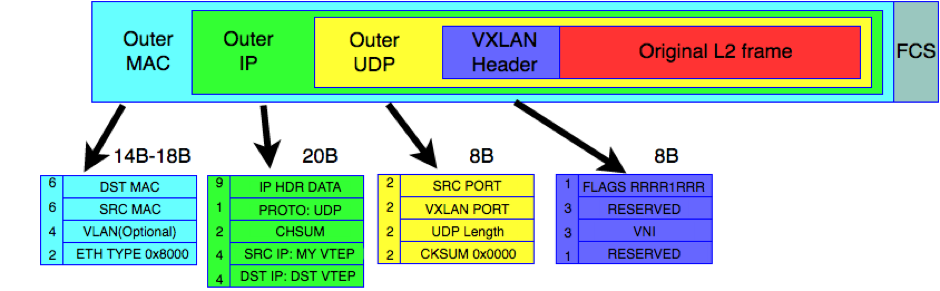
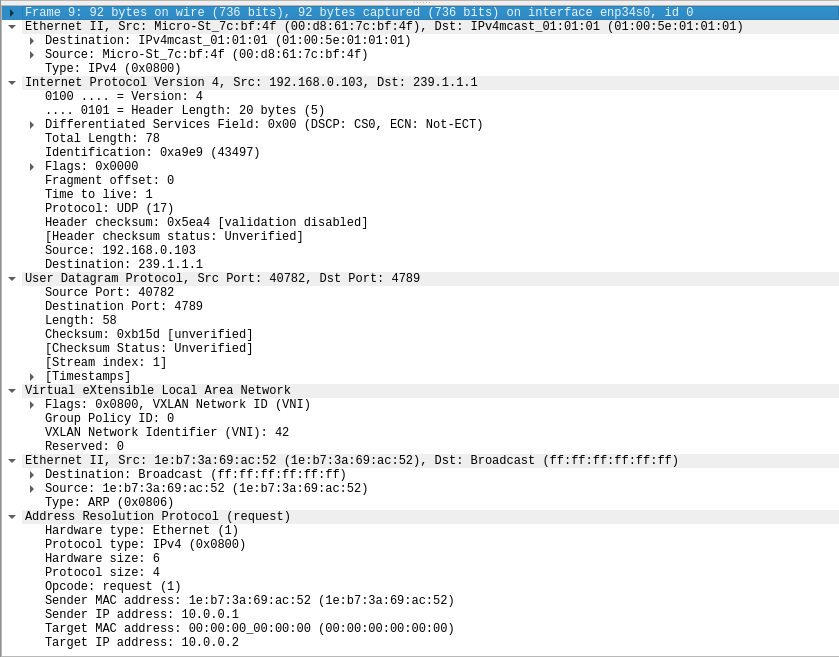

# VXLAN

## 简介

VXALN 全称为 Virtual eXtensible Local Area Network，即虚拟扩展局域网，由 RFC 7348 描述。表面上来看，该技术是 VLAN 的扩展，用来解决 802.1q 协议中 VLAN ID 不能超过 4096 个的问题，实际上而言，该解决思路从二层交换网络跳脱出来，VXLAN 在 Layer 3 网络之上构建 Layer 2 网络来完成虚拟化需求，其中 layer 3 网络称为底层网络（underlay），Layer 2 网络称为虚拟网络（overlay），虚拟网络利用底层网络提供的三层转发路径实现二层互通。虽然虚拟网络中的各个节点可能物理上相距很远，但都可以同其他节点进行局域网通信，因此 VXLAN 实际上可以看做是一种隧道技术。

总而言之，VXLAN 解决了三个痛点问题：

- VLAN：
- 多租户：
- MAC 地址过大：

## 基本概念

顶层网络/虚拟网络（Overlay）也称为 VXLAN 段（VXLAN segment），只有在相同 VXLAN 段中的主机才能直接进行通信。每个 VXLAN 段由一个 24 位的 VNI 标识，这意味着在一个管理域中可以共存多达 $2^{24}$  的 VXLAN 段。

VNI 标识了由主机产生的 MAC 帧的活动范围，VNI 作为外部头，将内部 MAC 帧进行封装后传输。因此，不同 VNI 的 VXLAN 段中流量是隔离的。同时，这也使得不同 VXLAN 段可以使用相同的 MAC 地址。

正是由于封装的特性，VXLAN 也可以称之为三层网络上的二层隧道技术。主机产生的原始帧通过 VTEP 隧道端点，添加 VXLAN 头封装后，通过隧道传输到另一端 VTEP 隧道端点，然后去除 VXLAN 头解封后，传输给目的主机。VTEP 一般在交换机或者服务器上通过软硬件实现，而其中的封装过程对于主机而言是无感的。

| 术语 |           全称            |       中文       | 说明                                                         |
| :--: | :-----------------------: | :--------------: | ------------------------------------------------------------ |
| VNI  | VXLAN Network Identifier  | VXLAN 网络标识符 | VNI 类似 VLAN ID，处于同一 VXLAN 段的主机才能互相二层通信。  |
| VTEP |   VXLAN Tunnel Endpoint   |  VXLAN 隧道端点  | 隧道端点是用于 VXLAN 报文的封装和解封装。VTEP 与物理网络相连，分配有物理网络的 IP 地址，VXLAN 报文中外部 IP 头中的地址即为 VTEP 地址。 |
| FDB  | Forwarding Database Entry |      转发表      | VXLAN 转发表类似于 MAC 转发表。                              |
|  \   |       VXLAN Gateway       |    VXLAN 网关    | 网关负责不同 VXLAN 之间互相进行通信。                        |

其中转发表结构为：

| VNI  |     MAC 地址      | VTEP IP  |
| :--: | :---------------: | :------: |
|  10  | 01:02:03:04:05:06 | 10.0.0.1 |
| ...  |        ...        |   ...    |

## 转发原理

与其他隧道技术不同，VXLAN 隧道模型是 1 对 N，而不是点对点。VXLAN 设备可以通过类似网桥学习机制来动态学习其他 VXLAN 节点信息，也可以通过静态配置转发表。

### 单播 VM-to-VM 通信

假设同一 VXLAN 网段内两个 VM A 与 B 进行通信，A 向 B 正常发送 MAC 帧。

- VTEP 查看 VM 属于哪个网段，获得该网段 VNI。
- 在该网段范围内，查看转发表是否有该"目的 MAC-VTEP" 表项。
- 若有，则封装数据包发送到该远端 VTEP；否则，丢弃该数据包。
- 远端 VTEP 收到数据包，解封获取内层目的 MAC，确认是否属于该网段。
- 若属于，则转发给该 VM，同时进行“内层源 MAC-外层源 IP” 学习，存储到转发表；若不属于，则丢弃。

### BUM 通信

同一 VXLAN 内主机进行 IP 通信时，主机开始不知道对端主机 MAC 地址，会发送 ARP 请求报文请求对端主机 MAC 地址。在正常二层网络中，该 ARP 请求报文 MAC 为广播 MAC，因此将会发送到同一广播域内所有主机上，目的主机通过单播回复 ARP 响应给发送者，使发送主机学习到对端 MAC 地址。

这个问题可以归类为 BUM (Broadcast, Unknown Unicast, Multicast) 帧转发问题，VXLAN 网络也需要机制来解决该问题。

- BUM 帧复制，静态配置远端 VTEPs 列表
- EBGP 控制面

## VXLAN 帧格式

内部二层帧通过四层外部头进行 UDP 封装，如下图所示。



其中：

- 外部以太网头：由物理网络决定，VLAN 头是可选的。
- 外部 IP 头：源 IP 为本地 VTEP 地址，目的 IP 为对端 VTEP 地址。
- 外部 UDP 头：目的端口为 VXLAN 端口，默认为 4789。UDP 校验为一般为 0，保证所有包都能正常被 VTEP 接收。
- VXLAN 头：FLAG I 位为 1，其余为 0。

## Linxu 内核实现

### 基本命令

Linux 操作系统上 VXLAN 实现主要来自于 Linux 内核或 Openvswitch。

VXLAN 设备管理可以通过 **iproute2** 命令来完成。

创建 vxlan 设备:

```
# ip link add vxlan0 type vxlan id 42 group 239.1.1.1 dev eth1 dstport 4789
```

删除 vxlan 设备:

```
# ip link delete vxlan0
```

列出 vxlan 信息:

```
# ip -d link show vxlan0
```

VXLAN 表项管理通过 **bridge** 命令来完成：

创建转发表项:

```
# bridge fdb add/append to 00:17:42:8a:b4:05 dst 192.19.0.2 dev vxlan0
```

- 其中，若动作为 add，则重复添加将会报错，如果想要追加 dst 地址，则使用 append 命令，这样一个 MAC 具有多个 VTEP 地址。

删除转发表项:
```
# bridge fdb delete 00:17:42:8a:b4:05 dev vxlan0
```

列出转发表项:

```
# bridge fdb show dev vxlan0
```

### 组播模式

通常情况下，VXLAN 数据分发使用组播模式最为方便。

- 通过同一组地址，自动发现其他 VTEP。
- 组播 1 对 N 数据分发模型契合 VXLAN 1 对 N 隧道模型。
- 无需额外
- automatic discovery of other VTEPs sharing the same multicast group
- good bandwidth usage (packets are replicated as late as possible)
- decentralized and controller-less design

创建 vxlan 设备:

```
# ip link add vxlan0 type vxlan id 42 group 239.1.1.1 dev eth1 dstport 4789
```

VXLAN 创建之后，需要为 vxlan0 配置 IP 地址，这样系统会生成路由表，到达该网段的路由出端口为 vxlan0 虚拟接口。

```
# ip addr add 10.0.0.1/24 dev vxlan0
# ip link set vxlan0 up
# ip route show
10.0.0.0/24 dev vxlan0 proto kernel scope link src 10.0.0.1
...
```

此时，假设我们从主机上 ping 10.0.0.2 时，在 eth1 上可以通过 wireshark 抓包到封装的 ARP 包。

 

此时，vxlan0 类似于一个网桥，远端 VTEP 是虚拟端口：

- vxlan0 向该 VNI 所属组地址发送 BUM 帧；
- 通过源地址学习到“主机 MAC--VTEP IP 地址”映射。

### 单播静态泛洪

### 单播静态 L2 表项

### 单播静态 L3 表项

### 单播动态 L3 表项

创建 vxlan 设备（点对点模式）:

```
# ip link add vxlan0 type vxlan id 42 local 192.168.0.103 remote 192.168.0.104 dev eth1 dstport 4789
```

其中：

- dev 为使用的物理网卡名称。
- id 为 VNI。
- local 和 remote 的 IP 地址也是底层网络的接口地址，两者并不需要在同一网段，路由可通即可。

### 实践

- 

```
# bridge fdb append to 00:00:00:00:00:00 dst 192.168.0.100 dev vxlan0
# bridge fdb append to 00:00:00:00:00:00 dst 192.168.0.101 dev vxlan0
# bridge fdb append to 00:00:00:00:00:00 dst 192.168.0.102 dev vxlan0
```

删除转发表项:

## 参考

- [RFC7348 - Virtual eXtensible Local Area Network (VXLAN): A Framework for Overlaying Virtualized Layer 2 Networks over Layer 3 Networks](https://datatracker.ietf.org/doc/html/rfc7348)
- https://vincent.bernat.ch/en/blog/2017-vxlan-linux


