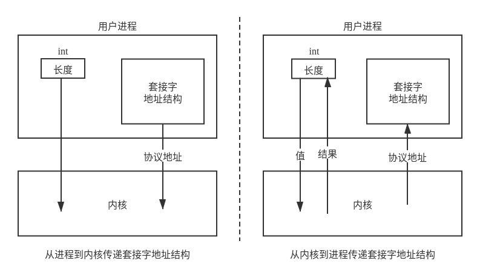
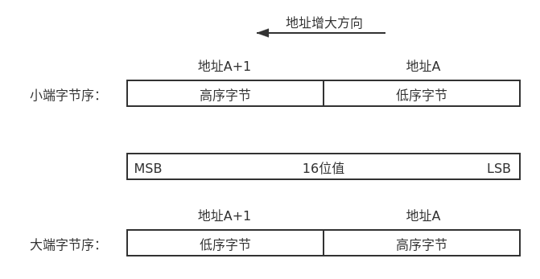
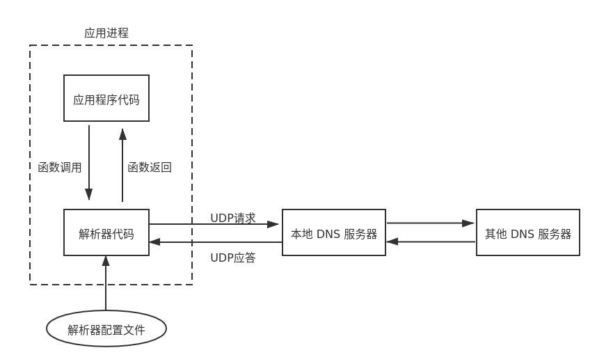

# 基本套接字编程

## 套接字地址结构

大多数套接字函数都需要一个**指向套接字地址结构的指针作为参数**，每个协议族都定义了自己的套接字地址结构，这些结构名均以 `sockaddr_` 开头。

| 结构体名称         | 功能              | 头文件           |
| ------------------ | ----------------- | ---------------- |
| `sockaddr`         | 通用套接字地址    | `<sys/socket.h>` |
| `sockaddr_storage` | 新通用套接字地址  | `<sys/socket.h>` |
| `sockaddr_in`      | IPv4 套接字地址   | `<netinet/in.h>` |
| `sockaddr_in6`     | IPv6 套接字地址   | `<netinet/in.h>` |
| `sockaddr_un`      | Unix 域套接字地址 | `<sys/un.h>`     |

> 结构体中的 IP 地址和端口结构均是网络序。

### 地址传递与值-结果参数

当往一个套接字函数传递套接字地址时，传递的是指向该结构的一个指针。

```c
struct sockaddr_in serv;
// filling in serv{}
connect(sockfd, (struct sockaddr *)&serv, sizeof(serv));
```

同时，该结构的长度通常也作为一个参数来传递，但其传递方式取决于传递的方向是从内核到进程还是从进程到内核。

- 从进程到内核传递套接字，其参数是结构体的整数大小。内核通过指针和内容大小，便知道从进程复制多少数据。
- 从内核到进程传递套接字，其参数是指向表示该结构大小的整数变量的指针。当函数被调用时，它告诉内核该结构的大小，这样内核写该结构时不会越界；当函数返回时，结构大小又是一个结果，它告诉进程内核在该结构中存储了多少信息。这种类型的参数称为值-结果参数。



当使用值-结果参数时，如果地址结构时固定长度的，那么内核返回值总是固定的，例如 IPv4 是 16 字节，IPv6 是 28 字节。如果是可变套接字结构，那么返回值很可能小于该结构的最大长度。

### 通用套接字地址结构

套接字函数以引用（指针）形式来传递套接字地址参数，需要通用类型指针来支持任何协议族的套接字地址，由于历史因素，当时并没有 `void *` 这种通用类型指针，因此定义了一个通用的套接字地址结构。

```c
struct sockaddr {
    uint8_t sa_len;
    sa_family_t sa_family;  /* address family: AF_XXX value */
    char sa_data[14];       /* protocol specific address */
}
```

**其中，sa_len 结构体长度字段并不是所有的实现都支持，这是 BSD 添加的，用于简化套接字地址结构的处理，但 POSIX 规范并不要求有这个成员。**因此，在 Linux 中定义如下，共计 16 字节。

```c
struct sockaddr
{
    __SOCKADDR_COMMON (sa_);	/* Common data: address family and length.  */
    char sa_data[14];		/* Address data.  */
};
```

其中 `__SOCKADDR_COMMON (sa_)` 是一个宏定义，其定义为 `#define __SOCKADDR_COMMON(sa_prefix) sa_family_t sa_prefix##family`，其中使用了 `##` 连接符，将 `sa_prefix` 和 `family` 进行连接。例如，`__SOCKADDR_COMMON (sa_)` 将会被简单的替换为 ` sa_family_t sa_family`。

### IPv4 地址结构

IPv4 套接字地址结构以 `sockaddr_in` 命名，协议族前缀为 `sin_`，**包含三个主要的结构：协议族 `sin_family`、端口 `sin_port` 以及网络地址 `sin_addr`**，最后的 `sin_zero` 是用来补齐与通用套接字地址结构相比不足的位。

```c
/* Internet address.  */
typedef uint32_t in_addr_t;
struct in_addr {
    in_addr_t s_addr;
};

/* Structure describing an Internet socket address.  */
struct sockaddr_in {
    __SOCKADDR_COMMON (sin_);									// 2 字节
    in_port_t sin_port;            /* Port number.  */			// 2 字节
    struct in_addr sin_addr;        /* Internet address.  */	// 4 字节

    /* Pad to size of `struct sockaddr'.  */					// 8 字节
    unsigned char sin_zero[sizeof(struct sockaddr) -
                           __SOCKADDR_COMMON_SIZE -
                           sizeof(in_port_t) -
                           sizeof(struct in_addr)];
};
```

> 或许你会发现，`in_addr` 中 仅仅定义了一个 `in_addr_t` 类型的变量，这就造成了 IPv4 地址存在两种不同的访问方法，例如，定义了套接字地址结构为 serv，那么 `serv.sin_addr` 将按照 `in_addr` 结构体来引用 32 位地址，而 `serv.sin_addr.s_addr` 将按照 `in_addr_t` (通常是一个 32 位整数) 来引用同一个地址，因此，我们必须正确的处理参数。这是具有历史原因的，一开始 `sin_addr` 是一个结构，定义为多种结构的 union，允许访问其中的部分字节，用于早期 IP 地址划分为 A，B，C 的时期，随着子网划分技术和无类地址编排的发展，其它结构被废除，仅仅剩下了一个字段的结构。

### IPv6 地址结构

IPv4 套接字地址结构以 `sockaddr_in`6 命名，协议族前缀为 `sin6_`。

```c
/* IPv6 address */
struct in6_addr {
    union {
        uint8_t __u6_addr8[16];
        uint16_t __u6_addr16[8];
        uint32_t __u6_addr32[4];
    } __in6_u;
#define s6_addr            __in6_u.__u6_addr8
#ifdef __USE_MISC
# define s6_addr16        __in6_u.__u6_addr16
# define s6_addr32        __in6_u.__u6_addr32
#endif
};

/* Structure describing an IPv6 socket address.  */
struct sockaddr_in6 {
    __SOCKADDR_COMMON (sin6_);								// 2 字节
    in_port_t sin6_port;    /* Transport layer port # */	// 2 字节
    uint32_t sin6_flowinfo;    /* IPv6 flow information */	// 4 字节
    struct in6_addr sin6_addr;    /* IPv6 address */		// 16 字节
    uint32_t sin6_scope_id;    /* IPv6 scope-id */			// 4 字节
};
```

## 字节操作函数

`string.h` 头文件定义了以 `mem` 开头的操作内存字节的函数，在网络编程时，经常使用该系列函数对内存字节进行操作。

| 函数名                | 作用                       |
| --------------------- | -------------------------- |
| `memcpy(dst, src, n)` | 将 src 的 n 字节拷贝到 dst |
| `memset(s, c, n)`     | 将 s 的 n 字节设为 c       |
| `memcmp(s1, s2, n)`   | 比较 s1 和 s2 的 n 字节    |


## 字节序函数

内存存储 16 位整数有两种形式：

- 小端字节序：低序字节存储在起始地址。
- 大端字节序：高序字节存储在起始地址。



这两种字节序没有标准可寻，都在系统中使用着。某个系统所使用的字节序称为**主机字节序**（host byte order），网络协议使用的字节序称为**网络字节序**（network byte order）。通常情况下，Linux 系统使用小端字节序，网络协议使用大端字节序，我们只需要在合适的情况下调用字节序转换函数即可。

以下函数包含在头文件  `#include<arpa/inet.h>` 中，其中 `s` 表示 `unsigned short int ` ，`l` 表示  `unsigned long int `。

| 函数名  |           主要功能           |
| :-----: | :--------------------------: |
| `htons` | 16位短整形数据主机序转网络序 |
| `htonl` | 32位长整形数据主机序转网络序 |
| `ntohs` | 16位短整形数据主机序转网络序 |
| `ntohl` | 32位长整形数据主机序转网络序 |

## 地址转换函数

以下函数包含在头文件  `#include<arpa/inet.h>` 中。

|   函数名    |                           主要功能                           |
| :---------: | :----------------------------------------------------------: |
| `inet_aton` | 点分十进制数字符串转换为 32 位网络字节序二进制值 (`struct in_addr`) |
| `inet_ntoa` | 32 位网络字节序二进制值 (`struct in_addr`) 转换为点分十进制数字符串 |
| `inet_pton` |      表达式格式 (presentation) 转换为数值格式 (numeric)      |
| `inet_ntop` |      数值格式 (numeric) 转换为表达式格式 (presentation)      |

## 名字与地址转换

通常情况下，我们会使用数值地址（32 位 IP 地址）来表示主机，例如 `206.6.22.3`，用数值端口号（16 位数）来表示服务器，例如 80 号端口通常表示主机上的一个 Web 服务器。然而，许多情况下我们应该使用域名来代替地址，因为域名容易记忆又输入方便。因此网络编程需要在地址和域名之间进行转换的函数。

我们知道，域名和 IP 地址转换由 DNS 协议来完成，实际中转换由 DNS 服务器来完成，那么我们编写的代码如何与 DNS 服务器打交道呢？答案是通过解析器（resolver）来完成，解析器代码通常位于系统库函数中，构造应用程序时被 link-editing 到应用程序中。



### netdb

### IPv4 转换函数

### 通用转换函数

### 打包我们自己的函数

